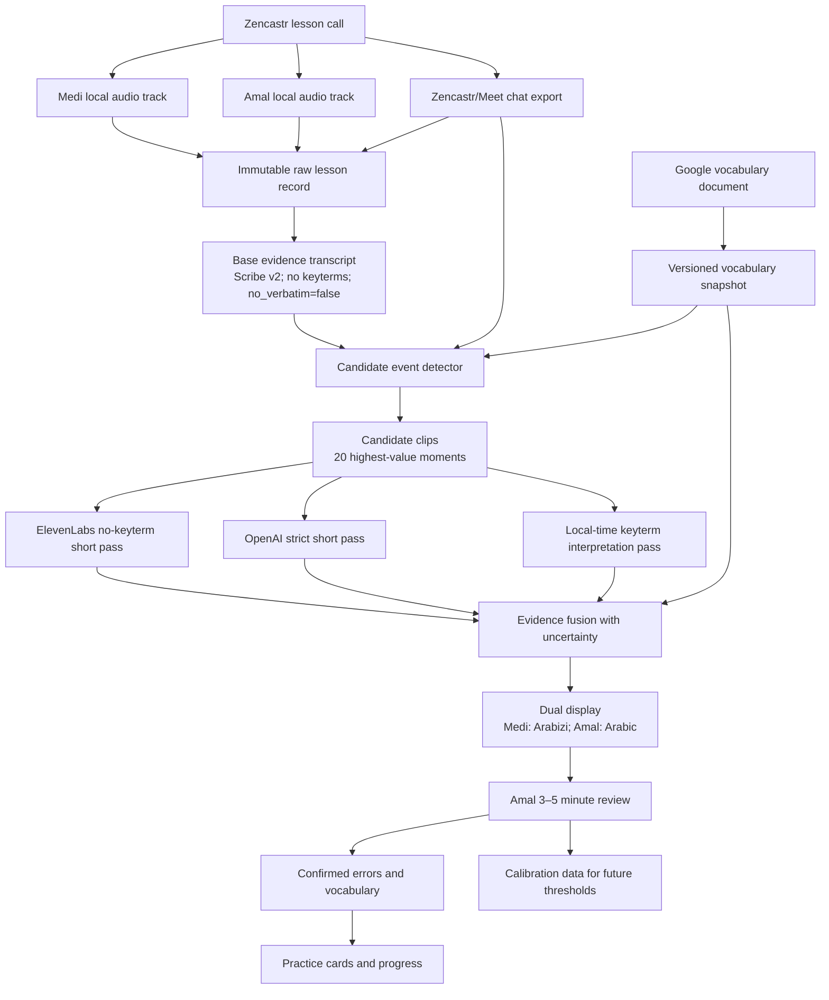

# Anees: independent transcription test, research review, and build recommendation

**Prepared:** 2026-09-04  
**Audience:** Medi, Amal, Claude, and any engineer asked to challenge or implement the plan  
**Scope:** the current `C:\dev\anees` project, the new 2026-09-04 lesson, the Google vocabulary source available during the test, current vendor documentation, and relevant Palestinian-Arabic/pronunciation-assessment research  
**Status:** independent analysis only. I did **not** change `C:\dev\anees`; it already contains uncommitted work belonging to Medi/Claude. Reproducible test artifacts are in the accompanying ZIP.

## Executive verdict

The best current solution is **not “OpenAI instead of ElevenLabs,” and not “ElevenLabs alone.”** It is a deliberately split system:

1. **Capture Medi and Amal on separate tracks.** This is the highest-leverage change and should happen before further diarization tuning. Zencastr Free currently advertises unlimited separate-track recording/download and is suitable for 60–70 minute lessons. Amal does not need to upload a file manually; Zencastr records locally and progressively uploads, but both people must keep the recording page open until upload completion.
2. **Use ElevenLabs Scribe v2 as the primary transcript evidence engine for now**, with `no_verbatim=false`, no vocabulary keyterms on the raw learner track, and word timestamps. On this independent sample it preserved more speech, fillers, and cut-off forms than either OpenAI prompt.
3. **Use OpenAI as a targeted second opinion and reasoning layer, not as the sole evidence transcript.** The strict OpenAI prompt stopped the prior wrong-language failures, but it still normalized or dropped learner evidence. Adding the learned vocabulary made the result slightly worse on this sample.
4. **Keep two transcript layers:** an immutable “observed/evidence” layer that may look messy, and a derived “canonical/display” layer using Amal’s spelling, Arabizi for Medi, Arabic for Amal, and explicit uncertainty links back to the audio.
5. **Find errors primarily from interaction evidence:** Amal’s correction/recast, Medi asking for or forgetting a word, Medi self-repairing, long within-turn pauses, and lesson chat. Generic ASR cannot be instructed to stop all correction reliably.
6. **Treat phonetic diagnosis as a later, candidate-only subsystem.** Use known target forms, Amal reference audio, a Palestinian pronunciation lexicon, forced alignment/phone posterior methods, and human calibration. Do not let an MSA or Qur’anic pronunciation model grade free Palestinian conversation as truth.

My confidence is **high** that separate tracks are necessary, **moderate** that ElevenLabs should remain the near-term primary transcription engine, and **low** for any claim about true word accuracy or “nearly perfect” transcription because there is not yet a human verbatim gold transcript.

The 20-window experiment does answer Medi’s prompt hypothesis: **better OpenAI prompting fixed language control, but vocabulary-constrained prompting did not beat the strict prompt and did not beat ElevenLabs on learner-form preservation.** O1 recovered 14/20 anchor families; O2 recovered 13/20; ElevenLabs arms recovered 16/20. O1 and O2 retained zero mechanically counted fillers, versus 22 in the short unprompted ElevenLabs control. Those counts are behavior proxies, not WER.

## What “nearly perfect” must mean

One percentage cannot represent the goal. Anees needs four separately measured qualities:

| Dimension | What is being measured | Why ordinary WER is insufficient | Proposed gate after gold labeling |
|---|---|---|---|
| Conventional transcript accuracy | Correct words and order for both languages | A clean correction can score well while erasing Medi’s actual error | WER/CER by speaker and language; set threshold only after baseline |
| Learner-form preservation | False starts, malformed words, repetitions, uncertainty, and self-repairs survive | These are normally treated as ASR noise but are the educational signal | Recall on Amal/Medi-labeled learner-form events; initial target ≥80% |
| Speaker identity | Every timed word/turn belongs to Medi or Amal | Correct words attached to the tutor would create false learner errors | Channel identity should be deterministic; fallback diarization DER measured separately |
| Learning-event detection | Corrections, gaps, hesitation, and grammar/pronunciation candidates are found without flooding Amal | A perfect transcript does not automatically identify why the learner struggled | Top-20 precision is primary; target ≥85% accepted or usefully edited, plus missed-event audit |

“Nearly perfect transcript” should therefore mean: an audio-linked transcript good enough that the **20 most valuable candidate moments** can be reviewed by Amal in 3–5 minutes, not an unsupported 99% WER claim.

## Direct answers to the central questions

### Can ASR be told to transcribe phonetically and stop auto-correcting?

Only partially. Prompting can request verbatim output, phonetic approximations, false starts, and uncertainty. It cannot turn a modern sequence-to-sequence recognizer into a neutral phonetic measurement device. The decoder still chooses likely words from linguistic context. The present test demonstrates the limit: both OpenAI arms removed every counted filler and sometimes collapsed conjugation practice into a clean phrase, even though the prompt explicitly said not to.

The practical answer is a layered one:

- preserve raw audio and word times;
- generate a no-keyterm evidence transcript;
- detect high-value moments from the interaction;
- re-run only those clips through independent hypotheses;
- use phone-level alignment/scoring only where a target word is known;
- let Amal confirm rather than pretending the machine has ground truth.

### Should the vocabulary list be a hard whitelist?

No. It should be a **prior and post-transcription validator**, never a decoder cage. A hard whitelist would hide exactly the categories Anees needs to discover: malformed learned words, ordinary inflections not stored as separate entries, fillers, proper nouns, loanwords, and genuinely new words. The correct rule is:

> English, known Palestinian forms, regular Palestinian morphology, fillers, proper nouns, and natural loanwords are allowed. Any other form is retained with audio and flagged as `OOV/uncertain`; it is never silently replaced.

### Do I agree with the public report that ElevenLabs is “much better than OpenAI”?

The conclusion is directionally supported for **transcript evidence on the two tested lessons**, but the report’s headline proof is overstated. Its `15/20` blind vote compared the ElevenLabs family against Speechmatics and a local dialect Whisper system. OpenAI was not one of the blind-vote candidates. Therefore “ElevenLabs won Amal’s blind vote 15/20” does not logically prove “nothing from ChatGPT beats it.”

This independent 2026-09-04 test does provide new direct evidence against two current OpenAI configurations: ElevenLabs preserved more material and more disfluencies, while O1/O2 recovered fewer chat-anchor families. Still, without human verbatim gold, the defensible statement is **“ElevenLabs is the better operational primary now,”** not “ElevenLabs has proven lower Palestinian-Arabic WER.”

## Independent experiment: exact design

### Preregistration and independence

The protocol was frozen before inspecting any new OpenAI output or the existing ElevenLabs transcript for this lesson. The existing project was used only to locate an already-paid Scribe response; its conclusions were not inherited. The protocol file hash recorded at test creation is `4363178DDE2DDA9C6E78861D6E6BA784FA86003EC3D742069193F48DDA2EB1A4`.

### Frozen inputs

- Recording: `G:\My Drive\Meet Recordings\jir-hcex-xzd (2026-09-04 14 03 GMT-7)`
- Duration: `3876.083333` seconds (`01:04:36`)
- Recording SHA-256: `248EE52C3D0FD02A62AB72518B34B381A4F26CA75BB8A088D93DF10CA4CA1576`
- Media structure: H.264 video, one AAC stereo stream, and one timed-text stream. The AAC stream is treated as a mixed recording because it does not provide one participant per channel.
- Meet chat SHA-256: `CB8A8F3380792FE71AA8E26771C9A91636B521BF22459C5974A51175418345BE`; 21 timestamped Amal messages.
- Existing Scribe v2 response SHA-256: `A94C9E18376E95B0A96A51F4F289F3680A6000B0CC004C7F9137D48B9DBCFD6E`.
- Vocabulary used for the prompt: the selected Meet chat plus exported `Latest Topic` and `Animals` tabs from Medi’s Google document. The direct unauthenticated Google export returned 401; the signed-in browser was used read-only. Only these relevant tabs were used because further automated tab export hit rate limiting.

### Sampling

Medi requested 20 examples per lesson. All 21 chat messages were numbered chronologically; `random.Random(20260904)` selected 20 without replacement. The selected set was messages 1–19 and 21; message 20 was excluded. Each frozen clip is `[chat time − 15 s, chat time + 10 s]`, 25 seconds. Total nominal audio per arm is 500 seconds; after overlapping windows are unioned, unique audio is 490.557 seconds.

This is a high-value lexical sample, not a representative random sample of the entire lesson. Adjacent windows are not independent.

| # | Chat time | Amal’s typed anchor | Frozen audio window | Clip | SHA-256 prefix |
|---:|---:|---|---|---|---|
| 1 | 00:24:17 | `Na7el` | 00:24:02–00:24:27 | `clip-01.mp3` | `CAADB5567F56…` |
| 2 | 00:28:15 | `Mabsoo6` | 00:28:00–00:28:25 | `clip-02.mp3` | `C1A14155E4EE…` |
| 3 | 00:30:22 | `Basa6` | 00:30:08–00:30:33 | `clip-03.mp3` | `488D0853A107…` |
| 4 | 00:30:45 | `Basa6ni` | 00:30:30–00:30:55 | `clip-04.mp3` | `776AFA5BEDF9…` |
| 5 | 00:31:32 | `Babse6` | 00:31:17–00:31:42 | `clip-05.mp3` | `26F502702F36…` |
| 6 | 00:33:12 | `Byebse6ni` | 00:32:57–00:33:22 | `clip-06.mp3` | `2EF82873AFE6…` |
| 7 | 00:34:48 | `Babse6 / Btebse6 / Btebse6i / Btebse6u / Byebse6 / Btebse6 / Byebse6u / Bnebse6` | 00:34:34–00:34:59 | `clip-07.mp3` | `75287CF1A14D…` |
| 8 | 00:35:14 | `Bnebse6o` | 00:35:00–00:35:25 | `clip-08.mp3` | `EE22D0C43501…` |
| 9 | 00:36:14 | `Basa6 / Basa6at / Basa6u / Basa6eet / Basa6ti / Basa6tu / Basa6na` | 00:36:00–00:36:25 | `clip-09.mp3` | `F6753040F9D6…` |
| 10 | 00:36:43 | `Basa6tek?` | 00:36:28–00:36:53 | `clip-10.mp3` | `292C272A05EF…` |
| 11 | 00:37:01 | `Hasa6to` | 00:36:46–00:37:11 | `clip-11.mp3` | `A2506CB1B05E…` |
| 12 | 00:46:21 | `Banbese6` | 00:46:06–00:46:31 | `clip-12.mp3` | `40BDAB84F4B6…` |
| 13 | 00:48:33 | `Baboos` | 00:48:19–00:48:44 | `clip-13.mp3` | `36506438830C…` |
| 14 | 00:49:46 | `Buset` | 00:49:32–00:49:57 | `clip-14.mp3` | `6C830171F5AF…` |
| 15 | 00:53:26 | `Enbasa6 / Enbas6at / Enbasa6u / Enbasa6et / Enbasa6ti / Enbasa6tu / Enbasa6na` | 00:53:12–00:53:37 | `clip-15.mp3` | `4EBB543B6452…` |
| 16 | 00:54:54 | `Enbasa6ti bi/fi el-7afle` | 00:54:40–00:55:05 | `clip-16.mp3` | `E34A7D71380B…` |
| 17 | 00:56:42 | `Enbasa6u bisafrethom` | 00:56:28–00:56:53 | `clip-17.mp3` | `D95A89F0F0D6…` |
| 18 | 00:58:28 | `Banbese6 / Btenbese6 / Btenbes6i / Btenbes6u / Byenbese6 / Btenbese6 / Byenbes6u / Bnenbese6` | 00:58:13–00:58:38 | `clip-18.mp3` | `67D84B40E9BE…` |
| 19 | 00:59:14 | `Btenbese6i lamma ne6la3?` | 00:58:59–00:59:24 | `clip-19.mp3` | `9AF451780A9B…` |
| 21 | 01:01:10 | `Enbes6i biyoamek` | 01:00:56–01:01:21 | `clip-21.mp3` | `050F1FE5791C…` |

### Test arms

- **E-long:** the original one-call, full-lesson ElevenLabs Scribe v2 response; words whose midpoint lies in each frozen window were extracted. It is not directly call-matched to the short-clip arms.
- **O1:** `gpt-transcribe`, Arabic + English language hints, strict verbatim bilingual prompt, no vocabulary.
- **O2:** the same request plus 41 selected chat forms and 75 Arabizi/Arabic document pairs. The prompt says the lexicon is context rather than a correction key.
- **ES (post-hoc control):** Scribe v2 on each same 25-second clip, `diarize=true`, two expected speakers, word timestamps, `no_verbatim=false`, no keyterms.
- **EKG (post-hoc):** same short ElevenLabs clips with 184 global keyterms from the selected chat and two document tabs.
- **EKL (post-hoc):** same short ElevenLabs clips with the two document tabs plus only chat terms posted within ±120 seconds of each clip; 144–161 keyterms.

O1 and O2 were pre-registered. ES, EKG, and EKL were exploratory follow-ups and must not be presented as if they were pre-registered. ES was added specifically because comparing short keyterm calls to the long baseline confounds vocabulary with chunking.

### Exact OpenAI prompts

**O1 strict**

> This is a one-to-one Palestinian Arabic lesson between a male learner, Medi, and his female tutor, Amal. The only languages spoken are Palestinian Arabic and English. Transcribe exactly what is audible. Write Arabic speech in Arabic script and English speech in Latin script. Never translate. Never output German, Japanese, Chinese, Azerbaijani, Spanish, or any other language. Preserve fillers, repetitions, false starts, cut-off words, wrong grammar, learner mistakes, and uncertain pronunciations. Do not silently repair Medi's speech into a fluent or correct sentence. If a sound cannot be identified, write [غير واضح] or a brief phonetic approximation instead of inventing a plausible word. Do not add explanations or speaker labels.

**O2 vocabulary-conditioned**

> This is a one-to-one Palestinian Arabic lesson between a male learner, Medi, and his female tutor, Amal. The only languages spoken are Palestinian Arabic and English. Transcribe exactly what is audible. Write Arabic speech in Arabic script and English speech in Latin script. Never translate. Never output German, Japanese, Chinese, Azerbaijani, Spanish, or any other language. Preserve fillers, repetitions, false starts, cut-off words, wrong grammar, learner mistakes, and uncertain pronunciations. Do not silently repair Medi's speech into a fluent or correct sentence. The approved vocabulary below is context, not a correction key: prefer one of its words or an ordinary Palestinian inflection only when the audio supports it. If Medi mispronounces a listed word or produces a nonword, preserve the closest phonetic form rather than replacing it with the approved word. If a sound does not fit the list, write [غير واضح] or a brief phonetic approximation; do not invent a different Arabic word. Do not add explanations or speaker labels. APPROVED TOPIC VOCABULARY: CHAT FORMS: Na7el; Mabsoo6; Basa6; Basa6ni; Babse6; Byebse6ni; Btebse6; Btebse6i; Btebse6u; Byebse6; Byebse6u; Bnebse6; Bnebse6o; Basa6at; Basa6u; Basa6eet; Basa6ti; Basa6tu; Basa6na; Basa6tek?; Hasa6to; Banbese6; Baboos; Buset; Enbasa6; Enbas6at; Enbasa6u; Enbasa6et; Enbasa6ti; Enbasa6tu; Enbasa6na; Enbasa6ti bi/fi el-7afle; Enbasa6u bisafrethom; Btenbese6; Btenbes6i; Btenbes6u; Byenbese6; Byenbes6u; Bnenbese6; Btenbese6i lamma ne6la3?; Enbes6i biyoamek. LEARNED FORMS: Ma3na = معنى; Raqam = رقم; 7arf = حرف; Kelme = كلمة; Jumle = جملة; Esem = اسم; Sifa = صفة; Jame3 = جمع; Zarf = ظرف; Fe3el = فعل; Maadi = ماضي; Mudaare3 = مضارع; Amer = أمر; Musta2bal = مستقبل; Sabab = سبب; 5ayaar = خيار; 7atta = حتى; 7atta law = حتى لو; 7aades = حادث; Bil8ala6 = بالغلط; Bazeed = بزيد; Ziaadeh = زيادة; Ba2eem = بقيم; Muraaja3a = مراجعة; Ana baraaje3 = أنا براجع; Ana 7aafez = أنا حافظ; Daafe3 = دافع; Mu7aadase/a = محادثة; Ana bad7ak = بضحك; Ana bada77ek = بضحِّك; Ana bazha2 = بزهق; Ana bazahhe2 = بزهِّق; Ana baz3al = بزعَل; Ana baza33el = بزعِّل; Ana bat3ab = بتعب; Ana bata33eb = بتعِّب; Ana ba5aaf = بخاف; Ana ba5awwef = بخوِّف; Ana bajhaz = بجهز; Ana bajahhez = بجهِّز; Ana ba3asseb = بعصِّب; 7aywaan = حيوان; Besse/a = بسة; Kalb = كلب; Jaaje/a = جاجة; Deek = ديك; 9oo9 = صوص; 7maar = حمار; 5aroof = خروف; 7ayye/a = حية; Tair = طير; 3asfoor = عصفور; 7ashara = حشرة; Dubaan = دبان; Dubaane/a = دبانة; Namel = نمل; Namle/a = نملة; His-his = بعوضة; His-hise/a = هسهسة; Sarsoor = صرصور; 3ankaboot = عنكبوت; Faar = فار; Ba2ar = بقر; Ba2ara = بقرة; 7saan = حصان; 2erd = قرد; Sinjaab = سنجاب; Na7el = نحل; Na7le/a = نحلة; 7adee2et el-7aywaanaat = حديقة الحيوانات; 8azaal = غزال; Albaan = ألبان.

### Call controls

- Odd-numbered clips called O1 then O2; even-numbered clips called O2 then O1.
- One successful request per arm/clip; only 429 or 5xx was eligible for at most two retries with deterministic 2 s and 5 s backoff.
- Successful but poor, empty, or wrong-language outputs were outcomes, not manually “fixed.”
- All 40 OpenAI calls and all 60 new ElevenLabs calls returned HTTP 200 and nonempty text.
- The full raw response, response metadata, prompts/keyterms, clip hashes, elapsed time, and estimated audio cost are stored in the evidence bundle.

## Results

### Aggregate behavior

| Arm | Successful | Surface tokens | Arabic-script tokens | Fillers | Cutoffs/ellipses | Chat families visible | Foreign-script clips |
|---|---:|---:|---:|---:|---:|---:|---:|
| E | 20/20 | 714 | 82 | 21 | 19 | 16/20 | 0 |
| ES | 20/20 | 725 | 123 | 22 | 25 | 16/20 | 0 |
| O1 | 20/20 | 590 | 98 | 0 | 12 | 14/20 | 0 |
| O2 | 20/20 | 593 | 83 | 0 | 7 | 13/20 | 0 |
| EKG | 20/20 | 716 | 58 | 20 | 20 | 16/20 | 0 |
| EKL | 20/20 | 702 | 32 | 17 | 15 | 16/20 | 0 |

Definitions:

- “Surface tokens” is a regex count of Latin/Arabic alphanumeric forms; it is **not accuracy**.
- “Arabic-script tokens” reflects script choice, not Arabic content; ElevenLabs often emits Arabic words in Latin/Arabizi.
- Filler and cutoff counts are mechanical lower bounds.
- “Chat family visible” is a manual surface judgment that the typed form or its relevant lexical family appears. It is not audio-grounded correctness.
- Four anchors are structurally unscorable/missed because the typed chat appeared tens of seconds after the spoken word; this is why no WER is calculated.

### Main findings

1. **The strict OpenAI prompt solved the old wrong-language failure mode in this sample.** O1/O2 produced no non-Latin/non-Arabic scripts. This is meaningful operational progress over the older report’s German/Japanese/Chinese failures.
2. **It did not preserve enough learner evidence.** O1/O2 produced 590/593 tokens versus 725 for the directly matched short unprompted ElevenLabs control. More text is not inherently better, but the missing content included conjugation attempts, fillers, and false starts that Anees explicitly needs.
3. **The vocabulary prompt did not improve OpenAI.** O1 recovered 14 anchor families; O2 recovered 13. O2 worsened clips 12 and 16 and reduced the mechanical cutoff count from 12 to 7. O1 and O2 were identical in 4 clips and changed in 16; mean character similarity was 0.8893.
4. **Both OpenAI conditions removed every counted filler.** This directly contradicts the prompt’s request to preserve them. It does not prove every hesitation was absent, but it makes OpenAI unsafe as the only pause/error evidence source.
5. **Short clipping, not keyterms, fixed ElevenLabs speaker-cluster collapse.** E-long assigned 695 of 708 extracted word records to `speaker_0` and only 13 to `speaker_1`; only 1/20 windows contained two Scribe IDs although Meet captions showed both named speakers in 19/20. ES detected at least two clusters in 19/20 with no keyterms. EKG and EKL also detected at least two in 19/20. The only defensible causal attribution is segmentation/request context, not vocabulary.
6. **Even recovered clusters are not stable identities.** A local 25-second call labeling `speaker_0` and `speaker_1` does not prove which is Medi or Amal, nor that the mapping is consistent between clips. Separate tracks make this inference unnecessary.
7. **Global future vocabulary can poison the transcript.** In clip 1 the unprompted systems and local-keyterm arm heard “Awesome”; EKG substituted the future lesson term `Mabsoo6`. This is the exact leakage risk created by waiting for the entire lesson vocabulary and then applying all of it globally.
8. **Local keyterms are useful for display but dangerous for evidence.** EKL produced readable forms such as `Babse6`, `Byebse6ni`, `Enbas6ti fi el-7afle`, and `Btenbes6i lamma ne6la3`; it also reduced fillers/cutoffs versus ES and may overwrite Medi’s malformed form. It belongs in the canonical interpretation layer only.

### High-value examples

- **Clip 2:** E-long retained `Masbu- mabsut`, an apparent false start; OpenAI produced the clean `مبسوط`. This is precisely the kind of evidence Anees must not discard.
- **Clips 8–9:** OpenAI collapsed a conjugation drill; clip 8 became only `هو. هي.` and clip 9 only “I made him happy.” ElevenLabs retained more paradigm attempts.
- **Clip 12:** O1 and ElevenLabs retained `Banbisat/Nabasat`-like attempts; O2 returned `[unclear]`, so the learned-vocabulary prompt harmed recovery.
- **Clip 16:** E-long and the short ElevenLabs arms retained the `enbasa6ti/fi el-7afle` phrase; O1 hallucinated “Airbnb” and O2 omitted most of it.
- **Clip 18:** ElevenLabs preserved `lamaaa uh nitlaaw Nitla-…`; OpenAI made the utterance cleaner and removed the counted hesitation.
- **Clip 1:** global ElevenLabs keyterms inserted `Mabsoo6` where the no-keyterm and local-context arms had “Awesome,” demonstrating temporal vocabulary leakage.

### What cannot be concluded

- No arm’s WER, CER, or learner-error recall is known.
- The 16/20 family score does not mean 80% accuracy.
- More tokens do not prove ElevenLabs is more correct.
- Meet caption speaker names are useful weak metadata, not verbatim gold.
- The sample heavily represents one verb family and tutor-typed vocabulary.
- The lesson recording is mixed, so Medi-vs-Amal identity is not audio-ground-truth.
- The result ranks tested configurations on this lesson, not every OpenAI/ElevenLabs model or future model revision.

## Why the four missing anchors matter

The frozen windows intentionally were not moved after seeing output. That exposed a design flaw in using chat timestamps as exact word times:

- `Baboos` was spoken roughly 65 seconds before its chat post.
- `Buset` was spoken roughly 42 seconds before its post.
- the full `Btenbese6i lamma ne6la3?` example was earlier than its post;
- `Enbes6i biyoamek` was spoken roughly 80 seconds before its post.

Therefore lesson chat should create a **search anchor**, not a 25-second truth window. Production should search ±120 seconds using lexical/semantic matching, preserve multiple candidates, and ask Amal only when the match is ambiguous.

## Speaker identity diagnosis

The current recording contains one mixed audio stream. The project’s Scribe full-lesson call asked for two speakers, but today it collapsed almost everything into one cluster. The fallback then labels everyone `Both`, which avoids a false identity claim but makes downstream learning metrics unusable.

The current code also creates an internal contradiction when the split fails: line 120 treats Arabic words from both voices as “Medi Arabic,” while line 122 counts pauses only in runs labeled `Medi`; after fallback, those runs are labeled `Both`. Thus the published statistics can count tutor Arabic as learner Arabic while reporting zero learner pauses. This is a P0 correctness issue, not a cosmetic one.

Recommended identity order:

1. **Separate capture tracks** named at ingestion (`medi`, `amal`) — ground truth by construction.
2. If only a mixed Meet file exists, use its embedded named captions as weak time-boundary hints, not transcript truth.
3. For fallback experiments, OpenAI’s diarization API currently accepts up to four known speaker names paired with 2–10 second reference samples. Test it on a labeled gold set before production.
4. Never assign names merely from “the speaker with more Arabic.” Amal may speak English and Medi’s Arabic share should increase over time; the heuristic is nonstationary.

## Recommended end-to-end architecture



### Capture workflow

- Use one Zencastr session as the call, not Zencastr plus another call simultaneously.
- The host sends Amal a link. Both wear headphones.
- Record separate tracks. The current pricing page says the free plan includes unlimited separate recording/download, up to six participants, progressive upload, and local recording.
- At the end, both keep the page open until upload confirmation. The host downloads the participant files or a ZIP. Amal does not manually send/upload audio.
- Free separate MP3 tracks are sufficient. Zencastr’s pricing page and older help center conflict on whether free WAV is available; verify the account UI before depending on WAV.
- Do not rely on Zencastr’s native transcription for Arabic: its November 2024 help article lists only English, French, German, Portuguese, and Spanish on paid plans, while the current pricing grid says “10 supported languages” without naming them. Either way, this project supplies its own ASR.
- Keep Google Meet recording/chat as a fallback only if Zencastr proves operationally annoying. Today’s Meet artifact showed why it is weaker: named captions and chat were useful, but the audio was one mixed stream.

### Grace period and vocabulary snapshots

Recommended default: **45 minutes after the lesson**, configurable to 30–60 minutes.

1. Immediately ingest and hash both audio tracks and chat; mark lesson `provisional`.
2. Start the no-keyterm evidence transcription immediately. It does not need the vocabulary update.
3. At +45 minutes, snapshot the Google document revision and chat, including tab/revision identifiers and a content hash.
4. Run OOV matching, canonical display, and candidate ranking using that frozen snapshot.
5. If Amal adds words later, create a new vocabulary-snapshot version and re-run matching/display only. Do not spend money retranscribing the entire audio.

This gives Amal time to add lesson vocabulary without letting future chat terms contaminate earlier raw ASR.

### Transcript data contract

Every token/span should preserve provenance. A minimum schema:

```json
{
  "lesson_id": "2026-09-04",
  "source_track": "medi",
  "start_ms": 3279772,
  "end_ms": 3280410,
  "observed_surface": "en-enbas...",
  "canonical_arabizi": "Enbasa6ti",
  "canonical_arabic": "انبسطتي",
  "language": "ar-PS",
  "asr_engine": "elevenlabs/scribe_v2",
  "asr_config_hash": "...",
  "vocabulary_snapshot_id": null,
  "uncertainty": 0.42,
  "flags": ["self_repair", "possible_pronunciation_error"],
  "audio_clip_id": "...",
  "human_status": "unreviewed"
}
```

The raw `observed_surface` is append-only. Human edits and canonical forms are separate records with author, timestamp, and reason.

### Arabizi/Arabic display policy

- Medi’s default interface: Arabizi, preserving the project’s exact numeral conventions and Amal’s forms.
- Amal’s default interface: Arabic script plus the aligned audio.
- Both can reveal the other representation.
- Automatic transliteration is a suggestion with confidence; it must never overwrite the evidence transcript.
- The project vocabulary document is authoritative for canonical spellings, but not proof of what Medi actually uttered.

## Learning-event detector

Candidate generation should be evidence-based and multi-signal. Each candidate stores all signals, not just a model conclusion.

| Event type | Strong signals | Output | Auto-confirm? |
|---|---|---|---|
| Tutor correction/recast | Medi utterance followed within ~0–8 s by Amal repeating a minimally different form; words such as “no,” “say…,” `صح`, or explicit explanation | before/after audio, observed hypothesis, tutor target | No |
| Forgotten/asked word | Medi says “I forgot,” “what does X mean?”, “how do I say…?”, long search followed by Amal supply | question + supplied word + clip | Usually candidate with high priority |
| Self-repair | same speaker restarts/changes a form (`Masbu- mabsut`) | initial and repaired spans | No; may be productive learning rather than error |
| Hesitation/retrieval gap | within-Medi-turn silence, filler chain, lengthened onset, repeated partial word | duration and neighboring words | No; pause alone is not error |
| Grammar candidate | disagreement between Medi form, tutor recast, vocabulary/morphology rules, and independent transcripts | evidence bundle and rule citation | No |
| Pronunciation candidate | known target + observable phone mismatch across repeated attempts/reference | target/observed phones, confidence, audio | No until calibrated |
| OOV/new word | surface form unmatched after allowed English, morphology, fillers, names, and loanwords | retained surface + nearest candidates | Ask/flag, never replace |

### Candidate ranking for a 20-item review

Use a transparent score, tuned later from Amal labels:

```text
score = 4*tutor_explicit_correction
      + 3*learner_explicit_gap
      + 2*tutor_recast_similarity
      + 2*chat_match
      + 1*self_repair
      + 1*long_pause
      + 1*cross_engine_disagreement
      - 2*already_confirmed_duplicate
      - 2*low_audio_quality
```

Diversify the final 20 so one conjugation drill cannot occupy the whole list. Suggested caps: at most eight examples from one lexical family and at least two candidate types when available.

### The 3–5 minute Amal review

Twenty items at an average 8–12 seconds each is 2:40–4:00 before occasional edits. Each card should have:

- tap-to-play 4–10 second audio, with one-tap “more context”;
- `Medi said` evidence field;
- `Suggested target` in Arabic and Arabizi;
- reason/type and confidence;
- buttons: **Correct error**, **Not an error**, **Edit target**, **Needs context**;
- keyboard/mobile shortcuts and automatic advance;
- bulk “these are the same conjugation pattern” grouping.

Do not ask Amal to proofread the whole hour. For the first five lessons, sample a few rejected/low-score events too; otherwise recall can never be estimated.

## Phonetic layer: feasible, but not a turnkey Palestinian model

Palestinian-specific phonetic diagnosis is possible as an engineering/research milestone, not as a prompt switch.

Recommended sequence:

1. Restrict phonetic analysis to candidate clips where a target form is known.
2. Build a pronunciation dictionary from Amal’s canonical forms and recordings. Seed it with Maknuune, an open Palestinian lexicon with more than 36,000 entries, 17,000 lemmas, 3,700 roots, diacritized Arabic, phonological transcriptions, and English glosses.
3. Use forced alignment to align the known orthographic target to audio phones. Montreal Forced Aligner defines forced alignment as producing a time-aligned transcript using a pronunciation dictionary.
4. Compute phone posterior/GOP-style features or CTC alignment disagreement. Kaldi’s GOP implementation explicitly describes GOP as a canonical-phone posterior ratio and notes classifier-based features usually outperform a raw threshold.
5. Calibrate phone-specific thresholds on Medi’s speech using Amal’s labels. Classic CALL work likewise used phone-specific thresholds and human judgments.
6. Use a universal phone recognizer such as Allosaurus only as an exploratory hypothesis source; it supports 2,000+ language inventories, but its timestamps are approximate and it is not a Palestinian learner grader.

Available Arabic mispronunciation datasets are mismatched to this task. ASMDD is Egyptian speech from children aged 2–8 on 100 frequent words. Iqra’Eval is Qur’anic/MSA read-speech assessment. Neither should be used as the truth standard for an adult’s spontaneous Palestinian conversation.

Azure and Google are worth later baseline tests because both explicitly list `ar-PS` speech recognition/adaptation. Azure’s pronunciation-assessment locale list, however, names Arabic Egypt and Saudi Arabia rather than Palestinian Arabic, and some fine-grained outputs are English-only. This supports benchmarking their ASR, not adopting their pronunciation score uncritically.

## Existing project audit

### What already exists

The repository is not empty despite the README saying “nothing built yet.” It contains:

- multiple Aug 25 engine outputs and comparison pages;
- an ElevenLabs/Meet lesson pipeline;
- generated lesson transcripts for Aug 25 and Sep 4;
- Google Meet chat extraction;
- HTML publishing to GitHub Pages;
- Gmail notification code;
- experimental speaker diarization, local Whisper, Speechmatics, OpenAI, and tutor-reaction scripts;
- extensive product/research planning documents.

There is **no implemented candidate error inbox, vocabulary-document ingestion, database/schema, review dashboard, flashcard loop, or production-grade test suite** visible in the repo.

### Severity findings

#### P0 — fix before trusting or automatically publishing learning metrics

1. **Mixed-channel capture defeats speaker-grounded learning analysis.** Today’s full Scribe call collapsed nearly all words into one cluster. Separate tracks are the remedy.
2. **No human verbatim gold exists, yet the engine report uses categorical language.** Preference votes and token counts cannot establish accuracy.
3. **The published `15/20` vote excludes OpenAI.** `build_engine_report.py` and `check02_scoring.md` show that the blind comparison was ElevenLabs vs Speechmatics vs local dialect Whisper. The headline overgeneralizes the result.
4. **Fallback metrics are internally invalid.** On failed speaker split, Arabic from both speakers is counted as Medi’s, while pauses can disappear because no run remains labeled Medi.
5. **Unvalidated transcripts are published and emailed automatically.** There is no human gate even when speaker split failed.
6. **Publish failure is suppressed.** `git commit` and `git push` use `check=False`, after which the function returns a public URL anyway. An email can therefore announce a page that was not successfully pushed.

#### P1 — required for a dependable MVP

1. No vocabulary-document synchronization, snapshotting, revision ID, or reconciliation exists.
2. No error-event extraction/review workflow exists; the current output is a transcript and coarse counts.
3. Ingestion identity uses a filename/state key, not Drive file ID as the binding contract requires.
4. The ElevenLabs request has no retry/backoff; the failure path only logs and updates state, with no failure email.
5. The 90-day raw-audio deletion contract is not implemented.
6. The pre-check samples only minutes 3–6 and runs before reading chat; a slow-English introduction could cause an Arabic lesson to be skipped even when the chat proves otherwise.
7. README, graph, blueprint, and constants disagree about what is built, which engine is primary, and whether two-channel capture is active.
8. The Python/Node dependencies are not pinned in `requirements.txt`, `pyproject.toml`, or a repo-local `package.json`; email code borrows another project’s `node_modules` and `.env` by absolute path.
9. No automated tests or CI checks cover parsing, speaker failure, idempotency, metrics, publishing, email, or deletion.
10. Provider model aliases/configurations are not captured as immutable run records in production, making later comparisons hard to reproduce.

#### P2 — cleanup and operational resilience

1. The pre-check comment still estimates `$1.50` for a full run although current Scribe pricing is $0.22/hour.
2. The Meet filename regex and minimum file-size heuristic are brittle.
3. State is written after the publish step, so the state version is not necessarily included in the same published commit.
4. The recipient address and external Alchemy path are hard-coded.
5. Public lesson transcript publishing is intentional and accepted by Medi, but the UI should still show that it is public and offer per-lesson deletion.

### Documentation reconciliation required

`plan/constants.md` says the binding design is separate channels, Drive-ID idempotency, three retries, failure email, 90-day deletion, and Supabase secrets. The current pipeline implements none of those except local secret avoidance in Git. `plan/graph.yaml` still marks early transcription/gold-sheet work as current even though later live pipeline artifacts exist. The README date/status is stale. Before additional features, turn the constants into executable acceptance tests and update the task graph from actual repository state.

## Proposed production pipeline

### Stage 0 — safe ingestion

- Unique lesson ID from provider session ID plus content hashes.
- Store both tracks, chat, recording metadata, consent/privacy status, and hashes.
- Idempotent state machine: `discovered → uploading → transcribing → provisional → awaiting_vocab → candidates_ready → tutor_reviewed → published`.
- Retry transient vendor calls three times with jittered backoff; permanent failures create a visible job and email Medi only.
- Never email/publish a success URL until the page/database transaction is verified.

### Stage 1 — evidence transcript

- Transcribe each named track separately with ElevenLabs Scribe v2, no keyterms, `no_verbatim=false`, word timestamps.
- Use 2–5 minute chunks with 1–2 second overlap for the searchable whole-lesson pass; deduplicate overlap deterministically. Twenty-five-second segmentation was useful today but has not been validated as the ideal production chunk length.
- Preserve provider response, config, model label, clip hash, and confidence/log-probability data.
- Calculate silence and pause features directly from audio/VAD, not only from text fillers.

### Stage 2 — candidate discovery

- Rule/model pass over cross-speaker temporal patterns.
- Search each chat item within ±120 seconds and attach best candidate(s).
- Allow all vocabulary/morphology; flag OOV after decoding.
- Rank/deduplicate/diversify to 20.

### Stage 3 — candidate adjudication

- Recut 4–15 second core clips plus wider context.
- Run ElevenLabs no-keyterm and OpenAI strict on the exact clips.
- Optionally run local-temporal keyterms to generate canonical Arabizi/Arabic, clearly marked non-evidence.
- Ask an LLM to produce structured hypotheses only from supplied evidence. It must cite timestamps and may return `uncertain`.

Suggested reasoning prompt:

```text
You are analyzing a Palestinian Arabic tutoring event, not rewriting a transcript.
Inputs: (1) Medi-track audio/transcript hypotheses, (2) Amal-track audio/transcript
hypotheses, (3) exact timestamps, (4) lesson chat near this moment, (5) a versioned
vocabulary/rules snapshot. Vocabulary is a prior, not a whitelist.

Return JSON only:
- event_type: correction | gap | self_repair | hesitation | grammar_candidate |
  pronunciation_candidate | oov | none
- observed_medi: preserve malformed/partial surface; never silently repair
- likely_target_arabizi
- likely_target_arabic
- amal_evidence: exact timestamped span or null
- evidence_spans: source/start/end/text
- alternatives: up to 3
- confidence: 0..1
- needs_amal_review: true/false
- explanation: one short factual sentence

Do not infer an error from accent alone. Do not call a pause an error without context.
If evidence conflicts, choose uncertain and preserve all hypotheses.
```

### Stage 4 — review and learning loop

- Amal reviews only the top 20 and a small quality-control sample.
- Confirmed events feed the vocabulary/error database and review cards.
- Cards always retain source lesson/audio and both scripts.
- Medi’s pause/retrieval metrics become a separate milestone after deterministic tracks exist.

## Human gold benchmark required next

The smallest defensible next evaluation is **100 clips accumulated as 20 per lesson across five lessons**. The current 20 are a pilot and may be reused only if Amal relabels the exact audio rather than accepting chat text as truth.

For each clip, Amal should provide:

- exact Medi words as heard, preserving malformed/partial forms;
- exact Amal words;
- speaker and word/turn boundaries to a reasonable tolerance;
- target/correction if present;
- event type;
- `not sure` where the audio is ambiguous;
- whether each machine output is acceptable for evidence and for display.

Evaluation:

- WER/CER by speaker and language on fully transcribed clips;
- learner-form event recall and precision;
- filler/cutoff/self-repair recall;
- speaker-attributed word accuracy and DER for mixed-file fallback;
- top-20 candidate precision, plus recall from a random rejected sample;
- review time median and 90th percentile;
- inter-rater check on 10–20 clips if possible, because the target dialect spelling itself can vary.

Do not tune thresholds on all 100 and report the same set. Use the first 60 for development, 20 validation, and final 20 held out—or continue collecting until there is a meaningful holdout.

## Cost analysis

Current official list prices used here are OpenAI `gpt-transcribe` at $0.0045/minute and ElevenLabs Scribe v2 at $0.22/hour, with ElevenLabs keyterms listed at $0.05/hour/20% surcharge depending on billing presentation.

For this `64.60`-minute lesson:

| Operation | Estimate |
|---|---:|
| ElevenLabs one full-duration pass | `$0.237` |
| ElevenLabs one full-duration keyterm pass | `$0.291` |
| OpenAI one full-duration pass | `$0.291` |
| Recommended one-track base + one-track keyterm interpretation + 20×25 s OpenAI | `$0.565` |
| Conservative two-track version of both ElevenLabs passes + 20×25 s OpenAI | `$1.093` |
| All new API calls made for this independent experiment | `$0.18056` |

The recommended workflow is comfortably under Medi’s $3/lesson ceiling even under the conservative two-track calculation and before a small LLM reasoning charge. Production should meter actual invoice units because multichannel/rounding/minimum-duration rules can differ from simple arithmetic.

## Vendor and research findings

### OpenAI

- [`gpt-transcribe` model documentation](https://developers.openai.com/api/docs/models/gpt-transcribe) lists high-accuracy file/realtime transcription, unstructured context, keyword hints, multiple language hints, and $0.0045/minute.
- [`gpt-4o-transcribe-diarize`](https://developers.openai.com/api/docs/models/gpt-4o-transcribe-diarize) provides built-in speaker diarization.
- The [transcription API reference](https://developers.openai.com/api/reference/resources/audio/subresources/transcriptions/methods/create) documents `known_speaker_names` and 2–10 second reference samples for up to four speakers; `gpt-transcribe` supports multiple language hints and prompt/keyword guidance.

Implication: OpenAI remains worth targeted use, particularly known-speaker fallback and cross-engine adjudication. Its current strict prompt was operationally safe on language choice, but this experiment rejects the assumption that adding the full learned vocabulary automatically improves verbatim learner transcription.

### ElevenLabs

- The [Scribe request reference](https://elevenlabs.io/docs/api-reference/speech-to-text/convert) documents keyterms, up to 1,000 entries with length constraints, a 20% surcharge, `no_verbatim=false` by default, diarization, and multichannel responses.
- The [STT overview](https://elevenlabs.io/docs/overview/capabilities/speech-to-text) documents word timestamps, files up to 3 GB, up to 10 hours in standard mode, and up to five independently processed channels.
- The [API pricing page](https://elevenlabs.io/pricing/api) lists Scribe v2 at $0.22/hour, keyterm prompting at $0.05/hour, and realtime at $0.39/hour.

Implication: Scribe remains the best primary evidence engine tested. Use separate channels and no keyterms for the raw learner layer. Keyterms may improve canonical spelling but are not neutral.

### Zencastr and Google Meet

- [Zencastr pricing](https://zencastr.com/pricing) currently advertises a free plan with unlimited separate-track recording/download, local recording, progressive upload, six participants, and unlimited track storage.
- [Zencastr’s recording guide](https://support.zencastr.com/en/articles/9745874-getting-started-with-recording) says each participant has a separate track, guests join by link, and everyone must keep the page open until upload confirmation. It says free MP3 downloads and paid WAV, conflicting with the newer pricing grid on WAV.
- [How Zencastr records](https://support.zencastr.com/en/articles/5452702-how-zencastr-records) explains local browser recording and progressive upload, which means Amal does not manually upload after every lesson.
- Zencastr’s [transcript help article](https://support.zencastr.com/en/articles/9746991-getting-transcripts-for-zencastr-recordings) lists only five non-Arabic languages and paid transcription; use Zencastr for capture, not Arabic ASR.
- [Google Meet recording documentation](https://support.google.com/meet/answer/9308681?hl=en) confirms embedded captions and chat recording behavior. It does not promise downloadable per-participant audio tracks. The actual 2026-09-04 file had one mixed audio stream.

### Palestinian Arabic and pronunciation assessment

- [Maknuune](https://aclanthology.org/2022.wanlp-1.13/) is the strongest directly relevant lexical resource found: open Palestinian entries with phonological transcriptions, diacritized Arabic, and English glosses.
- [Montreal Forced Aligner](https://montreal-forced-aligner.readthedocs.io/en/v3.4.1/user_guide/index.html) supplies the forced-alignment framework when target text and a pronunciation dictionary are known.
- [Kaldi’s GOP implementation](https://github.com/kaldi-asr/kaldi/blob/master/src/bin/compute-gop.cc) and classic [Witt & Young CALL work](https://www.isca-archive.org/still_1998/witt98_still.html) show the appropriate phone-level direction and the need for human/phone-specific calibration.
- [Allosaurus](https://github.com/xinjli/allosaurus) is a universal phone recognizer covering more than 2,000 languages, useful for exploratory hypotheses rather than uncalibrated grading.
- [ASMDD](https://arxiv.org/abs/2111.01136) and [Iqra’Eval](https://aclanthology.org/2025.arabicnlp-sharedtasks.61/) demonstrate Arabic MDD resources but expose the domain mismatch: Egyptian children/top-100 words and Qur’anic MSA reading, respectively.
- Microsoft documents [`ar-PS` recognition/custom speech](https://learn.microsoft.com/en-us/azure/ai-services/Speech-Service/language-support), but its pronunciation-assessment locale table lists Arabic Egypt and Saudi Arabia, not Palestinian Arabic. Google likewise lists [`ar-PS` with Chirp 3/long/short and adaptation](https://docs.cloud.google.com/speech-to-text/docs/speech-to-text-supported-languages).

### Open-source projects worth learning from—not adopting as a turnkey answer

- [mcp-server-pronunciation](https://github.com/JuhongPark/mcp-server-pronunciation): local audio capture, ASR, grammar/fluency feedback; its explicit safety disclaimer is a good product pattern.
- [Cadence](https://github.com/pstepanovum/Cadence): Next.js/Supabase/Python pronunciation-coach architecture and audio-linked practice flows.
- [FluentAnyLang](https://github.com/Jim-Elijah/fluent-any-lang): local-first, sentence-level playback/shadowing and user-owned media.
- [CTC-based GOP](https://github.com/frank613/CTC-based-GOP): research implementation for phone-level pronunciation assessment.
- [Label Studio](https://github.com/HumanSignal/label-studio): possible audio annotation interface if building the 100-clip gold set quickly.
- [ts-fsrs](https://github.com/open-spaced-repetition/ts-fsrs): later spaced-repetition scheduling component; not relevant to transcript truth.

None of these provides validated adult Palestinian conversational error detection out of the box. They are patterns/components.

## Implementation milestones and acceptance criteria

### M0 — capture and evidence integrity

- Complete one real 60–70 minute Zencastr lesson with separate Medi/Amal MP3s.
- Both tracks ingest automatically or through one host download action; Amal does no manual file transfer.
- Channel-to-name mapping verified from session metadata and a short listen.
- Hashes/configs stored; no transcript published on failed processing.

### M1 — 20-card candidate inbox

- Base no-keyterm transcript per channel.
- Chat ±120-second matcher and explicit-gap/correction/self-repair rules.
- Twenty candidate cards with audio, Arabic, Arabizi, and evidence.
- Amal completes one real review unaided in ≤5 minutes.

### M2 — five-lesson gold benchmark

- 100 reviewed candidate clips plus a random rejected sample.
- Report WER/CER, learner-form preservation, event precision/recall, and review time separately.
- Lock engine/config decision only from held-out labels.

### M3 — phonetic experiment

- Select 30–50 known-target words with multiple Medi attempts and Amal references.
- Build Palestinian phone dictionary entries.
- Compare forced-alignment/GOP/CTC signals to Amal labels.
- Ship only if it improves candidate ranking without increasing false accusations.

### M4 — learning loop

- Confirmed events generate cards with source audio.
- Medi sees Arabizi; Amal sees Arabic; both can reveal both.
- Existing FSRS contracts, caps, retention, and deletion rules become tested code.

## Questions Claude should attack

1. Can Claude reproduce every aggregate from `comparison.json` and identify any manual surface judgment it disputes after listening to the bundled clips?
2. Does Claude agree that its existing 15/20 vote excluded OpenAI? If not, which exact blind candidate maps to an OpenAI result?
3. Why does the current README say nothing is built while the pipeline publishes real lessons? Which document is authoritative today?
4. How will the current `Both` fallback avoid counting Amal’s Arabic as Medi’s while losing Medi’s pauses?
5. What exact mechanism turns Zencastr outputs into a Drive-ID/session-ID-idempotent job without asking Amal to upload anything?
6. What is the chosen vocabulary snapshot cutoff, and how are late edits versioned without retranscribing audio?
7. How will raw observed forms be protected from later canonical normalization and human edits?
8. What evidence proves a form is an error rather than a valid Palestinian variant, hesitation, joke, or ASR mistake?
9. How will recall be measured if Amal only reviews the top 20? What random-negative sampling rate is acceptable?
10. Is 2–5 minute base chunking appropriate, or should a controlled chunk-length test be run first? What metric decides?
11. Will ElevenLabs process two separate mono tracks or one multichannel container, and what are the actual billed units?
12. Should OpenAI known-speaker diarization be kept solely as Meet fallback? What gold threshold must it meet?
13. How does the system prevent a vocabulary item learned late in the lesson from biasing an earlier clip, as EKG did with `Mabsoo6`?
14. What is the exact Arabizi normalization policy for `2/3/5/6/7/8/9`, capitalization, vowels, and variants? Which transformations are reversible?
15. Who decides canonical Palestinian variants: Amal, Maknuune, or a model? The correct answer should preserve Amal’s local rules while documenting alternatives.
16. What is the privacy/deletion experience for a public transcript, and can Amal delete a lesson without editing Git?
17. Why are Git commit/push failures ignored before emailing a success link?
18. Where will secrets and dependencies live so Anees no longer borrows another project’s `.env` and `node_modules`?
19. What tests enforce the binding constants: retries, retention, idempotency, limits, speaker identity, and failure notifications?
20. What would falsify the recommendation that ElevenLabs remain primary? Define the held-out evidence before the next engine comparison.

## Bottom line

Medi’s intuition was half right: a much stricter OpenAI prompt makes the transcription safer and linguistically better constrained. It did **not** make OpenAI the best raw evidence engine in today’s controlled comparison, and adding the full learned vocabulary made the output slightly worse. ElevenLabs currently preserves more of the messy speech that Anees needs, but its full-lesson diarization failed dramatically on today’s mixed recording.

The decisive design move is therefore **separate participant tracks**, followed by a no-keyterm evidence transcript, targeted multi-engine adjudication, and a fast human review loop. Build that before trying to solve Palestinian phonetic grading. Once 100 clips have real labels, the project can make evidence-based engine and threshold decisions rather than relying on a persuasive-looking transcript or a preference bar chart.

## Appendix A — complete clip-by-clip comparison

All six text outputs for every selected clip are included below. Raw JSON additionally contains word timestamps, speaker IDs, confidence/log-probability fields where returned, request metadata, keyterms, elapsed time, hashes, and cost estimates.

### Clip 1: chat anchor `Na7el`

- Frozen window: `00:24:02–00:24:27`; audio file in evidence bundle: `clips/clip-01.mp3`.
- Meet caption speakers: Amal, Medi Natanzi; E-long clusters: speaker_0, speaker_1; ES clusters: speaker_0, speaker_1.
- Manual surface-audit note: All recover bee(s)/Na7el; O1/O2 render نحل.

| Arm | Tokens | Arabic-script tokens | Fillers | Cutoffs/ellipses | Anchor family |
|---|---:|---:|---:|---:|---|
| E | 34 | 0 | 1 | 0 | recovered |
| ES | 33 | 0 | 1 | 1 | recovered |
| O1 | 29 | 2 | 0 | 0 | recovered |
| O2 | 31 | 2 | 0 | 0 | recovered |
| EKG | 34 | 0 | 1 | 0 | recovered |
| EKL | 34 | 0 | 1 | 0 | recovered |

<details><summary>All six transcript outputs</summary>

**E — E-long: ElevenLabs, existing 64-min call; frozen windows extracted**

> Oh my God, bees. What was bees? Bee. Awesome. Nahl. Nahl. My wife then, yeah. If I wanna buy more, do you have like a card? Uh, I have just one. I forgot take,
**ES — ES: ElevenLabs, same 25-s clips, no keyterms (post-hoc control)**

> Oh my God, bees. What was bees? Bee. Awesome. [background chatter] My wife, Dania. If I wanna buy more, do you have, like, a card? Uh, I have just one. I forgot take-
**O1 — O1: OpenAI strict bilingual/verbatim prompt (pre-registered)**

> Oh my God, bees. What bees? نحل. نحل. My wife. If I want to buy more, do you have like a card? I have just one. I forgot to.
**O2 — O2: OpenAI plus learned/topic vocabulary (pre-registered)**

> Oh my God, bees. What was bees? نحل. نحل. My wife. If I want to buy more, do you have like a card? I have just one. I forgot to take.
**EKG — EKG: ElevenLabs short clips plus global keyterms (post-hoc)**

> Oh my God, bees. What was bees? Bee. Mabsoo6. Na7el. Na7eb. My wife, Dania. If I wanna buy more, do you have like a card? Uh, I have just one. I forgot take it
**EKL — EKL: ElevenLabs short clips plus local ±120-s keyterms (post-hoc)**

> Oh my God, bees. What was bees? Bee. Awesome. Na7el. Na7el. My wife, Dania. If I wanna buy more, do you have, like, a card? Uh, I have just one. I forgot take it.

</details>

### Clip 2: chat anchor `Mabsoo6`

- Frozen window: `00:28:00–00:28:25`; audio file in evidence bundle: `clips/clip-02.mp3`.
- Meet caption speakers: Amal, Medi Natanzi; E-long clusters: speaker_0; ES clusters: speaker_0, speaker_1.
- Manual surface-audit note: All recover mabsoo6; E alone keeps the audible-looking false start 'Masbu-'.

| Arm | Tokens | Arabic-script tokens | Fillers | Cutoffs/ellipses | Anchor family |
|---|---:|---:|---:|---:|---|
| E | 28 | 0 | 0 | 1 | recovered |
| ES | 28 | 8 | 0 | 0 | recovered |
| O1 | 25 | 8 | 0 | 2 | recovered |
| O2 | 25 | 8 | 0 | 1 | recovered |
| EKG | 29 | 0 | 0 | 2 | recovered |
| EKL | 26 | 0 | 0 | 0 | recovered |

<details><summary>All six transcript outputs</summary>

**E — E-long: ElevenLabs, existing 64-min call; frozen windows extracted**

> Happy is just sameeh? No, that's good. Masbu- mabsut. Mabsut. I think we need to add a third part two. Mabsut. Ihkiha. Yeah Mabsut. Mabsut. Now bedna nakhood
**ES — ES: ElevenLabs, same 25-s clips, no keyterms (post-hoc control)**

> Happy is. This is just a ni? No, that's good. مبسوط مبسوط I think we need to add this part too. مبسوط. احكيها. مبسوط. مبسوط. now بدنا ناخد
**O1 — O1: OpenAI strict bilingual/verbatim prompt (pre-registered)**

> Happy is... Is this منيح? No, that's good. مبسوط. I think we need to add this word too. مبسوط، احكيها. مبسوط. مبسوط. Now, بدنا ناخد...
**O2 — O2: OpenAI plus learned/topic vocabulary (pre-registered)**

> Happy is... Is this منيح? No, that's good. مبسوط. I think we need to add this word too. مبسوط، احكيها. مبسوط. مبسوط. Now, بدنا ناخد.
**EKG — EKG: ElevenLabs short clips plus global keyterms (post-hoc)**

> Happy is. Is this just a ni? No, that's good. Mabsoo6. Mabsoo6. I think we need to add a s- part too. Mabsoo6. 3ahkiha. Mabsoo6. Mabsoo6. Now, bedna na'kho-
**EKL — EKL: ElevenLabs short clips plus local ±120-s keyterms (post-hoc)**

> Happy is just a ni? No, that's good. Mabsoo6. Mabsoo6. I think we need to add this part too. Mabsoo6. Ahkiha. Mabsoo6. Mabsoo6. Now, bedna naakhod

</details>

### Clip 3: chat anchor `Basa6`

- Frozen window: `00:30:08–00:30:33`; audio file in evidence bundle: `clips/clip-03.mp3`.
- Meet caption speakers: Amal, Medi Natanzi; E-long clusters: speaker_0; ES clusters: speaker_0, speaker_1.
- Manual surface-audit note: All recover the b-s-6 family and basa6ni.

| Arm | Tokens | Arabic-script tokens | Fillers | Cutoffs/ellipses | Anchor family |
|---|---:|---:|---:|---:|---|
| E | 34 | 0 | 2 | 2 | recovered |
| ES | 33 | 0 | 2 | 1 | recovered |
| O1 | 29 | 4 | 0 | 0 | recovered |
| O2 | 29 | 0 | 0 | 0 | recovered |
| EKG | 31 | 0 | 2 | 1 | recovered |
| EKL | 31 | 0 | 2 | 1 | recovered |

<details><summary>All six transcript outputs</summary>

**E — E-long: ElevenLabs, existing 64-min call; frozen windows extracted**

> he made someone happy. Besat. OK. So- He said he made someone happy. Was that- Mm-hmm. He made someone happy. So he made me happy with B. Basatne. Basatne. Why? Did I lose you
**ES — ES: ElevenLabs, same 25-s clips, no keyterms (post-hoc control)**

> Made someone happy. Basat Okay So- So he made someone happy, Basat Mm-hmm. He made someone happy. So he made me happy would be? Basat me Basat me What? Did I lose you?
**O1 — O1: OpenAI strict bilingual/verbatim prompt (pre-registered)**

> Made someone happy. بسط. Okay. So, he made someone happy. بسط. He made someone happy. So, he made me happy would be. بسطني. بسطني. What? Did I lose you?
**O2 — O2: OpenAI plus learned/topic vocabulary (pre-registered)**

> Made someone happy. Basat. Okay. So he made someone happy. Basat. He made someone happy. So he made me happy would be? Basatni. Basatni. What? Did I lose you?
**EKG — EKG: ElevenLabs short clips plus global keyterms (post-hoc)**

> Made someone happy. Basat. Okay. So- So he made someone happy, Basat. Mm-hmm. He made someone happy. So he made me happy would be? Basa6ni. Basa6ni. What? Did I lose you?
**EKL — EKL: ElevenLabs short clips plus local ±120-s keyterms (post-hoc)**

> Made someone happy. Basat. Okay. So- So he made someone happy, basat. Mm-hmm. He made someone happy. So he made me happy would be? Basa6ni. Basa6ni. What? Did I lose you?

</details>

### Clip 4: chat anchor `Basa6ni`

- Frozen window: `00:30:30–00:30:55`; audio file in evidence bundle: `clips/clip-04.mp3`.
- Meet caption speakers: Amal, Medi Natanzi; E-long clusters: speaker_0; ES clusters: speaker_0, speaker_1.
- Manual surface-audit note: All recover basa6ni; wording differs around صح.

| Arm | Tokens | Arabic-script tokens | Fillers | Cutoffs/ellipses | Anchor family |
|---|---:|---:|---:|---:|---|
| E | 31 | 15 | 0 | 1 | recovered |
| ES | 34 | 16 | 0 | 1 | recovered |
| O1 | 24 | 12 | 0 | 2 | recovered |
| O2 | 26 | 14 | 0 | 0 | recovered |
| EKG | 28 | 13 | 0 | 0 | recovered |
| EKL | 34 | 16 | 0 | 0 | recovered |

<details><summary>All six transcript outputs</summary>

**E — E-long: ElevenLabs, existing 64-min call; frozen windows extracted**

> Did I lose you مهم، بسطني صح. بسّتني. بسطني. Okay هلأ بسط، بستني whatever هي past ماضي- مم. شو الـ indicator for present؟ How do I make it present كيف
**ES — ES: ElevenLabs, same 25-s clips, no keyterms (post-hoc control)**

> Did I lose you? ممكن. بسطني، صح. Okay. بسطني. بسطني. Okay. هلأ بسط، بسطني whatever هي past ماضي. شو ال indicator for present؟ So- How do I make it present؟ كيف بعمل
**O1 — O1: OpenAI strict bilingual/verbatim prompt (pre-registered)**

> بسطني. أوكي. هلا بسط، بسطني whatever هي past، ماضي. شو الـindicator for present? So... How do I make it present? كيف بعمل...
**O2 — O2: OpenAI plus learned/topic vocabulary (pre-registered)**

> بسطني، صح. بسطني. أوكي. هلا بسط، بسطني whatever هي past، ماضي. شو الـindicator for present? So. How do I make it present? كيف بعمل؟
**EKG — EKG: ElevenLabs short clips plus global keyterms (post-hoc)**

> Basa6ni صح Okay. Basa6ni بسطني. Okay. هلأ بسط، بسطني whatever هي past ماضي. شو الindicator for present؟ How do I make it present؟ كيف بعمل
**EKL — EKL: ElevenLabs short clips plus local ±120-s keyterms (post-hoc)**

> Did I lose you? مهم، بسطني صح. Okay, بسطني. بسطني، okay. هلأ بسط، بسطني whatever هي past ماضي. شو الـ indicator for present؟ So. How do I make it present؟ كيف بعمل

</details>

### Clip 5: chat anchor `Babse6`

- Frozen window: `00:31:17–00:31:42`; audio file in evidence bundle: `clips/clip-05.mp3`.
- Meet caption speakers: Amal, Medi Natanzi; E-long clusters: speaker_0; ES clusters: speaker_0, speaker_1.
- Manual surface-audit note: All produce a plausible phonetic form for babse6; orthography remains uncertain.

| Arm | Tokens | Arabic-script tokens | Fillers | Cutoffs/ellipses | Anchor family |
|---|---:|---:|---:|---:|---|
| E | 52 | 5 | 0 | 1 | recovered |
| ES | 55 | 0 | 2 | 3 | recovered |
| O1 | 48 | 1 | 0 | 0 | recovered |
| O2 | 47 | 0 | 0 | 0 | recovered |
| EKG | 52 | 0 | 1 | 1 | recovered |
| EKL | 51 | 6 | 1 | 1 | recovered |

<details><summary>All six transcript outputs</summary>

**E — E-long: ElevenLabs, existing 64-min call; frozen windows extracted**

> sat or bab sit? e or a؟ i babysit. Okay, babysit but said beset was the he so just okay. لأن بالماضي we always يعني the- Goes say a. Yes, we-- it goes back to a like by default بس we have exceptions that internal flipping goes back to e. So
**ES — ES: ElevenLabs, same 25-s clips, no keyterms (post-hoc control)**

> Sat or bab sit? Bab sit. E or A? E. Bab sit. Okay. Bab sit. But said basat was, uh, he. So just, okay. [speaking Arabic] we always, yeah, need, uh- Go say- Yes. We, it goes back to A, like, by default. Best we have exceptions that internal flipping goes back to E. So-
**O1 — O1: OpenAI strict bilingual/verbatim prompt (pre-registered)**

> Saat, or babsat, E or A? E, babsat. Okay, babsat. But said, but saat was the E, so just okay. Because in the past, we always, يعني, yes, it goes back to A, like by default, but we have exceptions that internal flipping goes back to E. So.
**O2 — O2: OpenAI plus learned/topic vocabulary (pre-registered)**

> Saat, or babsat, E or A? E, babsat. Okay, babsat. But said, but saat was the E, so just okay. Because in the past, we always, yes, it goes back to A, like by default, but we have exceptions that internal flipping goes back to E. So.
**EKG — EKG: ElevenLabs short clips plus global keyterms (post-hoc)**

> Baset or Babset? Baset. E or A? E. Baset. Okay, Baset. But said Basat was, uh, he. So just, okay. La'anna bil maadi we always, ya'ani the- Goes to A. Yes, we-- it goes back to A, like, by default. Bas we have exceptions that internal flipping goes back to E. So
**EKL — EKL: ElevenLabs short clips plus local ±120-s keyterms (post-hoc)**

> Basat أو Babse6? E أو A. Babse6. E. Babse6. Okay. Babse6. But said Basat was, uh, E. So just-- okay. لأن بالماضي we always يعني the- Goes to A. Yes, we-- it goes back to A like by default. بس we have exceptions that internal flipping goes back to E. So

</details>

### Clip 6: chat anchor `Byebse6ni`

- Frozen window: `00:32:57–00:33:22`; audio file in evidence bundle: `clips/clip-06.mp3`.
- Meet caption speakers: Amal, Medi Natanzi; E-long clusters: speaker_0; ES clusters: speaker_0, speaker_1.
- Manual surface-audit note: All recover byebse6/byebse6ni; O1/O2 use بسط orthography.

| Arm | Tokens | Arabic-script tokens | Fillers | Cutoffs/ellipses | Anchor family |
|---|---:|---:|---:|---:|---|
| E | 28 | 17 | 0 | 0 | recovered |
| ES | 31 | 23 | 2 | 0 | recovered |
| O1 | 26 | 19 | 0 | 0 | recovered |
| O2 | 26 | 19 | 0 | 0 | recovered |
| EKG | 28 | 0 | 0 | 0 | recovered |
| EKL | 27 | 0 | 0 | 0 | recovered |

<details><summary>All six transcript outputs</summary>

**E — E-long: ElevenLabs, existing 64-min call; frozen windows extracted**

> bibsit yeah. Bibsit so it makes me happy. بييبستني. بييبستني طيب هلأ بدي تحكيلي كل conjugations ل-"babset". امم مضارعة؟ خلينا نبلش مضارعة بعدين ماضي بعدين أمر. Ok
**ES — ES: ElevenLabs, same 25-s clips, no keyterms (post-hoc control)**

> بيبسط، yeah. بيبسط. So it makes me happy. اه بيبسطني. بيبسطني. طب هلأ بدي تحكيلي كل الـ conjugations لـ ببسط. اه مدارة؟ خلينا نبلش مدارة بعدين ماضي بعدين أمر. Okay مدارة
**O1 — O1: OpenAI strict bilingual/verbatim prompt (pre-registered)**

> بيبسط. So it makes me happy. بيبسطني. بيبسطني. هلا بدي تحكيلي كل الـconjugations لـ ببسط. مضارع. خلينا نبلش مضارع، بعدين ماضي، بعدين أمر. Okay. مضارع.
**O2 — O2: OpenAI plus learned/topic vocabulary (pre-registered)**

> بيبسط. So it makes me happy. بيبسطني. بيبسطني. هلا بدي تحكيلي كل الـconjugations لـ ببسط. مضارع. خلينا نبلش مضارع، بعدين ماضي، بعدين أمر. Okay. مضارع.
**EKG — EKG: ElevenLabs short clips plus global keyterms (post-hoc)**

> Byebset, yeah. Byebset. So it makes me happy. Byebsetni. Byebsetni. Hel2a beddi te7ki li kol el-conjugations la babset. Mudaare3? Khalina nbelsh mudaare3, ba3den maadi, ba3den amer. Okay. Mudaare3
**EKL — EKL: ElevenLabs short clips plus local ±120-s keyterms (post-hoc)**

> Byebse6, yeah. Byebse6. So it makes me happy. Byebse6ni. Byebse6ni. Hala beddi te7kili kol el-conjugations la babse6. Mudaare3? Khalina nbelsh mudaare3, ba3den maadi, ba3den amr. Okay. Mudaare3

</details>

### Clip 7: chat anchor `Babse6 / Btebse6 / Btebse6i / Btebse6u / Byebse6 / Btebse6 / Byebse6u / Bnebse6`

- Frozen window: `00:34:34–00:34:59`; audio file in evidence bundle: `clips/clip-07.mp3`.
- Meet caption speakers: Amal, Medi Natanzi; E-long clusters: speaker_0; ES clusters: speaker_0, speaker_1.
- Manual surface-audit note: The spoken portion includes bnebse6o; all render بنبسطه.

| Arm | Tokens | Arabic-script tokens | Fillers | Cutoffs/ellipses | Anchor family |
|---|---:|---:|---:|---:|---|
| E | 19 | 8 | 1 | 1 | recovered |
| ES | 22 | 10 | 0 | 0 | recovered |
| O1 | 17 | 6 | 0 | 0 | recovered |
| O2 | 17 | 6 | 0 | 0 | recovered |
| EKG | 22 | 10 | 1 | 0 | recovered |
| EKL | 22 | 10 | 0 | 0 | recovered |

<details><summary>All six transcript outputs</summary>

**E — E-long: ElevenLabs, existing 64-min call; frozen windows extracted**

> we make him happy. We make him happy احنا بنبسط- بنبسطه. ممتاز ok كمل go on. الماضي اه هو
**ES — ES: ElevenLabs, same 25-s clips, no keyterms (post-hoc control)**

> Like we make him happy. We make him happy. إحنا بنبسط، بنبسطه. ممتاز. Okay، كمل. Go on. آآ، الماضي آآ، هو
**O1 — O1: OpenAI strict bilingual/verbatim prompt (pre-registered)**

> We make him happy. We make him happy. إحنا بنبسطه. ممتاز. Okay, كمل. Go on. الماضي هو.
**O2 — O2: OpenAI plus learned/topic vocabulary (pre-registered)**

> We make him happy. We make him happy. إحنا بنبسطه. ممتاز. Okay, كمل. Go on. الماضي هو.
**EKG — EKG: ElevenLabs short clips plus global keyterms (post-hoc)**

> Like we make him happy We make him happy. إحنا بنبسط، بنبسطه ممتاز. Okay، كمل. Go on آآآ، الماضي آآآ هو
**EKL — EKL: ElevenLabs short clips plus local ±120-s keyterms (post-hoc)**

> Like we make him happy We make him happy. إحنا بنبسط، بنبسطه ممتاز. Okay، كمِّل. Go on آآآ، الماضي، آآآ، هو

</details>

### Clip 8: chat anchor `Bnebse6o`

- Frozen window: `00:35:00–00:35:25`; audio file in evidence bundle: `clips/clip-08.mp3`.
- Meet caption speakers: Amal, Medi Natanzi; E-long clusters: speaker_0; ES clusters: speaker_0.
- Manual surface-audit note: Frozen window contains sparse paradigm fragments; O1/O2 collapse it to 'هو. هي.'

| Arm | Tokens | Arabic-script tokens | Fillers | Cutoffs/ellipses | Anchor family |
|---|---:|---:|---:|---:|---|
| E | 13 | 11 | 1 | 1 | not_recovered |
| ES | 10 | 10 | 0 | 0 | not_recovered |
| O1 | 2 | 2 | 0 | 0 | not_recovered |
| O2 | 2 | 2 | 0 | 0 | not_recovered |
| EKG | 8 | 0 | 0 | 0 | not_recovered |
| EKL | 8 | 0 | 0 | 0 | not_recovered |

<details><summary>All six transcript outputs</summary>

**E — E-long: ElevenLabs, existing 64-min call; frozen windows extracted**

> مم hold on هو بسات- أم. هي بسيتا ات اه هم بساتوا انا
**ES — ES: ElevenLabs, same 25-s clips, no keyterms (post-hoc control)**

> ‫أمم، الآن. هو بساط. هي بساطات. هم بساطو. أنا بساط.‬
**O1 — O1: OpenAI strict bilingual/verbatim prompt (pre-registered)**

> هو. هي.
**O2 — O2: OpenAI plus learned/topic vocabulary (pre-registered)**

> هو. هي.
**EKG — EKG: ElevenLabs short clips plus global keyterms (post-hoc)**

> Amaan. Hoe Basa6. Hee Basa6at. Homma Basa6u. Ana
**EKL — EKL: ElevenLabs short clips plus local ±120-s keyterms (post-hoc)**

> Amaan. Huwe Basaat. Heeye Basataat. Humme Basaatu. Ana

</details>

### Clip 9: chat anchor `Basa6 / Basa6at / Basa6u / Basa6eet / Basa6ti / Basa6tu / Basa6na`

- Frozen window: `00:36:00–00:36:25`; audio file in evidence bundle: `clips/clip-09.mp3`.
- Meet caption speakers: Amal, Medi Natanzi; E-long clusters: speaker_0; ES clusters: speaker_0, speaker_1.
- Manual surface-audit note: E retains several conjugation attempts; both OpenAI arms reduce the clip to 'I made him happy.'

| Arm | Tokens | Arabic-script tokens | Fillers | Cutoffs/ellipses | Anchor family |
|---|---:|---:|---:|---:|---|
| E | 23 | 11 | 1 | 2 | recovered |
| ES | 30 | 0 | 3 | 3 | recovered |
| O1 | 4 | 0 | 0 | 0 | not_recovered |
| O2 | 4 | 0 | 0 | 0 | not_recovered |
| EKG | 27 | 2 | 1 | 1 | recovered |
| EKL | 26 | 0 | 0 | 1 | recovered |

<details><summary>All six transcript outputs</summary>

**E — E-long: ElevenLabs, existing 64-min call; frozen windows extracted**

> اه بسات- بساتِ- بساتِتني أسف بساتِتك. بَسْتَكْ. is it just بسَتِّك do remove the ET؟ Ok بسَتَّكْ. I made him happy. مم
**ES — ES: ElevenLabs, same 25-s clips, no keyterms (post-hoc control)**

> Uh, basa- basat- basatit ni. Uh, so basat-- Hold on. Basatetik. Basatet? Is it just basatet? Do you remove the E-T? Basatet. Okay. Basatet. I made him happy. Mm, basat-
**O1 — O1: OpenAI strict bilingual/verbatim prompt (pre-registered)**

> I made him happy.
**O2 — O2: OpenAI plus learned/topic vocabulary (pre-registered)**

> I made him happy.
**EKG — EKG: ElevenLabs short clips plus global keyterms (post-hoc)**

> آآآ Basa6, Basa6ti, Basa6itni. Hasa Basa6, a7lan Basa6atit. Basa6tek? Is it just Basa6tek? Do you remove the et? Basa6tek. Okay. Basa6tek. I made him happy. ممم Basa6-
**EKL — EKL: ElevenLabs short clips plus local ±120-s keyterms (post-hoc)**

> Basa6. Basa6ti. Basa6itnee. Asal basa6. Awaam basa6at tik. Basa6tek? Is it just basa6tek? Do you remove the ET? Basa6tek. Okay. Basa6tek. I made him happy. Basa6-

</details>

### Clip 10: chat anchor `Basa6tek?`

- Frozen window: `00:36:28–00:36:53`; audio file in evidence bundle: `clips/clip-10.mp3`.
- Meet caption speakers: Amal, Medi Natanzi; E-long clusters: speaker_0; ES clusters: speaker_0, speaker_1.
- Manual surface-audit note: All capture basato/basatto family; O2 changes some forms to Arabic script.

| Arm | Tokens | Arabic-script tokens | Fillers | Cutoffs/ellipses | Anchor family |
|---|---:|---:|---:|---:|---|
| E | 43 | 0 | 1 | 0 | recovered |
| ES | 44 | 0 | 1 | 1 | recovered |
| O1 | 38 | 0 | 0 | 0 | recovered |
| O2 | 38 | 4 | 0 | 0 | recovered |
| EKG | 44 | 0 | 1 | 1 | recovered |
| EKL | 44 | 0 | 1 | 1 | recovered |

<details><summary>All six transcript outputs</summary>

**E — E-long: ElevenLabs, existing 64-min call; frozen windows extracted**

> between he makes am happy and I make him happy Basato, basatto. It's a double t Oh gosh. Okay . O and te. Okay. So, uh, also some people you might hear people say absato, abstatni. If it's easier we can also learn it.
**ES — ES: ElevenLabs, same 25-s clips, no keyterms (post-hoc control)**

> It's between he makes him happy and I make him happy Basato, basatto. It's a double- Oh, gosh. Okay [laughs] Ta and ta. Okay. So, uh, also some people you might hear people say absato, absatni. If it's easier, we can also learn it
**O1 — O1: OpenAI strict bilingual/verbatim prompt (pre-registered)**

> It's between he makes him happy and I make him happy. Basato, basatto. It's a double. Oh gosh. Okay. So also some people, you might hear people say, absatto, absatni. If it's easier, we can also learn it.
**O2 — O2: OpenAI plus learned/topic vocabulary (pre-registered)**

> It's between he makes him happy and I make him happy. بسطه، بسطه. It's doubled. Oh gosh. Okay. Okay. So also some people, you might hear people say أبسطه, أبسطني. If it's easier, we can also learn it.
**EKG — EKG: ElevenLabs short clips plus global keyterms (post-hoc)**

> It's between he makes him happy and I make him happy Basato, basatto. It's a double- Oh, gosh. Okay [laughs] Ta and ta Okay So, uh, also some people you might hear people say absato, absatni. If it's easier, we can also learn it
**EKL — EKL: ElevenLabs short clips plus local ±120-s keyterms (post-hoc)**

> It's between he makes him happy and I make him happy Basato, basatto. It's a double- Oh gosh. Okay [laughs] Ta and ta Okay So, uh, also some people you might hear people say absato, absatni. If it's easier, we can also learn it

</details>

### Clip 11: chat anchor `Hasa6to`

- Frozen window: `00:36:46–00:37:11`; audio file in evidence bundle: `clips/clip-11.mp3`.
- Meet caption speakers: Amal; E-long clusters: speaker_0; ES clusters: speaker_0, speaker_1.
- Manual surface-audit note: All capture absato/absatni family; chat spelling Hasa6to may itself be a typo or delayed note.

| Arm | Tokens | Arabic-script tokens | Fillers | Cutoffs/ellipses | Anchor family |
|---|---:|---:|---:|---:|---|
| E | 53 | 0 | 0 | 2 | recovered |
| ES | 61 | 0 | 1 | 4 | recovered |
| O1 | 51 | 0 | 0 | 0 | recovered |
| O2 | 51 | 0 | 0 | 0 | recovered |
| EKG | 60 | 0 | 1 | 4 | recovered |
| EKL | 60 | 0 | 1 | 4 | recovered |

<details><summary>All six transcript outputs</summary>

**E — E-long: ElevenLabs, existing 64-min call; frozen windows extracted**

> might hear people say absato, abstatni. If it's easier we can also learn it. Absat- why would it be absato? Yeah, I mean, some people- Just keep - Do just add an A at the beginning The Jerusalem people don't right? I don't know. Oh okay. Some people just say absatni,absato,absatna or
**ES — ES: ElevenLabs, same 25-s clips, no keyterms (post-hoc control)**

> You might hear people say absato, absatni. If it's easier, we can also learn it Absat. Why would it be absat to? Yeah, I mean, some people- Oh, just keep- ... do just, uh, add an A at the beginning The Jerusalem people don't, right? I don't know. [laughs] Oh, right. Some people just say absatni, absato, absatno or basatni, basato, basa-
**O1 — O1: OpenAI strict bilingual/verbatim prompt (pre-registered)**

> Might hear people say, absatto, absatni. If it's easier, we can also learn it. Absatto? Why would it be absatto? Yeah, I mean, some people do just add an A at the beginning. The Jerusalem people don't, right? I don't know. Some people just say absatni, absatto, absatno, or basatni, basatto.
**O2 — O2: OpenAI plus learned/topic vocabulary (pre-registered)**

> Might hear people say, absatto, absatni. If it's easier, we can also learn it. Absatto? Why would it be absatto? Yeah, I mean, some people do just add an a at the beginning. The Jerusalem people don't, right? I don't know. Some people just say absatni, absatto, absatno, or basatni, basatto.
**EKG — EKG: ElevenLabs short clips plus global keyterms (post-hoc)**

> You might hear people say absato, absatni. If it's easier, we can also learn it Absatni. Why would it be absato? Yeah, I mean, some people- Oh, just keeps- ... do just, uh, add an A at the beginning The Jerusalem people don't, right? I don't know. [laughs] Oh, right. Some people just say absatni, absato, absatna or basatni, basato, basa-
**EKL — EKL: ElevenLabs short clips plus local ±120-s keyterms (post-hoc)**

> Might hear people say absato, absatni. If it's easier, we can also learn it Absat. Why would it be absat to? Yeah, I mean, some people- Oh, just keep- ... do just, uh, add an A at the beginning The Jerusalem people don't, right? I don't know. [laughs] Oh, right. Some people just say absatni, absato, absatna or basatni, basato, basa-

</details>

### Clip 12: chat anchor `Banbese6`

- Frozen window: `00:46:06–00:46:31`; audio file in evidence bundle: `clips/clip-12.mp3`.
- Meet caption speakers: Amal, Medi Natanzi; E-long clusters: speaker_0; ES clusters: speaker_0, speaker_1.
- Manual surface-audit note: Vocabulary arm replaces Banbisat/Nabasat with [unclear], a harmful prompt effect.

| Arm | Tokens | Arabic-script tokens | Fillers | Cutoffs/ellipses | Anchor family |
|---|---:|---:|---:|---:|---|
| E | 29 | 0 | 4 | 0 | recovered |
| ES | 30 | 0 | 4 | 1 | recovered |
| O1 | 24 | 0 | 0 | 1 | recovered |
| O2 | 25 | 0 | 0 | 1 | not_recovered |
| EKG | 30 | 0 | 4 | 0 | recovered |
| EKL | 25 | 0 | 4 | 0 | recovered |

<details><summary>All six transcript outputs</summary>

**E — E-long: ElevenLabs, existing 64-min call; frozen windows extracted**

> easier. Okay. Uh, before we go to banebeset, add the A to the, uh, past now. Let's see if it's easier. So um, um, is it, is it nabasat
**ES — ES: ElevenLabs, same 25-s clips, no keyterms (post-hoc control)**

> Be easier Okay Uh, before we go to ban visit, add the A to the, uh, past now. Let's see if it's easier So, um, um, zit, zit nabasat or-
**O1 — O1: OpenAI strict bilingual/verbatim prompt (pre-registered)**

> It easier. Okay. Before we go to Banbisat, add the A to the past now. Let's see if it's easier. So, the Nabasat or...
**O2 — O2: OpenAI plus learned/topic vocabulary (pre-registered)**

> It'll be easier. Okay. Before we go to [unclear], add the a to the past now. Let's see if it's easier. So, the [unclear] or...
**EKG — EKG: ElevenLabs short clips plus global keyterms (post-hoc)**

> Be easier. Okay. Uh, before we go to Banbese6, add the A to the, uh, past now. Let's see if it's easier. So, um, um, is it, is it Nabasa6?
**EKL — EKL: ElevenLabs short clips plus local ±120-s keyterms (post-hoc)**

> Okay. Uh, before we go to banbeset, add the A to the, uh, past now. Let's see if it's easier. So, um, um, zin-zinnabasat or

</details>

### Clip 13: chat anchor `Baboos`

- Frozen window: `00:48:19–00:48:44`; audio file in evidence bundle: `clips/clip-13.mp3`.
- Meet caption speakers: Amal, Medi Natanzi; E-long clusters: speaker_0; ES clusters: speaker_0, speaker_1.
- Manual surface-audit note: Chat says Baboos (kiss), but the frozen window is later and discusses basa6/basat. Meet captions place baboos about 65 s before the chat post.

| Arm | Tokens | Arabic-script tokens | Fillers | Cutoffs/ellipses | Anchor family |
|---|---:|---:|---:|---:|---|
| E | 40 | 0 | 0 | 2 | not_recovered |
| ES | 40 | 0 | 0 | 3 | not_recovered |
| O1 | 35 | 0 | 0 | 1 | not_recovered |
| O2 | 35 | 0 | 0 | 1 | not_recovered |
| EKG | 41 | 0 | 1 | 3 | not_recovered |
| EKL | 40 | 0 | 1 | 1 | not_recovered |

<details><summary>All six transcript outputs</summary>

**E — E-long: ElevenLabs, existing 64-min call; frozen windows extracted**

> So the past i-... Oh. It turns into a. So they're both basit? Ba- No, but it's the, it's, it's a longer A. Basat. Basat. Is it always the Us turn into a long A? Do Us always turn into
**ES — ES: ElevenLabs, same 25-s clips, no keyterms (post-hoc control)**

> So the pa... Oh. It turns into A. So they're both basat? Ba- No, but it's the, it's, it's a longer A. Basat. Basat. Is it always the Us turn into a long A? Yes. Do Us always turn into-
**O1 — O1: OpenAI strict bilingual/verbatim prompt (pre-registered)**

> So the path, it turns into a. So they're both basat? No, but it's a longer A, baasat. Baasat. Is it always the u's turn into a long A? Yes. The u's always turn into...
**O2 — O2: OpenAI plus learned/topic vocabulary (pre-registered)**

> So the path, it turns into a. So they're both basat? No, but it's a longer A, basat. Basat. Is it always the u's turn into a long A? Yes. The u's always turn into...
**EKG — EKG: ElevenLabs short clips plus global keyterms (post-hoc)**

> So the path is, uh- It turns into a. So they're both Basa6at? Ba... No, but it's the, it's, it's a longer A. Basa6at. Basa6at. Is it always the Us turn into a long A? Yes. Do Us always turn into-
**EKL — EKL: ElevenLabs short clips plus local ±120-s keyterms (post-hoc)**

> So the pa-- uh. It turns into a. So they're both basat? Ba-- no, but it's the, it's, it's a longer A. Basat. Basat. Is it always the Us turn into a long A? Yes. Do Us always turn into-

</details>

### Clip 14: chat anchor `Buset`

- Frozen window: `00:49:32–00:49:57`; audio file in evidence bundle: `clips/clip-14.mp3`.
- Meet caption speakers: Amal, Medi Natanzi; E-long clusters: speaker_0; ES clusters: speaker_0, speaker_1.
- Manual surface-audit note: Chat says Buset (I kissed), but the frozen window is later and discusses basat. Meet captions place Buset about 42 s before the chat post.

| Arm | Tokens | Arabic-script tokens | Fillers | Cutoffs/ellipses | Anchor family |
|---|---:|---:|---:|---:|---|
| E | 44 | 0 | 1 | 2 | not_recovered |
| ES | 46 | 0 | 1 | 1 | not_recovered |
| O1 | 42 | 0 | 0 | 0 | not_recovered |
| O2 | 42 | 0 | 0 | 0 | not_recovered |
| EKG | 46 | 0 | 1 | 1 | not_recovered |
| EKL | 46 | 0 | 1 | 1 | not_recovered |

<details><summary>All six transcript outputs</summary>

**E — E-long: ElevenLabs, existing 64-min call; frozen windows extracted**

> So basat. What does basat turn into? And she immediately says sorry 'cause she knows. Um, so basat- Sorry? She immediately said sorry because she's like, "That's really, really, really confusing." With the kiss and the- Make me happy. It never crossed my mind.
**ES — ES: ElevenLabs, same 25-s clips, no keyterms (post-hoc control)**

> So Basat, what does Basat turn into? And she immediately says sorry 'cause she knows. Um, so Basat- True? She immediately said sorry because she's like, "That's really, really, really confusing with the kiss and the make me happy." [laughs] It never crossed my mind. [laughs]
**O1 — O1: OpenAI strict bilingual/verbatim prompt (pre-registered)**

> So, Basat. What does Basat turn into? And she immediately said sorry because she knows. So, Basat, she immediately said sorry because she's like, that's really, really, really confusing with the kiss and the make me happy. It never crossed my mind.
**O2 — O2: OpenAI plus learned/topic vocabulary (pre-registered)**

> So, Basat, what does Basat turn into? And she immediately says sorry because she knows. So, Basat, she immediately said sorry because she's like, that's really, really, really confusing with the kiss and the make me happy. It never crossed my mind.
**EKG — EKG: ElevenLabs short clips plus global keyterms (post-hoc)**

> So Basa6at. What does Basa6at turn into? And she immediately says sorry 'cause she knows. Um, so Basa6- True? She immediately said sorry because she's like, "That's really, really, really confusing with the kiss and the make me happy." [laughs] It never crossed my mind. [laughs]
**EKL — EKL: ElevenLabs short clips plus local ±120-s keyterms (post-hoc)**

> So Basat, what does Basat turn into? And she immediately says sorry because she knows. Um, so Basat- True? She immediately said sorry because she's like, "That's really, really, really confusing with the kiss and the make me happy." [laughs] It never crossed my mind. [laughs]

</details>

### Clip 15: chat anchor `Enbasa6 / Enbas6at / Enbasa6u / Enbasa6et / Enbasa6ti / Enbasa6tu / Enbasa6na`

- Frozen window: `00:53:12–00:53:37`; audio file in evidence bundle: `clips/clip-15.mp3`.
- Meet caption speakers: Amal, Medi Natanzi; E-long clusters: speaker_0; ES clusters: speaker_0, speaker_1.
- Manual surface-audit note: All capture enbasa6-family attempts; spellings differ.

| Arm | Tokens | Arabic-script tokens | Fillers | Cutoffs/ellipses | Anchor family |
|---|---:|---:|---:|---:|---|
| E | 48 | 0 | 1 | 1 | recovered |
| ES | 46 | 0 | 1 | 3 | recovered |
| O1 | 48 | 2 | 0 | 1 | recovered |
| O2 | 45 | 2 | 0 | 1 | recovered |
| EKG | 49 | 0 | 1 | 2 | recovered |
| EKL | 44 | 0 | 1 | 1 | recovered |

<details><summary>All six transcript outputs</summary>

**E — E-long: ElevenLabs, existing 64-min call; frozen windows extracted**

> So this is to be happy and did you have fun or to have fun. So it would be, uh, embaixoet. Yes. Embasotet, EMBASOTI. Now if I want to say did you enjoy something? Kif bakia? Did you enjoy something? Did you enjoy the party? So th- this
**ES — ES: ElevenLabs, same 25-s clips, no keyterms (post-hoc control)**

> So this is to be happy. Did you have fun or to have fun? So it would be, uh, in- inbasatet. Yes. Inbasatet. Inbasati. Now, if I want to say did you enjoy something? Did you enjoy something? Did you enjoy the party? So did- did-
**O1 — O1: OpenAI strict bilingual/verbatim prompt (pre-registered)**

> So this is to be happy. Did you have fun or to have fun? So it would be in basattet. Yes, in basattet, in basatti. Now, if I want to say, did you enjoy something? كيف بحكيها? Did you enjoy something? Did you enjoy the party? So this...
**O2 — O2: OpenAI plus learned/topic vocabulary (pre-registered)**

> So this is to be happy. Did you have fun or to have fun? So it would be inbasatet. Yes, inbasatet, inbasatti. Now, if I want to say, did you enjoy something? كيف بحكيها? Did you enjoy something? Did you enjoy the party? So this...
**EKG — EKG: ElevenLabs short clips plus global keyterms (post-hoc)**

> So this is to be happy. Did you have fun or to have fun? So it would be, uh, en- Enbasatet. Yes. Enbasatet. Enbasati. Now, if I want to say, "Did you enjoy something?" Keef bahkyeha? Did you enjoy something? Did you enjoy the party? So did, did s-
**EKL — EKL: ElevenLabs short clips plus local ±120-s keyterms (post-hoc)**

> So this is to be happy. Did you have fun or to have fun? So it would be, uh, en-enbasatet. Yes. Enbasatet, enbasati. Now, if I want to say, "Did you enjoy something?" Did you enjoy something? Did you enjoy the party? So did-

</details>

### Clip 16: chat anchor `Enbasa6ti bi/fi el-7afle`

- Frozen window: `00:54:40–00:55:05`; audio file in evidence bundle: `clips/clip-16.mp3`.
- Meet caption speakers: Amal, Medi Natanzi; E-long clusters: speaker_0; ES clusters: speaker_0, speaker_1.
- Manual surface-audit note: E keeps embasati/mbsetti; O1 hallucinates 'Airbnb' and O2 omits the target phrase.

| Arm | Tokens | Arabic-script tokens | Fillers | Cutoffs/ellipses | Anchor family |
|---|---:|---:|---:|---:|---|
| E | 40 | 0 | 2 | 0 | recovered |
| ES | 35 | 10 | 0 | 0 | recovered |
| O1 | 33 | 4 | 0 | 3 | not_recovered |
| O2 | 21 | 0 | 0 | 1 | not_recovered |
| EKG | 36 | 0 | 1 | 1 | recovered |
| EKL | 35 | 0 | 0 | 1 | recovered |

<details><summary>All six transcript outputs</summary>

**E — E-long: ElevenLabs, existing 64-min call; frozen windows extracted**

> Yeah. Saib. And, and embasati fi el B or B doesn't matter. Feel hafleh Mm-hmm. Yes, mbset fel hafleh? Mbsetti bilhafleh both are perfect fine-- perfectly fine. How do I say did they enjoy their trip? Did they enjoy past
**ES — ES: ElevenLabs, same 25-s clips, no keyterms (post-hoc control)**

> Yeah. انبسطت في الـ P or B doesn't matter. في الحفلة. Yes. انبسطت في الحفلة. انبسطت بالحفلة. Both are perfect fine. Perfectly fine. How do I say did they enjoy their trip? Did they enjoy
**O1 — O1: OpenAI strict bilingual/verbatim prompt (pre-registered)**

> Yeah. Does it in the ... in the Airbnb, does it matter? في الحفلة. Yes. ... في الحفلة. ... both are perfect fine, perfectly fine. How do I say, Did they enjoy their trip? They enjoy.
**O2 — O2: OpenAI plus learned/topic vocabulary (pre-registered)**

> Yeah. In... does it matter? Yes. Both are perfect fine, perfectly fine. How do I say, Did they enjoy their trip?
**EKG — EKG: ElevenLabs short clips plus global keyterms (post-hoc)**

> Yeah. Enbasetee fee el- B or B, doesn't matter. Fee el-7afle. Mhm. Yes. Enbasetee fee el-7afle. Enbasetee bil-7afle. Both are perfect fine. Perfectly fine. How do I say, "Did they enjoy their trip?" Did they enjoy
**EKL — EKL: ElevenLabs short clips plus local ±120-s keyterms (post-hoc)**

> Yeah. En-enbas6ti fi el- B or B doesn't matter. Fi el-7afle. Yes. Enbas6ti fi el-7afle. Enbas6ti bil-7afle. Both are perfect fine. Perfectly fine. How do I say, "Did they enjoy their trip?" Did they enjoy

</details>

### Clip 17: chat anchor `Enbasa6u bisafrethom`

- Frozen window: `00:56:28–00:56:53`; audio file in evidence bundle: `clips/clip-17.mp3`.
- Meet caption speakers: Amal, Medi Natanzi; E-long clusters: speaker_0; ES clusters: speaker_0, speaker_1.
- Manual surface-audit note: All capture btenbese6-family conjugation practice; O2 violates Arabic-script instruction.

| Arm | Tokens | Arabic-script tokens | Fillers | Cutoffs/ellipses | Anchor family |
|---|---:|---:|---:|---:|---|
| E | 16 | 0 | 2 | 0 | recovered |
| ES | 15 | 12 | 0 | 0 | recovered |
| O1 | 10 | 7 | 0 | 0 | recovered |
| O2 | 10 | 0 | 0 | 0 | recovered |
| EKG | 15 | 13 | 0 | 0 | recovered |
| EKL | 15 | 0 | 1 | 0 | recovered |

<details><summary>All six transcript outputs</summary>

**E — E-long: ElevenLabs, existing 64-min call; frozen windows extracted**

> bitin besit Mmm Inti beten bestiti Betenbisti Betenbisti Inti Betenbisti And then intoo uuuh betenbestu Ummm
**ES — ES: ElevenLabs, same 25-s clips, no keyterms (post-hoc control)**

> مـ بتنبسط مم. إنتي بتنبسطي بتنبسطي. بتنبسطي. إنتي بتنبسطي. And then into، آآآ، بتنبسطوا
**O1 — O1: OpenAI strict bilingual/verbatim prompt (pre-registered)**

> بتنبستي. انتي بتنبستي. بتنبستي. انتي بتنبستي. And then into. بتنبستو.
**O2 — O2: OpenAI plus learned/topic vocabulary (pre-registered)**

> Bittenbest. Inti bittenbesti. Bittenbesti. Inti bittenbesti. And then into bittenbestu.
**EKG — EKG: ElevenLabs short clips plus global keyterms (post-hoc)**

> مـم، بتنبسط. مم. إنتي بتنبسطي. بتنبسطي. بتنبسطي. إنتي بتنبسطي. And then إنت، آآآ، بتنبسطو. مم.
**EKL — EKL: ElevenLabs short clips plus local ±120-s keyterms (post-hoc)**

> Mmm. Btenbese6. Am. Entee btenbese6tee. Btenbes6tee. Btenbes6tee. Entee btenbes6tee. And then into, ah, btenbes2. Am.

</details>

### Clip 18: chat anchor `Banbese6 / Btenbese6 / Btenbes6i / Btenbes6u / Byenbese6 / Btenbese6 / Byenbes6u / Bnenbese6`

- Frozen window: `00:58:13–00:58:38`; audio file in evidence bundle: `clips/clip-18.mp3`.
- Meet caption speakers: Amal, Medi Natanzi; E-long clusters: speaker_0; ES clusters: speaker_0, speaker_1.
- Manual surface-audit note: All capture btenbese6i lamma ne6la3 family; E shows the most disfluency.

| Arm | Tokens | Arabic-script tokens | Fillers | Cutoffs/ellipses | Anchor family |
|---|---:|---:|---:|---:|---|
| E | 39 | 0 | 1 | 1 | recovered |
| ES | 37 | 14 | 0 | 0 | recovered |
| O1 | 34 | 11 | 0 | 1 | recovered |
| O2 | 36 | 13 | 0 | 1 | recovered |
| EKG | 37 | 0 | 0 | 0 | recovered |
| EKL | 38 | 0 | 0 | 0 | recovered |

<details><summary>All six transcript outputs</summary>

**E — E-long: ElevenLabs, existing 64-min call; frozen windows extracted**

> lamaaa uh nitlaaw Nitla- Nitla Betenbistilama nitla I'm kinda glad we only got through this one verb 'cause I'm happy to do all the homework on this one verb Tayeb atini anta hela jumla With ban biscuits Ana, ana
**ES — ES: ElevenLabs, same 25-s clips, no keyterms (post-hoc control)**

> لما نتلا. نتلا. نتلا. تنبسطي لما نتلا؟ I'm kinda glad we only got through this one verb cause I'm happy to do all the homework on this one verb. طيب أعطيني إنت هلا جملة with بنبسط. أنا
**O1 — O1: OpenAI strict bilingual/verbatim prompt (pre-registered)**

> لما نطلع، نطلع. تنبسطي لما نطلع؟ I'm kind of glad we only got through this one verb because I'm happy to do all the homework on this one verb. طيب، عطيني أنت هالجملة. وأنا...
**O2 — O2: OpenAI plus learned/topic vocabulary (pre-registered)**

> لما نطلع. نطلع. تنبسطي لما نطلع. I'm kind of glad we only got through this one verb because I'm happy to do all the homework on this one verb. طيب، عطيني أنت هلا جملة. وتنبسط. أنا...
**EKG — EKG: ElevenLabs short clips plus global keyterms (post-hoc)**

> Lamma ne6la3, ne6la3 Ne6la3. Btenbese6 lamma ne6la3? I'm kinda glad we only got through this one verb because I'm happy to do all the homework on this one verb. Taieb. 3a2tini enta hala Jumle with Banbese6. Ana
**EKL — EKL: ElevenLabs short clips plus local ±120-s keyterms (post-hoc)**

> Lamma ne6la3. Ne6la3 Ne6la3. Btenbes6i lamma ne6la3? I'm kind of glad we only got through this one verb because I'm happy to do all the homework on this one verb. Taieb. A3tini enta hala Jumle with banbese6. Ana

</details>

### Clip 19: chat anchor `Btenbese6i lamma ne6la3?`

- Frozen window: `00:58:59–00:59:24`; audio file in evidence bundle: `clips/clip-19.mp3`.
- Meet caption speakers: Amal, Medi Natanzi; E-long clusters: speaker_0; ES clusters: speaker_0, speaker_1.
- Manual surface-audit note: Only family-level fragments occur in-window; O2's بنبسط is the cleanest surface form. Full chat sentence was spoken earlier.

| Arm | Tokens | Arabic-script tokens | Fillers | Cutoffs/ellipses | Anchor family |
|---|---:|---:|---:|---:|---|
| E | 43 | 0 | 1 | 1 | recovered |
| ES | 41 | 20 | 0 | 1 | recovered |
| O1 | 31 | 17 | 0 | 1 | recovered |
| O2 | 36 | 4 | 0 | 1 | recovered |
| EKG | 42 | 20 | 0 | 2 | recovered |
| EKL | 41 | 0 | 1 | 2 | recovered |

<details><summary>All six transcript outputs</summary>

**E — E-long: ElevenLabs, existing 64-min call; frozen windows extracted**

> Umm bass Hadi al filll Hada Hada al fill Is it bass hadaal fil Only this- Bass hadal fill yes Yeah Okay Now the amir Shoo alamir min bann bisit Okay so this is what I had a question about So in basalt
**ES — ES: ElevenLabs, same 25-s clips, no keyterms (post-hoc control)**

> اممم بس هذي الفعل. هذا. هذا الفعل. Is it بس هذا الفعل؟ only this- بس هذا الفعل. Yes. Yeah. Okay. طيب now the أمر. شو الأمر من بنبسط؟ Okay. So this is what I had a question about. So in بسط
**O1 — O1: OpenAI strict bilingual/verbatim prompt (pre-registered)**

> بس هادي الفعل. هذا. هذا الفعل. بس هذا الفعل. نعم. طيب، now the أمر، شو الأمر من بن بالست؟ Okay, so this is what I had a question about. So in...
**O2 — O2: OpenAI plus learned/topic vocabulary (pre-registered)**

> Pass. Hadi al-fi'l. Hada. Hada al-fi'l. The bas, hada al-fi'l, only this. Bas hada al-fi'l, yes. Okay. Now the amr. شو الأمر من بنبسط؟ Okay, so this is what I had a question about. So, in...
**EKG — EKG: ElevenLabs short clips plus global keyterms (post-hoc)**

> امم بس هذي الـ فعل. هذا. هذا الفعل. Is it بس هذا الفعل؟ Only this- بس هذا الفعل، yes. Yeah, okay. طيب now the أمر. شو الأمر من Banbaset؟ Okay, so this is what I had a question about. So Enbasa6-
**EKL — EKL: ElevenLabs short clips plus local ±120-s keyterms (post-hoc)**

> Um, bas hade el-fe3el. Hada. Hada el-fe3el. Is it bas hada el-fe3el? Only this- Bas hada el-fe3el, yes. Yeah. Okay. Taieb. Now the amer. Shu el-amer min Banbese6? Okay. So this is what I had a question about. So in bas-

</details>

### Clip 21: chat anchor `Enbes6i biyoamek`

- Frozen window: `01:00:56–01:01:21`; audio file in evidence bundle: `clips/clip-21.mp3`.
- Meet caption speakers: Amal, Medi Natanzi; E-long clusters: speaker_0; ES clusters: speaker_0, speaker_1.
- Manual surface-audit note: The command was spoken roughly 80 s before the chat post; the frozen window contains the next question instead.

| Arm | Tokens | Arabic-script tokens | Fillers | Cutoffs/ellipses | Anchor family |
|---|---:|---:|---:|---:|---|
| E | 57 | 15 | 2 | 1 | not_recovered |
| ES | 54 | 0 | 4 | 2 | not_recovered |
| O1 | 40 | 3 | 0 | 0 | not_recovered |
| O2 | 47 | 9 | 0 | 0 | not_recovered |
| EKG | 57 | 0 | 4 | 1 | not_recovered |
| EKL | 55 | 0 | 2 | 1 | not_recovered |

<details><summary>All six transcript outputs</summary>

**E — E-long: ElevenLabs, existing 64-min call; frozen windows extracted**

> what is the, what is the thing that makes you happy؟ More, uh more happy? The most. The most. Oh, the most happy. Did you say أحسن or أكثر؟ أحسن right? شو أكتر إشي. The most thing not the best thing، okay. No. The best thing is أحسن إشي. Yeah. آآآ- اعطيني جملة زي هيك.
**ES — ES: ElevenLabs, same 25-s clips, no keyterms (post-hoc control)**

> What is the, what is the thing that makes you happy? The mo- uh, more happy? Mm-hmm. The most. The most. Oh, the most happy. Did you say ahsan or akthar? Ahsan, right? [speaking Arabic] The most thing, not the best thing. Okay. Yeah. The best thing is ahsan ishi. Yeah. Uh- [speaking Arabic]
**O1 — O1: OpenAI strict bilingual/verbatim prompt (pre-registered)**

> What is the thing that makes you happy? More happy? The most. Oh, the most happy. Did you say ahsan or aktar? Ahsan, right? شو أكتر إشي. The most thing, not the best thing. Okay. The best thing is ahsan.
**O2 — O2: OpenAI plus learned/topic vocabulary (pre-registered)**

> What is the thing that makes you happy? More happy? The most. The most. Oh, the most happy. Did you say ahsan or aktar? Ahsan, right? شو أكتر إشي. The most thing, not the best thing. Okay. The best thing is أحسن إشي. عطيني جملة زي هيك.
**EKG — EKG: ElevenLabs short clips plus global keyterms (post-hoc)**

> What is the, what is the thing that makes you happy? The mo-- uh, more happy? Mm-hmm. The most. The most. Oh, the most happy. Did you say ahsan or akthar? Ahsan, right? Sho akthar ishi. The most thing, not the best thing. Okay. Yeah. The best thing is ahsan ishi. Yeah. Uh- A3tini jumle zay hak
**EKL — EKL: ElevenLabs short clips plus local ±120-s keyterms (post-hoc)**

> What is the, what is the thing that makes you happy? The mo-- uh, more happy? The most. The most. Oh, the most happy. Did you say ahsan or akthar? Ahsan, right? Sho akthar ishi. The most thing, not the best thing. Okay. The best thing is ahsan ishi. Yeah. Uh- A3tini jumle zay heek

</details>


## Appendix B — metric caveats

- Unicode Arabic and Arabizi are tokenized differently, so cross-arm token counts are approximate behavior indicators.
- A “filler” count recognizes a small spelling set (`uh`, `um`, `mm`, `mhm`, and Arabic approximations); prolonged sounds can evade it.
- Cutoff counts recognize hyphen-final fragments and ellipses; an engine may normalize a cutoff without an explicit marker.
- E-long word-window extraction uses token midpoints from the full call; ES/EKG/EKL/O1/O2 transcribed recut audio files. Boundary effects are unavoidable.
- Latency is workstation-to-vendor wall time under unknown shared load; ES had two extreme calls and is not a throughput benchmark.
- Model aliases can change. The report records vendor labels and raw response IDs but cannot recover an undisclosed backend snapshot.
- Chat text is authored by Amal and is valuable target evidence; its timestamp is a post time, not necessarily the speech time.
- Meet captions supply named speaker intervals but are themselves ASR output and may have delayed or inaccurate text.

## Appendix C — evidence bundle map

- `protocol.md` — frozen preregistration.
- `manifest.json` — hashes, selection, exact prompts, lexicon, clips.
- `comparison.json` — all computed metrics and six-arm text comparison.
- `results-openai-strict.json`, `results-openai-vocab.json` — raw O1/O2 outputs.
- `results-elevenlabs.json` — E-long frozen-window extraction.
- `results-elevenlabs-segmented.json` — ES no-keyterm control.
- `results-elevenlabs-keyterms.json` — EKG global-keyterm experiment.
- `results-elevenlabs-keyterms-local.json` — EKL local-keyterm experiment.
- `meet-captions-selected.json` — named Meet caption blocks overlapping every window.
- `clips/` — all 20 sampled MP3s.
- `source-vocabulary/` — exact relevant vocabulary/chat snapshots used by the test.
- `*.py` — generation and analysis scripts.
- `claim-to-source-ledger.md` — claim verification map.
- `SHA256SUMS.txt` — bundle file hashes.
