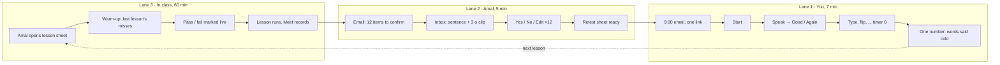
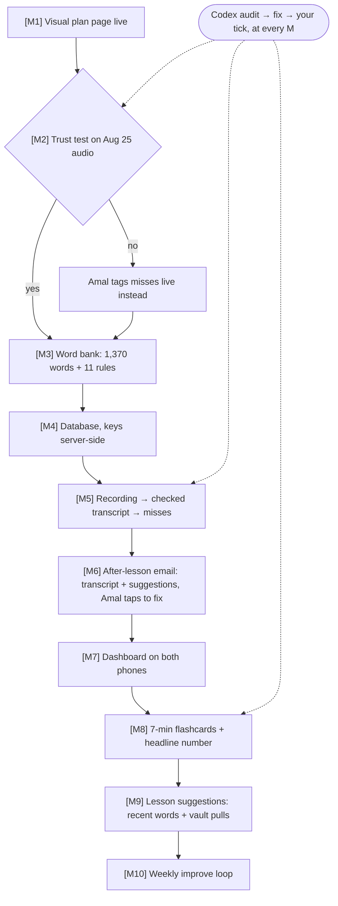
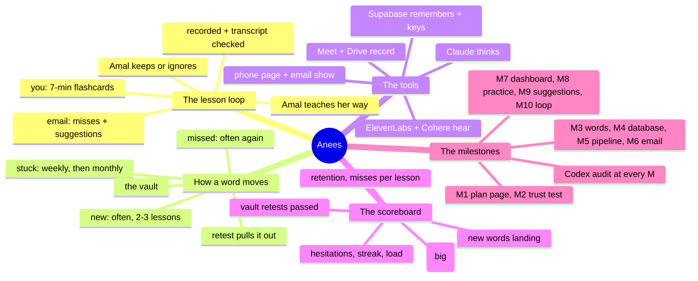
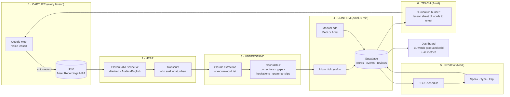
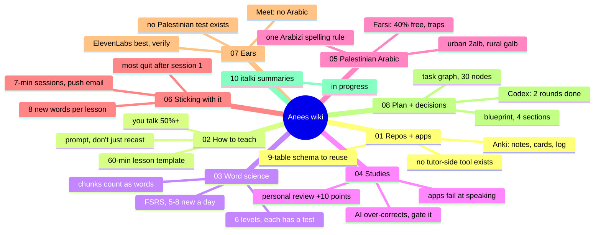

# ANEES BLUEPRINT (renamed from Anees 2026-09-03; anees أنيس = the companion whose company lifts loneliness, same word in Farsi) (step-by-step with Medi, started 2026-09-03)

> **FIRST AND ONLY ACTION ON APPROVAL (Medi, 2026-09-03):** publish ONE web page (Artifact) that renders this blueprint with every diagram as a picture: the 3-lane flow, word cycle, milestones, mind map, tech stack, scoreboard, wiki map. Send the link. Then STOP and wait for Medi's next instruction. No install, no repo, no code, no emails.

## Core Goal
_(flow approved 2026-09-03)_
**Every lesson with Amal makes the next one better: the recording tells us what stuck and what didn't, Amal gets suggestions (never a script), and you keep cycling old words while learning new ones, with a full scoreboard of metrics (words said cold on top, plus retention, misses per lesson, new words landing, vault retests passed, hesitations, streak, review load).**

## User Experience Flow

**Lane 1 — You, between lessons (7 minutes)**
- 9:00 email "7 minutes of Arabic" --> tap the link --> one big Start button
- Start --> card 1: hear Amal's question --> you speak --> tap Good / Again
- --> card 2 (type it) --> card 3 (flip it) --> ... timer hits 0 --> stop, even mid-card
- --> done screen: one number, "words you can say cold" --> close

**Lane 2 — Amal, right after each lesson (Medi's correction 2026-09-03: not rigid, she owns the plan)**
- lesson ends --> Meet saves the audio --> transcribed --> Claude reviews the transcript for errors --> email to Amal + Medi as soon as it's ready
- email has 3 parts: (1) the transcript, fixable by Amal with one tap per line; (2) new words + misses spotted; (3) **suggestions** for her next lesson, not a script
- suggestions = recent words to hit again (frequent while new) + a few older words pulled from the vault + which grammar rules to test, woven into whatever she is teaching
- she keeps or ignores any suggestion --> her own lesson plan

**Lane 3 — In class (60 minutes, voice only, Amal's plan)**
- Amal teaches what she wants (e.g. a new verb) --> uses that verb to test old nouns, adjectives, grammar --> Meet records
- new words take 2-3 lessons to land; flashcards reinforce between lessons
- --> lesson ends --> back to Lane 2

**Word life cycle (how the queue breathes)**
- new word --> seen often (every lesson + every practice) --> it sticks --> pushed back (weekly, then monthly) --> the vault --> pulled out for a retest --> if missed, back to often

**The loop**
- Lane 3 --> Lane 2 --> Lane 1 --> Lane 3 ... 3-4 times a week

### Same flow as a chart


### Milestones


### Mind map (all pictures in one)


## Tech Stack
_(approved 2026-09-03)_
- **Capture:** Google Meet auto-record --> Google Drive (already in place)
- **Hear:** ElevenLabs Scribe v2 (main), Cohere Transcribe Arabic (second opinion, free)
- **Think:** Claude API: checks the transcript, finds misses, writes Amal's suggestions
- **Remember:** Supabase: database, login for 2 emails, Edge Functions that hold every secret key
- **Show:** one phone-friendly web page on GitHub Pages (same pattern as the gold dashboard): Scoreboard · Inbox · Words · Practice · Suggestions
- **Schedule:** FSRS (ts-fsrs) decides when each word comes back
- **Nudge:** rich email via the existing send_note.mjs sender
- **Audit:** Codex at every milestone; **Plan:** BuilderIO visual-plan page for you and Amal
- **Runs on:** the always-on Alchemy PC for the Drive watcher; everything else in the cloud

## Immediate Milestone — "Can we trust the ears?" (M1 + M2, about one week)
- Step 1 (Claude, 10 min): install the visual-plan tool --> a login window opens --> **you click sign in once**
- Step 2 (Codex, read-only): confirms the fixes from its two reviews before any file is created
- Step 3 (Claude): download the Aug 25 recording --> transcribe with ElevenLabs and Cohere --> check both against each other
- Step 4 (Claude): build a 50-line sheet: 20 Amal corrections, 10 "how do you say", 10 hesitations, 10 random Arabic lines, each with the audio clip
- Step 5 (**you + Amal**, 20 min): mark each line right / wrong
- Step 6 (Claude + Codex): score against the 4 thresholds --> **go** (recordings are the main signal) or **no-go** (Amal tags misses live, recordings secondary)
- Done when: the scorecard and the decision are on the visual-plan page and you've ticked it.
- Nothing else gets built until this is decided.

---

# ANEES (formerly Anees) — Palestinian Arabic Lesson Tracker (working notes, superseded by the blueprint above as the reading surface)
Working name; Medi can rename. Plan written 2026-09-03 after a 7-question grill.

## PLAN TOOL (decided 2026-09-03): BuilderIO `visual-plan` skill, hosted mode
- What it is: a Claude Code skill that turns a plan into a scannable web page (diagrams, wireframes, file map, decisions, open questions) with a share link and comments Medi/Amal can leave and Claude resolves. Free, open source. Source: https://github.com/BuilderIO/skills/tree/main/skills/visual-plan
- Install (first action after approval): `npx @agent-native/skills@latest add --skill visual-plan` → Medi completes the one-time browser login when it opens (Claude never enters credentials).
- Then `/visual-plan` authors the Anees plan from this file: contracts table, task graph v2, the six-step loop, the milestone audit loop, dashboard wireframes (Today / Inbox / Words / Practice / Lesson sheet), and the open questions. Comments from Medi and Amal become graph changes; every change regenerates the page.
- graph.yaml stays the task truth; the visual plan is the reading surface. This markdown file becomes wiki/08.
- Fallback if hosted login fails: `--mode local-files` (same visuals, no comments/sharing).

## HOW THIS PLAN IS PRESENTED (earlier decision, now implemented via visual-plan)
Research (2026-09-03, ADHD planning + Claude rendering): Barkley externalization, CHADD mind maps, Now/Next/Later (Bastow), progressive disclosure, ≤3 items in "Now", checkboxes as the only input.
**Structure = a task graph ("graph engineering", task-graph flavor), one source of truth, two views:**
- `plan/graph.yaml` — nodes (id, title, owner: medi|amal|claude, phase, done_when, first_action, wiki_link), edges (depends_on). Claude works from this file. Every task-status change happens here.
- `plan/map.html` (published Artifact) — generated from graph.yaml. Layer 0: one picture (the 6-step loop + phase strip). Layer 1: Now / Next / Later, max 3 cards in Now. Layer 2: click a card → 3-5 steps with checkboxes, first tiny action, link to wiki. Layer 3: the wiki, never inline. Checkbox state persists per viewer.
- Rule: never edit the map by hand; regenerate from graph.yaml. This file (the long plan) becomes a wiki page, not the thing Medi reads.
- Medi's phone/dashboard gets one pinned link (Barkley's "point of performance").
Sources: [CHADD mind maps](https://chadd.org/attention-article/from-chaos-to-clarity-using-mind-maps-to-navigate-adult-adhd/), [Barkley externalization](https://www.additudemag.com/working-memory-powers-executive-function/), [Now/Next/Later](https://www.prodpad.com/blog/invented-now-next-later-roadmap/), [progressive disclosure](https://design.intuit.com/adhd-and-design/), [graph-engineering skill](https://github.com/codejunkie99/graph-engineering), [Mermaid types](https://mermaid.js.org/intro/).

## Context
Medi takes voice-only Palestinian Arabic lessons with tutor Amal Abusrour, 3-4x/week on Google Meet, and supplements with Quizlet (which does not record wrong answers). Amal keeps a ~1,370-word vocab doc and an 11-rule grammar doc, but NOTHING records which words Medi is weak on. Goal: record every lesson, extract struggles, keep a spaced-review list, and give Amal a curriculum builder that retests words and records results. Dashboard used by BOTH Medi and Amal.
First deliverable requested: a VISUAL PLAN LAYOUT (this file → an HTML artifact after approval).

## Grill results (settled facts)
| # | Question | Answer |
|---|---|---|
| 1 | Who uses it | Both Medi and Amal |
| 2 | Error signal | Recordings first; manual add must exist; exercises to identify/test/improve/review |
| 3 | Struggle types | Amal corrected me · "how do you say" gaps · hesitation · grammar slips (all 4) |
| 4 | Consent / surface | Amal OK with cloud STT · Web dashboard |
| 5 | Exercise mode / metric | All 4 modes (speak, type Arabizi, flip, Amal live) · #1 metric = words produced cold, show all others too |
| 6 | Amal's time / kill risk | 5 min after class · **transcripts too wrong to trust** |
| 7 | History / build-vs-buy | Only the Aug 25 recording + Amal's doc is the history · Build our own |

## Key findings that shaped the design
- Google Meet Gemini notes/transcripts have NO Arabic. Aug 25 transcript rendered Arabic as gibberish ("Camel"=kammel, "Buzzbot"=mazbout). The MP4 recording is fine → re-transcribe.
- Levantine word-error rates: Whisper ~58%, Cohere Transcribe Arabic (open) ~40%, ElevenLabs Scribe v2 ~10-25% (lists Palestinian, diarization, AR-EN code-switch, $0.40/hr). No published Palestinian WER anywhere → must hand-test.
- Amal's vocab doc: 3 column layouts, Arabizi mixed with `'`/`kh` in early tabs, zero learner-status markers, 836 conjugation rows that are paradigms not vocab.
- Wispr Flow: Arabic script only, no Arabizi, gated API → not a transcriber. Optional dictation input only.
- Reusable references: py-fsrs / ts-fsrs (MIT scheduler), m98/fluent mistakes-db shape, AALETA error taxonomy, Maknuune 36K Palestinian lexicon (phonological → Arabizi map), CAMeL Tools.

## Visual plan layout (the deliverable)



Dashboard tabs (both users, magic-link login):
1. **Today** — #1 metric big, next review due, last lesson's confirmed struggles.
2. **Inbox** (Amal) — AI candidates from the latest lesson, yes/no/edit, 5 min.
3. **Words** — all ~1,370 + new; status: unknown / seen / weak / known / cold-produced; filters by topic, rule, last-tested.
4. **Practice** (Medi) — FSRS queue; modes: Speak (mic → Scribe → grade), Type Arabizi, Flip self-grade.
5. **Lesson sheet** (Amal) — auto-built list of words/rules to retest next class; she marks results live; results feed back.
6. **Metrics** — corrections/lesson trend, coverage %, streak, per-topic heat map, transcript confidence.

## Design rules pulled from the wiki (binding for every phase)
- **Word status ladder 0-5** (New → Recognised → Recalled → Spoken → Used → Kept); up only by passing that level's test, down after two fails (wiki 03).
- **Scheduler = FSRS** via ts-fsrs, retention 0.90, defaults until 1,000 reviews (wiki 03/04).
- **Caps:** 8 new words/lesson, 25/week, 40 reviews/day, overflow silently rescheduled; leech at 8 lapses, warn at 4 (wiki 06).
- **Session = 7 minutes**, visible countdown, one "Start" button, production only (speak/type), no multiple choice (wiki 06).
- **Push not pull:** rich email at 9:00 with one deep link; Amal's inbox is a 5-line confirm, never browsing (wiki 06).
- **Headline metric = "Words I can say cold":** first attempt on a due day, ≥7 days since last exposure, no hint, pass; trailing 28 days, deduplicated (wiki 06). Secondary: true retention, streak w/ freeze, corrections/10 min, hesitations/min on fixed prompt, review load.
- **Corrections logged as** utterance, error type, feedback type (recast/prompt/explicit), uptake, repair, recurrence (wiki 02).
- **Canonical Arabizi spec** (wiki 05 §4): 2 3 7 5 8 6 9, doubled consonant for shadda, -e/-a for ة, hyphenated clitics; Amal's spelling wins for known words; machine conversion is a suggestion queue.
- **Every word carries:** script (normalized ي/ك), canonical Arabizi, variants[], region_variant (default urban), qaf_origin flag, farsi_cognate + false_friend flag (Amal confirms), source, kind ∈ {word, chunk}, audio (required for review) (wiki 05).
- **Error taxonomy enum:** Persian-L1 phonology list (wiki 05 §5) + Levantine grammar list (§6) + link to the 11 rules in Amal's grammar doc.
- **Speak mode looks like class:** Amal's question as audio, timed spoken answer, no text prompt; Pimsleur anticipation pause (wiki 03/01).
- **Lesson template** for Amal (wiki 02 §7): 8-min retrieval warm-up from the error log → task → language focus → 3/2/1 retelling recorded.
- **N=1 progress judgement:** weekly aggregation, 2-week baseline, 4-week trend, "progress" only after 3 consecutive weekly points above baseline (wiki 06).

## Draft task graph (becomes `plan/graph.yaml` on approval; phases below are the long-form of the same nodes)
```yaml
nodes:
  - {id: G0, title: Set up repo + plan graph + map page, owner: claude, phase: W, depends_on: [], done_when: "anees repo exists, graph.yaml + wiki/ pushed, map artifact published", first_action: "git init C:\\dev\\anees"}
  - {id: G1, title: Write wiki pages 00-08, owner: claude, phase: W, depends_on: [G0], done_when: "9 files in wiki/, linked from README"}
  - {id: T0, title: Download Aug 25 recording, owner: claude, phase: 0, depends_on: [G0], done_when: "MP4 on disk, duration 62 min"}
  - {id: T1, title: Transcribe with Scribe v2 + Cohere, owner: claude, phase: 0, depends_on: [T0], done_when: "two transcripts with speaker labels stored"}
  - {id: T2, title: Hand-check 50 Arabic lines, owner: medi+amal, phase: 0, depends_on: [T1], done_when: "sheet with 50 rows marked right/wrong", first_action: "open the sheet Claude emails you"}
  - {id: T3, title: Go / no-go on transcription, owner: medi, phase: 0, depends_on: [T2], done_when: "decision recorded in graph.yaml (go if ≥75% right)"}
  - {id: B1, title: Import Amal's 1,370 words + 11 rules, owner: claude, phase: 1, depends_on: [G0], done_when: "words + rules tables filled, 20 spot-checks pass"}
  - {id: B2, title: Ask Amal 2alb/galb/kalb + false-friend list, owner: amal, phase: 1, depends_on: [B1], done_when: "profile variant set, false-friend flags confirmed"}
  - {id: P1, title: Drive watcher → transcript → candidates, owner: claude, phase: 2, depends_on: [T3, B2], done_when: "Aug 25 run yields candidates incl. asif-vs-verb and mazloom"}
  - {id: P2, title: Rich email nudge to Amal + Medi, owner: claude, phase: 2, depends_on: [P1], done_when: "email received with count + deep link"}
  - {id: D1, title: Dashboard v1 Today/Inbox/Words/Metrics, owner: claude, phase: 3, depends_on: [P1], done_when: "both users log in on phone; Amal confirms 1 real inbox"}
  - {id: R1, title: Practice: FSRS + speak/type/flip, 7-min cap, owner: claude, phase: 4, depends_on: [D1], done_when: "one full session logged in reviews; headline number updates"}
  - {id: S1, title: Lesson sheet + live pass/fail, owner: claude, phase: 5, depends_on: [R1], done_when: "one real class uses the sheet; results in reviews mode=live"}
  - {id: M1, title: Progress judgement (2-wk baseline, weekly trend), owner: claude, phase: 5, depends_on: [R1], done_when: "weekly chart with baseline line on Metrics tab"}
  # Milestone audit loops (Codex = independent auditor; added 2026-09-03 at Medi's request)
  - {id: A0, title: Codex reviews the whole plan, owner: codex, phase: W, depends_on: [], done_when: "review saved to wiki/09-codex-reviews.md; risks folded into graph"}
  - {id: L0, title: Loop M0: transcription trust, owner: codex, phase: 0, depends_on: [T3], done_when: "Codex audits the 50-line scorecard + go/no-go reasoning; verdict logged"}
  - {id: L1, title: Loop M1: word bank audit, owner: codex, phase: 1, depends_on: [B1, B2], done_when: "Codex checks import script + 20 random rows vs Amal's doc; Arabizi normalizer tests pass"}
  - {id: L2, title: Loop M2: pipeline audit, owner: codex, phase: 2, depends_on: [P1, P2], done_when: "Codex reviews extractor prompt + code; false-flag rate on Aug 25 measured; fixes applied"}
  - {id: L3, title: Loop M3: dashboard audit, owner: codex, phase: 3, depends_on: [D1], done_when: "Codex reviews auth/RLS, phone layout, Inbox flow; Amal completes 1 inbox with no help"}
  - {id: L4, title: Loop M4: practice audit, owner: codex, phase: 4, depends_on: [R1], done_when: "Codex reviews FSRS wiring + caps + speak grading; 5 real sessions logged; headline number correct by hand-check"}
  - {id: L5, title: Loop M5: lesson sheet audit, owner: codex, phase: 5, depends_on: [S1, M1], done_when: "Codex reviews sheet ranking + live logging; 2 real classes used it"}
  - {id: W1, title: Weekly improve loop, owner: claude+codex, phase: ongoing, depends_on: [L4], done_when: "every Monday: metrics reviewed, one change proposed, Codex reviews the diff, change shipped or dropped; logged in wiki/08"}
now: [A0, G0, T0]        # max 3
next: [B1, G1, T1, T2, T3, L0, B2, L1]
later: [P1, P2, L2, D1, L3, R1, L4, S1, M1, L5, W1]
```

### The loop that runs inside every milestone
```
BUILD (Claude) → TEST (automated + one real use by Medi/Amal) → AUDIT (Codex, independent)
      ↑                                                                  │
      └──────────────── FIX what Codex found ◄───────────────────────────┘
                              → SIGN-OFF (Medi ticks the box on the map)
```
- Codex is never the builder of what it audits. It reviews code, prompt, test evidence and the "done_when" claim.
- Every audit writes 3 lines to `wiki/09-codex-reviews.md`: what it checked, what failed, what changed.
- A milestone is not "done" on the map until its L-node is green.

## CODEX REVIEW A0 — round 1 + round 2 done 2026-09-03 (round 2: 4/5 risks closed; the remaining M0-threshold gap, S0→F0 dependency, and 4 mapping ambiguities are fixed in the CONTRACTS table below; round 3 = Codex confirms at the start of G0 before any file is created)
Top risks: (1) 75% word-accuracy gate doesn't test what we mine; (2) secrets on static GitHub Pages; (3) five contradictory contracts across wiki pages; (4) no audio-capture path for review items; (5) no retries/dedupe/retention/manual-add. Graph order wrong in 9 places. Cut from v1: secondary charts/streaks/formal N=1 claims, automatic ASR grading, up-front audio for all 1,370 words. Full text goes to `wiki/09-codex-reviews.md` on approval.

### CONTRACTS (one `plan/constants.md`, supersedes any conflicting line elsewhere in this file)
| Contract | Value |
|---|---|
| Word status | exactly 6: 0 New · 1 Recognised · 2 Recalled · 3 Spoken · 4 Used · 5 Kept. Tutor labels map onto these (new=0-1, shaky=2-3, solid=4, known=5). No other vocab. |
| Headline metric | "Words I can say cold": **spoken** attempts only (typed does not count); first attempt on a due day; ≥7 days since last exposure; no hint; pass; trailing **28** days; dedup by item. |
| FSRS unit | per **card** = item × mode (speak / type / flip). Item status derives from its cards. |
| Retention target | 0.90. |
| Caps | 8 new items/lesson · 25/week · 40 reviews/day · session 7 min. |
| Leech | warn at 4 lapses, flag+suspend at 8. |
| Grading v1 | speak mode records audio; **self-grade** (Again/Hard/Good/Easy) or Amal grades on the sheet. Automatic ASR grading = v2. |
| Audio | required only when an item enters speak practice; source = clip from the lesson recording at the utterance timestamp; if none, Amal records 3 s from the Inbox. Never bulk-generate. |
| Secrets | ElevenLabs + Anthropic keys live in Supabase Edge Function secrets only. Static page calls Edge Functions with the user's session token. |
| Trust test M0 | stratified gold sample from Aug 25: 20 Amal corrections, 10 "how do you say" gaps, 10 hesitation/self-repair lines, 10 random Arabic lines; plus speaker labels and timestamps on all 50. Thresholds: Arabic word accuracy ≥75%; speaker label accuracy ≥90%; hesitation/self-repair preserved ≥60%; extraction precision ≥70% on corrections, ≥70% on gaps, ≥50% on hesitations; grammar-slip extraction measured at M0 for information only (no gate; gated at L2 ≥60%). Any gated miss → fallback = Amal tags live, recordings secondary. |
| Pass ↔ rating | speak/type/flip all rate Again / Hard / Good / Easy (FSRS 1-4). **Pass = Good or Easy.** Again = fail. Hard = pass for scheduling but does NOT count toward the headline metric. |
| Item status from cards | item status = the level its **weakest required card** has earned: 1 needs flip pass; 2 needs flip+type pass; 3 needs speak pass; 4 needs speak-in-sentence pass; 5 = level 4 held ≥30 days with no Again on any card. Two consecutive Again on any card drops the item one level. |
| Fallback audio | if no clip exists when an item enters speak practice, the item shows "needs audio" on Amal's Inbox **and** on the Words row; she records 3 s from either place. Manual-add items get audio the same way. |
| Retention (audio) | raw lesson audio 90 days; 3-s item clips kept while the item exists; Medi's recorded speak attempts 30 days then deleted; transcripts and review rows kept. |
| Ingestion | idempotent by Drive file id; retry 3× with backoff; failed runs email Medi only; raw audio kept 90 days then deleted, transcripts kept; Amal can request deletion of any lesson. |
| Manual add | one form (word, meaning, optional note) on the Words tab for Medi or Amal; enters at status 0 with source=manual. |

### Task graph v2 (supersedes the draft above; becomes `plan/graph.yaml`)
```yaml
nodes:
  # Phase W — scaffold + docs (parallel with Phase 0; neither builds product code)
  - {id: V0, title: Install visual-plan skill (hosted) + Medi logs in, owner: claude+medi, depends_on: [], done_when: "skill listed; login done; empty plan opens in browser", first_action: "run the npx add command; Medi clicks login"}
  - {id: V1, title: Author Anees visual plan from this file, owner: claude, depends_on: [V0, A0], done_when: "share link works; Medi and Amal can comment; contains contracts, graph v2, loops, 5 wireframes"}
  - {id: A0, title: Codex reviews plan, owner: codex, depends_on: [], done_when: "rounds 1-2 done 2026-09-03; round 3 at G0 start"}
  - {id: G0, title: Scaffold repo + constants + graph, owner: claude, depends_on: [A0], done_when: "C:\\dev\\anees with plan/graph.yaml, plan/constants.md, README; pushed"}
  - {id: G1, title: Write wiki 00-09, owner: claude, depends_on: [G0], done_when: "10 files in wiki/, linked from README"}
  - {id: G2, title: Publish map artifact, owner: claude, depends_on: [G1], done_when: "map generated from graph.yaml, link pinned for Medi"}
  # Phase 0 — trust test (no repo needed)
  - {id: T0, title: Get Aug 25 audio, owner: claude, depends_on: [], done_when: "MP4 in scratch, 62 min"}
  - {id: T1, title: Transcribe twice (Scribe v2 + Cohere), owner: claude, depends_on: [T0], done_when: "two diarized transcripts saved"}
  - {id: T2, title: Build stratified 50-line gold sheet, owner: claude, depends_on: [T1], done_when: "sheet emailed: 20 corrections, 10 gaps, 10 hesitations, 10 random"}
  - {id: T3, title: Check the 50 lines, owner: medi+amal, depends_on: [T2], done_when: "every row marked", first_action: "open the sheet, mark right/wrong"}
  - {id: T4, title: Score + go/no-go, owner: medi, depends_on: [T3], done_when: "scorecard vs 4 thresholds; decision in graph.yaml"}
  - {id: L0, title: Codex audit M0, owner: codex, depends_on: [T4], done_when: "sample selection, arithmetic, speaker/timestamp accuracy checked; verdict logged"}
  - {id: F0, title: Fix + retest M0, owner: claude, depends_on: [L0], done_when: "Codex findings closed; Medi ticks M0"}
  # Phase 1 — foundation + word bank
  - {id: S0, title: Supabase project + schema + Edge Functions, owner: claude, depends_on: [G0, F0], done_when: "9 tables, RLS, allowlist auth for 2 emails, edge fn with secrets; migrations in repo"}
  - {id: B0, title: Amal profile: 2alb/galb/kalb + dialect, owner: amal, depends_on: [], done_when: "variant recorded", first_action: "Claude emails Amal 3 questions"}
  - {id: B1, title: Import 1,370 words + 11 rules, owner: claude, depends_on: [S0, B0, F0], done_when: "words/rules tables filled; 20 random rows match the doc; Arabizi normalizer tests pass"}
  - {id: B2, title: Confirm Farsi false-friend flags, owner: amal, depends_on: [B1], done_when: "each flagged row yes/no"}
  - {id: X1, title: Manual add form, owner: claude, depends_on: [S0], done_when: "Medi or Amal adds a word from phone; lands at status 0"}
  - {id: L1, title: Codex audit M1, owner: codex, depends_on: [B1, B2, X1], done_when: "reconciliation, packed cells, dupes, Unicode, status consistency checked"}
  - {id: F1, title: Fix + retest M1, owner: claude, depends_on: [L1], done_when: "findings closed; Medi ticks M1"}
  # Phase 2 — pipeline
  - {id: P1, title: Drive watcher → transcript → candidates, owner: claude, depends_on: [F1], done_when: "Aug 25 run yields candidates incl. asif-vs-verb + mazloom; idempotent; retries; failure email"}
  - {id: X2, title: Audio clip per candidate, owner: claude, depends_on: [P1], done_when: "each candidate has a 3-s clip cut at its timestamp"}
  - {id: L2, title: Codex audit M2, owner: codex, depends_on: [P1, X2], done_when: "idempotency, recovery, secrets, precision + missed-struggle rate on all 4 types measured"}
  - {id: F2, title: Fix + retest M2, owner: claude, depends_on: [L2], done_when: "findings closed; Medi ticks M2"}
  # Phase 3 — dashboard
  - {id: D1, title: Dashboard v1: Today · Inbox · Words, owner: claude, depends_on: [F2], done_when: "both users log in on phone; Amal completes one real Inbox in ≤5 min with no help"}
  - {id: P2, title: Email nudge with deep link, owner: claude, depends_on: [D1], done_when: "email lands within 10 min of a new recording"}
  - {id: L3, title: Codex audit M3, owner: codex, depends_on: [D1, P2], done_when: "allowlist auth, RLS negative tests, phone layout, headline metric code vs contract"}
  - {id: F3, title: Fix + retest M3, owner: claude, depends_on: [L3], done_when: "findings closed; Medi ticks M3"}
  # Phase 4 — practice
  - {id: X3, title: Baseline data: 2 weeks of lessons logged, owner: claude, depends_on: [F2], done_when: "≥6 lessons with confirmed struggles before practice starts"}
  - {id: R1, title: Practice: FSRS per card, speak/type/flip, 7-min cap, self-grade, owner: claude, depends_on: [F3, X3], done_when: "5 real sessions in reviews; headline number matches a hand count"}
  - {id: L4, title: Codex audit M4, owner: codex, depends_on: [R1], done_when: "FSRS fixtures, caps, overflow, 7-min stop, append-only reviews, metric agreement"}
  - {id: F4, title: Fix + retest M4, owner: claude, depends_on: [L4], done_when: "findings closed; Medi ticks M4"}
  # Phase 5 — teach
  - {id: S1, title: Lesson sheet + live pass/fail, owner: claude, depends_on: [F4], done_when: "2 real classes used it; results in reviews mode=live"}
  - {id: C1, title: Weekly progress line (simple), owner: claude, depends_on: [F4], done_when: "one weekly chart of the headline number; nothing else"}
  - {id: L5, title: Codex audit M5, owner: codex, depends_on: [S1, C1], done_when: "ranking reproducible, live logging persists, tutor workload ≤5 min"}
  - {id: F5, title: Fix + retest M5, owner: claude, depends_on: [L5], done_when: "findings closed; Medi ticks M5"}
  - {id: W1, title: Weekly improve loop, owner: claude+codex, depends_on: [F5], done_when: "Mondays: metrics → one change → Codex reviews diff → ship or drop; logged in wiki/08"}
now:   [V0, V1, T0]            # max 3; A0 is done
next:  [G0, B0, G1, G2, S0, T1, T2, T3, T4, L0, F0]
later: [B1, B2, X1, L1, F1, P1, X2, L2, F2, D1, P2, L3, F3, X3, R1, L4, F4, S1, C1, L5, F5, W1]
deferred_v2: [automatic ASR grading, streaks, secondary charts, N=1 statistics, bulk audio, Wispr Flow]
```

## Phase W — Write the wiki + plan graph + map (first action after approval, before Phase 0)
- Create `plan/graph.yaml` from the draft above and a generator that renders `plan/map.html` (Layer 0 loop + phase strip, Layer 1 Now/Next/Later, Layer 2 click-to-expand with checkboxes, Layer 3 wiki links). Publish as an Artifact; pin the link for Medi.
- Create `C:\dev\anees\wiki\` with pages 00-08 split out of this file verbatim, plus `README.md` pointing at it. Commit + push (new private GitHub repo `anees`).
- Publish the visual plan layout as an HTML artifact (the diagram above + phases + hard limits) for Medi and Amal.

## Phases (thinnest slice first; kill risk addressed in Phase 0)

### Phase 0 — Trust test (before any building)
- Download Aug 25 MP4 from Drive (file 1IcW-94CWMNBBlYcOSXQRxQYqEatjtYT-).
- Transcribe twice: ElevenLabs Scribe v2 (diarize on) and Cohere Transcribe Arabic (open, second opinion).
- Pull 50 Arabic utterances; Medi + Amal hand-check in a shared sheet. Go if Scribe ≥ ~75% words right on Arabic turns. If not, fall back to "Amal tags live" as the primary signal and recordings as secondary.
- Output: one-page accuracy scorecard + go/no-go.

### Phase 1 — Seed the word bank
- Parse Amal's vocab doc (Drive API export) → `words` table. Normalize the 3 column layouts; split packed cells; keep Arabic script, Arabizi, English, plural, topic, source tab. Skip the 836 paradigm rows (store as `paradigms`). Normalize Arabizi variants (`'`→3, `kh`→5, `9`→s-emphatic) into one canonical spelling + keep original.
- Parse grammar doc → `rules` table (11 rules) so grammar slips can link to a rule.
- Every word starts `status = seen, confidence = unknown`. No guessed statuses (Medi audit rule: never a guessed value).

### Phase 2 — Capture → candidates pipeline
- Script on Medi's PC (Python, scheduled like ig-saves refresh) polls Drive `Meet Recordings` for new MP4s → Scribe v2 → transcript JSON stored in Supabase `lessons`.
- Claude extraction prompt gets: diarized transcript + known-word list + rules list. Returns candidates typed as `correction | gap | hesitation | grammar_slip`, each with tutor's actual sentence, timestamp, confidence, linked word/rule. Low-confidence lines flagged, never guessed.
- Rich email nudge to Amal + Medi (house style, send_note.mjs): "12 candidates waiting, 5 min".

### Phase 3 — Dashboard v1 (Today · Inbox · Words · Metrics)
- Static HTML + Supabase JS, GitHub Pages, same deploy pattern as the gold dashboard. Supabase Auth magic link for the two users only; RLS on all tables.
- Metric #1: count of words answered right in Practice with no hint in the last 30 days.

### Phase 4 — Practice + FSRS
- ts-fsrs in the browser; `reviews` table records every attempt (mode, result, ms).
- Speak mode: browser mic → Scribe → fuzzy match against canonical Arabizi/script (accept either). Type mode: Arabizi with variant-tolerant matching. Flip mode: Easy/Hard.
- This replaces Quizlet; optional Quizlet text import if Medi exports sets later.

### Phase 5 — Lesson sheet / curriculum builder
- Ranks words by weakness × staleness × topic; produces a printable/on-screen sheet for Amal; she marks pass/fail live; results are `reviews` with `mode = live`.

## Storage / hosting (my call, reversible)
- New Supabase project `anees` (free tier). If the project cap is hit, a `anees` schema inside gold-flip-hub via the management-API token (expires 2026-11-30).
- Repo: `C:\dev\anees` (off the Drive-synced tree, like ganjsta-ui). Push after each addition.
- Secrets: ElevenLabs + Anthropic keys in User env vars, never in repo.

## Costs
- Scribe v2 ≈ $0.40/lesson-hour → ~$1.50/week. Claude extraction ≈ cents/lesson. Supabase + Pages free.

## Verification
- Phase 0: scorecard with hand-checked accuracy number; go/no-go recorded.
- Phase 1: row count in `words` ≈ 1,370 ± the packed-cell splits; spot-check 20 random rows against the doc.
- Phase 2: run on Aug 25 MP4 end-to-end; Amal confirms/rejects candidates; at least one real correction ("asif" adjective vs verb "ba3tazer", "Muslim/mazloom") must surface.
- Phase 3-4: live on GitHub Pages, both users log in on phone; one full Practice session recorded in `reviews`; metric #1 updates.
- Phase 5: one lesson sheet used in a real class; results land as `mode = live` reviews.

## Out of scope for v1
Video, pronunciation scoring, MSA, Wispr Flow integration, multi-tutor, italki.

---
---

# WIKI DRAFT (to be split into `wiki/` pages on approval)

## CODEX RESEARCH AUDIT — 2026-09-03 (corrections override the pages below where they conflict)
**Verdict:** strong enough to start M2 as a *validation* test; not strong enough to freeze vendors, thresholds, or automation.
**Corrected claims**
- Page 02/03: Lyster & Saito 2010 explicit-correction effect is **0.84**, not ~0.59, and explicit correction was **not distinguishable** from prompts/recasts ([paper](https://kazuyasaito.net/SSLA2010.pdf)). Keep "prompts work"; drop "prompts beat explicit".
- Page 04: Lindsey et al. 2014 (+10-17%) is a middle-school exam-retention result. Treat as a **ceiling**, not a forecast for adult Palestinian speaking.
- Page 04: "apps fail at speaking" → "in Duolingo's own data, speaking lags the other three skills"; Duolingo did report measurable speaking gains.
- Page 07: the WER table mixes incompatible datasets (generic Arabic, Israeli Levantine, non-Palestinian code-switching). **Not comparable.** The "expect 25-35% WER" line is withdrawn; the only number that counts is M2's own.
- Page 01: "no tutor-side dashboard exists" → "none found in a GitHub topic/star search"; absence not proven.
- Page 11: WhisperX is **BSD-2**; pyannote.audio is **MIT** with separate model-access terms.
**Contradictions resolved (single rule everywhere)**
- Leech: **warn at 4 lapses, flag+suspend at 8** (page 06 rule 12 "cull at 4" is withdrawn).
- Arabizi tooling: CAMeL Tools core has **no** Arabizi module; the CAMeL Lab **seq2seq-transliteration-tool** is a separate repo (license unverified).
- ElevenLabs Scribe v2: docs list **generic Arabic, 10-20% WER tier**; "Palestinian named" came from a marketing page and is **unverified** until M2.
- Overworded Levantine list: existence **unresolved**; do not plan on it.
- Echo-Loop: final interval is **336 h = 14 days** (README's "28 days" is wrong).
**Added to the plan**
- M2 trust test now also measures **diarization error rate (DER)** with pyannote.metrics (target ≤ 15%, provisional) and CER alongside WER.
- Tutor adjudication of the 50-line sheet can use **ELAN** or **Label Studio** (time-aligned audio + text) instead of a plain spreadsheet if Amal prefers; spreadsheet stays the default.
- Extraction trust (M2/L2): double-annotate corrections (Claude vs Amal) and report precision, recall, false-positive rate, and Amal's minutes.
- ADHD dosing: the 7-minute / 40-review / 8-new policy is a **starting point**; run a 4-6-week N-of-1 pilot (M4→M5) before hard-coding.
- Missing tools now covered on page 12: LinguaCafe, asbplayer, Yomitan, OpenLingo, Immersion Suite.

### Wiki map

Planned pages: 00-Home · 01-Repos-and-Apps · 02-Teaching-Methods · 03-Vocabulary-Science · 04-Studies-and-PoC · 05-Palestinian-Arabic-Specifics · 06-Sticking-With-It · 07-Transcription-Engines (from first research batch) · 08-Plan-and-Decisions

## 01 — Repos & Apps to Learn From

*Research date 2026-09-03. "Unverified" = could not confirm this session.*

### A. Open-source repos worth studying

| Repo | Stars / License / Activity | One thing to steal |
|---|---|---|
| [Anki](https://github.com/ankitects/anki) | 30.3k, AGPL-3, release 26.08.1 (Aug 2026) | The **note → cards → revlog** split. One `notes` row, N `cards` (one per mode: speak/type/flip), append-only `revlog` (`id, cid, ease 1-4, ivl, lastIvl, factor, time_ms, type`). Schema: [AnkiDroid wiki](https://github.com/ankidroid/Anki-Android/wiki/Database-Structure). |
| [fsrs4anki](https://github.com/open-spaced-repetition/fsrs4anki) / [ts-fsrs](https://github.com/open-spaced-repetition/ts-fsrs) | 4.1k / 773, MIT | The **DSR state**: `difficulty (1-10), stability (days to 90% recall), retrievability`. FSRS-6 = 21 params ([algorithm](https://github.com/open-spaced-repetition/awesome-fsrs/wiki/The-Algorithm)). ts-fsrs drops into a Supabase stack. |
| [Lute v3](https://github.com/LuteOrg/lute-v3) | 1.5k, MIT | `words` + `wordparents`: `WoText, WoTextLC, WoStatus, WoTranslation, WoRomanization` plus parent→child so inflected form → lemma is explicit ([schema](https://deepwiki.com/LuteOrg/lute-v3/4.1-database-schema)). Status 1-5 / 98 ignored / 99 well-known. |
| [Echo-Loop](https://github.com/echo-loop/Echo-Loop) | 3.4k, AGPL-3, Flutter, active 2026 | **Listen → shadow → retell** on the learner's own audio; 8-stage/28-day review of *sentences with original audio*. Closest to "review a lesson clip". |
| [VocabSieve](https://github.com/FreeLanguageTools/vocabsieve) | 535, GPL-3 | "Known words" inferred from lookups + reviews, never typed. |
| [m98/fluent](https://github.com/m98/fluent) | 393, MIT | `mistakes-db.json`: error *patterns* with counts + example corrections, separate from vocab; `mastery-db` 0-5 per topic; `session-log`. |
| [duolingo/halflife-regression](https://github.com/duolingo/halflife-regression) | 576, MIT, 2016 | Learning-trace row: `p_recall, delta, lexeme_id, history_seen, history_correct, session_seen, session_correct`. Log per exposure. |
| [Discute](https://github.com/5uru/Discute) | 87, Apache-2 | Whisper → LLM corrections → TTS readback. Speak-mode plumbing reference. |
| [OpenPronounce](https://github.com/Halleck45/OpenPronounce) | 48, MIT | Phoneme scoring — **English-only**, useless for Arabic. |
| [vertesia/large-language-tutor](https://github.com/vertesia/large-language-tutor) | archived 2025 | Rule: deterministic app logic, LLM only for non-deterministic tasks. |
| [LibreLingo](https://github.com/LibreLingo/LibreLingo) | 2.6k, archived Jun 2026 | Lesson as YAML data, not a doc. |
| [flashcards-open-source-app](https://github.com/kirill-markin/flashcards-open-source-app) | 62, MIT | Documents FSRS logic in `docs/`, exposes SQL over MCP — copy the habit. |
| [WhisperLevantine](https://huggingface.co/HebArabNlpProject/WhisperLevantine) | — | Whisper-large-v3 on ~1,200 h Levantine. Also [Casablanca](https://arxiv.org/abs/2410.04527) multidialect benchmark. |

Gap found: **no maintained open-source tutor-side dashboard** for language learning exists (GitHub topic `language-tutor`: 7 repos, none >7 stars).

### B. Commercial apps: the one mechanic, and the evidence

| App | Mechanic | Evidence |
|---|---|---|
| Duolingo | Per-lexeme half-life model; strength bars = p_recall decay | HLR paper (Settles & Meeder ACL 2016), 13M traces. Efficacy studies company-authored ([research.duolingo.com](https://research.duolingo.com/)). |
| Anki | Note/card split + append-only revlog | 20 years of data; FSRS trained on it. Strongest engineering evidence. |
| FSRS (Anki, RemNote) | Per-learner params from the log | RemNote claims 20-40% fewer reviews at equal retention ([help](https://help.remnote.com/en/articles/9124137-the-fsrs-spaced-repetition-algorithm)) — vendor claim, consistent with open benchmarks. |
| Memrise | Learner-attached mnemonic per word | Self-reported stats; marketing. |
| LingQ | Status 1-4 + Known; blue = never seen ([support](https://lingq-support.groovehq.com/help/can-you-explain-a-lingqs-status)) | No efficacy study; good UX. |
| Clozemaster | 0/25/50/75/100% = 4 correct in a row at 1/10/30/180 days ([docs](https://docs.clozemaster.com/article/37-how-do-i-master-something)) | Fixed ladder; simple enough to explain to a tutor. |
| Speak / Praktika | Streaming ASR + roleplay | No efficacy study; no SRS (competitor-sourced). |
| Langua | Corrections + post-conversation report; saved words fed back | Vendor-described; matches our pipeline. |
| Pimsleur | Graduated-interval recall + **anticipation pause** ([method](https://www.pimsleur.com/the-pimsleur-method/)) | Pause is the transferable bit for speak mode. |
| Glossika | Sentence reps, record-yourself, daily "at-risk" list | Rhetoric, no study. |
| Migaku / Refold | Unknown/Learning/Known/Ignored/**Tracking** states ([blog](https://migaku.com/blog/youtube/the-learning-statuses-migaku-browser-extension)) | Tracking = tutor-pinned words. |
| Busuu / Babbel | Structured lessons + review | Vendor-commissioned Vesselinov studies (Babbel ~15 h ≈ one semester). |
| italki / Preply | **Preply Lesson Insights**: speaking time, vocab, grammar per lesson → Daily Exercises | Nearest commercial analogue to our loop. |
| Quizlet (current) | Learn mode; Progress buckets "Still learning" | Free tier caps Learn/Test rounds; Learn paywalled ~$2.99/mo (unverified). Confirms the pain. |

### C. Data-model patterns
- **Word vs lemma vs card.** Anki: bag of fields. Lute: surface form is the row, lemma via `wordparents`. Duolingo: `lexeme_id`. For dialect Arabic with no reliable lemmatizer: **form is primary, lemma an optional tutor-confirmed link.**
- **Learner state.** SM-2: `ivl, factor, reps, lapses, due`. FSRS: `stability, difficulty, due, state, last_review`. Ordinal status for tutors: "new / shaky / solid / known". **Recommendation: FSRS state per card + ordinal status per item for tutor display.**
- **Review events.** Everyone that works keeps an **append-only log**.

Recommended schema (9 tables):
```
lessons        id, recorded_at, meet_url, audio_url, transcript_url, duration_s, tutor_notes
utterances     id, lesson_id, speaker (learner|tutor), t_start, t_end, text_ar, text_translit, text_en
struggles      id, lesson_id, utterance_id, kind (correction|gap|hesitation|grammar),
               learner_said, target_form, note, extracted_by (llm|tutor),
               status (pending|confirmed|rejected), confirmed_by, confirmed_at
items          id, form_ar, translit, gloss_en, lemma_id→items.id NULL, pos, sense_note,
               audio_url, source_struggle_id, tutor_status (new|shaky|solid|known|ignored),
               tutor_pinned bool, created_at
item_contexts  id, item_id, utterance_id, sentence_ar, sentence_en
cards          id, item_id, mode (speak|type|flip), stability, difficulty, due, state, reps, lapses, last_review
reviews        id, card_id, reviewed_at, rating (1-4), answer_text, answer_audio_url,
               asr_text, asr_score, elapsed_days, scheduled_days, duration_ms   -- append-only
error_patterns id, label, description, count
struggle_patterns  struggle_id, pattern_id
lesson_sheets  id, lesson_id (next), created_by, items jsonb[], results jsonb, sent_at
```
`struggles` = tutor inbox; `items` exist only after confirmation; `reviews` never updates.

### D. UI patterns for a learner + tutor dashboard
- Confirm inbox with transcript line + 3-second audio clip (Preply, Migaku Tracking).
- Colored word status painted over the transcript (LingQ/Lute/Migaku).
- Four-button rating for flip; speak/type auto-rate with override (Anki/FSRS).
- Plain-word mastery ladder for the tutor (Clozemaster/LingQ).
- Card front = Amal's clip, not an isolated word (Echo-Loop/Glossika).
- Anticipation pause in speak mode (Pimsleur).
- Retest sheet as data; results logged as `reviews mode=lesson` (LibreLingo/Preply).
- Error-pattern rollup tile "top 5 recurring patterns this month" (m98/fluent).
- One chart both users see: reviews/day + retention %.
- No typed input from the learner beyond the answer.

### What we should steal (10)
1. Anki note/card/revlog split — one item, three cards, one immutable log.
2. FSRS via ts-fsrs; store `stability, difficulty, due, state` on `cards`.
3. Lute's `wordparents`: form is the row, lemma optional link.
4. Duolingo trace columns on every review row.
5. m98/fluent's separate mistakes DB: error patterns with counts.
6. Echo-Loop: review the clip, not the word.
7. Preply Lesson Insights as the tutor-side product shape.
8. Migaku's Tracking/pinned status for tutor-flagged words.
9. Clozemaster's four-rung ladder as the tutor-facing label over FSRS.
10. Pimsleur's anticipation pause; WhisperLevantine/Scribe for ASR, not OpenPronounce.

## 02 — How to Teach a Spoken Language: Methods, Evidence, and What Works 1-on-1

*For Amal (tutor) and Medi (learner). Voice-only Palestinian Arabic, 3–4×/week. Researched 2026-09-03. Effect sizes: d or g ≈ 0.2 small, 0.5 medium, 0.8 large. Items marked [unverified] could not be checked against the source this session.*

### 1. The big theories (one paragraph each)

**Krashen's Input Hypothesis (i+1).** You acquire language by understanding messages slightly above your level ("i" = where you are, "+1" = one step up). Criticism: "i" and "+1" are never defined, and output is ignored ([Wikipedia](https://en.wikipedia.org/wiki/Input_hypothesis)). *Lesson implication:* Amal should speak Arabic Medi can mostly follow, at a level just past his own; never all-English, never incomprehensible.

**Swain's Output Hypothesis (1985).** Immersion students who heard massive input still spoke poorly. Speaking forces you to *notice the gap*, test hypotheses, and reflect on form ([InfinLume summary](https://www.infinlume.com/blog/input-vs-output-language-learning)). *Implication:* Medi must talk at least half the lesson.

**Long's Interaction Hypothesis (1996).** Learning happens in *negotiation for meaning*: clarification requests, confirmation checks, corrections during real conversation. Keck et al. 2006, 14 studies, d = 0.92 immediate ([Keck 2006](https://works.bepress.com/casey_keck/6/)); Mackey & Goo 2007, 28 studies, d = 0.71 immediate, 1.09 delayed ([Cambridge](https://www.cambridge.org/core/journals/language-teaching/article/interaction-and-instructed-second-language-acquisition/78A156EE200F744F5978F99BFB073DBE)). *Implication:* 1-on-1 voice is the ideal format; every misunderstanding is a learning event.

**Skill Acquisition Theory (DeKeyser).** Declarative (know the rule) → procedural (use it slowly) → automatized (fast) through deliberate practice ([DeKeyser](https://onlinelibrary.wiley.com/doi/abs/10.1002/9781405198431.wbeal0067)). *Implication:* explain briefly, then drill in real use until fast.

**Usage-based / frequency (Nick Ellis 2002).** Grammar emerges from statistics ([ERIC](https://eric.ed.gov/?id=EJ650672)). *Implication:* prioritize high-frequency words and chunks; repetition is not optional.

**Noticing Hypothesis (Schmidt 1990).** You can't acquire a feature you never consciously notice ([Wikipedia](https://en.wikipedia.org/wiki/Noticing_hypothesis)). *Implication:* corrections must be *noticed* as corrections.

**Sociocultural theory / ZPD (Vygotsky; Lantolf).** What the learner can do *with help* but not alone; scaffold, then fade ([Lantolf et al. 2020](https://www.academia.edu/50859660/)). *Implication:* Amal feeds words just-in-time, then withdraws support in later retellings.

### 2. Corrective feedback: what actually works

**Terms.** *Recast* = tutor repeats correctly without flagging. *Prompt* = tutor withholds the answer and pushes self-correction (elicitation, clarification request, metalinguistic clue, repetition with rising intonation). *Explicit correction* = "No, say X." *Uptake* = learner responds; *repair* = learner produces the correct form.

- Lyster & Ranta 1997: recasts were 55% of feedback but least likely to produce repair; elicitation and metalinguistic feedback most likely ([ERIC](https://eric.ed.gov/?id=EJ539354)).
- Lyster & Saito 2010 meta-analysis, 15 studies, N = 827: durable effects; prompts > recasts; gains show most on free speech; longer treatments beat short ([ERIC](https://eric.ed.gov/?id=EJ892626)). [unverified: d ≈ 0.83 prompts, 0.59 explicit, 0.53 recasts.]
- Li 2010, 33 studies: d = 0.64; explicit wins short-term, implicit better maintained ([ERIC](https://eric.ed.gov/?id=EJ883422)).
- Brown 2016: recasts dominate; prompts produce more uptake ([SAGE](https://journals.sagepub.com/doi/10.1177/1362168814563200)).
- Norris & Ortega 2000 (49 studies): instruction works; explicit beats implicit ([ERIC](https://eric.ed.gov/?id=EJ611436)). [unverified: d ≈ 1.13 vs 0.54.]

**For Amal:** default to **prompts**; recast only during fluency time; explicit sparingly. Then Medi **says the corrected sentence** — repair is the learning moment.

**Tool should log per correction:** timestamp; Medi's utterance; error type (sound / word / grammar / chunk); feedback type (recast / prompt / explicit); uptake; repair; recurrence same lesson; "review me" flag for next warm-up.

### 3. Methods and their evidence

| Method | What it is | Evidence |
|---|---|---|
| **Task-based (TBLT)** | Learn by doing real tasks; grammar after | Bryfonski & McKay 2019, 52 studies, d = 0.93; re-analysis Xuan 2022 g = 0.61 ([ERIC](https://eric.ed.gov/?id=EJ1225836)). **Strong.** |
| **Dogme / conversation-driven** | Materials-light; language emerges from talk | Thin; principles overlap with interaction/TBLT ([Wikipedia](https://en.wikipedia.org/wiki/Dogme_language_teaching)). |
| **Audio-lingual** | Drill dialogues, pattern practice | Better speaking, worse writing (Scherer & Wertheimer 1964); Pennsylvania Project 1970 not better ([ERIC](https://eric.ed.gov/?id=ED015446)). Drills help automatization only. |
| **TPR** | Physical response to commands | Beginners/children; moot for voice-only ([Asher 1969](https://journals.sagepub.com/doi/10.1177/002246696900300304)). |
| **Pimsleur** | Graduated interval recall (5 s, 25 s, 2 min, 10 min, 1 h…) | Schedule is a proposal not a trial ([ERIC](https://eric.ed.gov/?id=ED012150)); spacing itself well evidenced. |
| **Michel Thomas / Language Transfer** | Build sentences from rules, no memorizing | No controlled study ([LessWrong](https://www.lesswrong.com/posts/FMpnREfJzbf3JSyfb/review-michel-thomas-french-direct-instruction)). Language Transfer has an Arabic course — raw material. |
| **FSI/DLI intensive** | Arabic = Category IV, ~2,200 h ([FSI](https://www.fsi-language-courses.org/blog/fsi-language-difficulty/)) | Tells us the *dose*. |
| **Shadowing** | Repeat audio half a second behind | Hamada 2016: listening gains, short daily sessions ([SAGE](https://journals.sagepub.com/doi/abs/10.1177/1362168815597504)). |
| **Refold / AJATT** | Massive immersion + Anki | Testimonials only ([tatsumoto](https://tatsumoto-ren.github.io/blog/should-i-trust-mattvsjapan-and-the-refold-site.html)). |
| **Goldlist** | Handwrite lists, revisit at 2-week gaps | One study, N=74, gains = spacing ([ERIC](https://eric.ed.gov/?id=EJ1345758)). |
| **Sentence mining** | Anki cards from real sentences | Rests on spacing + retrieval + context ([Nakata 2015](https://eric.ed.gov/?id=EJ1084789)). |
| **Conversation + error log** | Talk freely; tutor logs errors; review after | = prompts + delayed focus-on-form + spaced retrieval, all evidenced. |

### 4. Nation's Four Strands and the 60-minute split

Nation 2007: equal time on (1) meaning-focused input (~98% known words), (2) meaning-focused output, (3) language-focused learning, (4) fluency development (100% known material, faster) ([PDF](https://www.victoria.ac.nz/__data/assets/pdf_file/0019/1626121/2007-Four-strands.pdf)). Medi gets no Arabic outside lessons → shift input to homework audio; live hour = 10/20/15/15.

### 5. Memory science

- **Retrieval practice.** Roediger & Karpicke 2006: one week later, restudy group forgot 56%, test group 13% ([PubMed](https://pubmed.ncbi.nlm.nih.gov/16507066/)). Karpicke & Blunt 2011 ([PubMed](https://pubmed.ncbi.nlm.nih.gov/21252317/)). Adesope 2017 meta: g = 0.61 ([ERIC](https://eric.ed.gov/?id=EJ1141817)).
- **Spacing.** Cepeda 2006 ([link](https://escholarship.org/uc/item/3rr6q10c)); Cepeda 2008: best gap ≈ 10–20% of target retention (want 1 month → review after 3–6 days) ([link](https://escholarship.org/uc/item/0kp5q19x)). Expanding vs equal gaps: tiny difference (Nakata 2015).
- **Interleaving.** Brunmair & Richter 2019 g = 0.42 overall but **negative for word lists (g = −0.39)** ([link](https://www.semanticscholar.org/paper/bb5392e8eaf53a38cc0d147f301cce74cecb4436)). Mix grammar patterns and tasks; don't scramble new vocab.
- **Desirable difficulties** (Bjork). Kornell 2009: spacing beat cramming for 90%, yet 72% *felt* cramming worked ([Wiley](https://onlinelibrary.wiley.com/doi/abs/10.1002/acp.1537)).
- **Production vs recognition.** Produce Arabic (EN→AR); test must match the skill. [unverified: meta-analyses disagree on recall vs recognition effect size.]
- **Successive relearning** (Rawson & Dunlosky): retrieve to criterion in session 1, again in later spaced sessions; d = 1.52–4.19 ([SAGE](https://journals.sagepub.com/doi/full/10.1177/09637214221100484)). Engine of the warm-up.

### 6. Fluency development for speaking

- **4/3/2** (Nation 1989): same talk 4 → 3 → 2 min; rate 86 → 127 wpm in one learner ([TESL-EJ](https://tesl-ej.org/wordpress/issues/volume26/ej102/ej102a1/)). Voice version: 3/2/1.
- **Repeated retelling**; each pass Amal removes one support.
- **Measures** (de Jong; Segalowitz): speech rate (syl/min), mean length of run, silent pauses >250–300 ms per min, repairs ([de Jong](https://blog.soton.ac.uk/langsnap/files/2013/04/LANGSNAP_dejong.pdf)). Compute monthly from recordings on a fixed task.
- **Chunks** (Wray 2002; Boers 2006): learners taught to notice chunks rated more fluent ([ERIC](https://eric.ed.gov/?id=EJ805192)). Teach يعني، شو رأيك، ما بعرف as units.

### 7. Lesson design 1-on-1

PPP (present→practice→produce) vs TBLT (pre-task→task→language focus) ([Willis](https://www2.vobs.at/ludescher/grammar/task_based_learning.htm)). Use TBLT shape; PPP micro-drills only inside language-focus slot.
**Teach-back**: Kobayashi 2019 meta, teaching g = 0.56 ([Wiley](https://onlinelibrary.wiley.com/doi/10.1111/jpr.12221)).
**Curriculum**: CEFR can-do statements ([KCL list](https://www.kcl.ac.uk/language-centre/assets/can-do-statements-cefr.pdf)); ACTFL Arabic guidelines accept dialect ([CAL](https://www.cal.org/aop/guidelines.php)); OPI = 6-month milestone.

**60-minute template**

| Min | Block | Strand |
|---|---|---|
| 0–8 | Warm-up retrieval: last lesson's 10 items + error log; Medi produces | Language-focused |
| 8–12 | Teach-back: Medi explains one pattern | Language-focused |
| 12–20 | Input: Amal tells a short story at i+1; Medi answers | Input |
| 20–38 | Task: real conversation goal; prompts for errors; Amal logs | Output |
| 38–48 | Language focus: 3–5 logged errors, new chunks, 2-min drill | Language-focused |
| 48–58 | 3/2/1 retelling; record for rate/pause metrics | Fluency |
| 58–60 | Homework: 10-min audio + 10 cards | — |

### 8. What NOT to do

- Learning styles — Pashler 2008: no evidence ([PubMed](https://pubmed.ncbi.nlm.nih.gov/26162104/)).
- Grammar-first for speaking — supplement, not start.
- Massed cramming — feels better, retains worse.
- Passive listening only — Kuhl 2003: infants learned from a live person, nothing from recordings ([PNAS](https://ilabs.uw.edu/wp-content/uploads/kuhl_2003_pnas_1532872100.pdf)).
- Translation-only — Pennsylvania Project.
- Recast-only correction — most used, least repaired.

### 12 rules for our lessons (see end of page 02)
1. Medi talks ≥50%; Amal's Arabic stays at i+1.
2. Prompts first; recasts mid-fluency; explicit only for unknowns.
3. Every correction ends with Medi saying the fixed sentence aloud.
4. Log each error: form, feedback type, uptake, repair, recurrence.
5. Start every lesson with retrieval of last lesson + error log, in Arabic.
6. Review gaps ≈ 10–20% of target interval; revisit until correct across sessions.
7. Task first, grammar after.
8. Teach chunks as units; high-frequency Palestinian phrases first.
9. End with 3/2/1 retelling; record it.
10. Measure monthly: speech rate, mean length of run, pauses, fixed task.
11. Mix grammar patterns and tasks; don't scramble new vocab lists.
12. Homework = active recall + audio at 98% known; no passive playlists.

## 03 — Vocabulary Science: How Words Get Learned and Kept

*Written 2026-09-03. [unverified] = from memory; check before quoting.*

### 1. What "knowing a word" means
Nation: nine aspects — **form** (sound, spelling, parts), **meaning** (form-meaning link, concept, associations), **use** (grammar, collocations, register) — each **receptive** (recognise) and **productive** (produce) ([Nation, Routledge Handbook ch. 2](https://www.taylorfrancis.com/chapters/edit/10.4324/9780429291586-2/different-aspects-vocabulary-knowledge-paul-nation)).
**Productive lags receptive.** Laufer 1998: passive vocab grew fastest, controlled-active less, free-active not at all in a year ([Laufer 1998](https://academic.oup.com/applij/article-abstract/19/2/255/316323)). Webb 2008 confirmed in every frequency band ([Webb 2008](https://eric.ed.gov/?id=EJ784734)).

**Status ladder (up only by passing the named test; down after two fails):**

| Level | Name | Test that proves it |
|---|---|---|
| 0 | New | none |
| 1 | Recognised | Flip: hear/see Arabic → give English |
| 2 | Recalled | Type: English → type Arabizi |
| 3 | Spoken | Speak: English cue → say it; ASR/tutor accepts |
| 4 | Used | Speak: produce it inside a sentence answering a real question |
| 5 | Kept | Level-4 passed after ≥30-day gap, no lapses |

### 2. How many exposures
Webb 2007 (N=121): 1/3/7/10 encounters; 10 gave sizeable gains, still short of full knowledge ([Webb 2007](https://academic.oup.com/applij/article-abstract/28/1/46/174744)). Uchihara, Webb & Yanagisawa 2019 meta (26 studies, N=1,918): moderate positive correlation ([link](http://dx.doi.org/10.1111/lang.12343)), r ≈ .34 [unverified]. Nation: incidental ≈ 10-16 spaced meetings [unverified]; deliberate study 1-3.
**Involvement Load** (Laufer & Hulstijn 2001): need + search + evaluation ([link](https://onlinelibrary.wiley.com/doi/abs/10.1111/0023-8333.00164)). **Technique Feature Analysis** (Nation & Webb 2011): retrieval and generation score highest, which is exactly type and speak modes ([Le, Coxhead & Bui](https://papers.ssrn.com/sol3/papers.cfm?abstract_id=5431462)).

### 3. Lists vs context
Paired-associate cards work: Nakata 2011 review ([link](https://www.researchgate.net/publication/254217121)); Elgort 2011 card-learned words behaved like native words in priming [abstract unverified]. Smaller sets (~10) beat big sets ([Nakata & Webb 2016](https://www.cambridge.org/core/journals/studies-in-second-language-acquisition/article/abs/does-studying-vocabulary-in-smaller-sets-increase-learning/E17B75ABAE1300734AF014C363D59FBC)).
Laufer & Shmueli 1997: English glosses retained better; single-sentence matched or beat long text ([link](https://journals.sagepub.com/doi/10.1177/003368829702800106)). → English gloss + one short example sentence.
Keyword mnemonic: fast then forgotten faster ([review](https://www.sciencedirect.com/science/article/abs/pii/S0959475207000357)) → leeches only. Pictures: learners over-estimate learning [Carpenter & Olson 2012, unverified]. **Audio is mandatory** for a spoken-only dialect.

### 4. Spaced-repetition algorithms
Terms: **retrievability** = chance you recall now; **stability** = days until retrievability hits 90%; **lapse** = failed review.
- Leitner: boxes, no time model. Pimsleur 1967: 5 s, 25 s, 2 min, 10 min, 1 h, 5 h, 1 d, 5 d, 25 d, 4 mo, 2 y; good for within-lesson drills ([link](https://artofmemory.com/blog/the-pimsleur-language-method/)).
- SM-2 (Anki classic): ease × interval, one-size-fits-all.
- Half-Life Regression (Duolingo 2016): p = 2^(−Δ/h) on 13M traces ([paper](https://research.duolingo.com/papers/settles.acl16.pdf)); replaced by Birdbrain ([blog](https://blog.duolingo.com/learning-how-to-help-you-learn-introducing-birdbrain/)).
- **FSRS**: on 349.9M reviews / 9,999 users: FSRS-6 RMSE 0.065, FSRS-5 0.074, HLR 0.128, Ebisu 0.163 ([srs-benchmark](https://github.com/open-spaced-repetition/srs-benchmark)); beats SM-2 on 99.6% of collections ([Expertium](https://expertium.github.io/Benchmark.html)).
**Recommendation:** FSRS (ts-fsrs), defaults until ~1,000 reviews, then optimise. **Desired retention 0.90** ([Anki manual](https://docs.ankiweb.net/deck-options.html)). Load ≈ 10 reviews/day per new card/day → **5-8 new items/day ceiling**.

### 5. Optimal gap and successive relearning
Nakata 2015 (N=128): small advantage for expanding gaps; spacing itself is the lever ([link](https://eric.ed.gov/?id=EJ1084789)). Cepeda 2008 (N=1,350): best gap ≈ 20-40% of a 1-week target, 5-10% of a 1-year target → the 10-20% rule ([ERIC](https://eric.ed.gov/?id=ED505660)).
**Successive relearning** (Rawson & Dunlosky): 3 correct recalls in session 1, then 1 correct in each of 3 later spaced sessions ([summary](https://journals.sagepub.com/doi/full/10.1177/09637214221100484)). Session ends when the item is produced, not shown.

### 6. Testing formats
Recognition (flip) → receptive; Arabic→English recall → receptive; **English→Arabic recall → productive, most predictive of speech**; cloze → collocation; oral Q&A → use + pronunciation + fluency.
**Transfer-appropriate processing** (Morris, Bransford & Franks 1977; Lightbown 2008): memory is best when practice matches the test ([TAP](https://en.wikipedia.org/wiki/Transfer-appropriate_processing); [Lightbown](https://www.researchgate.net/publication/292461381)). → **Speak mode must look like class:** Amal's question as Arabic audio, timed spoken answer, no text prompt.

### 7. Frequency and coverage
95% coverage minimum for reading (Laufer 1989), 98% comfortable (Hu & Nation 2000); Nation 2006: 6-7K families for 98% of spoken English ([link](https://www.lextutor.ca/cover/papers/nation_2006.pdf)). Adolphs & Schmitt 2003: 2,000 families ≈ just under 95% of everyday speech ([link](https://academic.oup.com/applij/article-abstract/24/4/425/213596)).
**What to learn next:** rank by (a) spoken-Levantine frequency, (b) appeared in last lesson, (c) tried-and-failed (error log). Two of three → queue first.

### 8. Forgetting and relearning
Murre & Dros 2015 replicated Ebbinghaus; **savings** = relearning is far faster than first learning ([PLOS](https://journals.plos.org/plosone/article?id=10.1371%2Fjournal.pone.0120644)). Lapses are normal and cheap. **Leech** = 8 lapses (Anki), re-warn every 4 ([manual](https://docs.ankiweb.net/leeches.html)) → rewrite, mnemonic, or drop.

### 9. Error logs and corrective feedback
Lyster & Ranta 1997: recasts most used, least repaired; elicitation best ([ERIC](https://eric.ed.gov/?id=EJ539354)). Lyster & Saito 2010: durable, larger for prompts ([ERIC](https://eric.ed.gov/?id=EJ892626)). Written error logs: students who could explain corrections improved accuracy in new writing ([System 2024](https://www.sciencedirect.com/science/article/abs/pii/S0346251X24001118)). → every correction becomes an item `source=error_log`, retested by speak mode within 48 h.

### 10. Chunks vs single words
Boers et al. 2006 (N=32): chunk-noticing learners rated more fluent by blind judges ([link](https://journals.sagepub.com/doi/10.1191/1362168806lr195oa)). Spoken Arabic is chunk-heavy → chunks are first-class items with audio and a situation cue.

### Design decisions this implies (10)
1. Six statuses 0-5; promotion only by passing the level's test; two fails demote one level.
2. Tests: L1 flip AR→EN, L2 type EN→AR, L3 speak word, L4 speak in sentence to a tutor-style audio question, L5 = L4 after ≥30 days.
3. Scheduler = FSRS, retention 0.90, defaults until 1,000 reviews; log every review.
4. New items: 3 correct productions in session 1; later sessions end at 1 correct.
5. First review ~1 day; first gap never > 20% of target interval.
6. New-item cap 5-8/day; warn when due > 10× new.
7. Leech = 8 lapses → tutor sheet with rewrite / mnemonic / drop; re-flag every 4.
8. `kind ∈ {word, chunk}`; chunk cards use situation cue + audio.
9. Error log is a source: tagged `error_log`, speak mode within 48 h, next lesson sheet.
10. Cards carry native audio (required), English gloss, one example sentence, frequency rank.

## 04 — Studies & Proofs of Concept: AI, Transcripts, and Language Learning

*Compiled 2026-09-03. "Unverified" = recalled figure, page paywalled. "Industry" = authored/paid by the company studied.*

### 1. Duolingo research
| Study | Year / N | Result | Funding | So what |
|---|---|---|---|---|
| Settles & Meeder, Half-Life Regression ([ACL](https://aclanthology.org/P16-1174/)) | 2016; ~13M sessions | ~45% lower recall-prediction error vs baselines; +12% engagement | Industry | Per-item forgetting beats fixed intervals, but HLR is now near the bottom of the open benchmark. |
| Birdbrain ([blog](https://blog.duolingo.com/learning-how-to-help-you-learn-introducing-birdbrain)) | 2020 | IRT logistic model; no public effect size | Industry | Only the idea transfers. |
| Vesselinov & Grego ([PDF](https://theowlapp.health/wp-content/uploads/2022/04/DuolingoReport_Final-1.pdf)) | 2012; ~200 | "34 h ≈ one semester"; median gain half the mean | Industry; heavy attrition ([Krashen critique](http://sdkrashen.com/content/articles/krashen-does-duolingo-trump.pdf)) | Never repeat "34 hours" as fact. |
| Jiang et al. 2021 ([FLA](https://onlinelibrary.wiley.com/doi/full/10.1111/flan.12600)) | completers | A2 completers ≈ 4th-semester on reading/listening | Industry | No speaking. |
| DRR-24-04 ([PDF](https://duolingo-papers.s3.amazonaws.com/reports/Duolingo_whitepaper_language_read_listen_write_speak_2024.pdf)) | 2024; N=257 of 4,854 invited | After ~200 h: reading Int-High, **speaking "approaching Int-Low"** | Industry | Apps fail at speaking; that gap is ours to target. |
| Streaks ([blog](https://blog.duolingo.com/how-duolingo-streak-builds-habit/)) | internal A/B | +1.7% 7-day retention; streak-freeze +0.38% DAU | Industry | Small real nudge; the 3.6× course-finish figure is selection. |

### 2. Spaced-repetition proof
- SuperMemo history ([link](https://supermemo.guru/wiki/History_of_SuperMemo_algorithm)): started as N=1 self-study; a single-learner PoC is a respectable origin.
- Kornell 2009 ([Wiley](https://onlinelibrary.wiley.com/doi/abs/10.1002/acp.1537)): spacing beat cramming for 90% of people, +31 points, yet learners predicted spacing would be 14 points worse. → Do not let felt difficulty drive the schedule.
- **Lindsey, Shroyer, Pashler & Mozer 2014**, Psych Science ([SAGE](https://journals.sagepub.com/doi/abs/10.1177/0956797613504302), [PDF](https://scottbarrykaufman.com/wp-content/uploads/2014/01/Lindsey-et-al.-2014.pdf)): semester-long Spanish class, personalized review: **+16.5% over massed, +10.0% over one-size-fits-all spacing.** Closest existing PoC to ours; expect ~10-17% gain.
- FSRS benchmark ([repo](https://github.com/open-spaced-repetition/srs-benchmark)): log loss FSRS-6 0.346, DASH 0.368, **HLR 0.469**, Ebisu 0.499; small LSTM 0.333. → Use FSRS; neural nets need more data than one learner produces.

### 3. LLM tutors 2023-2026
- Context: Bloom's 2-sigma → rigorous replication Nickow, Oreopoulos & Quan 2020 ([NBER](https://www.nber.org/papers/w27476)), 96 RCTs: **+0.37 SD**. The human tutor is the asset; AI is scaffolding.
- Frontiers in Education 2026 ([link](https://www.frontiersin.org/journals/education/articles/10.3389/feduc.2026.1799269/full)), N=83, 16 weeks, voice agent: fluency d=0.99, accuracy d=0.56. → Voice practice moves fluency; accuracy needs explicit correction.
- Alignment drift ([arXiv 2505.08351](https://arxiv.org/pdf/2505.08351)): LLMs told to stay at A2 drift upward within a few turns. → Enforce level with a vocabulary whitelist, not a prompt.
- LLM corrective feedback: Fang et al. 2023 ([arXiv 2304.01746](https://arxiv.org/abs/2304.01746)) strong detection, **over-corrects**; Coyne 2023 ([arXiv 2303.14342](https://arxiv.org/abs/2303.14342)) rewrite-style edits. → Prompt for minimal edits citing the learner's exact words; keep the tutor-confirm gate.
- AI tutor RCTs: Kestin 2025 Sci Reports ([link](https://www.nature.com/articles/s41598-025-97652-6)) AI tutor beat active-learning class [unverified ~0.7-1.3 SD]; Bastani 2024 PNAS [unverified]: unrestricted GPT lowered exam scores ~17%, guard-railed tutor removed the harm. → AI that gives answers hurts; AI that gives hints helps. Review must force production before reveal.
- Gap: no controlled study of LLM flashcard quality or LLM error detection in learner speech transcripts.

### 4. ASR for learner speech
- **LearnerVoice 2024** ([arXiv 2407.04280](https://arxiv.org/html/2407.04280)): 50 h, 239 tutoring lessons, Korean L1 English learners. Whisper-small WER 18.4% → 10.3% after fine-tuning; **54% of errors sit on learner features** (fillers 37.6%, self-repairs 17.1%). → Stock Whisper cleans up the very hesitations we want to mine; use verbatim-mode prompting, keep audio.
- Graham & Roll 2024 ([PubMed](https://pubmed.ncbi.nlm.nih.gov/38391582/)): Whisper worse on non-native accents; Arabic L1 included.
- de Jong & Bosker 2013 ([slides](https://blog.soton.ac.uk/langsnap/files/2013/04/LANGSNAP_dejong.pdf)): silent-pause threshold 250-300 ms; articulation rate explains ~50% of fluency variance.
- **Uehara 2026** ([arXiv 2608.26137](https://arxiv.org/html/2608.26137)): de Jong composite + LLM scored ρ=0.818 with rater consensus, above a single human rater (0.621). → Speech rate + pause stats from ASR timestamps are a cheap validated progress metric.
- Azure Pronunciation Assessment ([docs](https://learn.microsoft.com/en-us/azure/ai-services/speech-service/how-to-pronunciation-assessment)): Arabic not in the supported list (verify). No independent ELSA/Speechace validity study found.
- Arabic learner speech: no Palestinian/Levantine learner corpus exists. Ours would be the first.

### 5. Transcript-mining PoCs
- NICT JLE ([site](https://alaginrc.nict.go.jp/nict_jle/index_E.html)): 1,281 interview transcripts, 167 error-tagged with **47 error tags** → taxonomy to adapt.
- LINDSEI ([UCLouvain](https://uclouvain.be/en/research-institutes/ilc/cecl/lindsei.html)): not error-annotated.
- Hobbyist pipelines with no outcome data: [52 Weeks 2023](https://52weeks.substack.com/p/week-41-speech-to-flashcards), [Traipsing About 2025](https://www.traipsingabout.com/p/how-im-using-ai-to-turbocharge-my), [Voice2Anki](https://github.com/thiswillbeyourgithub/Voice2Anki), [audio2anki](https://osteele.github.io/audio2anki/). Everyone stopped at "cards generated", never at "did it change speech".
- Preply Lesson Insights / italki Lesson Summary: **no published accuracy or effect data.**

### 6. Error correction in conversation
Lyster & Saito 2010 ([ERIC](https://eric.ed.gov/?id=EJ892626)): prompts > recasts, durable, largest on free production. Mackey & Goo 2007: d≈0.75 immediate, holds delayed [unverified]. Li, Zhu & Ellis 2016: immediate slightly better, delayed not harmful [unverified]. Error logs (Lalande 1982, Ferris) improve accuracy [written mode, unverified]. → Prompt, don't show; persistent error log; correcting after the lesson is fine.

### 7. Measurement
- Nation VST (Beglar 2010): English only. **Arabic:** Masrai & Milton 2019 ([LLJ](https://www.tandfonline.com/doi/abs/10.1080/09571736.2016.1258720)), LexArabic 2023 ([ResearchGate](https://www.researchgate.net/publication/375652524)); both MSA. **No dialect vocabulary test exists.** → LexArabic quarterly as an external anchor only.
- ACTFL OPI inter-rater ~0.9 [unverified]. → 15-min recorded monologue rated by Amal on ACTFL descriptors every 4-6 weeks.
- **Single-case design** (n=1), WWC standards ([PDF](https://ies.ed.gov/ncee/wwc/Docs/ReferenceResources/wwc_scd.pdf)): ≥5 data points per phase; multiple-baseline across error types (start correcting type A week 2, B week 5, C week 8).

### 8. Negative results and failure modes
- Duolingo funnel: 4,854 invited → 257 tested (~5%); ~200 h to finish A2; ~15% Day-30 retention for casual users [unverified].
- Anki review debt: community-documented, no peer-reviewed study; Kornell explains the mechanism.
- LLM hallucinated corrections: no study measured false-correction rate on learner transcripts → the tutor-confirm gate gives us the labels for free.
- ASR bias: Koenecke 2020 PNAS ([link](https://www.pnas.org/doi/10.1073/pnas.1915768117)) WER 0.35 vs 0.19 by speaker group [unverified].

### Evidence-based design rules (10)
1. FSRS per item, not fixed intervals or HLR (srs-benchmark).
2. Expect ~10-17% retention gain from personalized review (Lindsey 2014); design the tutor sheet around that.
3. Warn that spaced review feels worse than it works; never shorten intervals on "feels hard" (Kornell 2009).
4. Learner must say the answer before seeing it; hints never answers (Lyster & Saito; Bastani).
5. Keep the tutor-confirm gate; LLMs over-correct (Fang 2023).
6. Enforce level with a whitelist, not a prompt (alignment drift).
7. Verbatim-prompt the ASR; stock Whisper deletes fillers and self-repairs (LearnerVoice).
8. Grade spoken answers on speech rate + pause count from timestamps (Uehara 2026; de Jong).
9. Measure progress as a multiple-baseline single-case study, ≥5 points per phase (WWC).
10. Speaking is the skill apps fail at; log every claim's funding (Duolingo DRR-24-04).

**Open gaps we would be first to fill:** Levantine learner-speech corpus; ELSA/Speechace validity; Preply/italki summary effect data; LLM false-correction rate on transcripts.

## 05 — Palestinian Arabic Specifics: Dialect, Diglossia, Arabizi, and the Farsi Advantage

*Date 2026-09-03. Terms: MSA = Modern Standard Arabic (written/news register). Dialect = spoken variety. Diglossia = one community using two varieties for different jobs. Arabizi = Arabic in Latin letters + digits.*

### 1. Diglossia and dialect-first learning
MSA-first "neither reflects the sociolinguistic reality nor gives communicative skills" ([Georgetown Press, *Arabic as One Language*](https://press.georgetown.edu/Book/Arabic-as-One-Language)); Al-Batal 2017 collects 16 chapters of program data for the *integrated approach*; nobody argues dialect harms MSA ([OUP review](https://academic.oup.com/applij/article-abstract/41/6/1017/5108482)). Shiri 2013 (N=371): study abroad shifted learners toward dialect ([DOI](https://doi.org/10.1111/flan.12058)). Palmer 2007: "Teaching only the standard variety is a disservice."
**Medi's case is easier:** speech only, native tutor. Skipping MSA costs news/formal writing only. Palestinian shares ~50% common words with MSA ([Wikipedia](https://en.wikipedia.org/wiki/Levantine_Arabic)) so MSA resources are usable with a spoken-form check.
**Pitfalls:** dictionaries/ASR are MSA-trained; MSA grammar (case endings, dual verbs) absent from speech; tutors drift to MSA when asked for the "proper" form. Ask Amal for the *street* form explicitly.

### 2. Palestinian vs the rest of Levantine
Levantine (~60M) is a continuum; Palestinian = South Levantine with Jordanian ([Wikipedia](https://en.wikipedia.org/wiki/Palestinian_Arabic)):

| Variety | ق | ك | ث ذ ظ | Markers |
|---|---|---|---|---|
| **Urban** (Jerusalem, Nablus, Haifa, Jaffa) | ʔ (Arabizi **2**) | k | t/d/z | closest to Damascus/Beirut |
| **Rural** (central West Bank) | emphatic k | **ch** | kept | keeps feminine plural |
| **Hebron area, Gaza** | **g** | k or ch | Gaza t/d | mixes urban + Bedouin |
| **Bedouin** (Negev, Galilee) | q or g | k | kept | Hijazi/Syrian-desert types |
| **'48 / Galilee towns** | ʔ in towns | less ch | mixed | Hebrew loanwords |

Palestinian markers: *ʔiši* "thing" (vs Syrian *ši*); negation adds **-sh** (*ma baʕrifsh*).
**What Amal is probably teaching:** urban Palestinian (ق=2, ك=k, no ch). Ask her once: "Do you say *2alb*, *galb* or *kalb* for heart at home?" Record on her profile.
**"One dialect" = ** one phonology (urban), one negation (*ma…sh*), one set of function words (*hēk, hōn, halla2, kamān, ʔiši, bidd-*). Regional synonyms stored but tagged.
References: Shahin, "Palestinian Arabic" (Brill EALL); Cowell, *Reference Grammar of Syrian Arabic* (Georgetown 1964); Elihay, *Speaking Arabic* (4 vols) + *Olive Tree Dictionary* [editions unverified].

### 3. Structured resources (ranked for this program)
| # | Resource | Cost | Palestinian? | Exportable | Source |
|---|---|---|---|---|---|
| 1 | **Maknuune** (CAMeL/Birzeit) | Free CC-BY-4.0; 36k entries, 17k lemmas, script + phonological transcription + gloss + plurals | **Yes** | **Yes, open data** — the seed | [arXiv 2210.12985](https://arxiv.org/abs/2210.12985) |
| 2 | **Curras/Currasat** (Birzeit SINA) | Free (registration) | **Yes** | Partial | [Jarrar 2016](https://doi.org/10.1007/s10579-016-9370-7), [sina.birzeit.edu/curras](https://sina.birzeit.edu/curras/) |
| 3 | **learnlevantine.com** | $10/mo, $50/yr, $100 life; 2,785-word dictionary, 1,000-verb conjugator, variant flags | Tagged | No export (scrapable, check ToS) | [site](https://learnlevantine.com/) |
| 4 | **Living Arabic Project** | Free web | Levantine | No API | [site](https://livingarabic.com/) |
| 5 | **Playaling** | $15.99/mo; Palestinian sub-filter, 1,000+ videos | **Yes** | Transcript PDFs | [site](https://playaling.com/) |
| 6 | Elihay *Speaking Arabic* + *Olive Tree Dictionary* | ~$40-60/vol [unverified] | **Yes** | Paper/OCR | Minerva |
| 7 | Isleem *Colloquial Palestinian Arabic* | Paper [unverified] | **Yes** | Paper | — |
| 8 | Lingualism Palestinian titles | PDF ~$10-20 [titles unverified] | Claimed | PDF | [site](https://lingualism.com/) |
| 9 | Talk in Arabic | Sub | Levantine | No | [site](https://talkinarabic.com/) |
| 10 | Mango Levantine | ~$8-12/mo [unverified] | Syrian-leaning | No | — |
| 11 | ArabicPod101 | Freemium | Mostly MSA/Egyptian | No | [site](https://www.arabicpod101.com/) |
| 12 | Flinn 2026, Levantine word list (Iowa State thesis) | Free | Levantine | Likely [403] | [DOI](https://doi.org/10.31274/td-20260223-102) |

Conflict note: first research batch found an Overworded Levantine 3,000-word CSV; this pass could not confirm the site. Verify before use.
**Recommendation:** seed from Maknuune; frequency from Curras/Flinn; verb tables from learnlevantine; listening input from Playaling tagged Palestinian.

### 4. Arabizi
History: late-1990s chat workaround; digits shaped like letters ([Wikipedia](https://en.wikipedia.org/wiki/Arabic_chat_alphabet)). Stable core: 2=ء 3=ع 7=ح 5=خ 9=ص 6=ط. Variation: 8=غ mostly Levant (else *gh*); 2 doubles for ق in urban Levant; Gulf/Jordan use g/q; ة written a/e/ah/eh inconsistently.
Pedagogy research thin: Shweiry 2024 ([Springer](https://doi.org/10.1007/978-981-97-8594-0)) [paywalled]. Consensus: fine as a bridge for voice-first learners **if consistent**; inconsistent Arabizi silently teaches wrong vowels. For Medi (reads Persian script): Arabizi carries *pronunciation*, script carries *identity/lookup*.
Conversion tools: Shazal, Usman & Habash 2020 80.6% word accuracy ([ACL](https://aclanthology.org/2020.wanlp-1.15/)); Atar (Talafha 2021) 79% ([DOI](https://doi.org/10.11591/ijece.v11i3.pp2327-2334)); CAMeL Tools has no Arabizi module ([GitHub](https://github.com/CAMeL-Lab/camel_tools)); arabizi.io keyboard, no API. → ~80% accuracy means every machine conversion is a suggestion, never an auto-write.

**Canonical Arabizi spec for the word bank:**
| Sound | Canonical | Never |
|---|---|---|
| ء / urban ق | **2** (store `qaf_origin` flag) | q, k |
| ع | **3** | ', aa |
| ح | **7** | h |
| خ | **5** | kh |
| غ | **8** | gh |
| ط | **6** | t |
| ص | **9** | s |
| ض | **9'** | d |
| ظ | **6'** | z |
| ث / ذ | t / d (urban), s / z (learned words) | th, dh |
| ش | **sh** | ch, $ |
| ج | **j** | g |
| long vowels | aa ii uu; ē ō = ee oo | — |
| shadda | double the consonant (*sitt, kullo*) | apostrophe |
| ة | -e after front vowels, -a after back (*madrase, sa3a*); idafa → -et/-at | ah, eh |
| ال + sun letter | as spoken (*ish-shams*); `article` field separate | el-, al- |
| clitics | hyphen: *bidd-i, b-yiktob, ma-ba3rif-sh* | — |

Canonical = what Amal *says* in urban Palestinian; native-texted variants go in `variants[]`.

### 5. The Farsi advantage (and its traps)
**Script:** Persian = Arabic alphabet + پ چ ژ گ. Normalize ی/ک vs ي/ك codepoints; Arabic ة vs Persian ه/ت.
**Vocabulary:** ~40% of Persian words are Arabic-origin [headline figure unverified]; imported as frozen forms, roots not productive. Instant recognition of *kitāb, madrase, waqt, sā3a, mumkin, lāzim, shukran*. Drift table (confirm each with Amal before flagging):

| Word | Persian | Palestinian | Trap |
|---|---|---|---|
| تعارف ta'ārof | ritual politeness | *ta3āruf* = getting acquainted | false friend |
| حرف harf | word/talk | *7arf* = a letter; "talk" = *7aki* | false friend |
| فامیل fāmil | relatives | *3ēle / ahl* | false friend |
| نفر nafar | person counter | counter is *wā7ad/shakhs* | false friend |
| صحبت sohbat | conversation | *9u7be* = company/friendship | false friend |
| میوه mive | fruit | *fawākih* | Persian-only |
| قابل ghābel | worthy/able | *2ābil* = about to / capable | ق sound |
| غلط ghalat | wrong | *ghala6* | ط pronunciation |
| کلمه kalame | word | *kilme* | vowels |
| ادب adab · زحمت zahmat · مشغول mashghul · مریض mariz · خدمت khedmat · جواب javāb | same | same | fine |

**Phonology — Persian collapses what Arabic distinguishes** ([Wikipedia](https://en.wikipedia.org/wiki/Persian_phonology)): ق=غ, ت=ط, س=ص=ث, ز=ذ=ض=ظ, ح=ه, ع=ء; no vowel length; no initial clusters. **Predictable errors:** (1) ع → glottal/dropped; (2) ح → h (*7abibi → habibi*); (3) emphatics flattened, flattening the vowel (*9ēf* summer → *sēf* sword); (4) ق → gh; (5) long/short vowel merger (*kātab* vs *katab*); (6) epenthetic *e* (*ktāb → ketāb*); (7) final-syllable stress; (8) Persian /æ/ for short a. No published study of Persian-L1 Arabic learners found; list derived from phonology contrast [unverified].
**Grammar mismatches:** no gender, no dual, no agreement, SOV, ezafe not idafa, suffix plurals, *mi-* present prefix (helps: same idea as Levantine *b-*). Predictable errors: drop gender agreement; forget definite article on adjectives (*il-bēt kbīr* = "the house is big"); suffix plurals for broken plurals; verb last; ezafe *-e* for possession; miss feminine-singular agreement on non-human plurals.

### 6. Common learner errors in Levantine (all learners)
From [Levantine grammar](https://en.wikipedia.org/wiki/Levantine_Arabic_grammar), Azaz 2023, Alhawary 2017; no tagged Levantine learner corpus exists:
1. **b-prefix**: dropped in plain present, or kept after *bidd-, lāzim, mumkin, ra7*.
2. **Negation**: *ma…sh* on verbs, *mish* on nouns/adjectives; mixed up.
3. **Resumptive pronoun** in *illi* clauses (*illi shuft-o*); omitted.
4. **Gender agreement**; non-human plurals take feminine singular.
5. **Definite article on adjectives**: *il-bēt il-kbīr* vs *il-bēt kbīr*.
6. **Numbers**: 3-10 + plural, 11+ + singular; dual *-ēn*.
7. **Idafa vs taba3**; definiteness only on last noun.
8. **Suffix shapes** after vowels vs consonants.
9. **Word order** SVO; questions keep order.
10. **Vowel dropping** in fast speech restored by learner.

### 7. Speech technology (status only)
| Engine | Levantine/Palestinian | Note |
|---|---|---|
| ElevenLabs Scribe v2 | Docs show "Arabic (ara)" only, 10-20% WER tier ([docs](https://elevenlabs.io/docs/capabilities/speech-to-text)) | **Conflict:** batch-1 research found a Palestinian listing on the marketing page; Phase 0 verifies |
| Cohere Transcribe | ~40% WER Levantine | not re-verified |
| Whisper | Talafha 2023 Interspeech: deteriorates on Jordan/Palestine ([paper](https://www.isca-archive.org/interspeech_2023/talafha23_interspeech.html)) | only Palestinian eval found |
| Any | No public Palestinian benchmark | transcripts need human correction |

### Implications for our tool (10)
- Tag every word `region_variant` (urban/rural/Gaza/Galilee/Bedouin); default deck = urban Palestinian.
- Three spellings per entry: canonical Arabizi (§4 spec), normalized script, `variants[]`.
- `qaf_origin` / `kaf_origin` flags so g/ch forms are derived, never typed.
- Seed from Maknuune; import MSA gloss, plural, feminine as-is.
- `farsi_cognate` field + `false_friend` flag + Persian sense; Amal confirms before it shows.
- Ship the Persian-L1 error taxonomy (§5) + Levantine list (§6) as a fixed enum for tagging corrections.
- Log Amal's "2alb/galb/kalb" answer on her profile; sets default variant.
- Mark every entry's source (Maknuune / tutor / Playaling / learner) to filter MSA-leaning imports.
- Machine Arabizi conversion = suggestion queue, never auto-write.
- Every transcript is a draft: store audio, machine text, human-corrected text, engine name, date.

## 06 — Sticking With It: ADHD, Habit Design, and Measuring Progress

*Date 2026-09-03. Learner: adult with severe ADHD, tutor 3-4×/week, ~5 min tutor input/lesson, prior Quizlet abandonment. [unverified] = from memory or paywalled.*

### 1. What ADHD does to language learning
Terms: *working memory* = holding a few items while using them; *time blindness* = poor sense of elapsed time; *hyperfocus* = long intense absorption in an interesting task; *delay discounting* = preferring small rewards now over larger later.
- Working memory below controls in adults with ADHD (Alderson 2013 meta, https://doi.org/10.1037/a0032371) [d≈0.5 unverified]; can still prioritise valuable items (2025, https://doi.org/10.1177/10870547251330039). → Fewer items per session, more reps, nothing that depends on remembering yesterday.
- Timing deficits + delay discounting (Noreika 2013, https://doi.org/10.1016/j.neuropsychologia.2012.09.036). → Tool owns the clock; rewards immediate.
- Hyperfocus real but not on command; more in hobbies/screens (Hupfeld 2019, PMID 30267329), less in educational settings (Groen 2020, PMID 33126147). → Make Arabic feel like a hobby with Amal, not a course.
- Immediate frequent reward works better (Alsop 2016; Furukawa 2019) [child data].
- **FL learning specifically:** Sparks 2004: all 68 ADHD college students completed the FL requirement, two-thirds without accommodations (ERIC EJ694458); Sparks 2005: ADHD groups earned average-or-better grades. Marashi 2016 (N=61): ADHD correlated **positively with speaking fluency**, negatively with accuracy (ERIC EJ1127411). → ADHD is not a barrier to learning Arabic; it is a barrier to *showing up* and to *accuracy*.
- Kormos & Smith 2023: multisensory input, explicit structure, short varied tasks, immediate feedback, reduced memory load [unverified summary]. Body doubling anecdotal; Amal's lesson *is* the body double.
- **Gap:** no peer-reviewed study of ADHD adults using SRS or language apps.

### 2. Habit and engagement design
- **Fogg B=MAP**: behaviour needs Motivation, Ability, Prompt together (https://behaviormodel.org/). Motivation is the volatile term for ADHD → design for tiny ability + external prompt.
- **Implementation intentions** ("if 9 am, then open the link"): Gollwitzer & Sheeran 2006, 94 tests, **d = 0.65** (https://doi.org/10.1016/S0065-2601(06)38002-1).
- **Habit timeline**: Lally 2010, N=96, automaticity after 18-254 days, mean 66; one missed day did not matter. → Plan a 3-month runway.
- **Streaks (Duolingo)**: 7-day streak → 3.6× course completion (correlational); animations +1.7% 7-day return; two freezes +0.38% DAU (https://blog.duolingo.com/how-duolingo-streak-builds-habit/). Caution: a 3,100-day streaker admitted the app stopped teaching him in 2018 (https://leejo.github.io/2022/07/03/duolingo_streak/). Streak = attendance, not learning.
- **Notifications**: bandit reminders +0.5% DAU, +2% new-user retention (Yancey & Settles 2020, https://doi.org/10.1145/3394486.3403351).
- **Gamification often fails**: Hamari 2014, context-dependent, novelty fades (https://doi.org/10.1109/HICSS.2014.377). Avoid variable rewards in a trust-based tutor tool.
- **Base rate**: of 4,000 SRS users who did a first session, fewer than 20 did a second (https://gwern.net/spaced-repetition). Abandonment is the default.

### 3. Session design for ADHD + language
- Microlearning: Hunter 2026 meta (15 studies) SMD 0.80 (https://doi.org/10.1093/ageing/afag129) [health professions].
- Fixed timed blocks beat self-regulated breaks: Biwer 2023 (N=87), lower fatigue, equal completion (PMID 36859717). → **One 7-minute block, timer visible.**
- Review-debt caps: Anki 20 new/day ≈ 200 reviews/day (https://docs.ankiweb.net/deck-options.html); FSRS retention 90%, above 97% overwhelming; FSRS needs 20-30% fewer reviews than SM-2 (https://github.com/open-spaced-repetition/awesome-fsrs/wiki/ABC-of-FSRS). → Cap reviews/day and silently drop the rest.
- Retrieval not re-reading: Karpicke & Roediger 2008 (PMID 18276894). → Every item demands production.
- Push not pull: one email/SMS at a fixed time, one-tap link straight into the session. No home screen, no deck picker.

### 4. Metrics: one headline number
| Metric | Pro | Con |
|---|---|---|
| **Words produced cold** | Directly = "can I say it"; retrieval-based | Needs a cold test, not warm review |
| FSRS true retention | Free from logs; mature cards ≥21 d (https://docs.ankiweb.net/stats.html) | Measures the scheduler, not speaking; noisy daily |
| Corrections per lesson | Amal already produces them | Confounded by lesson difficulty |
| Speech rate / pauses per min | Drives perceived fluency (Bosker 2013, https://doi.org/10.1177/0265532212455394) | Dialect ASR unreliable; needs same-task prompts |
| Streak | Motivating | Attendance, not learning |
| Lexical coverage % | Ties to comprehension | No Palestinian frequency list yet |
| CEFR estimate | Human-meaningful (A2 ≈ 150-260 guided h) | Moves every few months |

**Headline: "Words I can say cold."** A word counts if its *first* retrieval attempt on a due day, ≥7 days since last exposure, passes (spoken or typed, no hint). Sum over trailing 28 days, deduplicated. Goes up only when learning happens.
**Secondary (5):** true retention trailing 30 d · lesson+session streak with 1 freeze/week · corrections per 10 min · hesitations per minute on a fixed 60-s prompt (3 prompts rotated weekly, weekly median) · review load (due tomorrow vs cap).
**N=1 judgement (single-case design):** 2-week baseline, then intervention; judge by level, trend, variability, immediacy, overlap (https://en.wikipedia.org/wiki/Single-subject_design); WWC ≥3 demonstrations, ≥5 points/phase; Tau-U effect size (Balikci 2026, https://doi.org/10.3390/bs16040507). Practical: aggregate weekly, 4-week trend line, call "progress" only when 3 consecutive weekly points exceed baseline.

### 5. Keeping Amal engaged
- Preply Classroom tutor tools: Notes report (errors, vocab, homework, next objectives), vocabulary flashcard push, homework tracking, talk-time tracker (https://help.preply.com/en/articles/4182374). Tutors are time-poor; 5 min is generous.
- Dashboard research (Verbert 2013, https://doi.org/10.1177/0002764213479363; Schwendimann 2017, https://doi.org/10.1109/TLT.2016.2599522): teachers act on *outliers and next actions*, not charts [unverified summary].
- Design: one inbox per lesson (voice memo or 5-line form); show her "12 of your words were spoken cold this week"; never make her browse.

### 6. Failure post-mortems
- "Skip 2 or 3 days because of life and the huge backlog is too much that I give up" (HN, https://news.ycombinator.com/item?id=39163094).
- "Anki has a way of taking over"; card-making costs more than reviewing (https://news.ycombinator.com/item?id=35209775).
- Gwern: pay-off distant, cost vivid.
- SuperMemo rule 4, minimum information: one fact per card (https://www.supermemo.com/en/blog/twenty-rules-of-formulating-knowledge).
- Cap tied to lessons: Amal's 5 min yields ~5-10 words; each new card ≈ 10 reviews over its life → **max 8 new words/lesson, ~25/week**, auto-paused when due > cap.

### Design rules for stickiness (12)
1. Daily review cap 40; overflow silently rescheduled, never shown as "150 due".
2. New-word cap 8/lesson, 25/week, auto-paused when tomorrow's due > cap.
3. One session = 7 minutes, visible countdown; stop at 0 even mid-card.
4. Push not pull: email + SMS at 9:00 with one deep link into the session.
5. One button on landing: "Start". No menus.
6. Every item requires production; no multiple choice.
7. Streak counts lessons + sessions, 1 free freeze/week auto-applied.
8. Headline = words said cold, trailing 28 days; nothing else above the fold.
9. Charts weekly, 4-week trend vs 2-week baseline.
10. Amal's input = 5-line form or voice memo per lesson; never browse.
11. Show Amal one line of impact per week.
12. Retention target 88-90%; cull any card failed 4× (leech).

## 07 — Transcription Engines for Levantine Arabic (from first research batch, 2026-09-03)
| Engine | WER on Levantine | Palestinian named? | Speaker labels | AR-EN mix | Cost | Verdict |
|---|---|---|---|---|---|---|
| Google Meet Gemini notes/transcript | no Arabic at all | — | — | — | Workspace | ✗ (Aug 25 proof: Arabic → gibberish) |
| Whisper large-v3 stock | ~58% | no | no | poor | free | ✗ |
| WhisperLevantine fine-tune | ~33% (Israeli-Arabic skew) | partly | no | ? | free | fallback |
| oddadmix whisper-turbo dialectal | 34% vs 59% base | Levantine | no | ? | free | fallback |
| Cohere Transcribe Arabic 07-2026 | ~40% | dialects | **no** | inconsistent | free, Apache-2 | second opinion |
| Deepgram Nova-3 Arabic | ? | **yes** | unverified | unverified | ~$0.29/hr | cheap fallback |
| Speechmatics Ursa 2 | 6.3% code-switch (self-reported) | Levantine | yes | claimed | ~$0.13/hr | test if Scribe fails |
| **ElevenLabs Scribe v2** | 10-25% | marketing page yes / docs unclear (conflict) | **yes** | **best independent AR-EN score** (arXiv 2605.19069) | $0.40/hr | **primary; verify in Phase 0** |
| Gemini 3.5 Transcribe | ar-EG only listed | no | ≤8 speakers, 30-min cap | ? | token-priced | no |
Benchmark reality: no Palestinian test set exists anywhere. Assume 25-35% WER on real tutoring audio; hand-check a 50-utterance sample. Diarization is mandatory (tutor vs learner turns). LearnerVoice 2024: stock ASR deletes fillers and self-repairs — use verbatim prompting.

## 10 — italki AI Lesson Summaries: How They Organize a Lesson

*Researched 2026-09-03 from 2025-2026 videos only (audio muted). UI = italki "Smart Lesson" promo 2026-04-23 ([link](https://www.youtube.com/watch?v=XZllPXtD6vE), same footage as "Meet italki Plus" 2025-01-02) + Bridget vs Languages full demo 2025-05-26 ([link](https://www.youtube.com/watch?v=X8omBUuQlGY)). App Store v4.35 current; Classroom upgrades v4.30/4.31 (Jul) and v4.19/4.20 (Mar/Apr). Reddit blocked; not used.*

### A. Learner-facing summary (Lesson Detail page, top to bottom)
1. **Notes** card: classroom notes, "term – meaning" lines (e.g. "Descuento – Black Friday deals/discount"), date chips, Links row.
2. **Vocabulary** card: speaker icon + word | English gloss; tap → definition + two example sentences with translations. **"+ Add words"** button (learner edits).
3. **Grammar** card: rule | plain explanation ("más/menos que | Compare things using…").
4. Plus tier adds **Error Corrections** ("mistakes made during the lesson and how to fix them") and **Idioms & Fixed Expressions** with "+ Add". Format of corrections never shown on screen [unverified].
- Tabs: **Lesson Summary | Practice | Homework | Progress** (2025) → **Lesson Summary | Practice | Progress** (2026).
- Practice: listening item (waveform, "Choose the correct response", 3 options), phrase cards, "What is the German word for 'alarm clock'?" with tap-to-play answers.
- Progress: streak 12 / longest 12, total lessons 24, practice hours 102, "surpassed 78% of similar learners", lesson-record calendar heat-map; flashcards on phone.
- Left rail: "All lessons" list; "All knowledge: Vocabulary 16 · Idioms 5"; Vocabulary deck page with sort/search/manage.
Official section list ([support](https://support.italki.com/hc/en-us/articles/54381185537945-Lesson-Summary-and-Lesson-Practice-Smart-Lessons)): basic = Topics, Vocabulary, Grammar; Plus = + Error Corrections, Idioms.

### B. Tutor-facing side
- Teacher's only documented role = **consent toggle** ("lesson audio recording" in Privacy Settings) → "Smart Lesson" label, ranked first for Plus students ([teacher FAQ](https://support.italki.com/hc/en-us/articles/38052591183513-What-is-italki-Plus-and-how-does-it-help-teachers)).
- **No evidence the teacher sees the summary.** Teacher-side article only shows the student's learning profile ([link](https://support.italki.com/hc/en-us/articles/34984421998361-How-do-you-find-your-new-student-s-learning-information)). Teachers can assign "AI homework" that counts toward streak.

### C. Their vocabulary loop
1. Summary extracts **knowledge points** (vocab, phrases, grammar) ([What is Practice](https://support.italki.com/hc/en-us/articles/36712595478809-What-is-Practice)).
2. Practice = bite-sized sets; each correct answer raises a **mastery level**; learner can mark "mastered"; Learning Journal.
3. **Spaced repetition gates** availability ("if in the review interval, practice might not be available").
4. Plus: unlimited repeats + **AI Roleplay** on the lesson's context. Practice skipped if <5 vocab words or no grammar.
5. Gamification: water drops, weekly streak, per-language "italki Fish".

### D. Languages, consent, timing, pricing
- 35 languages incl. **Arabic (Levantine)**, Egyptian, MSA. Palestinian = Levantine.
- Consent: web Classroom only; **both** must agree; audio "anonymized" on italki storage, transcript to third-party AI ([recording article](https://support.italki.com/hc/en-us/articles/29759239845657-Audio-recording-in-italki-Classroom)). Fallback: manual summary from own notes.
- Timing: "automatically generated once your lesson ends", no SLA. Pricing: Plus $5.99/mo or $59.99/yr, 30-day trial ([blog](https://www.italki.com/en/blog/italki-plus)); basic summary free with a Smart-Lesson teacher.

### E. What users say
- Praise (Trustpilot 4.4/5, ~14.9k): "AI summaries… create multiple choice and audio tests" (5★ 2026-08-29); "love the way the discussion are captured and cards are created" (5★ 2026-08-31); "AI tools for review are 90% great" (4★ 2026-07-28) ([link](https://www.trustpilot.com/review/www.italki.com)).
- Complaints: only some teachers generate it ([community](https://www.italki.com/en/post/4WcuiOqPR5dDW4zlLXSpW7)); "AI shoved down our throats" after Sept 2025 redesign ([jtalkonline 2026-02-15](https://jtalkonline.com/italki-is-dead-to-me/), single source); a tutor essay on an AI assistant leaking a student's health disclosure into a summary ([Andromeda Jones 2024](https://andromedajones.substack.com/p/the-future-of-online-language-teaching), attribution unverified). No Arabic-dialect accuracy complaints found.

### F. Competitors
| Platform | Artifact | Sections | Tutor sees? | Notes |
|---|---|---|---|---|
| italki Smart Lesson | Summary + Practice + flashcards | Topics · Vocabulary · Grammar (+Corrections, Idioms) | No | 35 langs incl. Levantine; $5.99 |
| Preply Lesson Insights | recap in chat after lesson | Summary · Vocabulary · Grammar corrections · Speaking (speed, pronunciation) · Next steps | Yes, both opt in | English only ([help](https://help.preply.com/en/articles/8800590-lesson-insights)) |
| Cambly | annotated transcript ~1 day later | new words · mistakes · alternatives · drills | tutor writes notes | English; Pro |
| Lingoda Lingobites | curriculum review sets | Memory Mixer · Recall & Relate · Grammar in Action | n/a | not from your recording |
| Verbling | teacher-built decks | Vocabulary decks · Materials · Learning Plan | teacher authors | no AI summary |
| LanguaTalk | AI-chat feedback report | corrections by category · saved vocab → SRS · audio summary | separate | 20+ langs incl. Arabic |

### G. What we copy / what we beat
1. Copy the block order: Topics → Vocabulary (word | gloss | example) → Grammar (rule | plain) → Corrections/Idioms.
2. Copy "+ Add words" so Medi/Amal edit before cards exist.
3. Copy mastery levels + spaced gating; skip practice under 5 items.
4. Copy two-party consent screen + manual-notes fallback.
5. **Beat:** the summary goes to the **tutor** with next-lesson suggestions; italki gives teachers nothing.
6. **Beat:** corrections shown as "what you said → what a Palestinian says" with a timestamp link to audio.
7. **Beat:** script + Arabizi + audio on every card; italki is script-only.
8. **Beat:** one line of speaking metrics (talk time, fillers), Preply-style.
9. **Beat:** a timing promise (under 10 min) and a privacy line (audio deleted after N days).
10. **Beat:** no fish; one weekly digest email for both.

## 11 — Reuse Map: What We Run As-Is vs Copy (Medi's ask 2026-09-03: reuse, don't rebuild)

| Our step | Run as-is (license) | Copy the pattern from | Saves |
|---|---|---|---|
| 1 Hear | ElevenLabs Scribe v2 API (paid); WhisperX + pyannote (BSD) as open skeleton; Cohere Transcribe Arabic (Apache-2) second opinion | LearnerVoice: verbatim prompting keeps fillers/self-repairs | writing any speech code |
| 2 Understand Arabic | CAMeL Tools (MIT): tokenize, dialect ID, morphology; Maknuune 36K Palestinian lexicon (CC-BY); CAMeL seq2seq Arabizi↔script (MIT) | Lute v3 (MIT): `words` + `wordparents` form→lemma, status 1-5 | building a dictionary or normalizer |
| 3 Find misses | **m98/fluent** (MIT, 393★): a Claude Code language kit with `mistakes-db.json` (error patterns + counts), `mastery-db`, `session-log`, SM-2 → adapt its prompts and DB shape as our extraction skill | lesson-lens (chat transcript → summary, Anki CSV, exercises, daily queue); Voice2Anki (AGPL, audio → Whisper → LLM → AnkiConnect); italki block order; NICT JLE 47 error tags / AALETA 37 | designing the extractor from scratch |
| 4 Remember + schedule | ts-fsrs / py-fsrs (MIT) | Anki schema (notes/cards/revlog); Duolingo HLR trace columns | the scheduler entirely |
| 5 Practice | **Option A:** Anki app (AnkiDroid/AnkiMobile) + AnkiConnect (GPL) — cards pushed from our DB, FSRS built in, audio on cards, self-grade; **Option B:** build our own 7-min page | Echo-Loop (AGPL): review the clip not the word; Pimsleur pause; Discute (Apache-2): mic → STT → LLM → TTS plumbing | Option A saves most of Phase 4 |
| 6 Show + nudge | our gold dashboard pattern (static page + Supabase); send_note.mjs rich emailer; BuilderIO visual-plan | Preply Lesson Insights (tutor recap shape); Migaku "Tracking" (tutor-pinned words); Clozemaster 4-rung ladder | dashboard scaffolding + email |

**DECIDED 2026-09-03 (Medi): Practice = our own page (Option B).** Quizlet rejected (no API, no results out, scraping banned in ToS; study history never exports). Anki rejected (Medi prefers one built page). Until the page exists, practice happens only in class.

### Repo deep-dive (2026-09-03) — what is actually liftable
| Repo | License | Lift | Notes |
|---|---|---|---|
| **m98/fluent** | MIT ✓ | `.claude/hooks/update-db.py` (atomic JSON write, `update_mistakes_db()` bumps frequency, keeps last 5 examples); error payload `{pattern_id, category, subcategory, description, severity, your_answer, correct_answer, context, difficulty_score, notes}`; `data-examples/mistakes-db-template.json`, `session-log-template.json`; `fluent-feedback-formatter` severity 🔴🟡🟢 + categories `grammar, formal_informal, vocabulary, spelling, prepositions, articles, missing`; `fluent-session-analyzer` "4+ occurrences = critical" | It is a chat tutor, not a transcript extractor: write our own SKILL.md that takes a diarized transcript and emits fluent's payload. SM-2 skipped (we use FSRS). |
| **lesson-lens** | none ✗ | nothing verbatim | Re-type the ideas: miss record `{learner_original, teacher_correction, reason, source_refs}`; prompt rules "never invent, preserve corrections exactly, cite source lines, flag [uncertain]"; second-pass reviewer emits `{section,item,field,current,suggested,issue,confidence}` = our Amal-confirm queue; queue order corrections-first, overdue-first; recognition→production after 2 passes; daily target ramps 5→30. Swap point: replace their LINE-chat parser with our diarized-segment adapter. |
| **Echo-Loop** | AGPL, facts only | review intervals 6h, 18h, 24h, 48h, 72h, 168h, 336h (code, not README); `Sentence{start,end,text}`; stages blind-listen → intensive → listen-and-repeat → retell | design for speak mode |
| **Voice2Anki** | AGPL | skip | Anki not in v1 |
| **ts-fsrs** | MIT ✓ | npm 5.4.2, Node ≥20: `createEmptyCard`, `fsrs(generatorParameters({request_retention:0.9}))`, `f.next(card, now, Rating.Good)` → `{card, log}`; persist both | scheduler done |
| **AnkiConnect** | GPL over HTTP | parked | only if Anki export is ever wanted |
| CAMeL Tools / Maknuune | MIT / CC-BY ✓ | install | Arabic normalizer + lexicon |

## 12 — Five Tools Medi Flagged (checked 2026-09-03)

| Tool | Stars / license / last push | Arabic | Transcript in | Results out | Verdict |
|---|---|---|---|---|---|
| [LinguaCafe](https://github.com/simjanos-dev/LinguaCafe) | 1,445 / GPL-3 / 2026-08 | **No** (27 langs, no RTL) | yes, text/subs | Anki export, no API; Leitner not FSRS | **Skip** |
| [asbplayer](https://github.com/asbplayer/asbplayer) | 1,427 / MIT / 2026-09 | untested, no RTL work ([#775](https://github.com/asbplayer/asbplayer/issues/775)) | subtitle + media only | reads Anki status in, no export | **Copy the card shape**: sentence + clipped audio + timestamp + source |
| [Yomitan](https://github.com/yomidevs/yomitan) | 2,805 / GPL-3 / 2026-08 | **best of the five**: MSA deinflection + dialect preprocessor ([PR 1958](https://github.com/yomidevs/yomitan/pull/1958)), hamza/alif/diacritic normalisation; hit rate 35%→89%; no Levantine rules, no Arabizi | no (hover only) | duplicate check only | **Copy the matching logic** (re-type, GPL) |
| [OpenLingo](https://github.com/pretzelai/openlingo) | 64 / MIT / 2026-05 (quiet 3 mo) | `ar` with MSA frequency dict; no RTL/dialect/Arabizi | via chat/unit [unverified] | Postgres tables | **Copy the pattern (MIT)** |
| [Immersion Suite](https://github.com/Mezuna-dev/Immersion-Suite) | 0 / GPL-3 / 2026-06 | none (Japanese) | no | local SQLite | **Skip** (FSRS-6 port + heatmap worth a glance) |

### OpenLingo, closer (deepest overlap)
- Modules: AI chat tutor with memory; 9 exercise types incl. speaking (Whisper STT → compare → grade) and listening (gpt-4o-mini-tts); SM-2; AI-generated units; article translator; streaks.
- Schema (`lib/db/schema.ts`, Drizzle + Postgres): `srsCard` (word, translation, cefr, pos, gender, examples, status, SM-2 fields; **no audio, no second script**), `dictionaryWord`, `wordCache`, `unit`, `course`, `lessonCompletion`, **`exerciseAttempt`** (type, correct, userAnswer), `dailyActivity`, `userStats`, **`userMemory`** (key/value notes), `chatConversation`, `audioCache`.
- LLM/ASR: Vercel AI SDK, Anthropic/OpenAI/Google; Whisper + OpenAI TTS; no local option. AI tools: readMemory/addMemory, **`srs` = the AI runs SQL against the learner's card table**, presentExercise, createUnit, addWordsToSrs.
- **Tutor-facing: none.** No teacher role, no confirm queue.
- Lift (MIT): `srsCard` + `exerciseAttempt` + `userMemory` shapes; the "AI can SQL the cards" tool ("what did Medi miss twice this month"); the speaking-exercise flow. Keep FSRS, drop its SM-2.

### What changes in our plan
- Nothing runs as-is; the blueprint stands. No open-source tool has a tutor role → Amal's confirm queue stays our own build.
- Add Yomitan-style Arabic normaliser (diacritics, hamza/alif, prefix/suffix peeling) to the miss-finder's matching step (Phase 2).
- Miss-card = asbplayer shape: sentence + clipped audio around the timestamp + source line.
- Adopt OpenLingo's `userMemory` idea as "notes Amal has made about Medi" and its SQL-over-cards tool for suggestions (Phase 5).

## 08 — Plan & Decisions (living page)
See top of this file: grill answers table, visual layout, phases 0-5, storage, costs, verification. Decisions log starts on approval.

## 00 — Home (wiki index)
- 01 Repos & Apps · 02 Teaching Methods · 03 Vocabulary Science · 04 Studies & PoC · 05 Palestinian Arabic · 06 Sticking With It · 07 Transcription Engines · 08 Plan & Decisions
- One-line thesis: record → transcribe (Scribe v2, verified) → extract 4 struggle types → Amal confirms in 5 min → 7-minute production-only review (FSRS) → Amal's retest sheet → headline number "words I can say cold".
- Hard limits from evidence: 8 new words/lesson · 40 reviews/day · 7-min sessions · retention 0.90 · leech at 8 (cull at 4 fails per page 06, reconcile: use 8 = Anki default, warn at 4).
