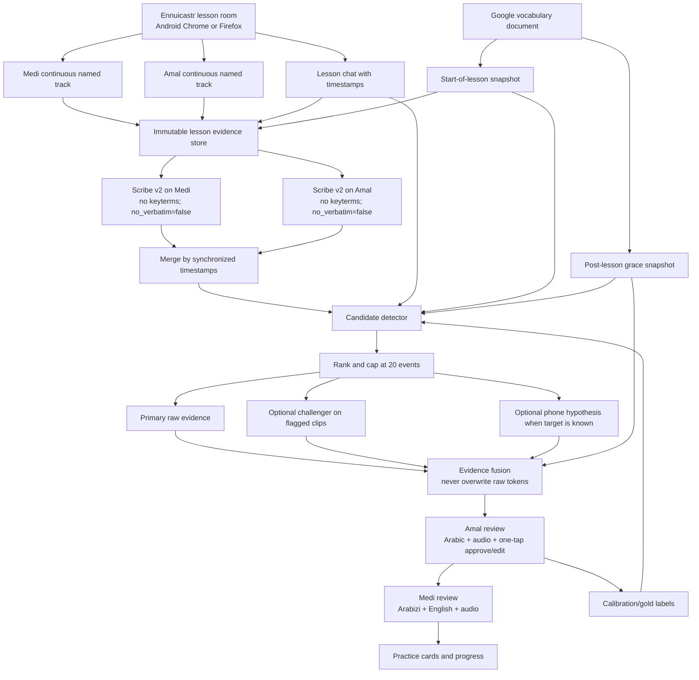

# Anees: full independent deep-research report and build recommendation

**Prepared:** 2026-09-04  
**Audience:** Medi, Amal, Claude, and any engineer asked to challenge or implement the plan  
**Scope:** the current `C:\dev\anees` project; the 2026-09-04 64-minute, 36-second lesson; the available lesson chat and vocabulary snapshot; Android-compatible capture; current commercial ASR; and research on Palestinian/Levantine learner speech and pronunciation assessment  
**Status:** superseding report. It replaces the earlier Zencastr capture recommendation, adds a separately preregistered Speechmatics Melia 1 benchmark, and consolidates the complete prior project audit and six-arm transcription study. I did **not** change `C:\dev\anees`; it contains work belonging to Medi/Claude.  
**Decision date:** prices, plans, models, and feature availability were checked on 2026-09-04 and can change.

## Executive verdict

The best current answer is a **better system around ElevenLabs, not an ASR engine that has proved better than ElevenLabs**:

1. **Use Ennuicastr as the lesson call on Android**, in audio-only continuous mode, with participant names `Medi` and `Amal`. It runs in Android Chrome or Firefox, guests join a link without an account, it records each person locally to a synchronized separate track, and its privacy policy says chat is included with the downloadable audio data. The exact download package should be verified in a five-minute pilot. [Ennuicastr overview](https://ecastr.com/), [FAQ](https://ecastr.com/faq/), [privacy policy](https://ecastr.com/privacy/)
2. **Use ElevenLabs Scribe v2 as the primary evidence transcript**, separately on the Medi and Amal tracks, with diarization off, `no_verbatim=false`, word timestamps on, and **no vocabulary keyterms on the primary pass**.
3. **Do not use the learned-word list as a hard ASR whitelist.** A decoder forced toward known words will turn a malformed attempt into the correct known word and erase the lesson’s most valuable evidence. Use the list after transcription to interpret, display, and flag; never to overwrite the raw result.
4. **Detect learning events from the interaction**, not from “bad-looking words” alone: Amal’s immediate correction or recast, Medi saying he forgot or asking what/how to say something, self-repair and repetition, lesson chat, and later pause evidence.
5. **Keep an immutable evidence layer and a separate pedagogical layer.** The evidence layer stores raw audio, raw ASR tokens, timestamps, track identity, model/configuration, and hashes. The pedagogical layer may contain Amal-approved Arabic, Medi-facing Arabizi, glosses, grammar notes, confidence, and review status.
6. **Limit review to the 20 highest-value moments.** Early lessons will require more setup and rule writing; the 3–5 minute target should be treated as an acceptance metric reached through ranking and calibration, not promised before there is labeled data.

I did a second independent engine test after the first report. Speechmatics released Melia 1 specifically for multilingual code-switching, so it was the strongest newly available challenger I could test with an existing credential. On the same twenty frozen 25-second windows, Melia produced **511 tokens, 2 counted fillers, 0 cutoff markers, and 14/20 chat-anchor families**. The ElevenLabs short no-keyterm control produced **725 tokens, 22 fillers, 25 cutoff markers, and 16/20 families**. Language hints changed **zero of twenty** Melia outputs. A full 64.6-minute Melia pass improved family visibility to 15/20 but still retained only 509 window tokens, 3 fillers, and no cutoff markers; it split this two-person lesson into six speaker clusters. These are preservation proxies, not WER, because no human verbatim gold transcript exists yet.

The external evidence points the same way. A May 2026 research benchmark of 1,200 code-switched utterances across Egyptian-Arabic/English, Saudi-Arabic/English, Persian/English, and German/English reported ElevenLabs Scribe v2 first overall at 13.2% WER and 0.936 BERTScore. It is meaningful independent support, but it does **not** include Palestinian Arabic, non-native learner speech, free conversation, or an error-preservation score. [Abdoli et al., 2026](https://arxiv.org/abs/2605.19069)

Therefore:

- **Production default now:** Ennuicastr continuous separate tracks → ElevenLabs Scribe v2 → timestamp merge → evidence-based candidate detector → Amal’s fast review → Medi’s Arabizi review cards.
- **Next engine worth a blind test:** Cohere Transcribe Arabic, because it is built for Arabic dialects plus English code-switching and placed second in a later third-party update. It remains unproven here, its hosted API has a 25 MB file limit, and current public examples return plain text rather than the timing-rich evidence Anees needs.
- **Long-term customization path:** Azure Custom Speech for `ar-PS`, but only after collecting clean, word-for-word labeled Medi audio. It is not the current primary and Azure’s pronunciation assessment does not list Palestinian Arabic.
- **Experimental phonetic path:** known target + Medi clip + Amal reference + Palestinian pronunciation dictionary + forced alignment/phone hypotheses. A general ASR “phonetic mode” is not a reliable substitute.

### Confidence

| Conclusion | Confidence | Reason |
|---|---|---|
| Separate named tracks are the correct speaker-identity solution | High | Identity is established by capture, avoiding unstable diarization inference |
| Ennuicastr is the best Android capture option found for this budget and workflow | Moderate-high | Official Android, separate-track, guest-link, chat, and continuous-recording support; still requires a device pilot |
| ElevenLabs should remain the primary evidence engine now | Moderate-high | Same-audio experiment, new Melia test, prior lesson evidence, and an independent commercial benchmark align |
| No currently available engine can produce a nearly perfect learner-error transcript automatically | High | No tested system preserved all target events; no relevant vendor offers a neutral “do not normalize” switch |
| 3–5 minutes of Amal review is attainable | Moderate | Plausible with a ranked twenty-card interface, but not yet measured on multiple lessons |
| Automatic Palestinian phoneme-level grading will work | Low until calibrated | Available Arabic pronunciation systems and datasets are domain-mismatched |

### The Android correction

The earlier report recommended Zencastr based on its free separate-track plan. That advice is not usable because Medi uses Android and Zencastr does not support the needed Android recording path. Every Zencastr recommendation in the earlier version is superseded by this report. Ennuicastr is not free, but continuous recording plus two-track Scribe remains under the stated `$3` per-lesson ceiling for a 60–70 minute lesson.

### What “better than ElevenLabs” means

There are three different contests:

- **Readable transcript:** which engine produces the cleanest text?
- **Evidence transcript:** which preserves Medi’s false starts, malformed forms, hesitations, repetitions, and code-switches?
- **Learning system:** which workflow most reliably turns a lesson into correct review items with minimal Amal effort?

ElevenLabs currently wins the second contest among tested engines. The proposed architecture wins the third by refusing to ask any single model to solve capture, speaker identity, verbatim evidence, dialect normalization, and pedagogy at once.

## Deep-research method, source quality, and unresolved gaps

This report used four evidence streams and keeps their authority separate:

1. **Direct local evidence:** the frozen 2026-09-04 lesson, twenty hashed audio windows, chat anchors, raw provider JSON, exact configurations, timing, and reproducible analysis scripts. This is strongest for behavior on this lesson but has no human verbatim ground truth.
2. **Independent evaluation:** the 2026 commercial code-switching paper and its dataset/project update. This is strongest for cross-provider ranking, but the dialects and speakers do not match Medi and Amal.
3. **Official product documentation:** current model features, input limits, platform support, retention, and list prices. These sources establish what a service claims and exposes, not real-world accuracy.
4. **Academic/open technical work:** Palestinian lexicons, Arabic ASR leaderboards, Levantine learner-error systems, forced alignment, GOP, and phone recognition. These establish possible components and known difficulty, not a turnkey product.

Research proceeded in stages: define the actual learning objective; inspect the existing Anees implementation and evidence; freeze a same-audio comparison; test OpenAI prompting; test ElevenLabs keyterm/no-keyterm behavior; correct the capture search for Android; survey current commercial and open alternatives; select and preregister the strongest available new challenger; run both short-window and full-lesson Melia calls; compare external evidence; then design the system around the remaining failure modes. Claims based on vendor benchmarks are labeled as such. Unsupported “best” or “near perfect” claims are not promoted to findings.

### Evidence-gap matrix

| Needed answer | Evidence available now | Gap | Closure step |
|---|---|---|---|
| Which engine has lowest WER on Medi’s speech? | Raw outputs from ElevenLabs, OpenAI, Melia | No human word-for-word reference | Amal labels the same frozen clips without seeing engine names; compute WER/CER after an agreed Arabic/Arabizi normalization |
| Which engine best preserves learner errors? | Fillers, cutoff, repetitions, family visibility, qualitative audio review | No complete event gold set | Label each actual attempt, self-repair, and correction event; score event recall and false preservation |
| Does Ennuicastr work reliably on Medi’s Android? | Official Android/browser support | No test on his phone/network/battery settings | Five-minute pilot with reconnect, quiet speech, chat, and download inspection; then one shadow lesson |
| Does Ennuicastr chat arrive in a usable file? | Privacy policy says chat is provided with audio data | Exact package schema not documented | Send timestamped test messages and inspect the paid sample/full download |
| Can Amal review twenty items in 3–5 minutes? | Workflow design only | No measured usability data | Instrument first three lessons: total time, plays, edits, skips, and false cards |
| Can Cohere beat Scribe here? | Official Arabic-dialect model and third-party second-place result | No credential/direct Anees output; timing metadata uncertain | Blind test on the frozen clips before any integration work |
| Can a custom `ar-PS` model learn Medi’s recurring errors? | Azure capability and learner-ASR precedent | No clean training set; customization may normalize errors | Wait for at least 30–60 minutes of exact labels, freeze a held-out set, then test against Scribe |
| Can phonetic scoring identify Palestinian errors safely? | General phone/forced-alignment tools and Levantine comparison research | No validated adult Palestinian conversational MDD model | Start with 30–50 known-target pairs and Amal ratings; ship only if ranking improves |
| What pause length signals word-retrieval difficulty for Medi? | Continuous track design will preserve timing | No personal baseline or labels | Later milestone: label pauses by cause and fit thresholds to Medi, not a generic fluency norm |

The absence of a human gold transcript is the dominant limitation. It is why this report says “best operational primary” rather than claiming a true Palestinian learner WER winner.

## What “nearly perfect” must mean

One percentage cannot represent the goal. Anees needs four separately measured qualities:

| Dimension | What is being measured | Why ordinary WER is insufficient | Proposed gate after gold labeling |
|---|---|---|---|
| Conventional transcript accuracy | Correct words and order for both languages | A clean correction can score well while erasing Medi’s actual error | WER/CER by speaker and language; set threshold only after baseline |
| Learner-form preservation | False starts, malformed words, repetitions, uncertainty, and self-repairs survive | These are normally treated as ASR noise but are the educational signal | Recall on Amal/Medi-labeled learner-form events; initial target ≥80% |
| Speaker identity | Every timed word/turn belongs to Medi or Amal | Correct words attached to the tutor would create false learner errors | Channel identity should be deterministic; fallback diarization DER measured separately |
| Learning-event detection | Corrections, gaps, hesitation, and grammar/pronunciation candidates are found without flooding Amal | A perfect transcript does not automatically identify why the learner struggled | Top-20 precision is primary; target ≥85% accepted or usefully edited, plus missed-event audit |

“Nearly perfect transcript” should therefore mean: an audio-linked transcript good enough that the **20 most valuable candidate moments** can be reviewed by Amal in 3–5 minutes, not an unsupported 99% WER claim.

## Direct answers to the central questions

### Can ASR be told to transcribe phonetically and stop auto-correcting?

Only partially. Prompting can request verbatim output, phonetic approximations, false starts, and uncertainty. It cannot turn a modern sequence-to-sequence recognizer into a neutral phonetic measurement device. The decoder still chooses likely words from linguistic context. The present test demonstrates the limit: both OpenAI arms removed every counted filler and sometimes collapsed conjugation practice into a clean phrase, even though the prompt explicitly said not to.

The practical answer is a layered one:

- preserve raw audio and word times;
- generate a no-keyterm evidence transcript;
- detect high-value moments from the interaction;
- re-run only those clips through independent hypotheses;
- use phone-level alignment/scoring only where a target word is known;
- let Amal confirm rather than pretending the machine has ground truth.

### Should the vocabulary list be a hard whitelist?

No. It should be a **prior and post-transcription validator**, never a decoder cage. A hard whitelist would hide exactly the categories Anees needs to discover: malformed learned words, ordinary inflections not stored as separate entries, fillers, proper nouns, loanwords, and genuinely new words. The correct rule is:

> English, known Palestinian forms, regular Palestinian morphology, fillers, proper nouns, and natural loanwords are allowed. Any other form is retained with audio and flagged as `OOV/uncertain`; it is never silently replaced.

### Do I agree with the public report that ElevenLabs is “much better than OpenAI”?

The conclusion is directionally supported for **transcript evidence on the two tested lessons**, but the report’s headline proof is overstated. Its `15/20` blind vote compared the ElevenLabs family against Speechmatics and a local dialect Whisper system. OpenAI was not one of the blind-vote candidates. Therefore “ElevenLabs won Amal’s blind vote 15/20” does not logically prove “nothing from ChatGPT beats it.”

This independent 2026-09-04 test does provide new direct evidence against two current OpenAI configurations: ElevenLabs preserved more material and more disfluencies, while O1/O2 recovered fewer chat-anchor families. Still, without human verbatim gold, the defensible statement is **“ElevenLabs is the better operational primary now,”** not “ElevenLabs has proven lower Palestinian-Arabic WER.”

## Independent experiment: exact design

### Preregistration and independence

The protocol was frozen before inspecting any new OpenAI output or the existing ElevenLabs transcript for this lesson. The existing project was used only to locate an already-paid Scribe response; its conclusions were not inherited. The protocol file hash recorded at test creation is `4363178DDE2DDA9C6E78861D6E6BA784FA86003EC3D742069193F48DDA2EB1A4`.

### Frozen inputs

- Recording: `G:\My Drive\Meet Recordings\jir-hcex-xzd (2026-09-04 14 03 GMT-7)`
- Duration: `3876.083333` seconds (`01:04:36`)
- Recording SHA-256: `248EE52C3D0FD02A62AB72518B34B381A4F26CA75BB8A088D93DF10CA4CA1576`
- Media structure: H.264 video, one AAC stereo stream, and one timed-text stream. The AAC stream is treated as a mixed recording because it does not provide one participant per channel.
- Meet chat SHA-256: `CB8A8F3380792FE71AA8E26771C9A91636B521BF22459C5974A51175418345BE`; 21 timestamped Amal messages.
- Existing Scribe v2 response SHA-256: `A94C9E18376E95B0A96A51F4F289F3680A6000B0CC004C7F9137D48B9DBCFD6E`.
- Vocabulary used for the prompt: the selected Meet chat plus exported `Latest Topic` and `Animals` tabs from Medi’s Google document. The direct unauthenticated Google export returned 401; the signed-in browser was used read-only. Only these relevant tabs were used because further automated tab export hit rate limiting.

### Sampling

Medi requested 20 examples per lesson. All 21 chat messages were numbered chronologically; `random.Random(20260904)` selected 20 without replacement. The selected set was messages 1–19 and 21; message 20 was excluded. Each frozen clip is `[chat time − 15 s, chat time + 10 s]`, 25 seconds. Total nominal audio per arm is 500 seconds; after overlapping windows are unioned, unique audio is 490.557 seconds.

This is a high-value lexical sample, not a representative random sample of the entire lesson. Adjacent windows are not independent.

| # | Chat time | Amal’s typed anchor | Frozen audio window | Clip | SHA-256 prefix |
|---:|---:|---|---|---|---|
| 1 | 00:24:17 | `Na7el` | 00:24:02–00:24:27 | `clip-01.mp3` | `CAADB5567F56…` |
| 2 | 00:28:15 | `Mabsoo6` | 00:28:00–00:28:25 | `clip-02.mp3` | `C1A14155E4EE…` |
| 3 | 00:30:22 | `Basa6` | 00:30:08–00:30:33 | `clip-03.mp3` | `488D0853A107…` |
| 4 | 00:30:45 | `Basa6ni` | 00:30:30–00:30:55 | `clip-04.mp3` | `776AFA5BEDF9…` |
| 5 | 00:31:32 | `Babse6` | 00:31:17–00:31:42 | `clip-05.mp3` | `26F502702F36…` |
| 6 | 00:33:12 | `Byebse6ni` | 00:32:57–00:33:22 | `clip-06.mp3` | `2EF82873AFE6…` |
| 7 | 00:34:48 | `Babse6 / Btebse6 / Btebse6i / Btebse6u / Byebse6 / Btebse6 / Byebse6u / Bnebse6` | 00:34:34–00:34:59 | `clip-07.mp3` | `75287CF1A14D…` |
| 8 | 00:35:14 | `Bnebse6o` | 00:35:00–00:35:25 | `clip-08.mp3` | `EE22D0C43501…` |
| 9 | 00:36:14 | `Basa6 / Basa6at / Basa6u / Basa6eet / Basa6ti / Basa6tu / Basa6na` | 00:36:00–00:36:25 | `clip-09.mp3` | `F6753040F9D6…` |
| 10 | 00:36:43 | `Basa6tek?` | 00:36:28–00:36:53 | `clip-10.mp3` | `292C272A05EF…` |
| 11 | 00:37:01 | `Hasa6to` | 00:36:46–00:37:11 | `clip-11.mp3` | `A2506CB1B05E…` |
| 12 | 00:46:21 | `Banbese6` | 00:46:06–00:46:31 | `clip-12.mp3` | `40BDAB84F4B6…` |
| 13 | 00:48:33 | `Baboos` | 00:48:19–00:48:44 | `clip-13.mp3` | `36506438830C…` |
| 14 | 00:49:46 | `Buset` | 00:49:32–00:49:57 | `clip-14.mp3` | `6C830171F5AF…` |
| 15 | 00:53:26 | `Enbasa6 / Enbas6at / Enbasa6u / Enbasa6et / Enbasa6ti / Enbasa6tu / Enbasa6na` | 00:53:12–00:53:37 | `clip-15.mp3` | `4EBB543B6452…` |
| 16 | 00:54:54 | `Enbasa6ti bi/fi el-7afle` | 00:54:40–00:55:05 | `clip-16.mp3` | `E34A7D71380B…` |
| 17 | 00:56:42 | `Enbasa6u bisafrethom` | 00:56:28–00:56:53 | `clip-17.mp3` | `D95A89F0F0D6…` |
| 18 | 00:58:28 | `Banbese6 / Btenbese6 / Btenbes6i / Btenbes6u / Byenbese6 / Btenbese6 / Byenbes6u / Bnenbese6` | 00:58:13–00:58:38 | `clip-18.mp3` | `67D84B40E9BE…` |
| 19 | 00:59:14 | `Btenbese6i lamma ne6la3?` | 00:58:59–00:59:24 | `clip-19.mp3` | `9AF451780A9B…` |
| 21 | 01:01:10 | `Enbes6i biyoamek` | 01:00:56–01:01:21 | `clip-21.mp3` | `050F1FE5791C…` |

### Test arms

- **E-long:** the original one-call, full-lesson ElevenLabs Scribe v2 response; words whose midpoint lies in each frozen window were extracted. It is not directly call-matched to the short-clip arms.
- **O1:** `gpt-transcribe`, Arabic + English language hints, strict verbatim bilingual prompt, no vocabulary.
- **O2:** the same request plus 41 selected chat forms and 75 Arabizi/Arabic document pairs. The prompt says the lexicon is context rather than a correction key.
- **ES (post-hoc control):** Scribe v2 on each same 25-second clip, `diarize=true`, two expected speakers, word timestamps, `no_verbatim=false`, no keyterms.
- **EKG (post-hoc):** same short ElevenLabs clips with 184 global keyterms from the selected chat and two document tabs.
- **EKL (post-hoc):** same short ElevenLabs clips with the two document tabs plus only chat terms posted within ±120 seconds of each clip; 144–161 keyterms.

O1 and O2 were pre-registered. ES, EKG, and EKL were exploratory follow-ups and must not be presented as if they were pre-registered. ES was added specifically because comparing short keyterm calls to the long baseline confounds vocabulary with chunking.

### Exact OpenAI prompts

**O1 strict**

> This is a one-to-one Palestinian Arabic lesson between a male learner, Medi, and his female tutor, Amal. The only languages spoken are Palestinian Arabic and English. Transcribe exactly what is audible. Write Arabic speech in Arabic script and English speech in Latin script. Never translate. Never output German, Japanese, Chinese, Azerbaijani, Spanish, or any other language. Preserve fillers, repetitions, false starts, cut-off words, wrong grammar, learner mistakes, and uncertain pronunciations. Do not silently repair Medi's speech into a fluent or correct sentence. If a sound cannot be identified, write [غير واضح] or a brief phonetic approximation instead of inventing a plausible word. Do not add explanations or speaker labels.

**O2 vocabulary-conditioned**

> This is a one-to-one Palestinian Arabic lesson between a male learner, Medi, and his female tutor, Amal. The only languages spoken are Palestinian Arabic and English. Transcribe exactly what is audible. Write Arabic speech in Arabic script and English speech in Latin script. Never translate. Never output German, Japanese, Chinese, Azerbaijani, Spanish, or any other language. Preserve fillers, repetitions, false starts, cut-off words, wrong grammar, learner mistakes, and uncertain pronunciations. Do not silently repair Medi's speech into a fluent or correct sentence. The approved vocabulary below is context, not a correction key: prefer one of its words or an ordinary Palestinian inflection only when the audio supports it. If Medi mispronounces a listed word or produces a nonword, preserve the closest phonetic form rather than replacing it with the approved word. If a sound does not fit the list, write [غير واضح] or a brief phonetic approximation; do not invent a different Arabic word. Do not add explanations or speaker labels. APPROVED TOPIC VOCABULARY: CHAT FORMS: Na7el; Mabsoo6; Basa6; Basa6ni; Babse6; Byebse6ni; Btebse6; Btebse6i; Btebse6u; Byebse6; Byebse6u; Bnebse6; Bnebse6o; Basa6at; Basa6u; Basa6eet; Basa6ti; Basa6tu; Basa6na; Basa6tek?; Hasa6to; Banbese6; Baboos; Buset; Enbasa6; Enbas6at; Enbasa6u; Enbasa6et; Enbasa6ti; Enbasa6tu; Enbasa6na; Enbasa6ti bi/fi el-7afle; Enbasa6u bisafrethom; Btenbese6; Btenbes6i; Btenbes6u; Byenbese6; Byenbes6u; Bnenbese6; Btenbese6i lamma ne6la3?; Enbes6i biyoamek. LEARNED FORMS: Ma3na = معنى; Raqam = رقم; 7arf = حرف; Kelme = كلمة; Jumle = جملة; Esem = اسم; Sifa = صفة; Jame3 = جمع; Zarf = ظرف; Fe3el = فعل; Maadi = ماضي; Mudaare3 = مضارع; Amer = أمر; Musta2bal = مستقبل; Sabab = سبب; 5ayaar = خيار; 7atta = حتى; 7atta law = حتى لو; 7aades = حادث; Bil8ala6 = بالغلط; Bazeed = بزيد; Ziaadeh = زيادة; Ba2eem = بقيم; Muraaja3a = مراجعة; Ana baraaje3 = أنا براجع; Ana 7aafez = أنا حافظ; Daafe3 = دافع; Mu7aadase/a = محادثة; Ana bad7ak = بضحك; Ana bada77ek = بضحِّك; Ana bazha2 = بزهق; Ana bazahhe2 = بزهِّق; Ana baz3al = بزعَل; Ana baza33el = بزعِّل; Ana bat3ab = بتعب; Ana bata33eb = بتعِّب; Ana ba5aaf = بخاف; Ana ba5awwef = بخوِّف; Ana bajhaz = بجهز; Ana bajahhez = بجهِّز; Ana ba3asseb = بعصِّب; 7aywaan = حيوان; Besse/a = بسة; Kalb = كلب; Jaaje/a = جاجة; Deek = ديك; 9oo9 = صوص; 7maar = حمار; 5aroof = خروف; 7ayye/a = حية; Tair = طير; 3asfoor = عصفور; 7ashara = حشرة; Dubaan = دبان; Dubaane/a = دبانة; Namel = نمل; Namle/a = نملة; His-his = بعوضة; His-hise/a = هسهسة; Sarsoor = صرصور; 3ankaboot = عنكبوت; Faar = فار; Ba2ar = بقر; Ba2ara = بقرة; 7saan = حصان; 2erd = قرد; Sinjaab = سنجاب; Na7el = نحل; Na7le/a = نحلة; 7adee2et el-7aywaanaat = حديقة الحيوانات; 8azaal = غزال; Albaan = ألبان.

### Call controls

- Odd-numbered clips called O1 then O2; even-numbered clips called O2 then O1.
- One successful request per arm/clip; only 429 or 5xx was eligible for at most two retries with deterministic 2 s and 5 s backoff.
- Successful but poor, empty, or wrong-language outputs were outcomes, not manually “fixed.”
- All 40 OpenAI calls and all 60 new ElevenLabs calls returned HTTP 200 and nonempty text.
- The full raw response, response metadata, prompts/keyterms, clip hashes, elapsed time, and estimated audio cost are stored in the evidence bundle.

## Results

### Aggregate behavior

| Arm | Successful | Surface tokens | Arabic-script tokens | Fillers | Cutoffs/ellipses | Chat families visible | Foreign-script clips |
|---|---:|---:|---:|---:|---:|---:|---:|
| E | 20/20 | 714 | 82 | 21 | 19 | 16/20 | 0 |
| ES | 20/20 | 725 | 123 | 22 | 25 | 16/20 | 0 |
| O1 | 20/20 | 590 | 98 | 0 | 12 | 14/20 | 0 |
| O2 | 20/20 | 593 | 83 | 0 | 7 | 13/20 | 0 |
| EKG | 20/20 | 716 | 58 | 20 | 20 | 16/20 | 0 |
| EKL | 20/20 | 702 | 32 | 17 | 15 | 16/20 | 0 |

Definitions:

- “Surface tokens” is a regex count of Latin/Arabic alphanumeric forms; it is **not accuracy**.
- “Arabic-script tokens” reflects script choice, not Arabic content; ElevenLabs often emits Arabic words in Latin/Arabizi.
- Filler and cutoff counts are mechanical lower bounds.
- “Chat family visible” is a manual surface judgment that the typed form or its relevant lexical family appears. It is not audio-grounded correctness.
- Four anchors are structurally unscorable/missed because the typed chat appeared tens of seconds after the spoken word; this is why no WER is calculated.

### Main findings

1. **The strict OpenAI prompt solved the old wrong-language failure mode in this sample.** O1/O2 produced no non-Latin/non-Arabic scripts. This is meaningful operational progress over the older report’s German/Japanese/Chinese failures.
2. **It did not preserve enough learner evidence.** O1/O2 produced 590/593 tokens versus 725 for the directly matched short unprompted ElevenLabs control. More text is not inherently better, but the missing content included conjugation attempts, fillers, and false starts that Anees explicitly needs.
3. **The vocabulary prompt did not improve OpenAI.** O1 recovered 14 anchor families; O2 recovered 13. O2 worsened clips 12 and 16 and reduced the mechanical cutoff count from 12 to 7. O1 and O2 were identical in 4 clips and changed in 16; mean character similarity was 0.8893.
4. **Both OpenAI conditions removed every counted filler.** This directly contradicts the prompt’s request to preserve them. It does not prove every hesitation was absent, but it makes OpenAI unsafe as the only pause/error evidence source.
5. **Short clipping, not keyterms, fixed ElevenLabs speaker-cluster collapse.** E-long assigned 695 of 708 extracted word records to `speaker_0` and only 13 to `speaker_1`; only 1/20 windows contained two Scribe IDs although Meet captions showed both named speakers in 19/20. ES detected at least two clusters in 19/20 with no keyterms. EKG and EKL also detected at least two in 19/20. The only defensible causal attribution is segmentation/request context, not vocabulary.
6. **Even recovered clusters are not stable identities.** A local 25-second call labeling `speaker_0` and `speaker_1` does not prove which is Medi or Amal, nor that the mapping is consistent between clips. Separate tracks make this inference unnecessary.
7. **Global future vocabulary can poison the transcript.** In clip 1 the unprompted systems and local-keyterm arm heard “Awesome”; EKG substituted the future lesson term `Mabsoo6`. This is the exact leakage risk created by waiting for the entire lesson vocabulary and then applying all of it globally.
8. **Local keyterms are useful for display but dangerous for evidence.** EKL produced readable forms such as `Babse6`, `Byebse6ni`, `Enbas6ti fi el-7afle`, and `Btenbes6i lamma ne6la3`; it also reduced fillers/cutoffs versus ES and may overwrite Medi’s malformed form. It belongs in the canonical interpretation layer only.

### High-value examples

- **Clip 2:** E-long retained `Masbu- mabsut`, an apparent false start; OpenAI produced the clean `مبسوط`. This is precisely the kind of evidence Anees must not discard.
- **Clips 8–9:** OpenAI collapsed a conjugation drill; clip 8 became only `هو. هي.` and clip 9 only “I made him happy.” ElevenLabs retained more paradigm attempts.
- **Clip 12:** O1 and ElevenLabs retained `Banbisat/Nabasat`-like attempts; O2 returned `[unclear]`, so the learned-vocabulary prompt harmed recovery.
- **Clip 16:** E-long and the short ElevenLabs arms retained the `enbasa6ti/fi el-7afle` phrase; O1 hallucinated “Airbnb” and O2 omitted most of it.
- **Clip 18:** ElevenLabs preserved `lamaaa uh nitlaaw Nitla-…`; OpenAI made the utterance cleaner and removed the counted hesitation.
- **Clip 1:** global ElevenLabs keyterms inserted `Mabsoo6` where the no-keyterm and local-context arms had “Awesome,” demonstrating temporal vocabulary leakage.

### What cannot be concluded

- No arm’s WER, CER, or learner-error recall is known.
- The 16/20 family score does not mean 80% accuracy.
- More tokens do not prove ElevenLabs is more correct.
- Meet caption speaker names are useful weak metadata, not verbatim gold.
- The sample heavily represents one verb family and tutor-typed vocabulary.
- The lesson recording is mixed, so Medi-vs-Amal identity is not audio-ground-truth.
- The result ranks tested configurations on this lesson, not every OpenAI/ElevenLabs model or future model revision.

## Second independent challenger test: Speechmatics Melia 1

### Why Melia was selected

Speechmatics introduced Melia 1 in June 2026 for automatic language detection and code-switching across 56+ languages. Its current official feature table lists batch transcription, speaker diarization, word timestamps, punctuation, and per-word language behavior, but no custom dictionary or confidence scores yet. The vendor’s September 2026 internal benchmark reported a 15.1% mixed error rate on Arabic/English versus 33.2% for Soniox v5, 45.6% for Amazon Standard, and 40.9% for AssemblyAI Universal 3.5 Pro. That benchmark omitted ElevenLabs and was run by Speechmatics, so it justified a test; it could not decide the Anees recommendation. [Speechmatics feature table](https://www.speechmatics.com/product/features-and-deployments), [vendor benchmark](https://www.speechmatics.com/company/articles-and-news/melia-code-switching-arabic-mandarin-tamil)

### Preregistration and controls

The short-test supplement was frozen before the Melia results were fetched. It reused the exact twenty audio files and windows from the first independent experiment. Two configurations were submitted:

- `M0`: `model="melia-1"`, `language="multi"`, speaker diarization, no language hints.
- `M2`: the same configuration plus non-strict `ar` and `en` language hints.

After those short outputs were analyzed, but before the full-lesson output was submitted, a separate full-lesson protocol was frozen. `MF` submitted the unmodified 134.5 MB recording with the same `ar`/`en` hints and extracted text from the original twenty windows. The exact protocols, scripts, JSON, and hashes are in the evidence bundle. Speechmatics’ own configuration guide confirms that Melia accepts diarization and non-strict language hints but rejects added vocabulary. [Official Melia Academy guide](https://github.com/speechmatics/speechmatics-academy/tree/main/basics/12-melia-multilingual)

### Combined aggregate result

| Arm | Call shape | Tokens | Arabic-script tokens | Fillers | Cutoffs/ellipses | Chat-anchor family visible | Speaker warning |
|---|---|---:|---:|---:|---:|---:|---|
| E-long | ElevenLabs, one full lesson; windows extracted | 714 | 82 | 21 | 19 | 16/20 | Full call collapsed labels in the prior audit |
| ES | ElevenLabs, twenty short clips, no keyterms | **725** | 123 | **22** | **25** | **16/20** | Short clips commonly restored two clusters |
| O1 | OpenAI `gpt-transcribe`, strict prompt | 590 | 98 | 0 | 12 | 14/20 | Diarization not requested |
| O2 | OpenAI plus learned/topic vocabulary | 593 | 83 | 0 | 7 | 13/20 | Diarization not requested |
| M0 | Melia, short clips, no hints | 511 | 102 | 2 | 0 | 14/20 | >2 clusters in 2 clips |
| M2 | Melia, short clips, `ar`/`en` hints | 511 | 102 | 2 | 0 | 14/20 | Exactly identical to M0 on 20/20 clips |
| MF | Melia, one full lesson; windows extracted | 509 | 124 | 3 | 0 | 15/20 | >2 clusters in 4 windows; 6 clusters over the lesson |

All token, filler, and cutoff values are mechanical lower-bound surface counts. “Family visible” is a manual check for whether a chat-anchor word family appears somewhere in the transcript; it is not a correctness judgment. More words can include hallucinations, and fewer words can be concise, so these measures must be read together with the audio-linked examples. They indicate evidence-preservation behavior, not WER.

### Full-lesson Melia behavior

- API wall time was `53.278 s`, including upload of the 134.5 MB file.
- The job reported `3,876 s` of audio and `4,188` words.
- Per-word language tags counted `880 ar` and `3,308 en`.
- It assigned `S1` through `S6` in a lesson with two people.
- At the current listed `$0.129/audio-hour`, the full mixed-file pass cost about `$0.139`. Each 500-second short-clip arm cost about `$0.018`. [Speechmatics pricing](https://www.speechmatics.com/pricing)

The speed and price are excellent. They do not offset the observed loss of learner attempts or the unusable mixed-file speaker count. Named capture tracks would solve identity but not recover words the decoder omitted.

### Qualitative failures that matter educationally

| Frozen clip | Event | ElevenLabs evidence behavior | Melia behavior | Why it matters |
|---:|---|---|---|---|
| 1 | Medi asks for “bees,” then Amal gives `نحل` | Preserves “bees” and an unfinished “I forgot take-” | Short says “these”; full says “please” and loses `نحل` | A vocabulary-recall event disappears |
| 3 | Practice of `basa6/basa6ni` | Keeps the attempt family | Short omits the forms; full context recovers them | Short clip context can hurt Melia, but full context still is not consistently complete |
| 7 | Conjugation including `bnebse6o` | Keeps the learner/tutor sequence and cutoffs | Both Melia forms omit the target attempt | A morphology practice event is removed |
| 9 | Dense false starts around `basa6` | Retains repeated partial forms | Short compresses heavily; full keeps some variants but fewer than ElevenLabs | The “mess” is the diagnostic evidence |
| 18 | Medi repeats a possibly wrong `ne6la3` pronunciation | Keeps `لما نتلا. نتلا. نتلا.` in the short control | Full Melia normalizes repetitions to `لما نطلع` | This is the exact kind of automatic correction Anees must resist |

Melia also frequently mapped Arabic-like syllables into plausible English spellings—examples include `bubset`, `septic`, `bun visit`, and `upset`—or rendered English in Arabic script. That is not necessarily conventional WER failure under every scoring normalization, but it complicates a learner-evidence product.

### Decision

Melia 1 is **rejected as the primary Anees engine for now**. It may be kept as a cheap disagreement signal on selected clips, but even that should wait until a gold set can show that it adds recall. Its hint mechanism had no observable effect in this sample, and it does not currently accept the vocabulary feature that might help names or dialect forms.

## Independent outside benchmark: what it proves and what it does not

The strongest third-party commercial comparison found is *Benchmarking Commercial ASR Systems on Code-Switching Speech: Arabic, Persian, and German* (Abdoli et al., arXiv v3, May 2026). It evaluated 1,200 utterances—300 each for Egyptian-Arabic/English, Saudi-Arabic/English, Persian/English, and German/English—with WER and BERTScore. ElevenLabs Scribe v2 ranked first overall at 13.2% WER and 0.936 BERTScore. The paper’s tables report especially large WER leads on the two Arabic sets: 13.1% on Egyptian-Arabic/English and 21.3% on Saudi-Arabic/English. [Paper landing page](https://arxiv.org/abs/2605.19069), [PDF](https://arxiv.org/pdf/2605.19069)

Its relevance is real: Arabic/English code-switching and commercial APIs are central to Anees. Its limits are equally important:

- no Palestinian Arabic;
- no non-native Arabic learner cohort;
- no tutor–learner conversation structure;
- no explicit preservation scoring for malformed attempts, false starts, or tutor corrections;
- samples were selected/produced for a general code-switching benchmark, not live 65-minute lessons;
- the evaluated configurations were not all customized with the Anees vocabulary.

A July 2026 update by the same project added Cohere Transcribe Arabic. It reported Cohere second on the two Arabic sets—28.8% WER on Egyptian and 29.8% on Saudi—but still behind ElevenLabs. Treat the update as useful third-party evidence, not as a peer-reviewed extension of every original-paper claim. [Updated benchmark](https://perle.ai/resources/asr-code-switching-revisited-updated-benchmarks-arabic-persian-german/)

The independent benchmark and the Anees lesson test agree on the operational choice. Neither establishes “near perfect” Palestinian learner transcription.

## Why the four missing anchors matter

The frozen windows intentionally were not moved after seeing output. That exposed a design flaw in using chat timestamps as exact word times:

- `Baboos` was spoken roughly 65 seconds before its chat post.
- `Buset` was spoken roughly 42 seconds before its post.
- the full `Btenbese6i lamma ne6la3?` example was earlier than its post;
- `Enbes6i biyoamek` was spoken roughly 80 seconds before its post.

Therefore lesson chat should create a **search anchor**, not a 25-second truth window. Production should search ±120 seconds using lexical/semantic matching, preserve multiple candidates, and ask Amal only when the match is ambiguous.

## Speaker identity diagnosis

The current recording contains one mixed audio stream. The project’s Scribe full-lesson call asked for two speakers, but today it collapsed almost everything into one cluster. The fallback then labels everyone `Both`, which avoids a false identity claim but makes downstream learning metrics unusable.

The current code also creates an internal contradiction when the split fails: line 120 treats Arabic words from both voices as “Medi Arabic,” while line 122 counts pauses only in runs labeled `Medi`; after fallback, those runs are labeled `Both`. Thus the published statistics can count tutor Arabic as learner Arabic while reporting zero learner pauses. This is a P0 correctness issue, not a cosmetic one.

Recommended identity order:

1. **Separate capture tracks** named at ingestion (`medi`, `amal`) — ground truth by construction.
2. If only a mixed Meet file exists, use its embedded named captions as weak time-boundary hints, not transcript truth.
3. For fallback experiments, OpenAI’s diarization API currently accepts up to four known speaker names paired with 2–10 second reference samples. Test it on a labeled gold set before production.
4. Never assign names merely from “the speaker with more Arabic.” Amal may speak English and Medi’s Arabic share should increase over time; the heuristic is nonstationary.

## Recommended end-to-end architecture



### Capture workflow: exact recommendation

1. Medi creates one persistent Ennuicastr room and bookmarks it. This becomes the call itself; do not run WhatsApp, Meet, or Zoom in parallel because Android apps will compete for the microphone and audio focus.
2. Medi sends Amal the persistent guest link. Amal enters the nickname `Amal`; she does not create an account. Medi uses `Medi` consistently so track identity survives reconnects.
3. Use headphones, connect power, enable Do Not Disturb, keep the browser in the foreground, and keep the screen awake. The foreground/screen precautions are operational safeguards against mobile suspension, not a vendor guarantee.
4. Select audio-only **continuous** recording. Ennuicastr’s standard `$1/hour` mode uses voice-activity detection. Its own audio primer warns that no VAD is perfect and some talking can be lost. Because quiet word starts, hesitations, and pauses are evidence here, continuous mode is worth `$2/hour`. [Pricing](https://ecastr.com/pricing/), [audio primer](https://ecastr.com/primer/)
5. Prefer the standard high-quality Opus codec with continuous mode if the interface permits that combination; FLAC is unnecessary unless the connection and storage are comfortable. Ennuicastr says either FLAC or continuous mode triggers the same `$2/hour` tier. If the interface couples continuous with FLAC, use it for the pilot and watch upload stability.
6. After stopping, wait for buffered upload to complete. Ennuicastr sends recording data during the call but may buffer when the connection is slow. The host downloads the full package once. Amal does not upload or send audio. [FAQ](https://ecastr.com/faq/)
7. Verify that the download contains two named audio files and chat in the five-minute pilot. The privacy policy says chat/audio-derived data are provided with audio downloads, but the exact file format is not specified publicly.
8. Anees ingests the package from a host-selected file or watched folder, hashes every source file, maps names to `medi` and `amal`, and refuses to publish if either expected track is absent.
9. Retain a local/Drive copy immediately. Ennuicastr recordings expire after one month. Do not rely on the vendor as the lesson archive.

### Why continuous mode matters

Voice-activity detection can improve storage and reduce noise, but it makes a binary decision about whether each low-energy region is speech. In ordinary podcasting, clipping a faint onset may be tolerable. In Anees it can remove:

- a tentative consonant at the beginning of an attempted Arabic word;
- a filler that identifies hesitation;
- the boundary between a pause and a false start;
- low-volume self-correction;
- timing needed for the later pause milestone.

The extra capture cost for a 70-minute lesson is about `$1.17` relative to standard VAD mode. That is a better use of budget than paying to transcribe audio that was never captured.

### Fallback capture options

| Option | Android path | Separate local tracks | Chat | Cost/limit relevant here | Verdict |
|---|---|---|---|---|---|
| **Ennuicastr** | Chrome/Firefox browser | Yes, always synchronized and named | Collected and provided with download per privacy policy | `$2/hour` for continuous; prorated; `$2` minimum payment with credit balance | **Primary recommendation; pilot first** |
| Riverside | Native Android app | Yes; local high-quality tracks with progressive upload | In-studio messaging; group-chat download documented for host/producer contexts | Free separate-track allowance is only 2 hours one-off; Pro is `$29/month` or `$24/month` annual with 15 hours | Polished fallback if Ennuicastr is unreliable |
| Craig on Discord | Discord Android app | Separate server-captured user tracks, not local source capture | Discord text channel remains separate | Core bot is free; up to 6 hours; files kept 7 days | Free backup/prototype, lower-fidelity and less centralized |
| Google Meet | Android app | The tested recording produced one mixed audio stream | Useful chat and named captions | Depends on Workspace entitlement | Familiar fallback only; diarization remains a problem |
| Zencastr | Unsupported for Medi’s required Android path | Irrelevant if the device cannot join/record correctly | — | Free plan otherwise looked attractive | Rejected for this project |

Riverside’s official help says mobile participants use the Android app, join an invite link, and keep the app open until automatic upload completes. Its current pricing page says the free account includes only two hours of separate-track recording **one-off**, not every month, while Pro includes fifteen hours and costs `$29/month` or `$24/month` on annual billing. [Guest workflow](https://support.riverside.fm/hc/en-us/articles/5252042203037-Join-a-Studio-as-a-Guest), [pricing](https://riverside.com/pricing)

Craig officially records a separate server-side track for each Discord speaker, supports up to six hours, and retains recordings for seven days. It is a genuine free option, but it records what reaches Discord rather than a robust local source track, and its command/bot workflow is less natural for a tutor. [Craig](https://craig.chat/)

### Grace period and vocabulary snapshots

Recommended default: **12 hours after the lesson**, configurable, with a `Finalize now` action if Amal finishes sooner.

1. Snapshot the vocabulary at lesson start; this is what was known before the conversation.
2. Immediately ingest and hash both tracks and chat; mark the lesson `provisional`.
3. Start no-keyterm Scribe transcription immediately. It does not depend on Amal’s edits.
4. During the grace period, Amal may add new words/rules to the Google document or approve chat-derived entries.
5. At the deadline, snapshot the document again with revision/tab identifiers and a content hash.
6. Run out-of-vocabulary classification, canonical display, and candidate ranking against both snapshots:
   - present at lesson start → known;
   - added during grace → new this lesson;
   - absent after grace → unresolved, not automatically “wrong.”
7. If Amal edits later, create a new vocabulary-snapshot version and re-run matching/display only. Do not re-transcribe the full lesson.

Twelve hours is a starting product decision, not a research fact. It protects Amal from an immediate post-call chore while keeping lesson processing timely. Measure how often she actually edits and shorten or lengthen it from usage.

### Vocabulary policy: strict dialect without destructive correction

The user rule “assume we will not use words outside the list; flag and ask” should be implemented as **strict downstream validation**, not hard decoding:

- Allow exact learned forms, regular Palestinian inflections, clitics, fillers, ordinary English, names, loanwords, and code-switching.
- Preserve every observed form even if unknown.
- Classify an unknown as `unresolved_surface`, never as an error by default.
- Ask Amal only when the unknown is educationally relevant, repeated, appears in a correction sequence, or changes meaning.
- Store her decision as one of: `new_valid_word`, `valid_variant`, `learner_error`, `asr_error`, `name_or_loanword`, or `ignore`.
- Add approved rules to a versioned local dialect layer. Maknuune may suggest alternatives, but Amal is the authority for the variety actually being learned.
- Never retroactively mutate the raw transcript. Canonical Arabic and Arabizi are linked annotations.

The global-keyterm test demonstrates why this matters: a lesson term supplied everywhere caused at least one unrelated clip to substitute a future target term for ordinary English. The learned list is valuable context but dangerous as a global decoder constraint.

### Transcript data contract

Every token/span should preserve provenance. A minimum schema:

```json
{
  "lesson_id": "2026-09-04",
  "source_track": "medi",
  "start_ms": 3279772,
  "end_ms": 3280410,
  "observed_surface": "en-enbas...",
  "canonical_arabizi": "Enbasa6ti",
  "canonical_arabic": "انبسطتي",
  "language": "ar-PS",
  "asr_engine": "elevenlabs/scribe_v2",
  "asr_config_hash": "...",
  "vocabulary_snapshot_id": null,
  "uncertainty": 0.42,
  "flags": ["self_repair", "possible_pronunciation_error"],
  "audio_clip_id": "...",
  "human_status": "unreviewed"
}
```

The raw `observed_surface` is append-only. Human edits and canonical forms are separate records with author, timestamp, and reason.

### Arabizi/Arabic display policy

- Medi’s default interface: Arabizi, preserving the project’s exact numeral conventions and Amal’s forms.
- Amal’s default interface: Arabic script plus the aligned audio.
- Both can reveal the other representation.
- Automatic transliteration is a suggestion with confidence; it must never overwrite the evidence transcript.
- The project vocabulary document is authoritative for canonical spellings, but not proof of what Medi actually uttered.

## Learning-event detector

Candidate generation should be evidence-based and multi-signal. Each candidate stores all signals, not just a model conclusion.

| Event type | Strong signals | Output | Auto-confirm? |
|---|---|---|---|
| Tutor correction/recast | Medi utterance followed within ~0–8 s by Amal repeating a minimally different form; words such as “no,” “say…,” `صح`, or explicit explanation | before/after audio, observed hypothesis, tutor target | No |
| Forgotten/asked word | Medi says “I forgot,” “what does X mean?”, “how do I say…?”, long search followed by Amal supply | question + supplied word + clip | Usually candidate with high priority |
| Self-repair | same speaker restarts/changes a form (`Masbu- mabsut`) | initial and repaired spans | No; may be productive learning rather than error |
| Hesitation/retrieval gap | within-Medi-turn silence, filler chain, lengthened onset, repeated partial word | duration and neighboring words | No; pause alone is not error |
| Grammar candidate | disagreement between Medi form, tutor recast, vocabulary/morphology rules, and independent transcripts | evidence bundle and rule citation | No |
| Pronunciation candidate | known target + observable phone mismatch across repeated attempts/reference | target/observed phones, confidence, audio | No until calibrated |
| OOV/new word | surface form unmatched after allowed English, morphology, fillers, names, and loanwords | retained surface + nearest candidates | Ask/flag, never replace |

### Candidate ranking for a 20-item review

Use a transparent score, tuned later from Amal labels:

```text
score = 4*tutor_explicit_correction
      + 3*learner_explicit_gap
      + 2*tutor_recast_similarity
      + 2*chat_match
      + 1*self_repair
      + 1*long_pause
      + 1*cross_engine_disagreement
      - 2*already_confirmed_duplicate
      - 2*low_audio_quality
```

Diversify the final 20 so one conjugation drill cannot occupy the whole list. Suggested caps: at most eight examples from one lexical family and at least two candidate types when available.

### The 3–5 minute Amal review

Twenty items at an average 8–12 seconds each is 2:40–4:00 before occasional edits. Each card should have:

- tap-to-play 4–10 second audio, with one-tap “more context”;
- `Medi said` evidence field;
- `Suggested target` in Arabic and Arabizi;
- reason/type and confidence;
- buttons: **Correct error**, **Not an error**, **Edit target**, **Needs context**;
- keyboard/mobile shortcuts and automatic advance;
- bulk “these are the same conjugation pattern” grouping.

Do not ask Amal to proofread the whole hour. For the first five lessons, sample a few rejected/low-score events too; otherwise recall can never be estimated.

## Phonetic layer: feasible, but not a turnkey Palestinian model

Palestinian-specific phonetic diagnosis is possible as an engineering/research milestone, not as a prompt switch.

Recommended sequence:

1. Restrict phonetic analysis to candidate clips where a target form is known.
2. Build a pronunciation dictionary from Amal’s canonical forms and recordings. Seed it with Maknuune, an open Palestinian lexicon with more than 36,000 entries, 17,000 lemmas, 3,700 roots, diacritized Arabic, phonological transcriptions, and English glosses.
3. Use forced alignment to align the known orthographic target to audio phones. Montreal Forced Aligner defines forced alignment as producing a time-aligned transcript using a pronunciation dictionary.
4. Compute phone posterior/GOP-style features or CTC alignment disagreement. Kaldi’s GOP implementation explicitly describes GOP as a canonical-phone posterior ratio and notes classifier-based features usually outperform a raw threshold.
5. Calibrate phone-specific thresholds on Medi’s speech using Amal’s labels. Classic CALL work likewise used phone-specific thresholds and human judgments.
6. Use a universal phone recognizer such as Allosaurus only as an exploratory hypothesis source; it supports 2,000+ language inventories, but its timestamps are approximate and it is not a Palestinian learner grader.

Available Arabic mispronunciation datasets are mismatched to this task. ASMDD is Egyptian speech from children aged 2–8 on 100 frequent words. Iqra’Eval is Qur’anic/MSA read-speech assessment. Neither should be used as the truth standard for an adult’s spontaneous Palestinian conversation.

Azure and Google are worth later baseline tests because both explicitly list `ar-PS` speech recognition/adaptation. Azure’s pronunciation-assessment locale list, however, names Arabic Egypt and Saudi Arabia rather than Palestinian Arabic, and some fine-grained outputs are English-only. This supports benchmarking their ASR, not adopting their pronunciation score uncritically.

## Existing project audit

### What already exists

The repository is not empty despite the README saying “nothing built yet.” It contains:

- multiple Aug 25 engine outputs and comparison pages;
- an ElevenLabs/Meet lesson pipeline;
- generated lesson transcripts for Aug 25 and Sep 4;
- Google Meet chat extraction;
- HTML publishing to GitHub Pages;
- Gmail notification code;
- experimental speaker diarization, local Whisper, Speechmatics, OpenAI, and tutor-reaction scripts;
- extensive product/research planning documents.

There is **no implemented candidate error inbox, vocabulary-document ingestion, database/schema, review dashboard, flashcard loop, or production-grade test suite** visible in the repo.

### Severity findings

#### P0 — fix before trusting or automatically publishing learning metrics

1. **Mixed-channel capture defeats speaker-grounded learning analysis.** Today’s full Scribe call collapsed nearly all words into one cluster. Separate tracks are the remedy.
2. **No human verbatim gold exists, yet the engine report uses categorical language.** Preference votes and token counts cannot establish accuracy.
3. **The published `15/20` vote excludes OpenAI.** `build_engine_report.py` and `check02_scoring.md` show that the blind comparison was ElevenLabs vs Speechmatics vs local dialect Whisper. The headline overgeneralizes the result.
4. **Fallback metrics are internally invalid.** On failed speaker split, Arabic from both speakers is counted as Medi’s, while pauses can disappear because no run remains labeled Medi.
5. **Unvalidated transcripts are published and emailed automatically.** There is no human gate even when speaker split failed.
6. **Publish failure is suppressed.** `git commit` and `git push` use `check=False`, after which the function returns a public URL anyway. An email can therefore announce a page that was not successfully pushed.

#### P1 — required for a dependable MVP

1. No vocabulary-document synchronization, snapshotting, revision ID, or reconciliation exists.
2. No error-event extraction/review workflow exists; the current output is a transcript and coarse counts.
3. Ingestion identity uses a filename/state key, not Drive file ID as the binding contract requires.
4. The ElevenLabs request has no retry/backoff; the failure path only logs and updates state, with no failure email.
5. The 90-day raw-audio deletion contract is not implemented.
6. The pre-check samples only minutes 3–6 and runs before reading chat; a slow-English introduction could cause an Arabic lesson to be skipped even when the chat proves otherwise.
7. README, graph, blueprint, and constants disagree about what is built, which engine is primary, and whether two-channel capture is active.
8. The Python/Node dependencies are not pinned in `requirements.txt`, `pyproject.toml`, or a repo-local `package.json`; email code borrows another project’s `node_modules` and `.env` by absolute path.
9. No automated tests or CI checks cover parsing, speaker failure, idempotency, metrics, publishing, email, or deletion.
10. Provider model aliases/configurations are not captured as immutable run records in production, making later comparisons hard to reproduce.

#### P2 — cleanup and operational resilience

1. The pre-check comment still estimates `$1.50` for a full run although current Scribe pricing is $0.22/hour.
2. The Meet filename regex and minimum file-size heuristic are brittle.
3. State is written after the publish step, so the state version is not necessarily included in the same published commit.
4. The recipient address and external Alchemy path are hard-coded.
5. Public lesson transcript publishing is intentional and accepted by Medi, but the UI should still show that it is public and offer per-lesson deletion.

### Documentation reconciliation required

`plan/constants.md` says the binding design is separate channels, Drive-ID idempotency, three retries, failure email, 90-day deletion, and Supabase secrets. The current pipeline implements none of those except local secret avoidance in Git. `plan/graph.yaml` still marks early transcription/gold-sheet work as current even though later live pipeline artifacts exist. The README date/status is stale. Before additional features, turn the constants into executable acceptance tests and update the task graph from actual repository state.

## Proposed production pipeline

### Stage 0 — safe ingestion

- Unique lesson ID from provider session ID plus content hashes.
- Store both tracks, chat, recording metadata, consent/privacy status, and hashes.
- Idempotent state machine: `discovered → uploading → transcribing → provisional → awaiting_vocab → candidates_ready → tutor_reviewed → published`.
- Retry transient vendor calls three times with jittered backoff; permanent failures create a visible job and email Medi only.
- Never email/publish a success URL until the page/database transaction is verified.

### Stage 1 — evidence transcript

- Transcribe each named track separately with ElevenLabs Scribe v2, no keyterms, `no_verbatim=false`, word timestamps.
- Use 2–5 minute chunks with 1–2 second overlap for the searchable whole-lesson pass; deduplicate overlap deterministically. Twenty-five-second segmentation was useful today but has not been validated as the ideal production chunk length.
- Preserve provider response, config, model label, clip hash, and confidence/log-probability data.
- Calculate silence and pause features directly from audio/VAD, not only from text fillers.

### Stage 2 — candidate discovery

- Rule/model pass over cross-speaker temporal patterns.
- Search each chat item within ±120 seconds and attach best candidate(s).
- Allow all vocabulary/morphology; flag OOV after decoding.
- Rank/deduplicate/diversify to 20.

### Stage 3 — candidate adjudication

- Recut 4–15 second core clips plus wider context.
- Run ElevenLabs no-keyterm and OpenAI strict on the exact clips.
- Optionally run local-temporal keyterms to generate canonical Arabizi/Arabic, clearly marked non-evidence.
- Ask an LLM to produce structured hypotheses only from supplied evidence. It must cite timestamps and may return `uncertain`.

Suggested reasoning prompt:

```text
You are analyzing a Palestinian Arabic tutoring event, not rewriting a transcript.
Inputs: (1) Medi-track audio/transcript hypotheses, (2) Amal-track audio/transcript
hypotheses, (3) exact timestamps, (4) lesson chat near this moment, (5) a versioned
vocabulary/rules snapshot. Vocabulary is a prior, not a whitelist.

Return JSON only:
- event_type: correction | gap | self_repair | hesitation | grammar_candidate |
  pronunciation_candidate | oov | none
- observed_medi: preserve malformed/partial surface; never silently repair
- likely_target_arabizi
- likely_target_arabic
- amal_evidence: exact timestamped span or null
- evidence_spans: source/start/end/text
- alternatives: up to 3
- confidence: 0..1
- needs_amal_review: true/false
- explanation: one short factual sentence

Do not infer an error from accent alone. Do not call a pause an error without context.
If evidence conflicts, choose uncertain and preserve all hypotheses.
```

### Stage 4 — review and learning loop

- Amal reviews only the top 20 and a small quality-control sample.
- Confirmed events feed the vocabulary/error database and review cards.
- Cards always retain source lesson/audio and both scripts.
- Medi’s pause/retrieval metrics become a separate milestone after deterministic tracks exist.

## Human gold benchmark required next

The smallest defensible next evaluation is **100 clips accumulated as 20 per lesson across five lessons**. The current 20 are a pilot and may be reused only if Amal relabels the exact audio rather than accepting chat text as truth.

For each clip, Amal should provide:

- exact Medi words as heard, preserving malformed/partial forms;
- exact Amal words;
- speaker and word/turn boundaries to a reasonable tolerance;
- target/correction if present;
- event type;
- `not sure` where the audio is ambiguous;
- whether each machine output is acceptable for evidence and for display.

Evaluation:

- WER/CER by speaker and language on fully transcribed clips;
- learner-form event recall and precision;
- filler/cutoff/self-repair recall;
- speaker-attributed word accuracy and DER for mixed-file fallback;
- top-20 candidate precision, plus recall from a random rejected sample;
- review time median and 90th percentile;
- inter-rater check on 10–20 clips if possible, because the target dialect spelling itself can vary.

Do not tune thresholds on all 100 and report the same set. Use the first 60 for development, 20 validation, and final 20 held out—or continue collecting until there is a meaningful holdout.

## Cost analysis

The recommended capture price is from Ennuicastr’s current official pricing; transcription prices are current vendor list rates as of 2026-09-04. Capture is charged for the room duration, while separate ASR submission of two full-length tracks is estimated as twice the lesson duration.

| Lesson length | Ennuicastr continuous capture at `$2/h` | Two Scribe tracks at `$0.22/audio-h` | Core total | Add twenty 25 s OpenAI clips at `$0.0045/min` | Core + optional clips |
|---:|---:|---:|---:|---:|---:|
| 60 min | `$2.00` | `$0.44` | **`$2.44`** | `$0.0375` | **`$2.48`** |
| 65 min | `$2.17` | `$0.48` | **`$2.64`** | `$0.0375` | **`$2.68`** |
| 70 min | `$2.33` | `$0.51` | **`$2.85`** | `$0.0375` | **`$2.88`** |

The core 70-minute flow remains below the user’s `$3/lesson` ceiling. A downstream text-model analysis charge is not included because it depends on model and context size; the system should meter it and keep only the twenty evidence windows in the expensive reasoning call.

Ennuicastr’s hourly option has a `$2` minimum payment, but unused excess is credited to future recordings. Its `$15/month` continuous subscription breaks even at roughly 7.5 capture hours per month—about 6.4 seventy-minute lessons. For one weekly lesson, pay-as-you-go is cheaper. [Ennuicastr pricing](https://ecastr.com/pricing/)

The cheaper `$1/hour` Ennuicastr mode plus two Scribe tracks would cost about `$1.68` for seventy minutes, but it uses VAD. I do not recommend saving `$1.17` until a pilot proves that VAD preserves soft learner starts and pause timing.

Current official pricing and capability references: [ElevenLabs API pricing](https://elevenlabs.io/pricing/api), [OpenAI GPT-Transcribe](https://developers.openai.com/api/docs/models/gpt-transcribe), [Speechmatics pricing](https://www.speechmatics.com/pricing).

## Vendor and research findings

### Ranked engine decision table

| Engine/path | Evidence | Strength for Anees | Blocking weakness | Role now |
|---|---|---|---|---|
| **ElevenLabs Scribe v2** | Direct same-lesson test; prior lesson; independent commercial benchmark | Highest observed learner-evidence density; fillers/cutoffs; word timing; multichannel support | Can still normalize, hallucinate, or miss speech; keyterms can poison output | **Primary evidence ASR** |
| **Cohere Transcribe Arabic** | Official model info; later third-party benchmark | Arabic dialects + English; 2B open weights; external second place on Egyptian/Saudi sets | Not directly tested; hosted upload ≤25 MB; public response example lacks timestamps/diarization | Next blind challenger, not production default |
| **OpenAI `gpt-transcribe`** | Direct two-prompt test; official current model docs | Strong language control; unstructured context, keyword and multiple-language hints; useful reasoning ecosystem | Fewer anchors; zero counted fillers; vocabulary prompt slightly worse; timing/format constraints must be checked | Targeted second opinion and analysis layer |
| **Speechmatics Melia 1** | Direct two short arms + full lesson | Fast, cheap, broad code-switching, per-word language labels | Lower evidence density; hints no effect; no custom dictionary/confidence; six clusters for two people | Rejected as primary; optional future disagreement arm |
| **Azure `ar-PS` + Custom Speech** | Official locale/customization docs | Explicit Palestinian locale; can train from human transcript/audio and text | Within-sentence language-ID limitation; no Palestinian pronunciation assessment; no direct Anees test | Long-term custom path after gold data |
| **Deepgram Nova-3 `ar-PS`** | Official language/model docs | Explicit Palestinian monolingual locale | Arabic excluded from Nova-3 multilingual code-switch mode; filler-word feature unavailable | Not suited to mixed lesson default |
| **Google Chirp 3 `ar-PS`** | Official preview locale/adaptation docs; outside benchmark | Palestinian locale; phrase adaptation | Auto multilingual mode favors prevalent language; weak outside Arabic code-switch result; Arabic diarization limitations | Low-priority test only |
| **Soniox** | Official generic Arabic/context docs; vendor comparison | Cheap, contextual prompting, async diarization | No Palestinian locale; no direct/independent advantage over Scribe | Lower-priority challenger |
| **Open-source Whisper/Arabic systems** | Project test and academic leaderboards | Local control and possible future fine-tuning | Current off-the-shelf results are not competitive for this mixed learner task | Research/fallback, not primary |

### OpenAI

- Official OpenAI documentation lists `gpt-transcribe` at `$0.0045/minute` and says it supports unstructured context, keyword hints, and multiple language hints for multilingual/code-switched audio. [Model page](https://developers.openai.com/api/docs/models/gpt-transcribe)
- The first Anees prompt deliberately required Arabic script for Arabic, ordinary English only for English, verbatim false starts/repetitions, uncertainty rather than invention, and no translation. This stopped the earlier wrong-language behavior but did not preserve as much learner evidence as Scribe.
- Adding the available learned vocabulary did not help: anchor-family visibility fell from 14/20 to 13/20 and cutoff markers fell from 12 to 7. This is one sample, but it refutes the assumption that a larger known-word prompt is automatically better.
- OpenAI’s diarized transcription model supports named reference speakers, but the API reference says its diarization path does not support a transcription prompt. Since separate capture tracks solve identity exactly, use diarization only for legacy mixed recordings. [Transcription API reference](https://developers.openai.com/api/reference/resources/audio/subresources/transcriptions/methods/create)
- OpenAI remains valuable after transcription: it can inspect short audio-linked moments, reconcile evidence, explain a confirmed error, and generate structured bilingual/Arabizi review content. It should not be allowed to replace raw transcript evidence with a polished sentence.

### ElevenLabs

- The Scribe request reference documents keyterms, `no_verbatim`, diarization, and multichannel output. The STT overview documents word timestamps, files up to 3 GB and ten hours in standard mode, and independently processed channels. [Request reference](https://elevenlabs.io/docs/api-reference/speech-to-text/convert), [STT capabilities](https://elevenlabs.io/docs/overview/capabilities/speech-to-text)
- Current API pricing lists Scribe v2 at `$0.22/audio-hour`; keyterm prompting is an additional charge. [Pricing](https://elevenlabs.io/pricing/api)
- Primary configuration: one mono track per known person, diarization off, `no_verbatim=false`, word timestamps, no keyterms.
- Do not equate “best tested” with truth. Scribe still made errors and changed script choice. Every candidate card must link back to audio.

### Speechmatics Melia 1

- Official docs position Melia for word-level code-switching across 56+ languages with batch diarization and timing, but no custom dictionary or confidence scores yet. [Features](https://www.speechmatics.com/product/features-and-deployments)
- Its official Academy guide accepts language hints and documents that vocabulary/additional context is rejected. [Guide](https://github.com/speechmatics/speechmatics-academy/tree/main/basics/12-melia-multilingual)
- The direct Anees benchmark rejects it as primary for this objective even though it is faster and cheaper than the current primary.

### Cohere Transcribe Arabic

- Cohere released `cohere-transcribe-arabic-07-2026`, a 2B Conformer model under Apache 2.0, for major Arabic dialects and English including Arabic-accented English. It is available by API and as open weights. [Release note](https://docs.cohere.com/changelog/transcribe-arabic)
- The hosted quickstart caps input at 25 MB and asks callers to choose the predominant language (`ar` or `en`). The example response is text-only. [Quickstart](https://docs.cohere.com/docs/audio-transcription-quickstart)
- Because separate tracks will still code-switch and a 65-minute track will exceed 25 MB in many formats, Anees would need careful chunking and timestamp reconstruction or self-hosting. Do not integrate until a twenty-clip blind test shows a real gain.

### Soniox, Deepgram, Google, and Azure

- Soniox documents generic Arabic (`ar`), contextual text/terms, and async diarization, but not a Palestinian locale. [Languages](https://soniox.com/docs/stt/concepts/supported-languages), [context](https://soniox.com/docs/stt/concepts/context)
- Deepgram Nova-3 lists Palestinian Arabic `ar-PS` for monolingual transcription, but its `language=multi` model supports a limited set that excludes Arabic; its model comparison says filler words are unavailable for Nova-3. That structural mismatch is decisive for Arabic–English lessons. [Languages/models](https://developers.deepgram.com/docs/models-languages-overview/)
- Google Chirp 3 lists `ar-PS` in preview and phrase adaptation, but automatic multilingual recognition is oriented toward selecting the most prevalent language and its feature table has timing/diarization caveats. [Chirp 3 docs](https://docs.cloud.google.com/speech-to-text/docs/models/chirp-3)
- Azure lists `ar-PS` speech recognition and Custom Speech support using audio with human transcripts and plain text. Microsoft says as little as thirty minutes can improve a custom model, while larger word-for-word datasets are recommended. However, continuous language identification cannot change language within the same sentence, and pronunciation-assessment support lists Arabic Egypt and Saudi Arabia rather than Palestinian Arabic. [Language support](https://learn.microsoft.com/en-us/azure/ai-services/Speech-Service/language-support), [Custom Speech training](https://learn.microsoft.com/en-us/azure/ai-services/speech-service/how-to-custom-speech-test-and-train), [language identification](https://learn.microsoft.com/en-us/azure/ai-services/speech-service/language-identification), [pronunciation assessment](https://learn.microsoft.com/en-us/azure/ai-services/speech-service/how-to-pronunciation-assessment)

Azure is the most credible future route for learning Medi’s accent and Amal’s Palestinian target forms, but only after Anees has clean labels. Fine-tuning bad machine transcripts would reinforce the wrong normalization.

### Palestinian Arabic and learner-error research

- [Maknuune](https://aclanthology.org/2022.wanlp-1.13/) is the strongest directly relevant lexical seed found: more than 36,000 Palestinian entries, about 17,000 lemmas and 3,700 roots, with diacritized Arabic, English glosses, and phonological transcription. It is not a replacement for Amal’s rules.
- The [Open Universal Arabic ASR Leaderboard](https://www.isca-archive.org/interspeech_2025/wang25_interspeech.pdf) evaluated open models across six dialect resources including Palestinian Casablanca data. Its best reported average WER was still 25.71%, and the task is primarily Arabic orthographic ASR—not learner-error preservation or live Arabic/English tutoring.
- [NADI 2025 multidialect ASR](https://aclanthology.org/2025.arabicnlp-sharedtasks.99/) likewise shows that open multidialect recognition remains difficult; the best shared-task WER was 35.68% in its setting.
- A directly relevant 2005 [Tactical Language Training System paper](https://www.isca-archive.org/interspeech_2005/sethy05b_interspeech.pdf) studied beginning learners of Levantine Arabic and modeled expected pronunciation errors with a noisy-channel/error-grammar approach, learner history, and pedagogical salience. The durable lesson is architectural: ordinary ASR is not enough; use likely learner-error models and target context.
- [Lee and Glass, 2013](https://www.isca-archive.org/slate_2013/lee13b_slate.html) compared non-native and native Levantine Arabic utterances using alignment/DTW. This maps naturally to Medi’s attempt followed by Amal’s modeled correction.
- [Montreal Forced Aligner](https://montreal-forced-aligner.readthedocs.io/en/v3.4.1/user_guide/index.html), [Kaldi GOP](https://github.com/kaldi-asr/kaldi/blob/master/src/bin/compute-gop.cc), [CTC-based GOP](https://github.com/frank613/CTC-based-GOP), and [Allosaurus](https://github.com/xinjli/allosaurus) are useful experimental components. None is validated as an automatic judge of adult Palestinian free conversation.
- Arabic pronunciation-assessment datasets found in current literature are mostly Egyptian children’s speech, MSA, or Qur’anic recitation. They cannot be treated as the truth standard for Amal’s Palestinian dialect.

### Why a “phonetic transcript” switch does not exist

Modern ASR decoders combine acoustic evidence with learned language regularities. A prompt such as “write exactly what you hear” changes the probability distribution; it does not disable the lexical/language prior. When Medi produces a near-word, the system may output the intended correct word, an English look-alike, a different Arabic word, or nothing. None is a neutral measurement.

The safe design uses three representations:

1. `observed_asr`: provider output, untouched;
2. `phone_hypothesis`: optional IPA/phone sequence with model/confidence, used only for selected clips;
3. `canonical_target`: Amal-approved Palestinian form in Arabic and Arabizi.

An error claim is a relationship among those objects plus audio—not a replacement string. Where no target is known, the system should say `uncertain` and ask.

### Open-source projects worth learning from—not adopting as a turnkey answer

- [mcp-server-pronunciation](https://github.com/JuhongPark/mcp-server-pronunciation): local audio capture, ASR, grammar/fluency feedback; its explicit safety disclaimer is a good product pattern.
- [Cadence](https://github.com/pstepanovum/Cadence): Next.js/Supabase/Python pronunciation-coach architecture and audio-linked practice flows.
- [FluentAnyLang](https://github.com/Jim-Elijah/fluent-any-lang): local-first, sentence-level playback/shadowing and user-owned media.
- [CTC-based GOP](https://github.com/frank613/CTC-based-GOP): research implementation for phone-level pronunciation assessment.
- [Label Studio](https://github.com/HumanSignal/label-studio): possible audio annotation interface if building the 100-clip gold set quickly.
- [ts-fsrs](https://github.com/open-spaced-repetition/ts-fsrs): later spaced-repetition scheduling component; not relevant to transcript truth.

None of these provides validated adult Palestinian conversational error detection out of the box. They are patterns/components.

## Implementation milestones and acceptance criteria

### M0 — capture and evidence integrity

- Complete a five-minute Android Ennuicastr preflight, then one real 60–70 minute continuous lesson with separate named Medi/Amal audio and chat.
- Both tracks ingest automatically or through one host download action; Amal does no manual file transfer.
- Channel-to-name mapping verified from session metadata and a short listen.
- Hashes/configs stored; no transcript published on failed processing.

### M1 — 20-card candidate inbox

- Base no-keyterm transcript per channel.
- Chat ±120-second matcher and explicit-gap/correction/self-repair rules.
- Twenty candidate cards with audio, Arabic, Arabizi, and evidence.
- Amal completes one real review unaided in ≤5 minutes.

### M2 — five-lesson gold benchmark

- 100 reviewed candidate clips plus a random rejected sample.
- Report WER/CER, learner-form preservation, event precision/recall, and review time separately.
- Lock engine/config decision only from held-out labels.

### M3 — phonetic experiment

- Select 30–50 known-target words with multiple Medi attempts and Amal references.
- Build Palestinian phone dictionary entries.
- Compare forced-alignment/GOP/CTC signals to Amal labels.
- Ship only if it improves candidate ranking without increasing false accusations.

### M4 — learning loop

- Confirmed events generate cards with source audio.
- Medi sees Arabizi; Amal sees Arabic; both can reveal both.
- Existing FSRS contracts, caps, retention, and deletion rules become tested code.

## Questions Claude should attack

1. Reproduce every aggregate in both `comparison.json` and `melia-comparison.json`. Which manual transcript-surface judgments change after listening to the bundled clips?
2. Can any tested line be labeled correct without a human verbatim reference? If not, does the UI clearly distinguish `ASR output`, `model inference`, and `Amal-confirmed`?
3. Does Claude agree that the project’s prior 15/20 blind vote excluded OpenAI? If not, which exact candidate maps to which OpenAI response?
4. What evidence would falsify ElevenLabs as primary: learner-event recall, WER, false-card rate, or review time? Freeze thresholds before testing Cohere.
5. Will Ennuicastr continuous mode actually work for a full lesson on Medi’s exact Android phone, browser version, battery settings, and network? Run five minutes before trusting it.
6. Does the Ennuicastr download reliably contain two named tracks plus a machine-readable chat log? What happens after reconnect, nickname change, or a browser suspension?
7. What privacy/consent message does Amal see, where are source recordings stored, and how does either person delete a lesson? Ennuicastr’s one-person-service and debugging-retention language must be accepted consciously.
8. Why does the current README say little/nothing is built while the pipeline publishes real lessons? Which document and schema are authoritative?
9. How will the current `Both` speaker fallback avoid counting Amal’s Arabic as Medi’s while losing Medi’s pauses? Can it be removed once separate tracks are mandatory?
10. What exact mechanism turns an Ennuicastr host download into an idempotent job? Define content hashes, reprocessing behavior, partial uploads, and duplicate-session handling.
11. Is the grace period twelve hours, next morning, or an explicit Amal “done” action? How are post-freeze vocabulary edits versioned without retranscribing audio?
12. How are raw observed forms protected from canonical normalization, Arabizi generation, model reanalysis, and human edits?
13. What proves a form is an error rather than a valid Palestinian variant, hesitation, joke, name, English loanword, or ASR mistake?
14. Will candidate generation prioritize explicit tutor corrections and self-declared gaps ahead of opaque pronunciation scores? Show the ranking weights and feature provenance.
15. How will recall be measured if Amal only sees the top twenty? Define a small random rejected-event audit so missed errors become visible.
16. How is correction adjacency handled when Amal posts chat 30–90 seconds after speech, teaches a whole conjugation table, or corrects indirectly by recasting?
17. What is the exact Arabizi policy for digits, vowels, stress, capitalization, clitics, and alternative spellings? Which transformations are reversible?
18. Who decides canonical Palestinian variants—Amal, the project list, Maknuune, or a model? How are disagreements and legitimate alternatives displayed?
19. Does `no_verbatim=false` remain pinned and tested after provider SDK/model updates? What golden regression clips prevent silent behavior drift?
20. Why are Git commit/push failures ignored before emailing a success link in the current pipeline? What transaction boundary prevents a false success notice?
21. Where will secrets and dependencies live so Anees does not borrow another project’s `.env` or `node_modules`?
22. What tests enforce retries, retention, idempotency, event caps, speaker identity, deletion, and failure notifications?
23. What exact human labels will be collected on the first sixty clips: verbatim audio, intended form, correction type, severity, confidence, valid variant, and review time?
24. Is Cohere’s lack of rich public timing output fatal, or can a blind short-clip accuracy gain justify forced timing/alignment afterward? Do not integrate before answering with data.
25. At what point is Azure Custom Speech worth training—30 minutes, 60 minutes, or several hours of clean Medi labels—and how will the held-out set remain untouched?
26. For pause analysis, how will the system distinguish a lexical-retrieval pause from Amal speaking, network lag, reading, thinking about content, or intentional emphasis?
27. What is the rollback if Ennuicastr fails midway? Is Meet/phone local backup acceptable without creating a second microphone conflict?
28. Can Amal complete twenty approve/edit actions in five minutes on her normal device? Instrument median, p90, and number of plays/edits instead of guessing.

## Bottom line

No current evidence supports switching Anees away from ElevenLabs as its primary transcript engine. Better OpenAI prompting fixed language selection but still compressed learner evidence. Speechmatics Melia 1—the strongest new multilingual challenger available for a direct test—was fast and inexpensive but preserved fewer target families, fillers, cutoffs, and total surface material, and its full-call diarization created six clusters for two people. The strongest independent 2026 code-switching benchmark also ranks ElevenLabs first, although it does not test Palestinian learners.

The largest practical improvement is upstream: replace the unsupported Zencastr idea with a five-minute Android trial of **Ennuicastr continuous separate-track capture**. Then build the product around evidence integrity:

> Ennuicastr named tracks + chat → Scribe v2 per track without keyterms → timestamp merge → top-20 interaction-driven candidates → optional clip-level disagreement/phone evidence → Amal approval in Arabic → Medi review in Arabizi.

Do not promise a nearly perfect transcript yet. Promise an auditable path to measuring and improving the moments that matter. After three shadow-mode lessons and sixty human-labeled clips, Anees can decide—with held-out evidence—whether Cohere deserves the primary slot, whether Azure customization is justified, and whether a phone-level subsystem improves ranking. Until then, ElevenLabs plus better capture is the strongest defensible answer.

## Appendix A — complete clip-by-clip comparison

All six text outputs for every selected clip are included below. Raw JSON additionally contains word timestamps, speaker IDs, confidence/log-probability fields where returned, request metadata, keyterms, elapsed time, hashes, and cost estimates.

### Clip 1: chat anchor `Na7el`

- Frozen window: `00:24:02–00:24:27`; audio file in evidence bundle: `clips/clip-01.mp3`.
- Meet caption speakers: Amal, Medi Natanzi; E-long clusters: speaker_0, speaker_1; ES clusters: speaker_0, speaker_1.
- Manual surface-audit note: All recover bee(s)/Na7el; O1/O2 render نحل.

| Arm | Tokens | Arabic-script tokens | Fillers | Cutoffs/ellipses | Anchor family |
|---|---:|---:|---:|---:|---|
| E | 34 | 0 | 1 | 0 | recovered |
| ES | 33 | 0 | 1 | 1 | recovered |
| O1 | 29 | 2 | 0 | 0 | recovered |
| O2 | 31 | 2 | 0 | 0 | recovered |
| EKG | 34 | 0 | 1 | 0 | recovered |
| EKL | 34 | 0 | 1 | 0 | recovered |

<details><summary>All six transcript outputs</summary>

**E — E-long: ElevenLabs, existing 64-min call; frozen windows extracted**

> Oh my God, bees. What was bees? Bee. Awesome. Nahl. Nahl. My wife then, yeah. If I wanna buy more, do you have like a card? Uh, I have just one. I forgot take,
**ES — ES: ElevenLabs, same 25-s clips, no keyterms (post-hoc control)**

> Oh my God, bees. What was bees? Bee. Awesome. [background chatter] My wife, Dania. If I wanna buy more, do you have, like, a card? Uh, I have just one. I forgot take-
**O1 — O1: OpenAI strict bilingual/verbatim prompt (pre-registered)**

> Oh my God, bees. What bees? نحل. نحل. My wife. If I want to buy more, do you have like a card? I have just one. I forgot to.
**O2 — O2: OpenAI plus learned/topic vocabulary (pre-registered)**

> Oh my God, bees. What was bees? نحل. نحل. My wife. If I want to buy more, do you have like a card? I have just one. I forgot to take.
**EKG — EKG: ElevenLabs short clips plus global keyterms (post-hoc)**

> Oh my God, bees. What was bees? Bee. Mabsoo6. Na7el. Na7eb. My wife, Dania. If I wanna buy more, do you have like a card? Uh, I have just one. I forgot take it
**EKL — EKL: ElevenLabs short clips plus local ±120-s keyterms (post-hoc)**

> Oh my God, bees. What was bees? Bee. Awesome. Na7el. Na7el. My wife, Dania. If I wanna buy more, do you have, like, a card? Uh, I have just one. I forgot take it.

</details>

### Clip 2: chat anchor `Mabsoo6`

- Frozen window: `00:28:00–00:28:25`; audio file in evidence bundle: `clips/clip-02.mp3`.
- Meet caption speakers: Amal, Medi Natanzi; E-long clusters: speaker_0; ES clusters: speaker_0, speaker_1.
- Manual surface-audit note: All recover mabsoo6; E alone keeps the audible-looking false start 'Masbu-'.

| Arm | Tokens | Arabic-script tokens | Fillers | Cutoffs/ellipses | Anchor family |
|---|---:|---:|---:|---:|---|
| E | 28 | 0 | 0 | 1 | recovered |
| ES | 28 | 8 | 0 | 0 | recovered |
| O1 | 25 | 8 | 0 | 2 | recovered |
| O2 | 25 | 8 | 0 | 1 | recovered |
| EKG | 29 | 0 | 0 | 2 | recovered |
| EKL | 26 | 0 | 0 | 0 | recovered |

<details><summary>All six transcript outputs</summary>

**E — E-long: ElevenLabs, existing 64-min call; frozen windows extracted**

> Happy is just sameeh? No, that's good. Masbu- mabsut. Mabsut. I think we need to add a third part two. Mabsut. Ihkiha. Yeah Mabsut. Mabsut. Now bedna nakhood
**ES — ES: ElevenLabs, same 25-s clips, no keyterms (post-hoc control)**

> Happy is. This is just a ni? No, that's good. مبسوط مبسوط I think we need to add this part too. مبسوط. احكيها. مبسوط. مبسوط. now بدنا ناخد
**O1 — O1: OpenAI strict bilingual/verbatim prompt (pre-registered)**

> Happy is... Is this منيح? No, that's good. مبسوط. I think we need to add this word too. مبسوط، احكيها. مبسوط. مبسوط. Now, بدنا ناخد...
**O2 — O2: OpenAI plus learned/topic vocabulary (pre-registered)**

> Happy is... Is this منيح? No, that's good. مبسوط. I think we need to add this word too. مبسوط، احكيها. مبسوط. مبسوط. Now, بدنا ناخد.
**EKG — EKG: ElevenLabs short clips plus global keyterms (post-hoc)**

> Happy is. Is this just a ni? No, that's good. Mabsoo6. Mabsoo6. I think we need to add a s- part too. Mabsoo6. 3ahkiha. Mabsoo6. Mabsoo6. Now, bedna na'kho-
**EKL — EKL: ElevenLabs short clips plus local ±120-s keyterms (post-hoc)**

> Happy is just a ni? No, that's good. Mabsoo6. Mabsoo6. I think we need to add this part too. Mabsoo6. Ahkiha. Mabsoo6. Mabsoo6. Now, bedna naakhod

</details>

### Clip 3: chat anchor `Basa6`

- Frozen window: `00:30:08–00:30:33`; audio file in evidence bundle: `clips/clip-03.mp3`.
- Meet caption speakers: Amal, Medi Natanzi; E-long clusters: speaker_0; ES clusters: speaker_0, speaker_1.
- Manual surface-audit note: All recover the b-s-6 family and basa6ni.

| Arm | Tokens | Arabic-script tokens | Fillers | Cutoffs/ellipses | Anchor family |
|---|---:|---:|---:|---:|---|
| E | 34 | 0 | 2 | 2 | recovered |
| ES | 33 | 0 | 2 | 1 | recovered |
| O1 | 29 | 4 | 0 | 0 | recovered |
| O2 | 29 | 0 | 0 | 0 | recovered |
| EKG | 31 | 0 | 2 | 1 | recovered |
| EKL | 31 | 0 | 2 | 1 | recovered |

<details><summary>All six transcript outputs</summary>

**E — E-long: ElevenLabs, existing 64-min call; frozen windows extracted**

> he made someone happy. Besat. OK. So- He said he made someone happy. Was that- Mm-hmm. He made someone happy. So he made me happy with B. Basatne. Basatne. Why? Did I lose you
**ES — ES: ElevenLabs, same 25-s clips, no keyterms (post-hoc control)**

> Made someone happy. Basat Okay So- So he made someone happy, Basat Mm-hmm. He made someone happy. So he made me happy would be? Basat me Basat me What? Did I lose you?
**O1 — O1: OpenAI strict bilingual/verbatim prompt (pre-registered)**

> Made someone happy. بسط. Okay. So, he made someone happy. بسط. He made someone happy. So, he made me happy would be. بسطني. بسطني. What? Did I lose you?
**O2 — O2: OpenAI plus learned/topic vocabulary (pre-registered)**

> Made someone happy. Basat. Okay. So he made someone happy. Basat. He made someone happy. So he made me happy would be? Basatni. Basatni. What? Did I lose you?
**EKG — EKG: ElevenLabs short clips plus global keyterms (post-hoc)**

> Made someone happy. Basat. Okay. So- So he made someone happy, Basat. Mm-hmm. He made someone happy. So he made me happy would be? Basa6ni. Basa6ni. What? Did I lose you?
**EKL — EKL: ElevenLabs short clips plus local ±120-s keyterms (post-hoc)**

> Made someone happy. Basat. Okay. So- So he made someone happy, basat. Mm-hmm. He made someone happy. So he made me happy would be? Basa6ni. Basa6ni. What? Did I lose you?

</details>

### Clip 4: chat anchor `Basa6ni`

- Frozen window: `00:30:30–00:30:55`; audio file in evidence bundle: `clips/clip-04.mp3`.
- Meet caption speakers: Amal, Medi Natanzi; E-long clusters: speaker_0; ES clusters: speaker_0, speaker_1.
- Manual surface-audit note: All recover basa6ni; wording differs around صح.

| Arm | Tokens | Arabic-script tokens | Fillers | Cutoffs/ellipses | Anchor family |
|---|---:|---:|---:|---:|---|
| E | 31 | 15 | 0 | 1 | recovered |
| ES | 34 | 16 | 0 | 1 | recovered |
| O1 | 24 | 12 | 0 | 2 | recovered |
| O2 | 26 | 14 | 0 | 0 | recovered |
| EKG | 28 | 13 | 0 | 0 | recovered |
| EKL | 34 | 16 | 0 | 0 | recovered |

<details><summary>All six transcript outputs</summary>

**E — E-long: ElevenLabs, existing 64-min call; frozen windows extracted**

> Did I lose you مهم، بسطني صح. بسّتني. بسطني. Okay هلأ بسط، بستني whatever هي past ماضي- مم. شو الـ indicator for present؟ How do I make it present كيف
**ES — ES: ElevenLabs, same 25-s clips, no keyterms (post-hoc control)**

> Did I lose you? ممكن. بسطني، صح. Okay. بسطني. بسطني. Okay. هلأ بسط، بسطني whatever هي past ماضي. شو ال indicator for present؟ So- How do I make it present؟ كيف بعمل
**O1 — O1: OpenAI strict bilingual/verbatim prompt (pre-registered)**

> بسطني. أوكي. هلا بسط، بسطني whatever هي past، ماضي. شو الـindicator for present? So... How do I make it present? كيف بعمل...
**O2 — O2: OpenAI plus learned/topic vocabulary (pre-registered)**

> بسطني، صح. بسطني. أوكي. هلا بسط، بسطني whatever هي past، ماضي. شو الـindicator for present? So. How do I make it present? كيف بعمل؟
**EKG — EKG: ElevenLabs short clips plus global keyterms (post-hoc)**

> Basa6ni صح Okay. Basa6ni بسطني. Okay. هلأ بسط، بسطني whatever هي past ماضي. شو الindicator for present؟ How do I make it present؟ كيف بعمل
**EKL — EKL: ElevenLabs short clips plus local ±120-s keyterms (post-hoc)**

> Did I lose you? مهم، بسطني صح. Okay, بسطني. بسطني، okay. هلأ بسط، بسطني whatever هي past ماضي. شو الـ indicator for present؟ So. How do I make it present؟ كيف بعمل

</details>

### Clip 5: chat anchor `Babse6`

- Frozen window: `00:31:17–00:31:42`; audio file in evidence bundle: `clips/clip-05.mp3`.
- Meet caption speakers: Amal, Medi Natanzi; E-long clusters: speaker_0; ES clusters: speaker_0, speaker_1.
- Manual surface-audit note: All produce a plausible phonetic form for babse6; orthography remains uncertain.

| Arm | Tokens | Arabic-script tokens | Fillers | Cutoffs/ellipses | Anchor family |
|---|---:|---:|---:|---:|---|
| E | 52 | 5 | 0 | 1 | recovered |
| ES | 55 | 0 | 2 | 3 | recovered |
| O1 | 48 | 1 | 0 | 0 | recovered |
| O2 | 47 | 0 | 0 | 0 | recovered |
| EKG | 52 | 0 | 1 | 1 | recovered |
| EKL | 51 | 6 | 1 | 1 | recovered |

<details><summary>All six transcript outputs</summary>

**E — E-long: ElevenLabs, existing 64-min call; frozen windows extracted**

> sat or bab sit? e or a؟ i babysit. Okay, babysit but said beset was the he so just okay. لأن بالماضي we always يعني the- Goes say a. Yes, we-- it goes back to a like by default بس we have exceptions that internal flipping goes back to e. So
**ES — ES: ElevenLabs, same 25-s clips, no keyterms (post-hoc control)**

> Sat or bab sit? Bab sit. E or A? E. Bab sit. Okay. Bab sit. But said basat was, uh, he. So just, okay. [speaking Arabic] we always, yeah, need, uh- Go say- Yes. We, it goes back to A, like, by default. Best we have exceptions that internal flipping goes back to E. So-
**O1 — O1: OpenAI strict bilingual/verbatim prompt (pre-registered)**

> Saat, or babsat, E or A? E, babsat. Okay, babsat. But said, but saat was the E, so just okay. Because in the past, we always, يعني, yes, it goes back to A, like by default, but we have exceptions that internal flipping goes back to E. So.
**O2 — O2: OpenAI plus learned/topic vocabulary (pre-registered)**

> Saat, or babsat, E or A? E, babsat. Okay, babsat. But said, but saat was the E, so just okay. Because in the past, we always, yes, it goes back to A, like by default, but we have exceptions that internal flipping goes back to E. So.
**EKG — EKG: ElevenLabs short clips plus global keyterms (post-hoc)**

> Baset or Babset? Baset. E or A? E. Baset. Okay, Baset. But said Basat was, uh, he. So just, okay. La'anna bil maadi we always, ya'ani the- Goes to A. Yes, we-- it goes back to A, like, by default. Bas we have exceptions that internal flipping goes back to E. So
**EKL — EKL: ElevenLabs short clips plus local ±120-s keyterms (post-hoc)**

> Basat أو Babse6? E أو A. Babse6. E. Babse6. Okay. Babse6. But said Basat was, uh, E. So just-- okay. لأن بالماضي we always يعني the- Goes to A. Yes, we-- it goes back to A like by default. بس we have exceptions that internal flipping goes back to E. So

</details>

### Clip 6: chat anchor `Byebse6ni`

- Frozen window: `00:32:57–00:33:22`; audio file in evidence bundle: `clips/clip-06.mp3`.
- Meet caption speakers: Amal, Medi Natanzi; E-long clusters: speaker_0; ES clusters: speaker_0, speaker_1.
- Manual surface-audit note: All recover byebse6/byebse6ni; O1/O2 use بسط orthography.

| Arm | Tokens | Arabic-script tokens | Fillers | Cutoffs/ellipses | Anchor family |
|---|---:|---:|---:|---:|---|
| E | 28 | 17 | 0 | 0 | recovered |
| ES | 31 | 23 | 2 | 0 | recovered |
| O1 | 26 | 19 | 0 | 0 | recovered |
| O2 | 26 | 19 | 0 | 0 | recovered |
| EKG | 28 | 0 | 0 | 0 | recovered |
| EKL | 27 | 0 | 0 | 0 | recovered |

<details><summary>All six transcript outputs</summary>

**E — E-long: ElevenLabs, existing 64-min call; frozen windows extracted**

> bibsit yeah. Bibsit so it makes me happy. بييبستني. بييبستني طيب هلأ بدي تحكيلي كل conjugations ل-"babset". امم مضارعة؟ خلينا نبلش مضارعة بعدين ماضي بعدين أمر. Ok
**ES — ES: ElevenLabs, same 25-s clips, no keyterms (post-hoc control)**

> بيبسط، yeah. بيبسط. So it makes me happy. اه بيبسطني. بيبسطني. طب هلأ بدي تحكيلي كل الـ conjugations لـ ببسط. اه مدارة؟ خلينا نبلش مدارة بعدين ماضي بعدين أمر. Okay مدارة
**O1 — O1: OpenAI strict bilingual/verbatim prompt (pre-registered)**

> بيبسط. So it makes me happy. بيبسطني. بيبسطني. هلا بدي تحكيلي كل الـconjugations لـ ببسط. مضارع. خلينا نبلش مضارع، بعدين ماضي، بعدين أمر. Okay. مضارع.
**O2 — O2: OpenAI plus learned/topic vocabulary (pre-registered)**

> بيبسط. So it makes me happy. بيبسطني. بيبسطني. هلا بدي تحكيلي كل الـconjugations لـ ببسط. مضارع. خلينا نبلش مضارع، بعدين ماضي، بعدين أمر. Okay. مضارع.
**EKG — EKG: ElevenLabs short clips plus global keyterms (post-hoc)**

> Byebset, yeah. Byebset. So it makes me happy. Byebsetni. Byebsetni. Hel2a beddi te7ki li kol el-conjugations la babset. Mudaare3? Khalina nbelsh mudaare3, ba3den maadi, ba3den amer. Okay. Mudaare3
**EKL — EKL: ElevenLabs short clips plus local ±120-s keyterms (post-hoc)**

> Byebse6, yeah. Byebse6. So it makes me happy. Byebse6ni. Byebse6ni. Hala beddi te7kili kol el-conjugations la babse6. Mudaare3? Khalina nbelsh mudaare3, ba3den maadi, ba3den amr. Okay. Mudaare3

</details>

### Clip 7: chat anchor `Babse6 / Btebse6 / Btebse6i / Btebse6u / Byebse6 / Btebse6 / Byebse6u / Bnebse6`

- Frozen window: `00:34:34–00:34:59`; audio file in evidence bundle: `clips/clip-07.mp3`.
- Meet caption speakers: Amal, Medi Natanzi; E-long clusters: speaker_0; ES clusters: speaker_0, speaker_1.
- Manual surface-audit note: The spoken portion includes bnebse6o; all render بنبسطه.

| Arm | Tokens | Arabic-script tokens | Fillers | Cutoffs/ellipses | Anchor family |
|---|---:|---:|---:|---:|---|
| E | 19 | 8 | 1 | 1 | recovered |
| ES | 22 | 10 | 0 | 0 | recovered |
| O1 | 17 | 6 | 0 | 0 | recovered |
| O2 | 17 | 6 | 0 | 0 | recovered |
| EKG | 22 | 10 | 1 | 0 | recovered |
| EKL | 22 | 10 | 0 | 0 | recovered |

<details><summary>All six transcript outputs</summary>

**E — E-long: ElevenLabs, existing 64-min call; frozen windows extracted**

> we make him happy. We make him happy احنا بنبسط- بنبسطه. ممتاز ok كمل go on. الماضي اه هو
**ES — ES: ElevenLabs, same 25-s clips, no keyterms (post-hoc control)**

> Like we make him happy. We make him happy. إحنا بنبسط، بنبسطه. ممتاز. Okay، كمل. Go on. آآ، الماضي آآ، هو
**O1 — O1: OpenAI strict bilingual/verbatim prompt (pre-registered)**

> We make him happy. We make him happy. إحنا بنبسطه. ممتاز. Okay, كمل. Go on. الماضي هو.
**O2 — O2: OpenAI plus learned/topic vocabulary (pre-registered)**

> We make him happy. We make him happy. إحنا بنبسطه. ممتاز. Okay, كمل. Go on. الماضي هو.
**EKG — EKG: ElevenLabs short clips plus global keyterms (post-hoc)**

> Like we make him happy We make him happy. إحنا بنبسط، بنبسطه ممتاز. Okay، كمل. Go on آآآ، الماضي آآآ هو
**EKL — EKL: ElevenLabs short clips plus local ±120-s keyterms (post-hoc)**

> Like we make him happy We make him happy. إحنا بنبسط، بنبسطه ممتاز. Okay، كمِّل. Go on آآآ، الماضي، آآآ، هو

</details>

### Clip 8: chat anchor `Bnebse6o`

- Frozen window: `00:35:00–00:35:25`; audio file in evidence bundle: `clips/clip-08.mp3`.
- Meet caption speakers: Amal, Medi Natanzi; E-long clusters: speaker_0; ES clusters: speaker_0.
- Manual surface-audit note: Frozen window contains sparse paradigm fragments; O1/O2 collapse it to 'هو. هي.'

| Arm | Tokens | Arabic-script tokens | Fillers | Cutoffs/ellipses | Anchor family |
|---|---:|---:|---:|---:|---|
| E | 13 | 11 | 1 | 1 | not_recovered |
| ES | 10 | 10 | 0 | 0 | not_recovered |
| O1 | 2 | 2 | 0 | 0 | not_recovered |
| O2 | 2 | 2 | 0 | 0 | not_recovered |
| EKG | 8 | 0 | 0 | 0 | not_recovered |
| EKL | 8 | 0 | 0 | 0 | not_recovered |

<details><summary>All six transcript outputs</summary>

**E — E-long: ElevenLabs, existing 64-min call; frozen windows extracted**

> مم hold on هو بسات- أم. هي بسيتا ات اه هم بساتوا انا
**ES — ES: ElevenLabs, same 25-s clips, no keyterms (post-hoc control)**

> ‫أمم، الآن. هو بساط. هي بساطات. هم بساطو. أنا بساط.‬
**O1 — O1: OpenAI strict bilingual/verbatim prompt (pre-registered)**

> هو. هي.
**O2 — O2: OpenAI plus learned/topic vocabulary (pre-registered)**

> هو. هي.
**EKG — EKG: ElevenLabs short clips plus global keyterms (post-hoc)**

> Amaan. Hoe Basa6. Hee Basa6at. Homma Basa6u. Ana
**EKL — EKL: ElevenLabs short clips plus local ±120-s keyterms (post-hoc)**

> Amaan. Huwe Basaat. Heeye Basataat. Humme Basaatu. Ana

</details>

### Clip 9: chat anchor `Basa6 / Basa6at / Basa6u / Basa6eet / Basa6ti / Basa6tu / Basa6na`

- Frozen window: `00:36:00–00:36:25`; audio file in evidence bundle: `clips/clip-09.mp3`.
- Meet caption speakers: Amal, Medi Natanzi; E-long clusters: speaker_0; ES clusters: speaker_0, speaker_1.
- Manual surface-audit note: E retains several conjugation attempts; both OpenAI arms reduce the clip to 'I made him happy.'

| Arm | Tokens | Arabic-script tokens | Fillers | Cutoffs/ellipses | Anchor family |
|---|---:|---:|---:|---:|---|
| E | 23 | 11 | 1 | 2 | recovered |
| ES | 30 | 0 | 3 | 3 | recovered |
| O1 | 4 | 0 | 0 | 0 | not_recovered |
| O2 | 4 | 0 | 0 | 0 | not_recovered |
| EKG | 27 | 2 | 1 | 1 | recovered |
| EKL | 26 | 0 | 0 | 1 | recovered |

<details><summary>All six transcript outputs</summary>

**E — E-long: ElevenLabs, existing 64-min call; frozen windows extracted**

> اه بسات- بساتِ- بساتِتني أسف بساتِتك. بَسْتَكْ. is it just بسَتِّك do remove the ET؟ Ok بسَتَّكْ. I made him happy. مم
**ES — ES: ElevenLabs, same 25-s clips, no keyterms (post-hoc control)**

> Uh, basa- basat- basatit ni. Uh, so basat-- Hold on. Basatetik. Basatet? Is it just basatet? Do you remove the E-T? Basatet. Okay. Basatet. I made him happy. Mm, basat-
**O1 — O1: OpenAI strict bilingual/verbatim prompt (pre-registered)**

> I made him happy.
**O2 — O2: OpenAI plus learned/topic vocabulary (pre-registered)**

> I made him happy.
**EKG — EKG: ElevenLabs short clips plus global keyterms (post-hoc)**

> آآآ Basa6, Basa6ti, Basa6itni. Hasa Basa6, a7lan Basa6atit. Basa6tek? Is it just Basa6tek? Do you remove the et? Basa6tek. Okay. Basa6tek. I made him happy. ممم Basa6-
**EKL — EKL: ElevenLabs short clips plus local ±120-s keyterms (post-hoc)**

> Basa6. Basa6ti. Basa6itnee. Asal basa6. Awaam basa6at tik. Basa6tek? Is it just basa6tek? Do you remove the ET? Basa6tek. Okay. Basa6tek. I made him happy. Basa6-

</details>

### Clip 10: chat anchor `Basa6tek?`

- Frozen window: `00:36:28–00:36:53`; audio file in evidence bundle: `clips/clip-10.mp3`.
- Meet caption speakers: Amal, Medi Natanzi; E-long clusters: speaker_0; ES clusters: speaker_0, speaker_1.
- Manual surface-audit note: All capture basato/basatto family; O2 changes some forms to Arabic script.

| Arm | Tokens | Arabic-script tokens | Fillers | Cutoffs/ellipses | Anchor family |
|---|---:|---:|---:|---:|---|
| E | 43 | 0 | 1 | 0 | recovered |
| ES | 44 | 0 | 1 | 1 | recovered |
| O1 | 38 | 0 | 0 | 0 | recovered |
| O2 | 38 | 4 | 0 | 0 | recovered |
| EKG | 44 | 0 | 1 | 1 | recovered |
| EKL | 44 | 0 | 1 | 1 | recovered |

<details><summary>All six transcript outputs</summary>

**E — E-long: ElevenLabs, existing 64-min call; frozen windows extracted**

> between he makes am happy and I make him happy Basato, basatto. It's a double t Oh gosh. Okay . O and te. Okay. So, uh, also some people you might hear people say absato, abstatni. If it's easier we can also learn it.
**ES — ES: ElevenLabs, same 25-s clips, no keyterms (post-hoc control)**

> It's between he makes him happy and I make him happy Basato, basatto. It's a double- Oh, gosh. Okay [laughs] Ta and ta. Okay. So, uh, also some people you might hear people say absato, absatni. If it's easier, we can also learn it
**O1 — O1: OpenAI strict bilingual/verbatim prompt (pre-registered)**

> It's between he makes him happy and I make him happy. Basato, basatto. It's a double. Oh gosh. Okay. So also some people, you might hear people say, absatto, absatni. If it's easier, we can also learn it.
**O2 — O2: OpenAI plus learned/topic vocabulary (pre-registered)**

> It's between he makes him happy and I make him happy. بسطه، بسطه. It's doubled. Oh gosh. Okay. Okay. So also some people, you might hear people say أبسطه, أبسطني. If it's easier, we can also learn it.
**EKG — EKG: ElevenLabs short clips plus global keyterms (post-hoc)**

> It's between he makes him happy and I make him happy Basato, basatto. It's a double- Oh, gosh. Okay [laughs] Ta and ta Okay So, uh, also some people you might hear people say absato, absatni. If it's easier, we can also learn it
**EKL — EKL: ElevenLabs short clips plus local ±120-s keyterms (post-hoc)**

> It's between he makes him happy and I make him happy Basato, basatto. It's a double- Oh gosh. Okay [laughs] Ta and ta Okay So, uh, also some people you might hear people say absato, absatni. If it's easier, we can also learn it

</details>

### Clip 11: chat anchor `Hasa6to`

- Frozen window: `00:36:46–00:37:11`; audio file in evidence bundle: `clips/clip-11.mp3`.
- Meet caption speakers: Amal; E-long clusters: speaker_0; ES clusters: speaker_0, speaker_1.
- Manual surface-audit note: All capture absato/absatni family; chat spelling Hasa6to may itself be a typo or delayed note.

| Arm | Tokens | Arabic-script tokens | Fillers | Cutoffs/ellipses | Anchor family |
|---|---:|---:|---:|---:|---|
| E | 53 | 0 | 0 | 2 | recovered |
| ES | 61 | 0 | 1 | 4 | recovered |
| O1 | 51 | 0 | 0 | 0 | recovered |
| O2 | 51 | 0 | 0 | 0 | recovered |
| EKG | 60 | 0 | 1 | 4 | recovered |
| EKL | 60 | 0 | 1 | 4 | recovered |

<details><summary>All six transcript outputs</summary>

**E — E-long: ElevenLabs, existing 64-min call; frozen windows extracted**

> might hear people say absato, abstatni. If it's easier we can also learn it. Absat- why would it be absato? Yeah, I mean, some people- Just keep - Do just add an A at the beginning The Jerusalem people don't right? I don't know. Oh okay. Some people just say absatni,absato,absatna or
**ES — ES: ElevenLabs, same 25-s clips, no keyterms (post-hoc control)**

> You might hear people say absato, absatni. If it's easier, we can also learn it Absat. Why would it be absat to? Yeah, I mean, some people- Oh, just keep- ... do just, uh, add an A at the beginning The Jerusalem people don't, right? I don't know. [laughs] Oh, right. Some people just say absatni, absato, absatno or basatni, basato, basa-
**O1 — O1: OpenAI strict bilingual/verbatim prompt (pre-registered)**

> Might hear people say, absatto, absatni. If it's easier, we can also learn it. Absatto? Why would it be absatto? Yeah, I mean, some people do just add an A at the beginning. The Jerusalem people don't, right? I don't know. Some people just say absatni, absatto, absatno, or basatni, basatto.
**O2 — O2: OpenAI plus learned/topic vocabulary (pre-registered)**

> Might hear people say, absatto, absatni. If it's easier, we can also learn it. Absatto? Why would it be absatto? Yeah, I mean, some people do just add an a at the beginning. The Jerusalem people don't, right? I don't know. Some people just say absatni, absatto, absatno, or basatni, basatto.
**EKG — EKG: ElevenLabs short clips plus global keyterms (post-hoc)**

> You might hear people say absato, absatni. If it's easier, we can also learn it Absatni. Why would it be absato? Yeah, I mean, some people- Oh, just keeps- ... do just, uh, add an A at the beginning The Jerusalem people don't, right? I don't know. [laughs] Oh, right. Some people just say absatni, absato, absatna or basatni, basato, basa-
**EKL — EKL: ElevenLabs short clips plus local ±120-s keyterms (post-hoc)**

> Might hear people say absato, absatni. If it's easier, we can also learn it Absat. Why would it be absat to? Yeah, I mean, some people- Oh, just keep- ... do just, uh, add an A at the beginning The Jerusalem people don't, right? I don't know. [laughs] Oh, right. Some people just say absatni, absato, absatna or basatni, basato, basa-

</details>

### Clip 12: chat anchor `Banbese6`

- Frozen window: `00:46:06–00:46:31`; audio file in evidence bundle: `clips/clip-12.mp3`.
- Meet caption speakers: Amal, Medi Natanzi; E-long clusters: speaker_0; ES clusters: speaker_0, speaker_1.
- Manual surface-audit note: Vocabulary arm replaces Banbisat/Nabasat with [unclear], a harmful prompt effect.

| Arm | Tokens | Arabic-script tokens | Fillers | Cutoffs/ellipses | Anchor family |
|---|---:|---:|---:|---:|---|
| E | 29 | 0 | 4 | 0 | recovered |
| ES | 30 | 0 | 4 | 1 | recovered |
| O1 | 24 | 0 | 0 | 1 | recovered |
| O2 | 25 | 0 | 0 | 1 | not_recovered |
| EKG | 30 | 0 | 4 | 0 | recovered |
| EKL | 25 | 0 | 4 | 0 | recovered |

<details><summary>All six transcript outputs</summary>

**E — E-long: ElevenLabs, existing 64-min call; frozen windows extracted**

> easier. Okay. Uh, before we go to banebeset, add the A to the, uh, past now. Let's see if it's easier. So um, um, is it, is it nabasat
**ES — ES: ElevenLabs, same 25-s clips, no keyterms (post-hoc control)**

> Be easier Okay Uh, before we go to ban visit, add the A to the, uh, past now. Let's see if it's easier So, um, um, zit, zit nabasat or-
**O1 — O1: OpenAI strict bilingual/verbatim prompt (pre-registered)**

> It easier. Okay. Before we go to Banbisat, add the A to the past now. Let's see if it's easier. So, the Nabasat or...
**O2 — O2: OpenAI plus learned/topic vocabulary (pre-registered)**

> It'll be easier. Okay. Before we go to [unclear], add the a to the past now. Let's see if it's easier. So, the [unclear] or...
**EKG — EKG: ElevenLabs short clips plus global keyterms (post-hoc)**

> Be easier. Okay. Uh, before we go to Banbese6, add the A to the, uh, past now. Let's see if it's easier. So, um, um, is it, is it Nabasa6?
**EKL — EKL: ElevenLabs short clips plus local ±120-s keyterms (post-hoc)**

> Okay. Uh, before we go to banbeset, add the A to the, uh, past now. Let's see if it's easier. So, um, um, zin-zinnabasat or

</details>

### Clip 13: chat anchor `Baboos`

- Frozen window: `00:48:19–00:48:44`; audio file in evidence bundle: `clips/clip-13.mp3`.
- Meet caption speakers: Amal, Medi Natanzi; E-long clusters: speaker_0; ES clusters: speaker_0, speaker_1.
- Manual surface-audit note: Chat says Baboos (kiss), but the frozen window is later and discusses basa6/basat. Meet captions place baboos about 65 s before the chat post.

| Arm | Tokens | Arabic-script tokens | Fillers | Cutoffs/ellipses | Anchor family |
|---|---:|---:|---:|---:|---|
| E | 40 | 0 | 0 | 2 | not_recovered |
| ES | 40 | 0 | 0 | 3 | not_recovered |
| O1 | 35 | 0 | 0 | 1 | not_recovered |
| O2 | 35 | 0 | 0 | 1 | not_recovered |
| EKG | 41 | 0 | 1 | 3 | not_recovered |
| EKL | 40 | 0 | 1 | 1 | not_recovered |

<details><summary>All six transcript outputs</summary>

**E — E-long: ElevenLabs, existing 64-min call; frozen windows extracted**

> So the past i-... Oh. It turns into a. So they're both basit? Ba- No, but it's the, it's, it's a longer A. Basat. Basat. Is it always the Us turn into a long A? Do Us always turn into
**ES — ES: ElevenLabs, same 25-s clips, no keyterms (post-hoc control)**

> So the pa... Oh. It turns into A. So they're both basat? Ba- No, but it's the, it's, it's a longer A. Basat. Basat. Is it always the Us turn into a long A? Yes. Do Us always turn into-
**O1 — O1: OpenAI strict bilingual/verbatim prompt (pre-registered)**

> So the path, it turns into a. So they're both basat? No, but it's a longer A, baasat. Baasat. Is it always the u's turn into a long A? Yes. The u's always turn into...
**O2 — O2: OpenAI plus learned/topic vocabulary (pre-registered)**

> So the path, it turns into a. So they're both basat? No, but it's a longer A, basat. Basat. Is it always the u's turn into a long A? Yes. The u's always turn into...
**EKG — EKG: ElevenLabs short clips plus global keyterms (post-hoc)**

> So the path is, uh- It turns into a. So they're both Basa6at? Ba... No, but it's the, it's, it's a longer A. Basa6at. Basa6at. Is it always the Us turn into a long A? Yes. Do Us always turn into-
**EKL — EKL: ElevenLabs short clips plus local ±120-s keyterms (post-hoc)**

> So the pa-- uh. It turns into a. So they're both basat? Ba-- no, but it's the, it's, it's a longer A. Basat. Basat. Is it always the Us turn into a long A? Yes. Do Us always turn into-

</details>

### Clip 14: chat anchor `Buset`

- Frozen window: `00:49:32–00:49:57`; audio file in evidence bundle: `clips/clip-14.mp3`.
- Meet caption speakers: Amal, Medi Natanzi; E-long clusters: speaker_0; ES clusters: speaker_0, speaker_1.
- Manual surface-audit note: Chat says Buset (I kissed), but the frozen window is later and discusses basat. Meet captions place Buset about 42 s before the chat post.

| Arm | Tokens | Arabic-script tokens | Fillers | Cutoffs/ellipses | Anchor family |
|---|---:|---:|---:|---:|---|
| E | 44 | 0 | 1 | 2 | not_recovered |
| ES | 46 | 0 | 1 | 1 | not_recovered |
| O1 | 42 | 0 | 0 | 0 | not_recovered |
| O2 | 42 | 0 | 0 | 0 | not_recovered |
| EKG | 46 | 0 | 1 | 1 | not_recovered |
| EKL | 46 | 0 | 1 | 1 | not_recovered |

<details><summary>All six transcript outputs</summary>

**E — E-long: ElevenLabs, existing 64-min call; frozen windows extracted**

> So basat. What does basat turn into? And she immediately says sorry 'cause she knows. Um, so basat- Sorry? She immediately said sorry because she's like, "That's really, really, really confusing." With the kiss and the- Make me happy. It never crossed my mind.
**ES — ES: ElevenLabs, same 25-s clips, no keyterms (post-hoc control)**

> So Basat, what does Basat turn into? And she immediately says sorry 'cause she knows. Um, so Basat- True? She immediately said sorry because she's like, "That's really, really, really confusing with the kiss and the make me happy." [laughs] It never crossed my mind. [laughs]
**O1 — O1: OpenAI strict bilingual/verbatim prompt (pre-registered)**

> So, Basat. What does Basat turn into? And she immediately said sorry because she knows. So, Basat, she immediately said sorry because she's like, that's really, really, really confusing with the kiss and the make me happy. It never crossed my mind.
**O2 — O2: OpenAI plus learned/topic vocabulary (pre-registered)**

> So, Basat, what does Basat turn into? And she immediately says sorry because she knows. So, Basat, she immediately said sorry because she's like, that's really, really, really confusing with the kiss and the make me happy. It never crossed my mind.
**EKG — EKG: ElevenLabs short clips plus global keyterms (post-hoc)**

> So Basa6at. What does Basa6at turn into? And she immediately says sorry 'cause she knows. Um, so Basa6- True? She immediately said sorry because she's like, "That's really, really, really confusing with the kiss and the make me happy." [laughs] It never crossed my mind. [laughs]
**EKL — EKL: ElevenLabs short clips plus local ±120-s keyterms (post-hoc)**

> So Basat, what does Basat turn into? And she immediately says sorry because she knows. Um, so Basat- True? She immediately said sorry because she's like, "That's really, really, really confusing with the kiss and the make me happy." [laughs] It never crossed my mind. [laughs]

</details>

### Clip 15: chat anchor `Enbasa6 / Enbas6at / Enbasa6u / Enbasa6et / Enbasa6ti / Enbasa6tu / Enbasa6na`

- Frozen window: `00:53:12–00:53:37`; audio file in evidence bundle: `clips/clip-15.mp3`.
- Meet caption speakers: Amal, Medi Natanzi; E-long clusters: speaker_0; ES clusters: speaker_0, speaker_1.
- Manual surface-audit note: All capture enbasa6-family attempts; spellings differ.

| Arm | Tokens | Arabic-script tokens | Fillers | Cutoffs/ellipses | Anchor family |
|---|---:|---:|---:|---:|---|
| E | 48 | 0 | 1 | 1 | recovered |
| ES | 46 | 0 | 1 | 3 | recovered |
| O1 | 48 | 2 | 0 | 1 | recovered |
| O2 | 45 | 2 | 0 | 1 | recovered |
| EKG | 49 | 0 | 1 | 2 | recovered |
| EKL | 44 | 0 | 1 | 1 | recovered |

<details><summary>All six transcript outputs</summary>

**E — E-long: ElevenLabs, existing 64-min call; frozen windows extracted**

> So this is to be happy and did you have fun or to have fun. So it would be, uh, embaixoet. Yes. Embasotet, EMBASOTI. Now if I want to say did you enjoy something? Kif bakia? Did you enjoy something? Did you enjoy the party? So th- this
**ES — ES: ElevenLabs, same 25-s clips, no keyterms (post-hoc control)**

> So this is to be happy. Did you have fun or to have fun? So it would be, uh, in- inbasatet. Yes. Inbasatet. Inbasati. Now, if I want to say did you enjoy something? Did you enjoy something? Did you enjoy the party? So did- did-
**O1 — O1: OpenAI strict bilingual/verbatim prompt (pre-registered)**

> So this is to be happy. Did you have fun or to have fun? So it would be in basattet. Yes, in basattet, in basatti. Now, if I want to say, did you enjoy something? كيف بحكيها? Did you enjoy something? Did you enjoy the party? So this...
**O2 — O2: OpenAI plus learned/topic vocabulary (pre-registered)**

> So this is to be happy. Did you have fun or to have fun? So it would be inbasatet. Yes, inbasatet, inbasatti. Now, if I want to say, did you enjoy something? كيف بحكيها? Did you enjoy something? Did you enjoy the party? So this...
**EKG — EKG: ElevenLabs short clips plus global keyterms (post-hoc)**

> So this is to be happy. Did you have fun or to have fun? So it would be, uh, en- Enbasatet. Yes. Enbasatet. Enbasati. Now, if I want to say, "Did you enjoy something?" Keef bahkyeha? Did you enjoy something? Did you enjoy the party? So did, did s-
**EKL — EKL: ElevenLabs short clips plus local ±120-s keyterms (post-hoc)**

> So this is to be happy. Did you have fun or to have fun? So it would be, uh, en-enbasatet. Yes. Enbasatet, enbasati. Now, if I want to say, "Did you enjoy something?" Did you enjoy something? Did you enjoy the party? So did-

</details>

### Clip 16: chat anchor `Enbasa6ti bi/fi el-7afle`

- Frozen window: `00:54:40–00:55:05`; audio file in evidence bundle: `clips/clip-16.mp3`.
- Meet caption speakers: Amal, Medi Natanzi; E-long clusters: speaker_0; ES clusters: speaker_0, speaker_1.
- Manual surface-audit note: E keeps embasati/mbsetti; O1 hallucinates 'Airbnb' and O2 omits the target phrase.

| Arm | Tokens | Arabic-script tokens | Fillers | Cutoffs/ellipses | Anchor family |
|---|---:|---:|---:|---:|---|
| E | 40 | 0 | 2 | 0 | recovered |
| ES | 35 | 10 | 0 | 0 | recovered |
| O1 | 33 | 4 | 0 | 3 | not_recovered |
| O2 | 21 | 0 | 0 | 1 | not_recovered |
| EKG | 36 | 0 | 1 | 1 | recovered |
| EKL | 35 | 0 | 0 | 1 | recovered |

<details><summary>All six transcript outputs</summary>

**E — E-long: ElevenLabs, existing 64-min call; frozen windows extracted**

> Yeah. Saib. And, and embasati fi el B or B doesn't matter. Feel hafleh Mm-hmm. Yes, mbset fel hafleh? Mbsetti bilhafleh both are perfect fine-- perfectly fine. How do I say did they enjoy their trip? Did they enjoy past
**ES — ES: ElevenLabs, same 25-s clips, no keyterms (post-hoc control)**

> Yeah. انبسطت في الـ P or B doesn't matter. في الحفلة. Yes. انبسطت في الحفلة. انبسطت بالحفلة. Both are perfect fine. Perfectly fine. How do I say did they enjoy their trip? Did they enjoy
**O1 — O1: OpenAI strict bilingual/verbatim prompt (pre-registered)**

> Yeah. Does it in the ... in the Airbnb, does it matter? في الحفلة. Yes. ... في الحفلة. ... both are perfect fine, perfectly fine. How do I say, Did they enjoy their trip? They enjoy.
**O2 — O2: OpenAI plus learned/topic vocabulary (pre-registered)**

> Yeah. In... does it matter? Yes. Both are perfect fine, perfectly fine. How do I say, Did they enjoy their trip?
**EKG — EKG: ElevenLabs short clips plus global keyterms (post-hoc)**

> Yeah. Enbasetee fee el- B or B, doesn't matter. Fee el-7afle. Mhm. Yes. Enbasetee fee el-7afle. Enbasetee bil-7afle. Both are perfect fine. Perfectly fine. How do I say, "Did they enjoy their trip?" Did they enjoy
**EKL — EKL: ElevenLabs short clips plus local ±120-s keyterms (post-hoc)**

> Yeah. En-enbas6ti fi el- B or B doesn't matter. Fi el-7afle. Yes. Enbas6ti fi el-7afle. Enbas6ti bil-7afle. Both are perfect fine. Perfectly fine. How do I say, "Did they enjoy their trip?" Did they enjoy

</details>

### Clip 17: chat anchor `Enbasa6u bisafrethom`

- Frozen window: `00:56:28–00:56:53`; audio file in evidence bundle: `clips/clip-17.mp3`.
- Meet caption speakers: Amal, Medi Natanzi; E-long clusters: speaker_0; ES clusters: speaker_0, speaker_1.
- Manual surface-audit note: All capture btenbese6-family conjugation practice; O2 violates Arabic-script instruction.

| Arm | Tokens | Arabic-script tokens | Fillers | Cutoffs/ellipses | Anchor family |
|---|---:|---:|---:|---:|---|
| E | 16 | 0 | 2 | 0 | recovered |
| ES | 15 | 12 | 0 | 0 | recovered |
| O1 | 10 | 7 | 0 | 0 | recovered |
| O2 | 10 | 0 | 0 | 0 | recovered |
| EKG | 15 | 13 | 0 | 0 | recovered |
| EKL | 15 | 0 | 1 | 0 | recovered |

<details><summary>All six transcript outputs</summary>

**E — E-long: ElevenLabs, existing 64-min call; frozen windows extracted**

> bitin besit Mmm Inti beten bestiti Betenbisti Betenbisti Inti Betenbisti And then intoo uuuh betenbestu Ummm
**ES — ES: ElevenLabs, same 25-s clips, no keyterms (post-hoc control)**

> مـ بتنبسط مم. إنتي بتنبسطي بتنبسطي. بتنبسطي. إنتي بتنبسطي. And then into، آآآ، بتنبسطوا
**O1 — O1: OpenAI strict bilingual/verbatim prompt (pre-registered)**

> بتنبستي. انتي بتنبستي. بتنبستي. انتي بتنبستي. And then into. بتنبستو.
**O2 — O2: OpenAI plus learned/topic vocabulary (pre-registered)**

> Bittenbest. Inti bittenbesti. Bittenbesti. Inti bittenbesti. And then into bittenbestu.
**EKG — EKG: ElevenLabs short clips plus global keyterms (post-hoc)**

> مـم، بتنبسط. مم. إنتي بتنبسطي. بتنبسطي. بتنبسطي. إنتي بتنبسطي. And then إنت، آآآ، بتنبسطو. مم.
**EKL — EKL: ElevenLabs short clips plus local ±120-s keyterms (post-hoc)**

> Mmm. Btenbese6. Am. Entee btenbese6tee. Btenbes6tee. Btenbes6tee. Entee btenbes6tee. And then into, ah, btenbes2. Am.

</details>

### Clip 18: chat anchor `Banbese6 / Btenbese6 / Btenbes6i / Btenbes6u / Byenbese6 / Btenbese6 / Byenbes6u / Bnenbese6`

- Frozen window: `00:58:13–00:58:38`; audio file in evidence bundle: `clips/clip-18.mp3`.
- Meet caption speakers: Amal, Medi Natanzi; E-long clusters: speaker_0; ES clusters: speaker_0, speaker_1.
- Manual surface-audit note: All capture btenbese6i lamma ne6la3 family; E shows the most disfluency.

| Arm | Tokens | Arabic-script tokens | Fillers | Cutoffs/ellipses | Anchor family |
|---|---:|---:|---:|---:|---|
| E | 39 | 0 | 1 | 1 | recovered |
| ES | 37 | 14 | 0 | 0 | recovered |
| O1 | 34 | 11 | 0 | 1 | recovered |
| O2 | 36 | 13 | 0 | 1 | recovered |
| EKG | 37 | 0 | 0 | 0 | recovered |
| EKL | 38 | 0 | 0 | 0 | recovered |

<details><summary>All six transcript outputs</summary>

**E — E-long: ElevenLabs, existing 64-min call; frozen windows extracted**

> lamaaa uh nitlaaw Nitla- Nitla Betenbistilama nitla I'm kinda glad we only got through this one verb 'cause I'm happy to do all the homework on this one verb Tayeb atini anta hela jumla With ban biscuits Ana, ana
**ES — ES: ElevenLabs, same 25-s clips, no keyterms (post-hoc control)**

> لما نتلا. نتلا. نتلا. تنبسطي لما نتلا؟ I'm kinda glad we only got through this one verb cause I'm happy to do all the homework on this one verb. طيب أعطيني إنت هلا جملة with بنبسط. أنا
**O1 — O1: OpenAI strict bilingual/verbatim prompt (pre-registered)**

> لما نطلع، نطلع. تنبسطي لما نطلع؟ I'm kind of glad we only got through this one verb because I'm happy to do all the homework on this one verb. طيب، عطيني أنت هالجملة. وأنا...
**O2 — O2: OpenAI plus learned/topic vocabulary (pre-registered)**

> لما نطلع. نطلع. تنبسطي لما نطلع. I'm kind of glad we only got through this one verb because I'm happy to do all the homework on this one verb. طيب، عطيني أنت هلا جملة. وتنبسط. أنا...
**EKG — EKG: ElevenLabs short clips plus global keyterms (post-hoc)**

> Lamma ne6la3, ne6la3 Ne6la3. Btenbese6 lamma ne6la3? I'm kinda glad we only got through this one verb because I'm happy to do all the homework on this one verb. Taieb. 3a2tini enta hala Jumle with Banbese6. Ana
**EKL — EKL: ElevenLabs short clips plus local ±120-s keyterms (post-hoc)**

> Lamma ne6la3. Ne6la3 Ne6la3. Btenbes6i lamma ne6la3? I'm kind of glad we only got through this one verb because I'm happy to do all the homework on this one verb. Taieb. A3tini enta hala Jumle with banbese6. Ana

</details>

### Clip 19: chat anchor `Btenbese6i lamma ne6la3?`

- Frozen window: `00:58:59–00:59:24`; audio file in evidence bundle: `clips/clip-19.mp3`.
- Meet caption speakers: Amal, Medi Natanzi; E-long clusters: speaker_0; ES clusters: speaker_0, speaker_1.
- Manual surface-audit note: Only family-level fragments occur in-window; O2's بنبسط is the cleanest surface form. Full chat sentence was spoken earlier.

| Arm | Tokens | Arabic-script tokens | Fillers | Cutoffs/ellipses | Anchor family |
|---|---:|---:|---:|---:|---|
| E | 43 | 0 | 1 | 1 | recovered |
| ES | 41 | 20 | 0 | 1 | recovered |
| O1 | 31 | 17 | 0 | 1 | recovered |
| O2 | 36 | 4 | 0 | 1 | recovered |
| EKG | 42 | 20 | 0 | 2 | recovered |
| EKL | 41 | 0 | 1 | 2 | recovered |

<details><summary>All six transcript outputs</summary>

**E — E-long: ElevenLabs, existing 64-min call; frozen windows extracted**

> Umm bass Hadi al filll Hada Hada al fill Is it bass hadaal fil Only this- Bass hadal fill yes Yeah Okay Now the amir Shoo alamir min bann bisit Okay so this is what I had a question about So in basalt
**ES — ES: ElevenLabs, same 25-s clips, no keyterms (post-hoc control)**

> اممم بس هذي الفعل. هذا. هذا الفعل. Is it بس هذا الفعل؟ only this- بس هذا الفعل. Yes. Yeah. Okay. طيب now the أمر. شو الأمر من بنبسط؟ Okay. So this is what I had a question about. So in بسط
**O1 — O1: OpenAI strict bilingual/verbatim prompt (pre-registered)**

> بس هادي الفعل. هذا. هذا الفعل. بس هذا الفعل. نعم. طيب، now the أمر، شو الأمر من بن بالست؟ Okay, so this is what I had a question about. So in...
**O2 — O2: OpenAI plus learned/topic vocabulary (pre-registered)**

> Pass. Hadi al-fi'l. Hada. Hada al-fi'l. The bas, hada al-fi'l, only this. Bas hada al-fi'l, yes. Okay. Now the amr. شو الأمر من بنبسط؟ Okay, so this is what I had a question about. So, in...
**EKG — EKG: ElevenLabs short clips plus global keyterms (post-hoc)**

> امم بس هذي الـ فعل. هذا. هذا الفعل. Is it بس هذا الفعل؟ Only this- بس هذا الفعل، yes. Yeah, okay. طيب now the أمر. شو الأمر من Banbaset؟ Okay, so this is what I had a question about. So Enbasa6-
**EKL — EKL: ElevenLabs short clips plus local ±120-s keyterms (post-hoc)**

> Um, bas hade el-fe3el. Hada. Hada el-fe3el. Is it bas hada el-fe3el? Only this- Bas hada el-fe3el, yes. Yeah. Okay. Taieb. Now the amer. Shu el-amer min Banbese6? Okay. So this is what I had a question about. So in bas-

</details>

### Clip 21: chat anchor `Enbes6i biyoamek`

- Frozen window: `01:00:56–01:01:21`; audio file in evidence bundle: `clips/clip-21.mp3`.
- Meet caption speakers: Amal, Medi Natanzi; E-long clusters: speaker_0; ES clusters: speaker_0, speaker_1.
- Manual surface-audit note: The command was spoken roughly 80 s before the chat post; the frozen window contains the next question instead.

| Arm | Tokens | Arabic-script tokens | Fillers | Cutoffs/ellipses | Anchor family |
|---|---:|---:|---:|---:|---|
| E | 57 | 15 | 2 | 1 | not_recovered |
| ES | 54 | 0 | 4 | 2 | not_recovered |
| O1 | 40 | 3 | 0 | 0 | not_recovered |
| O2 | 47 | 9 | 0 | 0 | not_recovered |
| EKG | 57 | 0 | 4 | 1 | not_recovered |
| EKL | 55 | 0 | 2 | 1 | not_recovered |

<details><summary>All six transcript outputs</summary>

**E — E-long: ElevenLabs, existing 64-min call; frozen windows extracted**

> what is the, what is the thing that makes you happy؟ More, uh more happy? The most. The most. Oh, the most happy. Did you say أحسن or أكثر؟ أحسن right? شو أكتر إشي. The most thing not the best thing، okay. No. The best thing is أحسن إشي. Yeah. آآآ- اعطيني جملة زي هيك.
**ES — ES: ElevenLabs, same 25-s clips, no keyterms (post-hoc control)**

> What is the, what is the thing that makes you happy? The mo- uh, more happy? Mm-hmm. The most. The most. Oh, the most happy. Did you say ahsan or akthar? Ahsan, right? [speaking Arabic] The most thing, not the best thing. Okay. Yeah. The best thing is ahsan ishi. Yeah. Uh- [speaking Arabic]
**O1 — O1: OpenAI strict bilingual/verbatim prompt (pre-registered)**

> What is the thing that makes you happy? More happy? The most. Oh, the most happy. Did you say ahsan or aktar? Ahsan, right? شو أكتر إشي. The most thing, not the best thing. Okay. The best thing is ahsan.
**O2 — O2: OpenAI plus learned/topic vocabulary (pre-registered)**

> What is the thing that makes you happy? More happy? The most. The most. Oh, the most happy. Did you say ahsan or aktar? Ahsan, right? شو أكتر إشي. The most thing, not the best thing. Okay. The best thing is أحسن إشي. عطيني جملة زي هيك.
**EKG — EKG: ElevenLabs short clips plus global keyterms (post-hoc)**

> What is the, what is the thing that makes you happy? The mo-- uh, more happy? Mm-hmm. The most. The most. Oh, the most happy. Did you say ahsan or akthar? Ahsan, right? Sho akthar ishi. The most thing, not the best thing. Okay. Yeah. The best thing is ahsan ishi. Yeah. Uh- A3tini jumle zay hak
**EKL — EKL: ElevenLabs short clips plus local ±120-s keyterms (post-hoc)**

> What is the, what is the thing that makes you happy? The mo-- uh, more happy? The most. The most. Oh, the most happy. Did you say ahsan or akthar? Ahsan, right? Sho akthar ishi. The most thing, not the best thing. Okay. The best thing is ahsan ishi. Yeah. Uh- A3tini jumle zay heek

</details>


## Appendix B — metric caveats

- Unicode Arabic and Arabizi are tokenized differently, so cross-arm token counts are approximate behavior indicators.
- A “filler” count recognizes a small spelling set (`uh`, `um`, `mm`, `mhm`, and Arabic approximations); prolonged sounds can evade it.
- Cutoff counts recognize hyphen-final fragments and ellipses; an engine may normalize a cutoff without an explicit marker.
- E-long word-window extraction uses token midpoints from the full call; ES/EKG/EKL/O1/O2 transcribed recut audio files. Boundary effects are unavoidable.
- Latency is workstation-to-vendor wall time under unknown shared load; ES had two extreme calls and is not a throughput benchmark.
- Model aliases can change. The report records vendor labels and raw response IDs but cannot recover an undisclosed backend snapshot.
- Chat text is authored by Amal and is valuable target evidence; its timestamp is a post time, not necessarily the speech time.
- Meet captions supply named speaker intervals but are themselves ASR output and may have delayed or inaccurate text.

## Appendix C — evidence bundle map

- `protocol.md` — frozen preregistration.
- `manifest.json` — hashes, selection, exact prompts, lexicon, clips.
- `comparison.json` — all computed metrics and six-arm text comparison.
- `results-openai-strict.json`, `results-openai-vocab.json` — raw O1/O2 outputs.
- `results-elevenlabs.json` — E-long frozen-window extraction.
- `results-elevenlabs-segmented.json` — ES no-keyterm control.
- `results-elevenlabs-keyterms.json` — EKG global-keyterm experiment.
- `results-elevenlabs-keyterms-local.json` — EKL local-keyterm experiment.
- `meet-captions-selected.json` — named Meet caption blocks overlapping every window.
- `clips/` — all 20 sampled MP3s.
- `source-vocabulary/` — exact relevant vocabulary/chat snapshots used by the test.
- `*.py` — generation and analysis scripts.
- `claim-to-source-ledger.md` — original claim verification map.
- `deep-research-claim-ledger.md` — expanded Android, Melia, competitor, and architecture verification map.
- `protocol-supplement.md`, `protocol-full-lesson.md` — frozen Melia preregistrations.
- `melia-comparison.json` and `results-speechmatics-*.json` — combined analysis and raw Melia outputs.
- `run_melia.py`, `run_melia_full.py`, `analyze_melia.py` — challenger execution and analysis scripts.
- `SHA256SUMS.txt` — bundle file hashes.

## Appendix D — complete Melia comparison on the twenty frozen windows

This appendix adds the challenger outputs to the evidence already printed in Appendix A. The `M2` short outputs are omitted here because all twenty are byte-for-byte identical to `M0`. The evidence bundle contains both raw JSON files. These transcripts are presented for audit, not as human truth.

### Clip 1

**ElevenLabs, short no-keyterm control**

> Oh my God, bees. What was bees? Bee. Awesome. [background chatter] My wife, Dania. If I wanna buy more, do you have, like, a card? Uh, I have just one. I forgot take-

**OpenAI, strict bilingual/verbatim prompt**

> Oh my God, bees. What bees? نحل. نحل. My wife. If I want to buy more, do you have like a card? I have just one. I forgot to.

**Speechmatics Melia 1, short clip without language hints**

> Oh my god these. My wife. If I want to buy more, do you ever like a card? I have just one. I forgot.

**Speechmatics Melia 1, full-lesson result extracted over the same window**

> oh my god, please. No my wife If I want to buy more, do you have like a card? I have just one. I forgot take

Surface-family audit: Melia short `not recovered`; Melia full `not recovered`. Short Melia speaker labels: `S1, S2`. Full-lesson Melia labels in window: `S2, S4`.

### Clip 2

**ElevenLabs, short no-keyterm control**

> Happy is. This is just a ni? No, that's good. مبسوط مبسوط I think we need to add this part too. مبسوط. احكيها. مبسوط. مبسوط. now بدنا ناخد

**OpenAI, strict bilingual/verbatim prompt**

> Happy is... Is this منيح? No, that's good. مبسوط. I think we need to add this word too. مبسوط، احكيها. مبسوط. مبسوط. Now, بدنا ناخد...

**Speechmatics Melia 1, short clip without language hints**

> Happy is. No, that's good. mabsud. mabsud. مبسوط أحكيها مبسوط مبسوط.

**Speechmatics Melia 1, full-lesson result extracted over the same window**

> adjective. happy is جسمني. no, that's good. مبسوط مبسوط مبسوط مبسوط. مبسوط احكيها مبسوط مبسوط ن بدنا ناخذ

Surface-family audit: Melia short `recovered`; Melia full `recovered`. Short Melia speaker labels: `S1, S2`. Full-lesson Melia labels in window: `S1, S2`.

### Clip 3

**ElevenLabs, short no-keyterm control**

> Made someone happy. Basat Okay So- So he made someone happy, Basat Mm-hmm. He made someone happy. So he made me happy would be? Basat me Basat me What? Did I lose you?

**OpenAI, strict bilingual/verbatim prompt**

> Made someone happy. بسط. Okay. So, he made someone happy. بسط. He made someone happy. So, he made me happy would be. بسطني. بسطني. What? Did I lose you?

**Speechmatics Melia 1, short clip without language hints**

> Made someone happy. Okay. So he made someone happy. Mhm. He made someone happy. So he made me happy would be. What? Did I lose you?

**Speechmatics Melia 1, full-lesson result extracted over the same window**

> made someone happy, basat. Okay. So. So he made someone happy. Bassat. Mhm. He made someone happy. So he made me happy with be. Bassatni. Bassatni. What? صح

Surface-family audit: Melia short `not recovered`; Melia full `recovered`. Short Melia speaker labels: `S1, S2, S3`. Full-lesson Melia labels in window: `S1, S2`.

### Clip 4

**ElevenLabs, short no-keyterm control**

> Did I lose you? ممكن. بسطني، صح. Okay. بسطني. بسطني. Okay. هلأ بسط، بسطني whatever هي past ماضي. شو ال indicator for present؟ So- How do I make it present؟ كيف بعمل

**OpenAI, strict bilingual/verbatim prompt**

> بسطني. أوكي. هلا بسط، بسطني whatever هي past، ماضي. شو الـindicator for present? So... How do I make it present? كيف بعمل...

**Speechmatics Melia 1, short clip without language hints**

> انبسطني صح بسطني انبسطني هلأ انبسط. انبسطني whatever هي باست ماضي شو الإنديكاتور فور برسنت؟

**Speechmatics Melia 1, full-lesson result extracted over the same window**

> صح بسطني. بسطني أوك هلأ بسط بسطني هي past، ماضي شو How do I make it present?

Surface-family audit: Melia short `recovered`; Melia full `recovered`. Short Melia speaker labels: `S1`. Full-lesson Melia labels in window: `S1`.

### Clip 5

**ElevenLabs, short no-keyterm control**

> Sat or bab sit? Bab sit. E or A? E. Bab sit. Okay. Bab sit. But said basat was, uh, he. So just, okay. [speaking Arabic] we always, yeah, need, uh- Go say- Yes. We, it goes back to A, like, by default. Best we have exceptions that internal flipping goes back to E. So-

**OpenAI, strict bilingual/verbatim prompt**

> Saat, or babsat, E or A? E, babsat. Okay, babsat. But said, but saat was the E, so just okay. Because in the past, we always, يعني, yes, it goes back to A, like by default, but we have exceptions that internal flipping goes back to E. So.

**Speechmatics Melia 1, short clip without language hints**

> Sat or bubset? Bubset. Bubset. Okay, bubset. But said the sat was the he. So just, okay. لأنه بالماضي. ويعني ذا. بس إيه؟ يس، وإيه؟ كوز باك تو أي ليك باي دي فولت. بس وي هافك سبتشنز. بس وي هافك سوب

**Speechmatics Melia 1, full-lesson result extracted over the same window**

> bubset or bubset? Bubset. okay. but said the thought was the he so It was just okay. Yes, it goes back to a like by default, but we have exceptions that internal flipping goes back to e. So,

Surface-family audit: Melia short `recovered`; Melia full `recovered`. Short Melia speaker labels: `S1, S2`. Full-lesson Melia labels in window: `S1, S2`.

### Clip 6

**ElevenLabs, short no-keyterm control**

> بيبسط، yeah. بيبسط. So it makes me happy. اه بيبسطني. بيبسطني. طب هلأ بدي تحكيلي كل الـ conjugations لـ ببسط. اه مدارة؟ خلينا نبلش مدارة بعدين ماضي بعدين أمر. Okay مدارة

**OpenAI, strict bilingual/verbatim prompt**

> بيبسط. So it makes me happy. بيبسطني. بيبسطني. هلا بدي تحكيلي كل الـconjugations لـ ببسط. مضارع. خلينا نبلش مضارع، بعدين ماضي، بعدين أمر. Okay. مضارع.

**Speechmatics Melia 1, short clip without language hints**

> يبسطني بيبسطني بيبسطني. طيب هلأ بدي تحكيلي كل الكونجيكيشنز لا ببسط مضارع؟ خلينا نبلش مضارع بعدين ماضي بعدين أمر أوك مضارع

**Speechmatics Melia 1, full-lesson result extracted over the same window**

> upset. Yeah. Be upset. So it makes me happy. بيبسطني. بيبسطني هلا بدي تحكي لي كل الكونجيشنز لا ببسط. مدارا. خلينا نبلش مضارع بعدين ماضي بعدين أمر أوك مضارعة ببسط

Surface-family audit: Melia short `recovered`; Melia full `recovered`. Short Melia speaker labels: `S1`. Full-lesson Melia labels in window: `S1, S2`.

### Clip 7

**ElevenLabs, short no-keyterm control**

> Like we make him happy. We make him happy. إحنا بنبسط، بنبسطه. ممتاز. Okay، كمل. Go on. آآ، الماضي آآ، هو

**OpenAI, strict bilingual/verbatim prompt**

> We make him happy. We make him happy. إحنا بنبسطه. ممتاز. Okay, كمل. Go on. الماضي هو.

**Speechmatics Melia 1, short clip without language hints**

> ممتاز. كمل جو أن الماضي هو

**Speechmatics Melia 1, full-lesson result extracted over the same window**

> ممتاز. ممتاز. أوكي كمل جو ان. الماضي هو

Surface-family audit: Melia short `not recovered`; Melia full `not recovered`. Short Melia speaker labels: `S1`. Full-lesson Melia labels in window: `S1, S2, S5`.

### Clip 8

**ElevenLabs, short no-keyterm control**

> ‫أمم، الآن. هو بساط. هي بساطات. هم بساطو. أنا بساط.‬

**OpenAI, strict bilingual/verbatim prompt**

> هو. هي.

**Speechmatics Melia 1, short clip without language hints**

> We had the thought Yeah. passathat. Ume passado. Anna.

**Speechmatics Melia 1, full-lesson result extracted over the same window**

> بسات. إيه بسات الفساتات. ثم فسدت أن

Surface-family audit: Melia short `recovered`; Melia full `recovered`. Short Melia speaker labels: `S1`. Full-lesson Melia labels in window: `S2`.

### Clip 9

**ElevenLabs, short no-keyterm control**

> Uh, basa- basat- basatit ni. Uh, so basat-- Hold on. Basatetik. Basatet? Is it just basatet? Do you remove the E-T? Basatet. Okay. Basatet. I made him happy. Mm, basat-

**OpenAI, strict bilingual/verbatim prompt**

> I made him happy.

**Speechmatics Melia 1, short clip without language hints**

> Is it just the septic to remove the et. Okay. The septic. I made him happy.

**Speechmatics Melia 1, full-lesson result extracted over the same window**

> فساتني إثنين بساطتك بساطتك. I made him happy

Surface-family audit: Melia short `not recovered`; Melia full `recovered`. Short Melia speaker labels: `S1, S2`. Full-lesson Melia labels in window: `S1, S2`.

### Clip 10

**ElevenLabs, short no-keyterm control**

> It's between he makes him happy and I make him happy Basato, basatto. It's a double- Oh, gosh. Okay [laughs] Ta and ta. Okay. So, uh, also some people you might hear people say absato, absatni. If it's easier, we can also learn it

**OpenAI, strict bilingual/verbatim prompt**

> It's between he makes him happy and I make him happy. Basato, basatto. It's a double. Oh gosh. Okay. So also some people, you might hear people say, absatto, absatni. If it's easier, we can also learn it.

**Speechmatics Melia 1, short clip without language hints**

> Between he makes him happy and I make him happy. Gosh. Okay. Okay. So, also some people you might hear people say absotto, absatni. If it's easier, we can also learn it.

**Speechmatics Melia 1, full-lesson result extracted over the same window**

> difference between He makes him happy and I make him happy. It's a double. Oh gosh. Okay. Okay. So, also some people you might hear people say absato, absatni. If it's easier, we can also learn it

Surface-family audit: Melia short `recovered`; Melia full `recovered`. Short Melia speaker labels: `S1, S2`. Full-lesson Melia labels in window: `S1, S2`.

### Clip 11

**ElevenLabs, short no-keyterm control**

> You might hear people say absato, absatni. If it's easier, we can also learn it Absat. Why would it be absat to? Yeah, I mean, some people- Oh, just keep- ... do just, uh, add an A at the beginning The Jerusalem people don't, right? I don't know. [laughs] Oh, right. Some people just say absatni, absato, absatno or basatni, basato, basa-

**OpenAI, strict bilingual/verbatim prompt**

> Might hear people say, absatto, absatni. If it's easier, we can also learn it. Absatto? Why would it be absatto? Yeah, I mean, some people do just add an A at the beginning. The Jerusalem people don't, right? I don't know. Some people just say absatni, absatto, absatno, or basatni, basatto.

**Speechmatics Melia 1, short clip without language hints**

> I'd hear people say absotto, absatni. If it's easier, we can also learn it. Why would it be upsat too? Yeah, some people. just keep. Do just add an A at the beginning. The Jerusalem people don't, right? I don't know. Oh, right. Some people just say, upsatni, upsatto, upsat. No, or basatni, basato,

**Speechmatics Melia 1, full-lesson result extracted over the same window**

> might hear people say absato, absatni. If it's easier, we can also learn it. Absat. Why would it be absatto? Yeah, Some people just keep. Do just add an A at the beginning. The Jerusalem people don't, right? I don't know. Oh, yeah. Some people just say upset me, upset. No,

Surface-family audit: Melia short `recovered`; Melia full `recovered`. Short Melia speaker labels: `S1, S2`. Full-lesson Melia labels in window: `S1, S2`.

### Clip 12

**ElevenLabs, short no-keyterm control**

> Be easier Okay Uh, before we go to ban visit, add the A to the, uh, past now. Let's see if it's easier So, um, um, zit, zit nabasat or-

**OpenAI, strict bilingual/verbatim prompt**

> It easier. Okay. Before we go to Banbisat, add the A to the past now. Let's see if it's easier. So, the Nabasat or...

**Speechmatics Melia 1, short clip without language hints**

> Easier. Okay. Before we go to bun visit, add the A to the past now. Let's see if it's easier. So, and then is it Nebasset or

**Speechmatics Melia 1, full-lesson result extracted over the same window**

> maybe Easier. Okay. Before we go to bun visit add the A to the past now, let's see if it's easier. So, um. Is it Nabasat or

Surface-family audit: Melia short `recovered`; Melia full `recovered`. Short Melia speaker labels: `S1, S2, S3`. Full-lesson Melia labels in window: `S1, S2, S5`.

### Clip 13

**ElevenLabs, short no-keyterm control**

> So the pa... Oh. It turns into A. So they're both basat? Ba- No, but it's the, it's, it's a longer A. Basat. Basat. Is it always the Us turn into a long A? Yes. Do Us always turn into-

**OpenAI, strict bilingual/verbatim prompt**

> So the path, it turns into a. So they're both basat? No, but it's a longer A, baasat. Baasat. Is it always the u's turn into a long A? Yes. The u's always turn into...

**Speechmatics Melia 1, short clip without language hints**

> So the path is, uh, It turns into a. So they're both passets. But no, but it's the it's it's a longer a.. Is it always the use turn into a long a?

**Speechmatics Melia 1, full-lesson result extracted over the same window**

> So the path is. It turns into a. So they're both passet. But no, but it's the it's it's a longer a.. Is it always the use turn into a long a? Do you use always turn into

Surface-family audit: Melia short `recovered`; Melia full `recovered`. Short Melia speaker labels: `S1, S2`. Full-lesson Melia labels in window: `S1, S2`.

### Clip 14

**ElevenLabs, short no-keyterm control**

> So Basat, what does Basat turn into? And she immediately says sorry 'cause she knows. Um, so Basat- True? She immediately said sorry because she's like, "That's really, really, really confusing with the kiss and the make me happy." [laughs] It never crossed my mind. [laughs]

**OpenAI, strict bilingual/verbatim prompt**

> So, Basat. What does Basat turn into? And she immediately said sorry because she knows. So, Basat, she immediately said sorry because she's like, that's really, really, really confusing with the kiss and the make me happy. It never crossed my mind.

**Speechmatics Melia 1, short clip without language hints**

> So, Bassett. What does Bassett turn into? And she immediately says sorry because she knows. So, she immediately said sorry because she's like, that's really. really confusing with the kiss and the Make me happy. It never crossed my mind.

**Speechmatics Melia 1, full-lesson result extracted over the same window**

> So, what does turn into? And she immediately says sorry because she knows. So she immediately said sorry because she's like, that's really, really, really confusing with the kiss and the make me happy. It never crossed my mind.

Surface-family audit: Melia short `recovered`; Melia full `not recovered`. Short Melia speaker labels: `S1, S2`. Full-lesson Melia labels in window: `S1, S2`.

### Clip 15

**ElevenLabs, short no-keyterm control**

> So this is to be happy. Did you have fun or to have fun? So it would be, uh, in- inbasatet. Yes. Inbasatet. Inbasati. Now, if I want to say did you enjoy something? Did you enjoy something? Did you enjoy the party? So did- did-

**OpenAI, strict bilingual/verbatim prompt**

> So this is to be happy. Did you have fun or to have fun? So it would be in basattet. Yes, in basattet, in basatti. Now, if I want to say, did you enjoy something? كيف بحكيها? Did you enjoy something? Did you enjoy the party? So this...

**Speechmatics Melia 1, short clip without language hints**

> So this is to be happy. And did you have fun or to have fun? So it will be in in Bassatit. Yes, in Bassatit, in Bassati, Did you enjoy something? Did you enjoy something? Did you enjoy something? Did you enjoy the party? So this

**Speechmatics Melia 1, full-lesson result extracted over the same window**

> So this is to be happy. And did you have fun or to have fun? So it would be in in basated. انبسطت انبسطتي. ناو إف اي وان تو ساي ديد يو إنجوي صمتينغ كيف بحكيها؟ party. So this will

Surface-family audit: Melia short `recovered`; Melia full `recovered`. Short Melia speaker labels: `S1, S2`. Full-lesson Melia labels in window: `S1, S2`.

### Clip 16

**ElevenLabs, short no-keyterm control**

> Yeah. انبسطت في الـ P or B doesn't matter. في الحفلة. Yes. انبسطت في الحفلة. انبسطت بالحفلة. Both are perfect fine. Perfectly fine. How do I say did they enjoy their trip? Did they enjoy

**OpenAI, strict bilingual/verbatim prompt**

> Yeah. Does it in the ... in the Airbnb, does it matter? في الحفلة. Yes. ... في الحفلة. ... both are perfect fine, perfectly fine. How do I say, Did they enjoy their trip? They enjoy.

**Speechmatics Melia 1, short clip without language hints**

> Yeah. Inside. انبسطت بالحفلة both are perfect fine perfectly fine how do I say did they enjoy their trip. they enjoy

**Speechmatics Melia 1, full-lesson result extracted over the same window**

> فانبسطتي في ال Yes, انبسطتي في الحفلة، Besides the bal hafla, both are perfect fine perfectly fine how do I say did they enjoy their trip? They enjoy the past

Surface-family audit: Melia short `recovered`; Melia full `recovered`. Short Melia speaker labels: `S1, S2`. Full-lesson Melia labels in window: `S1, S2`.

### Clip 17

**ElevenLabs, short no-keyterm control**

> مـ بتنبسط مم. إنتي بتنبسطي بتنبسطي. بتنبسطي. إنتي بتنبسطي. And then into، آآآ، بتنبسطوا

**OpenAI, strict bilingual/verbatim prompt**

> بتنبستي. انتي بتنبستي. بتنبستي. انتي بتنبستي. And then into. بتنبستو.

**Speechmatics Melia 1, short clip without language hints**

> بتنبسط. إنت بتنبسطي تنبسطي تنبسطي Into bitten bestie. And then into bitten bestie.

**Speechmatics Melia 1, full-lesson result extracted over the same window**

> بتنبسط أنت بتنبستي؟ بتنبسطي؟ تنبسط betinbesty betinbesty. Into betinbesty and then into. uh between bus two

Surface-family audit: Melia short `recovered`; Melia full `recovered`. Short Melia speaker labels: `S1`. Full-lesson Melia labels in window: `S1, S2`.

### Clip 18

**ElevenLabs, short no-keyterm control**

> لما نتلا. نتلا. نتلا. تنبسطي لما نتلا؟ I'm kinda glad we only got through this one verb cause I'm happy to do all the homework on this one verb. طيب أعطيني إنت هلا جملة with بنبسط. أنا

**OpenAI, strict bilingual/verbatim prompt**

> لما نطلع، نطلع. تنبسطي لما نطلع؟ I'm kind of glad we only got through this one verb because I'm happy to do all the homework on this one verb. طيب، عطيني أنت هالجملة. وأنا...

**Speechmatics Melia 1, short clip without language hints**

> لما نطلع نطلع نطلع، تنبسطي لما نطلع؟ only got through this one verb because I'm happy to do all the homework on this one verb.

**Speechmatics Melia 1, full-lesson result extracted over the same window**

> لما نطلع نطلع نطلع. استيل لما نطلع. طيب اعطاني انت إنت هالجملة. أنا أنا بنبسط

Surface-family audit: Melia short `recovered`; Melia full `recovered`. Short Melia speaker labels: `S1, S2`. Full-lesson Melia labels in window: `S1, S2`.

### Clip 19

**ElevenLabs, short no-keyterm control**

> اممم بس هذي الفعل. هذا. هذا الفعل. Is it بس هذا الفعل؟ only this- بس هذا الفعل. Yes. Yeah. Okay. طيب now the أمر. شو الأمر من بنبسط؟ Okay. So this is what I had a question about. So in بسط

**OpenAI, strict bilingual/verbatim prompt**

> بس هادي الفعل. هذا. هذا الفعل. بس هذا الفعل. نعم. طيب، now the أمر، شو الأمر من بن بالست؟ Okay, so this is what I had a question about. So in...

**Speechmatics Melia 1, short clip without language hints**

> بس هادي الفعل هادا هادا الفعل بس هادا الفعل أونلي بس هادا الفعل يس. يس أوكي Now the

**Speechmatics Melia 1, full-lesson result extracted over the same window**

> بس هذي الفعل هذا هذا الفعل بس هذا الفعل، يس. Yeah okay Now the ساعت

Surface-family audit: Melia short `not recovered`; Melia full `not recovered`. Short Melia speaker labels: `S1, S2`. Full-lesson Melia labels in window: `S1, S2, S5`.

### Clip 21

**ElevenLabs, short no-keyterm control**

> What is the, what is the thing that makes you happy? The mo- uh, more happy? Mm-hmm. The most. The most. Oh, the most happy. Did you say ahsan or akthar? Ahsan, right? [speaking Arabic] The most thing, not the best thing. Okay. Yeah. The best thing is ahsan ishi. Yeah. Uh- [speaking Arabic]

**OpenAI, strict bilingual/verbatim prompt**

> What is the thing that makes you happy? More happy? The most. Oh, the most happy. Did you say ahsan or aktar? Ahsan, right? شو أكتر إشي. The most thing, not the best thing. Okay. The best thing is ahsan.

**Speechmatics Melia 1, short clip without language hints**

> What is this, what is the thing that makes you happy? The more happy? The most. The most. Oh, the most happy. Did you say Ahsan or Akhtar? Ahsan, right? شو أكتر شيء؟

**Speechmatics Melia 1, full-lesson result extracted over the same window**

> The most, the most. Oh, the most happy. Did you say. أحسن شو أكتر شيء؟ أوكي. أعطيني جملة زي هيك

Surface-family audit: Melia short `not recovered`; Melia full `not recovered`. Short Melia speaker labels: `S1, S2`. Full-lesson Melia labels in window: `S1, S2, S5`.
