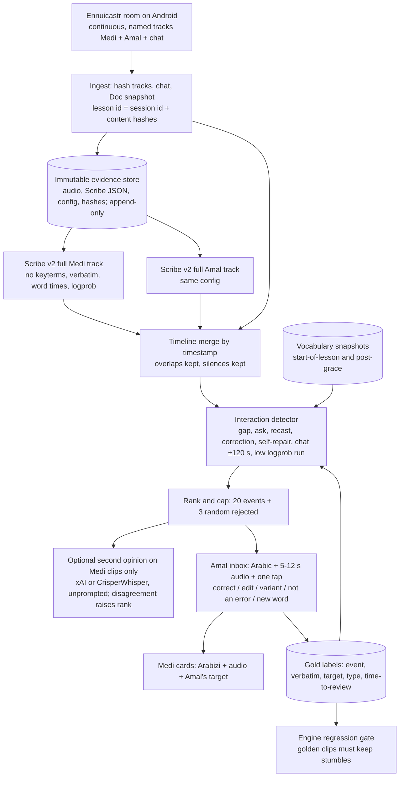
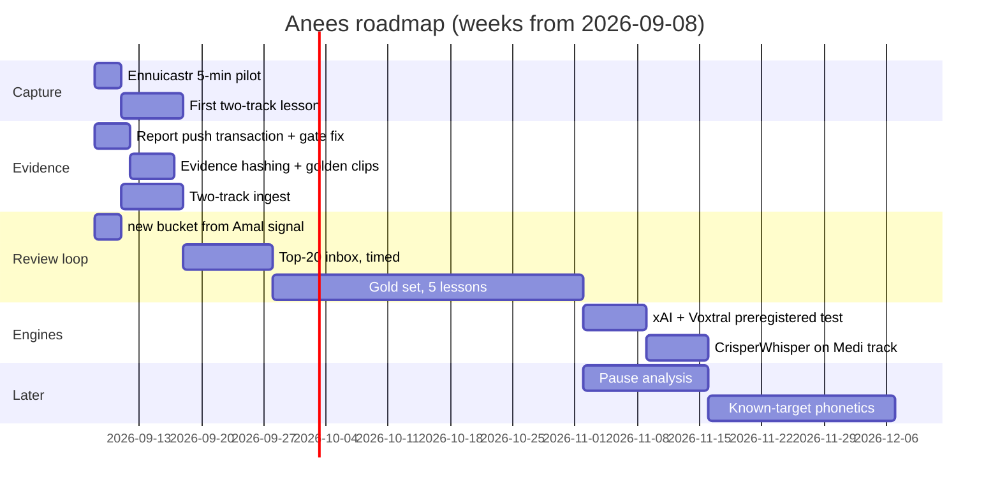

# Anees: independent adversarial audit of the Codex overnight ASR bake-off and the project

**Prepared:** 2026-09-05, by Claude (Fable 5.1) for Medi, Amal and Codex.
**Inputs audited:** `anees-overnight-asr-bakeoff-report-2026-09-05.md`, its evidence ZIP and SHA256SUMS, `anees-full-deep-research-report-2026-09-04.md`, the Fish report, the raw JSON in `work/`, the 20 frozen clips, the full Sep-4 lesson audio and Scribe output in `C:\dev\anees`, the repo code, and current provider documentation (fetched today).
**Standard of proof:** every number below was recomputed from raw JSON or measured from audio. "Better", "accurate" and "phonetic" are only used with a named metric. I could not listen to audio with ears; where a claim depends on hearing, I say which measurement replaced the ear and how much confidence that buys.

---

## 0. One-line verdict

**Codex's recommendation (keep ElevenLabs Scribe v2 as the evidence transcriber) survives an adversarial recount, but three of its headline numbers are softer than stated, its "cleanest poisoning example" is the wrong clip, its 25-second test windows hide the fact that Scribe itself degrades badly on short chunks, and the project's real risk is upstream (mixed-voice capture) and downstream (a report email that can point at an unpushed page), not the engine.**

---

## 1. Phase 1: evidence integrity

### 1.1 What verified clean

| Check | Result |
|---|---|
| Report and ZIP SHA-256 vs `SHA256SUMS` | Both match (`5D96…3EFC`, `4045…14B4`) |
| Bundle-internal `SHA256SUMS.txt` | 65/65 files match |
| 20 clip hashes vs original manifest (`D113…4CA4`) | 20/20 match; every Gemini and CrisperWhisper row carries the matching `clip_sha256` / `input_sha256` |
| Preregistration order (Gemini) | `protocol.md` 00:57:03, `preregistration.json` 00:57:18, first result file created 00:58:18 local; the API's own `created` stamp on clip 1 is 07:58:18Z, which is the same instant. Protocol hash inside the preregistration matches the file |
| Preregistration order (CrisperWhisper) | prereg 01:10:49 / 01:11:04, first result 01:11:36; hash matches |
| Gemini outputs | 81 rows: 80 × HTTP 200 (one of them empty text: `G0` clip 5), 1 × 429 |
| CrisperWhisper outputs | 40/40 `ok`, all non-empty, word timestamps used on all 40 |
| Upload ledger | 21 rows, 21 `deleted: true` (clip 16 uploaded twice) |
| Secrets in bundle | none; only env-var names (`GEMINI_API_KEY`, `XAI_API_KEY`, …) |
| Loop flags | reproduced mechanically: "same token ≥ 8 times in a row" selects exactly `CW_AUTO` clip 2 and `CW_AR` clips 7, 8, 18; nothing else |
| Aggregates | every token / Arabic-token / filler / cutoff figure in the combined table reproduces from raw JSON with the bundled regexes |

### 1.2 What does not hold as written

1. **"One 429, resolved by the retry policy" undercounts.** `run_gemini.py::call()` returns only the last attempt; intermediate failures are never persisted. Attempt counters on the 80 successes are `{1: 74, 3: 2, 4: 5}`, so at least 19 rate-limit or 5xx responses happened and were discarded, plus the one persisted 429 (`GD` clip 16, which exhausted four attempts and then succeeded after a second upload). Results are unaffected; the protocol sentence "persist every … error response" was not met and the report's description is wrong.
2. **The runner was edited after the run.** `run_gemini.py` mtime 01:04:48 is after the last write to the results file (01:04:41). Probably the `delete_leftovers` recovery path. Should be disclosed; the bundled script is not byte-identical to what produced the data.
3. **ElevenLabs segmented anchors were never judged.** `analyze_results.py` line 114: `judgment["ES"] = judgment["E"]` (same for EKG/EKL). The headline "ES 16/20" is inherited from the full-lesson arm. On clip 1 the ES text is "Oh my God, bees. What was bees? Bee. Awesome. [background chatter] My wife, Dania…" — the Arabic target is gone and a name ("Dania") was invented. Honest ES = 15/20 unless the English word "bees" counts, and if it counts, CrisperWhisper (which also wrote "bees") must be 8/20 instead of 7/20. The rubric was applied asymmetrically between arms.
4. **Token counts include content-destroying tags.** ES's 725 tokens include 12 tokens from `[speaking Arabic]` ×3, `[background chatter]` ×1, `[laughs]` ×4. Three of those tags *replace* Amal's Arabic (clip 21: her correction "شو أكتر إشي … أحسن إشي" became "[speaking Arabic]" twice). CrisperWhisper's 849 / 997 tokens include 42 / 238 bracket tags (`[UH]`, `[UM]`).
5. **"Cutoff markers" mislabels OpenAI.** O1's 12 are all ellipses ("…"), zero hyphen cut-offs; ES's 25 are 23 hyphens + 2 ellipses. Ellipses are punctuation, not evidence of a truncated word.
6. **Two filler regexes.** The 2026-09-04 analyzer counts Arabic fillers with `آ+|آه+|ا+ه+`; the overnight analyzers add `ام+|امم+`. With one regex ES = 23 and E = 22, not 22 and 21. ±1, but the arms were not measured with the same instrument, and `ام` also matches the word "mother".
7. **Gemini usage reports `total_output_tokens: 0` on all 80 calls.** The $0.1666 estimate is therefore a list-price assumption, not an observed charge. Codex flagged this itself; it remains open.
8. **Gemini diarization: request shape was valid.** `generation_config.transcription_config.mode.diarization_mode = "speaker"` is exactly what Google documents today. So the missing `word_info` is either API behaviour for that model/release or the SDK's `model_dump(exclude_none=True)` dropping an `annotations` field it does not model. The `google-genai` version is not recorded anywhere in the bundle (it ran from a `_deps` folder, and it is not installed in the system Python). Unresolved; re-run one clip over raw REST before concluding anything about Gemini diarization.
9. **"Buset was spoken about 42 seconds before the frozen window"** mixes two reference points. From the full-lesson Scribe timeline, Amal's "Buset … buset" sits at −31.1 s and −29.0 s before the clip-14 window start, and 44–46 s before the chat post. Both are outside the window, so the conclusion stands; the sentence does not.

### 1.3 Integrity verdict

Preregistration, hashing, deletion ledger and reproducibility are real and above the norm for this kind of work. The bookkeeping errors (2, 3, 4, 5, 6) all lean the same way: they make the ElevenLabs short-clip arm look slightly better and cleaner than it was. None reverses the ranking (Section 5.5), but the report should be corrected before it is cited.

---

## 2. Phase 2: transcript audit

### 2.1 How I "listened"

No ear was available. Each clip was reconstructed from five independent sources and one acoustic measurement:

1. Full-lesson Scribe word timeline (`scribe.json`, 11,066 words, word start/end, logprob).
2. Google Meet live captions with Meet's own speaker names (an independent decoder).
3. Per-word fundamental frequency (librosa pYIN): Medi ≈ 105–155 Hz, Amal ≈ 190–350 Hz; 160–185 Hz called ambiguous. Loudness per word relative to clip peak.
4. LPC formants (F1/F2) of the disputed vowel in clip 14.
5. The 12 machine outputs per clip (E, ES, O1, O2, Melia short/full, four Gemini arms, two CrisperWhisper arms) plus CrisperWhisper word timings.

Confidence is "high" only where ≥ 3 sources and the acoustics agree. Everything marked "learner event" below was located by timestamp and pitch, not by trusting any single transcript.

### 2.2 The disputed items, one by one

**Gemini clip 14 "Buset" (suspected vocabulary poisoning): CONFIRMED, on acoustic grounds.**
The three in-window tokens that every non-vocabulary engine wrote as "basat" have first-vowel F1 = 806, 663 and 591 Hz (F2 1319 / 1261 / 1438). Reference "Basat" tokens elsewhere in the lesson measure F1 678–896. Amal's real "Buset" at −31 s and −29 s measures F1 483 and 453 Hz (F2 1268 / 1089). An /a/ vowel, not /u/. The `GV` vocabulary list for clip 14 begins `['Baboos', 'Buset', …]`, so the substitution came from the prompt. Codex's conclusion is right; its evidence (a timeline argument) was weaker than it could have been, and the one contrary signal (Meet captions heard "Buffett" at +8 s) is outweighed by the formants.

**Gemini clip 16 is the cleaner poisoning example, and Codex scored it as a recovery.** In-window, Amal asks in English "How do I say did they enjoy their trip?" (pitch F, 16.8–20.9 s; present in E, ES, O1, O2, Melia, G0, CW). `GV` output: "Enbasa6ti fi el-7afle? Enbasa6u bisafrethom? How do I say, 'Did they enjoy their trip?'" — it emitted the *next* chat anchor as a spoken Arabizi phrase that nobody said. Codex's note says "also anticipates the next exercise" and still counts the clip as recovered. This should be the headline poisoning case: the inserted string is verifiable against every other engine and against the English sentence it shadows.

**Gemini clip 11: a third insertion.** Amal's "Yeah, I mean, some people-" (E, ES, O1, CW all have "I mean") became "Ya3ni, some people" in `GV`. The English filler was rewritten into the Arabizi vocabulary item.

**Gemini clip 17: family-level scoring hid a meaning change.** Medi drills form VII ("bitin besit … Betenbisti … betenbestu", all M-pitch 0.7–23 s; Amal models "Betenbisti" once at 8.3 s). `GV` wrote بتبسِط / بتبسِطي (form I, "you make happy") for his بتنبسط attempts ("you become happy"). Codex marked `GV` "recovered: b-s-6 present-tense family". Under the project's own rule ("must not silently replace with a known vocabulary word") this is a failure, not a recovery. `G0` reduced the whole drill to "Mhm. Mhm. And then in two"; `GH`/`GD` to "امم امم".

**Gemini clip 1 "Na7el": vocabulary helped and hurt at once.** Timeline: Medi "Oh my God, bees. What was bees?" (M, 0–1.5 s) = a self-declared gap; Amal "Nahl" (F196 Hz, 8.7 s); Medi "Nahl" (M126 Hz, 10.2 s) = repeat. `G0` dropped the first 13 s of speech entirely and began at "If I want to buy more". `GH` wrote "نحل. نحل." but dropped the English question. `GV` wrote "Oh my god, bees. What's bees? Na7el. Na7el." — the only Gemini arm to keep the gap and the repeat, but the spelling "Na7el" is the prompt's, not evidence of pronunciation. ES (the arm Codex ranks first) lost the word to "[background chatter]" and invented "Dania". Full-lesson E kept "Nahl. Nahl."

**Gemini diarization arm:** zero `word_info` annotations in all 20 responses; text collapsed and fused (clip 1: "نحالينحالي"; clip 2: "مبسوطمبسوطمبسوطمبسوط"). Request shape was correct (Section 1.2 item 8). Unusable as run; cause unresolved.

**CrisperWhisper loops:** mechanically confirmed (Section 1.1). `CW_AUTO` clip 2 = "ba-" ×~110; `CW_AR` clip 7 alternates "[UH] b-" ×~50; clip 8 "b-" ×~110; clip 18 "[UH]/[UM]" ×~90. The model card says loop suppression is on by default; it is not working on this audio with the Transformers backend. Untested: the CTranslate2 backend, `small`/`large`, or chunking.

**CrisperWhisper clip 11 `[fart]`:** five sound tags where Amal says "absato, absatni … absatni, absato, absatna". `CW_AUTO` on the same audio wrote "Apsato, Apsatmi". A sound-event hallucination triggered by forcing `language="ar"`; not a joke and not noise.

**Where ElevenLabs produced more text but not more correct text:**
- ES clip 1: "[background chatter] My wife, Dania" (hallucinated name; lost target).
- ES clip 8: "أنا بساط" where E and the timeline have only "انا" (a plausible completion, not evidence).
- ES clip 12: "zit, zit nabasat" for "is it, is it nabasat".
- ES clip 16: Medi's "embasati" (M-pitch, 3.8 s) rendered انبسطت (masculine, no ي) — a silent alteration of the learner form.
- ES clip 21: two "[speaking Arabic]" tags in place of Amal's correction.
- E clip 18: Amal's "with بنبسط" (F-pitch, 22.6 s) rendered "With ban biscuits".
These are exactly the cases a token count rewards.

### 2.3 The clips that actually test the objective

Eight moments in the 20 windows are verifiable learner events (self-declared gap, self-repair, malformed attempt, tutor correction), located by timestamp + pitch. Preserved = the attempt or the correction is legible in the output; partial = half of the pair; altered = replaced by a different or corrected form.

| Clip | Learner event (speaker by pitch) | E full | ES 25 s | O1 | M0 | G0 | GH | GV | GD | CW_AUTO | CW_AR |
|---|---|---|---|---|---|---|---|---|---|---|---|
| 1 | Medi "what was bees?" gap → Amal "Nahl" → Medi repeat | ✓ | ✗ tag | ✓ | ✗ | ✗ dropped | ½ | ✓ | ✗ | ½ | ½ |
| 2 | Medi "sameeh?" guess, "Masbu-" false start | ✓ | ½ | ½ | ✗ | ✗ | ✗ | ✗ | ✗ | ✗ loop | ½ |
| 9 | Medi "بسات- بساتِ- بساتِتني أسف بساتِتك" stumble chain (M, 0.7–5.7 s) | ✓ | ✓ | ✗ | ✗ | ✗ | ✗ | ✗ | ✗ | ✓ | ✓ |
| 16 | Medi "embasati fi el" (M, 3.8 s) | ✓ | altered | ✗ | ✗ | ✗ | ✓ | ✓ + insertion | ✓ | ½ | ✓ |
| 17 | Medi form-VII drill (M, 0.7–23 s) | ✓ | ✓ | ✓ | ✓ | ✗ | ✗ | altered (form I) | ✗ | ✓ | ✓ |
| 18 | Medi "nitla" for نطلع (ع dropped; M, 2.3–5 s) | ✓ Latin | ✓ "نتلا" | ✗ نطلع | ✗ | ✗ | ✗ | ✗ | ✗ | ✗ | ✗ loop |
| 19 | Medi "هادي الفعل → هذا الفعل" gender self-repair (M, 1.9–6.3 s) | ✓ | ✓ | ✓ | ✓ | ✗ | ✗ | ✗ | ✗ | ✓ | ✗ |
| 21 | Medi "أحسن" for "أكثر"; Amal corrects "شو أكتر إشي" | ✓ | ✗ tag | ✓ | ✓ | ✗ | ✗ | ✓ | ½ | ✗ | ✗ |
| **Score /8** | | **8** | **5** | **4.5** | **3** | **0** | **1.5** | **3** | **1.5** | **4** | **4** |

Three things this table says that the token table does not:

1. **Scribe on the full lesson (E) is the only output that kept all eight.** It is also the configuration the pipeline actually runs.
2. **Scribe on 25-second chunks (ES) lost three of eight** and altered a fourth. The window, not the engine, cost those. Every challenger was only ever tested on 25-second chunks, so their full-track behaviour is unknown, and Codex's production advice ("2–5 minute chunks with 1–2 s overlap") is untested and, on this evidence, risky.
3. **Gemini's failure mode is omission, not correction.** `G0` scored 0/8 by dropping the moments outright (clip 5: empty for 25 s of speech; clip 1: first 13 s gone; clip 9, 17, 19: reduced to the surrounding English). An omitted moment cannot be reviewed at all.

CrisperWhisper is worth one sentence more: outside its loops, `CW_AUTO` was the second-best renderer of Medi's stumbles ("basa- basat- basat- ne-", "buts hadi al fa'il. Hadah."), and its collapses all happen on Amal's fluent Arabic (clips 4, 6, 7, 18: translated to English or looped). That is a Medi-track engine, not a mixed-track engine.

---

## 3. Phase 3: research audit (documentation checked 2026-09-05)

Legend for evidence class: **D** direct Anees evidence, **O** official provider documentation, **I** independent research, **V** vendor benchmark or interested party, **S** inference.

| Provider | Arabic / Levantine | Within-utterance code-switch | Verbatim / filler control | Vocabulary bias | Word times + confidence | Channels / speakers | Retention / training | Price | Evidence | Codex claim check |
|---|---|---|---|---|---|---|---|---|---|---|
| ElevenLabs Scribe v2 | `ara` generic, no dialect (O) | not documented (O); works in practice (D) | `no_verbatim` (default keeps fillers/false starts) (O) | `keyterms` ≤ 1000 (O) | word start/end + `logprob` (O) | `diarize` ≤ 32, `use_multi_channel` ≤ 5 channels, `channel_index` (O) | default retention per privacy policy; Zero Retention Mode is enterprise-only (`enable_logging=false`) and the docs name TTS/Voice Changer, not STT (O) | $0.22/h all tiers (O) | D + O + I (Abdoli 2026) | Correct on features; silent on retention. **STT ZRM must be confirmed before Amal's voice is sent routinely** |
| OpenAI `gpt-transcribe` | ISO codes incl. `ar` (O) | prompt hints (O) | none; prompt is "unstructured context" (O) | prompt (O) | **word timestamps only on `whisper-1`** (O) | `gpt-4o-transcribe-diarize` with `known_speaker_references` (O) | not used for training; `/v1/audio/transcriptions` shows no abuse-monitoring retention (O) | $0.0045/min (O) | D + O | Codex under-weighted the missing timestamps: without them a clip cannot be cut. Second opinion only |
| Gemini 3.5 Transcribe | `ar-EG` only (O) | automatic (O) | `verbatim` mode (O); did not behave as verbatim here (D) | `custom_vocabulary` ≤ 1000, not with diarization/timestamps (O) | `word_info` offsets; "may degrade accuracy" (O) | diarization ≤ 8 (O); returned nothing here (D) | paid tier not used for improvement; abuse logs "limited period" (O) | ≈ $0.005/min blended (O) | D + O | Correct |
| xAI STT | `ar` generic (O) | file-level language detection (O) | `filler_words` (default **false** = removed); `format` = inverse text normalization only (O) | `keyterms` ≤ 100 (O) | word `start`/`end`; **confidence not documented** (O) | `diarize`, `multichannel` ≤ 8, `vad_threshold` (O) | no training without permission; 30-day abuse retention; self-serve ZDR (disables Files/Batch APIs) (O) | $0.10/h REST, $0.20/h streaming (O) | O + V (Nyra EN 73.9 disfluency F1) | Codex's "word timestamps/confidence" is half right (no confidence); "format=false avoids normalization" is only ITN. Still the best cheap untested candidate |
| Inworld STT-1 | `ar` in a 30-language list; **current languages page shows no "experimental" label** (O) | not documented | not documented | — | word timestamps (O) | diarization "Experimental" (O) | training use in privacy policy (per Codex; not re-verified) | on-demand | O | Codex's "Arabic experimental" came from `dev.docs.inworld.ai`, which no longer resolves. Unverified; doc drift |
| Fish `transcribe-1` | auto-detect, one language per file (O) | no | none (O) | none (O) | segment timestamps only (O) | none (O) | Terms (effective 2024-08-18) allow training on Content incl. third-party components; no API exemption (O) | $0.36/h (O) | O + V (Nyra filler F1 30.5) | Correct; consent gate is justified |
| StepAudio 2.5 ASR | zh/en only (O) | — | — | — | — | — | — | — | O | Correct, eliminated |
| Cartesia Ink | `ink-2` en; `ink-preview` en/fr/hi/ja/es (O) | — | — | — | — | — | — | — | O | Correct, eliminated |
| CrisperWhisper 2.0 medium | not listed; 8/10 benchmark languages synthetic (O/V) | window-level | verbatim/intended modes, `[UH]` `[UM]` sounds (O) | hotwords Pro only (O) | word timestamps (D) | none | local (D) | "free for research and other non-commercial use" (O) | D + O + V | Codex: "production licensing must be considered". For a single-user personal project this reads as non-commercial; read the licence text, do not assume. Loop suppression "on by default" failed on 4/40 (D) |
| Cohere Transcribe Arabic 07-2026 | dialect-resampled; **Casablanca (has Palestinian) WER 49.71 / CER 20.66** (V, model card) | "does not feature explicit automatic language detection and exhibits inconsistent performance on code-switched audio" (O, model card) | not documented | — | **no timestamps, no diarization** (O) | none | Apache 2.0, self-host (O); hosted 25 MB limit (O) | contact sales / free weights | O + V | Codex's 09-04 report called it "built for Arabic dialects plus English code-switching"; the model card says the opposite for code-switching. Not a mixed-track candidate |
| Azure `ar-PS` | explicit locale; Custom Speech from audio+human transcript and plain text; no pronunciation customization (O) | continuous LID cannot switch mid-sentence (O, per Codex) | lexical/raw text | phrase list | yes | yes | Azure DPA | ≈ $1/h | O | Correct; **pronunciation assessment has no `ar-PS`** (O) |
| Deepgram Nova-3 | `ar-PS` listed (O) | `language=multi` = en/es/fr/de/hi/ru/pt/ja/it/nl — **no Arabic** (O) | `filler_words` noted for Nova-2 only (O) | keyterm | yes | yes | — | — | O | Correct |
| Google Chirp 3 | `ar-PS` with model adaptation; no diarization or word confidence on `chirp_3` rows (O) | prevalent-language mode | — | phrase sets | partial | none for Arabic | GCP | — | O | Correct |
| Speechmatics Melia / `ar_en` | "Global Arabic … Gulf, Egypt, and the Levant"; **Palestinian not named** on the languages page (O) | `ar_en` bilingual pack (O) | none on that page | none (O) | word times, no confidence (O) | 6 clusters for 2 people (D) | — | — | D + O | wiki 13's "Palestinian named" is unverified |
| **Voxtral Transcribe 2 (Mistral, Feb 2026) — missed by Codex** | Arabic among 13 languages, no dialect note (O) | not documented | not documented | context bias ≤ 100 terms, non-English "experimental" (O) | word timestamps (O) | diarization with times (O) | Realtime weights Apache 2.0, self-hostable (O) | $0.003/min batch ($0.18/h) (O) | O | Cheap, timestamped, self-hostable; untested; verbatim behaviour unknown |
| **Munsit — missed by Codex** | vendor: 25+ dialects incl. Levantine "Lebanon, Syria, Jordan, and Palestine" (V) | vendor claim (V) | not documented | — | not documented | not documented | not documented | not published | V only | Vendor claims only; no independent evidence; needs a doc read before any test |
| **Talafha, Abu Alhassan, Abdul-Mageed 2025/26 (arXiv 2511.18774) — missed by Codex** | zero-shot context-aware decoding for Arabic varieties: first-pass-hypothesis prompting and retrieved exemplars, −9.15 % relative WER on dialects, −22 % on MSA (I) | | | conditions on *hypotheses*, not word lists | | | | | I | The academically grounded form of the "vocabulary prior" idea, with less insertion risk than a term list |

**Nyra verbatim benchmark:** every figure Codex quoted matches the page (published 2026-06-24; EN 4,957 clips, DE 202). The page itself does not say which languages are synthetic; that statement is on the Hugging Face model card. Interested party; English only; directional.

**Ennuicastr (ecastr.com today):** per-speaker synchronized tracks; "Works on Android and iPhone"; Chrome/Firefox; $1/h Opus, $2/h FLAC, "$10/month unlimited". Codex's "$15/month continuous subscription" no longer matches the site; the "continuous" (no-VAD) tier and chat export are not stated on the home page. Both must be confirmed in the 5-minute pilot, not assumed.

---

## 4. Phase 4: architecture review of `C:\dev\anees`

### 4.1 Built and running (verified in code, logs and Task Scheduler)

- Hourly Task Scheduler jobs `Anees lesson pipeline` (:15) and `Anees vocab import` (:35), both `Ready`.
- `lesson_pipeline.py`: Meet-folder watcher keyed by **filename** (not Drive file id), ffmpeg extract, pre-check (minutes 3–6, ≥ 12 % Arabic share, or the Meet chat sidecar shows a tutor typing), full-lesson Scribe v2 call with 3 retries / backoff / budget ledger (stop at 90 % of a $10 cap) / failure email to Medi only, transcript page, git commit + push that **raises on push failure** (the Codex P0 is fixed for this path).
- Speaker labels: Scribe diarization → "more Arabic = Amal" heuristic → pitch fallback (yin, < 155 Hz Medi, > 180 Hz Amal, neighbours vote) → `?`; a 15 % unlabeled floor suppresses per-speaker facts.
- `understand_lesson.py`: Doc-word events with prompted / correction / asked / elicited / uptake flags, chat location ±120 s, topic ranking, clips ≤ 25 s; `miss_kind.py` classifier; `buckets.py`.
- Supabase `anees`: 8 tables, RLS, token links with 7-day expiry, update-guard trigger, public rules view without tokens.
- Report pages, rich emails, planner/after links (minted, never sent), flashcards with offline queue, morning check, 77 tests collected (66 passed on the last full local run per the log; the two link suites are excluded from the morning check as live tests).

### 4.2 Only in documentation

- Two-track capture. Three incompatible versions exist: `constants.md` (PC mic + WASAPI loopback), wiki 13 (same), Codex (Ennuicastr on Android), handoff ("Craig or Ennuicastr"). No code, no pilot.
- 90-day raw-audio deletion and "Amal can request deletion of any lesson" (`constants.md`): no code path deletes anything.
- Drive-file-id idempotency: code keys `processed.json` by filename.
- Secrets in Supabase Edge Functions: actual secrets are Windows User env vars plus `C:/Claude/Personal/Project Alchemy/alchemy-lock/.env` (Gmail app password) and that project's `node_modules` (nodemailer), hard-coded by absolute path in `send_lesson_email.mjs` and checked by `morning_check.py`.
- Engines contract (`constants.md`): "Speechmatics bilingual primary, wav2vec2 Levantine CTC for raw learner form". Reality: ElevenLabs only; wav2vec2 never run in the pipeline.
- FSRS per card, 6 word statuses, caps: replaced by the simpler bucket scheme.
- Cohere transcription (graph node T1): never done.

### 4.3 Experimental (works, unproven)

- Pitch labels ("93 % agreement with ElevenLabs on Aug 25"; ElevenLabs is not ground truth, and my per-word check shows the 160–185 Hz band and short tokens are ambiguous).
- Tutor-reaction detector (~50 % precision by the overnight log).
- Miss classifier v2; `looks_arabizi` and skeleton matching.
- **The `new` bucket** (`buckets.py`: "first heard in one of the last 3 lessons and not yet drilled"). Medi's definition, stated today: *new = the words Amal indicates were newly introduced in that lesson* (e.g. babse6 / banbese6 on Sep 4). The heuristic must be replaced by an explicit Amal signal (after-link answer, chat, or grace-period Doc addition).
- `models/dialect-ct2` local Whisper (untracked, unused by the pipeline).

### 4.4 Where docs contradict code

`README.md` ("nothing built yet"), `plan/graph.yaml` (`now: [V0, T1, T2]`), `plan/constants.md` (engines, secrets, capture, retention, FSRS) and the blueprint mind map all describe a project that does not exist. `plan/HANDOFF-2026-09-05.md` and `OVERNIGHT-LOG.md` are accurate. The task graph should be regenerated from the repo, not edited.

### 4.5 Can raw evidence be overwritten?

`scribe.json` is written once and never rewritten (good). But it is gitignored, unhashed, and exists only on this PC; Supabase holds derived rows; GitHub Pages holds derived clips. There is no immutable evidence store and no hash chain from audio → Scribe output → events. Codex's benchmark manifest did this properly; the production pipeline does not.

### 4.6 Speaker attribution

Not trustworthy on Meet mixed audio. The Sep-4 Scribe output puts almost every word on `speaker_0`; the pitch fallback leaves ~14 % unlabeled and mislabels ambiguous tokens; the "more Arabic = Amal" rule is nonstationary (Codex is right). Named tracks are the only fix. Until then every per-speaker number is an estimate and the pages already say so.

### 4.7 Retries, idempotency, retention, deletion, failure notices

| Contract | State |
|---|---|
| Scribe retry ×3 with backoff | implemented (`pipeline_ext.transcribe_with_retry`) |
| Budget stop | implemented |
| Failure email, Medi only | implemented |
| Idempotent re-run | yes, by filename; cached `scribe.json` reused |
| 90-day audio deletion | **not implemented** |
| Amal deletion request | **no path** |
| OpenAI calls (suggest / after questions) retry | not verified in this audit |

### 4.8 Can publishing claim success before it is durable?

**Yes, still, for the report.** `build_report.build()` writes `docs/lessons/<date>-report.html`, cuts clips into `docs/lessons/<date>/clips/`, and sends the report email; nothing in `build_report.py` or `pipeline_ext.py` commits or pushes. The transcript email is safe (its `publish()` raises on push failure), the report email is not. The morning checklist's step 5 ("404 → run git push") is the symptom. The Sep-4 report page reached GitHub only through manual commits later that morning.

Second fragility: the Sep-4 lesson was first **skipped** ("arabic share 0.11 → not an Arabic lesson") although the pre-check measured 0.49, and was rescued only by the chat-sidecar rule added afterwards. Today's 13:30 lesson is skipped again if Amal does not type in chat and the post-hoc share is < 0.12. A code-switched lesson with long English explanations fails a 12 % gate.

### 4.9 Public exposure

- Anyone can insert `card_results` with the public anon key (known P1).
- 31 dead Amal tokens sit in two public commits (verified dead by Codex; low risk).
- Lesson transcripts and Amal's voice clips are public on GitHub Pages. Amal has not been asked. See Section 5.13.

---

## 5. Phase 5: independent verdict

### 5.1 Bottom line

Keep **ElevenLabs Scribe v2 on the full track** as the raw evidence transcriber. Do not chunk it. Stop searching for a replacement engine until (a) two named tracks exist and (b) 100 Amal-adjudicated events exist to score against. The next direct engine tests, in order and only after (a): xAI, Voxtral Mini Transcribe V2, CrisperWhisper on Medi's own track. Gemini, Fish, Cohere, Inworld: no test now.

### 5.2 Where I agree with Codex (material)

1. ElevenLabs remains the best operational evidence pass on this sample; my learner-event recount widens, not narrows, its lead on the full-lesson configuration.
2. Clip 14 "Buset" is vocabulary poisoning (now shown acoustically).
3. Vocabulary prompts belong only in a labelled secondary arm; never in the primary pass.
4. Speaker identity must come from capture, not diarization; Gemini's diarization arm and Melia's six clusters both support this.
5. CrisperWhisper is not a mixed-track primary; its loops are real and mechanically reproducible.
6. Fish must not receive Amal's audio without informed consent to training terms; the schema offers no controls that would justify the risk.
7. StepAudio and current Cartesia fail the language gate.
8. xAI is the highest-value untested commercial challenger.
9. No WER or accuracy claim is possible without human verbatim gold; the report's own caveats are correct.
10. The project's mixed-channel capture and the report/README contradictions are P0/P1 problems.

### 5.3 Where I disagree (material)

1. **"ES 16/20" was never judged**; it was copied from E. Honest ES is 15/20 with the rubric applied symmetrically.
2. **Clip 16, not clip 14, is the cleanest poisoning example**, and Codex counted it as a recovery.
3. **The anchor-family rubric rewards the failure Anees fears most**: `GV` clip 17 (form VII → form I) and clip 11 ("I mean" → "Ya3ni") were credited or unnoticed.
4. **Short windows are a confound Codex did not test.** Scribe itself drops from 8/8 to 5/8 learner events between the full-lesson and 25-second configurations. Every challenger was tested only on 25-second chunks. Codex's Stage-1 advice to run production in 2–5-minute chunks is contrary to the one piece of direct evidence on chunking.
5. **Cohere Transcribe Arabic was overstated in the 09-04 report** ("built for … code-switching"); the model card says code-switching is inconsistent, Casablanca WER is 49.7 %, and there are no timestamps.
6. **Voxtral Transcribe 2 and Munsit were missed**; Voxtral is cheaper than Scribe, timestamped, diarizing and self-hostable.
7. **"One 429"** is not what happened (≥ 20 rate-limit/5xx responses).
8. **The report-page publish path still announces success before the page is pushed**; Codex's 09-04 P0 was only half fixed and the overnight report does not say so.

### 5.4 True but overstated

- "ElevenLabs preserves more of the conjugation drill without a runaway loop" — true, but ES also replaced Amal's Arabic with `[speaking Arabic]` tags and invented "Dania"; token counts hide both.
- "xAI documents word timestamps/confidence" — timestamps yes, confidence no.
- "xAI `format=false` avoids normalization" — it disables inverse text normalization (numbers, currency), nothing about disfluencies.
- "Inworld Arabic is experimental" — the current docs do not say so; the source page moved.
- "Gemini's diarization arm returned no machine-readable annotations" — true for this run; the SDK version is unrecorded, so "operational failure of the exact tested configuration" cannot be separated from "SDK dropped the field".
- "CrisperWhisper's standard weights are research-only; production licensing must be considered separately" — the licence text says non-commercial use is free; Anees is non-commercial. Check, do not assume either way.
- "Speechmatics names Palestinian" (wiki 13) — the languages page says "the Levant".

### 5.5 Methodological errors that could reverse the ranking

| Error | Effect if corrected | Reverses? |
|---|---|---|
| ES anchors copied from E | ES 16 → 15 | No |
| Family rubric credits wrong-form and inserted words | GV 14 → ≤ 11; ES 16 → 15; E stays 16 | No |
| 25-s windows for all challengers | unknown for xAI/Voxtral; Gemini `GV` might gain on full tracks | Could narrow; cannot be known without a full-track test |
| Tags counted as tokens | ES 725 → 713; CW 849 → 807, 997 → 759 | No |
| One lesson, one verb family, mixed audio, no gold | all rankings are sample-specific | Any ranking could move on a different lesson; that is why the gold set comes first |

Nothing found reverses "Scribe full-lesson ≥ every tested alternative on this sample". The evidence that it *stays* first on Medi's own track, on a different lesson, does not exist yet.

### 5.6 My ranked table (for Anees's objective, not for readable prose)

Metric: learner-event preservation on the 8 timeline-verified events (Section 2.3), then controls and cost. Direct evidence unless marked.

| Rank | Engine / configuration | Events /8 | Why here |
|---|---|---|---|
| 1 | ElevenLabs Scribe v2, full track, no keyterms, `no_verbatim=false`, word timestamps | 8 | Only output that kept every attempt, false start and correction; logprob per word; multichannel |
| 2 | ElevenLabs Scribe v2, 25-s chunks | 5 | Same engine, worse by the window; tags replace content |
| 3 | OpenAI `gpt-transcribe`, strict prompt | 4.5 | Keeps self-repairs it hears, removes fillers, no word timestamps |
| 4 | CrisperWhisper 2.0 medium, auto (Medi-heavy audio only) | 4 | Best Latin rendering of stumbles; collapses on fluent Arabic; loops |
| 5 | CrisperWhisper 2.0 medium, forced `ar` | 4 | Same, plus `[fart]` and three loops |
| 6 | Gemini 3.5 Transcribe, local vocabulary | 3 | Recovers forms by prompting; inserted three unspoken items |
| 7 | Speechmatics Melia, auto | 3 | Clean, compressed, no cut-offs |
| 8 | Gemini bilingual hints | 1.5 | Drops English around Arabic |
| 9 | Gemini diarization | 1.5 | Fused text, no speakers |
| 10 | Gemini auto verbatim | 0 | Omits whole stretches (25 s empty on clip 5) |
| untested | xAI STT ($0.10/h, fillers on, timestamps, multichannel) | — | First to test after two-track capture |
| untested | Voxtral Mini Transcribe V2 ($0.18/h, timestamps, diarization, Apache 2.0 realtime weights) | — | Second |
| untested | Inworld, Cohere, Munsit, Azure custom, Chirp 3, Deepgram | — | Gated by language fit, consent, or missing timestamps |
| refused | Fish | — | Training terms; no controls |

### 5.7 Should ElevenLabs remain primary?

Yes, as the **raw evidence layer on full named tracks**, with three conditions: confirm STT zero-retention or accept the default retention in writing with Amal; pin `model_id`, `no_verbatim=false`, `timestamps_granularity=word`, no `keyterms`; add golden regression clips (clips 9, 17, 18, 19 above) that fail the build if a future Scribe release starts correcting them.

### 5.8 Who deserves another direct test, in order

1. **xAI** — $0.03 for the frozen 20 + one full Medi track; `filler_words=true`, `format=false`, `vad_threshold=0`, no keyterms; then a second arm with ≤ 100 keyterms to measure insertion rate against the E timeline.
2. **Voxtral Mini Transcribe V2** — same protocol; also self-host the Realtime weights on the 4070 Ti to remove the retention question entirely.
3. **CrisperWhisper 2.0** — only on Medi's separate track, CTranslate2 backend, `small` and `large`, with loop detection as a hard gate. Purpose: a stumble-renderer arm, never truth.
4. **Gemini `GV`** — not as a transcriber; as a *hypothesis generator* on flagged 10-s clips, with its output shown next to the unprompted text and its vocabulary list logged.
5. **Inworld** — only with a written no-training term.
6. **Cohere Transcribe Arabic** — only on Amal's Arabic-only track, self-hosted, and only if a timestamp path (forced alignment) exists.
7. **Fish** — only after Amal's informed consent to the training clause; expected value low.

### 5.9 Would a multi-engine ensemble help?

Only as a **disagreement detector**, never as a merged transcript. Evidence from this sample: `GV` inserts prompted words, ES emits tags instead of words, CrisperWhisper loops, OpenAI deletes fillers. A majority vote across those would launder each engine's confident error into the "consensus". Useful pattern: run one unprompted second engine on Medi's track only; where its tokens disagree with Scribe inside a 10-s window that already contains an interaction signal (Amal correction, gap, self-repair), raise that window's rank and show both hypotheses to Amal. Vocabulary-prompted arms never vote.

### 5.10 The architecture I would build



Rules baked in: the evidence store is append-only; every derived row carries the evidence hash; canonical Arabic/Arabizi are annotations linked to spans, never edits; nothing is emailed or linked until the page is pushed and fetched back with HTTP 200; no per-speaker number is published from a mixed track.

### 5.11 Minimum human-gold dataset before claiming improvement

- **5 lessons × 20 adjudicated events = 100 events**, each with: exact Medi words as heard (fillers, fragments), Amal's target, event type, valid-variant flag, importance, speaker + times, review seconds.
- **Plus 10 minutes of fully verbatim Medi-track transcript per lesson (50 minutes)** labelled by Amal, so WER/CER on learner speech is computable at all.
- **Plus 20 random rejected candidates per lesson** so recall of the top-20 is measured, not assumed.
- Split: 3 lessons development, 2 lessons frozen hold-out; inter-rater check on 20 items (Medi listens, Amal labels).
- Until this exists, no engine may be called better; the word is "different".

### 5.12 Milestones with acceptance criteria

| # | Milestone | Accept when |
|---|---|---|
| A | 5-minute Ennuicastr pilot on Medi's phone | download contains two named tracks + machine-readable chat; reconnect test passes; continuous (no-VAD) tier confirmed or FLAC used |
| B | Evidence store + full-track Scribe per track | audio and Scribe hashes recorded; re-run is byte-identical; golden clips 9/17/18/19 keep their stumbles |
| C | Report/email transaction fix | no email leaves before `git push` succeeds and the page returns 200; test exists |
| D | `new` bucket from Amal's signal | `new` rows only from after-link "new words" / chat / grace-period Doc additions; heuristic removed; test exists |
| E | Top-20 inbox | Amal completes one real inbox unaided; median and p90 seconds recorded; ≥ 85 % accepted or usefully edited |
| F | Gold set (5.11) | 100 events + 50 verbatim minutes + rejected sample labelled; hold-out frozen |
| G | Challenger test (xAI, Voxtral) | preregistered; scored on hold-out; replacement only if learner-event recall or verbatim WER improves without more insertions, speaker errors or review time |
| H | Pause analysis | separate tracks ≥ 3 lessons; causes labelled; personal threshold fitted |
| I | Known-target phonetics | 30–50 attempt/reference pairs; ranking gain vs Amal labels or drop it |

### 5.13 Privacy and consent policy (Medi and Amal)

1. Amal is told, in one page, in Arabic and English: what is recorded (her voice, chat), where it is stored (this PC, Google Drive, ElevenLabs for processing, Supabase for derived rows, GitHub Pages for clips), for how long (raw audio 90 days, clips while the word exists), who can see it (public pages: yes for clips today), and how to delete any lesson (one message to Medi; deletion within 7 days, logged).
2. No new provider receives her audio without a named data-use statement she has seen; providers whose terms allow training (Fish, Inworld by policy, Cartesia) are off unless she accepts in writing.
3. ElevenLabs: obtain the STT retention terms in writing or enable enterprise ZRM; record which applies.
4. Public GitHub Pages: either make clip pages token-gated like Amal's links, or get Amal's explicit yes to public clips of her voice.
5. Medi's own data: raw speak attempts 30 days; cards and reviews kept; export on request.
6. Every consent is a row with date, text shown, and answer.

### 5.14 A 20-item Amal workflow that can reach 3–5 minutes

- One link, one screen per item, no scrolling; the item is a 5–12 s clip auto-playing once, Medi's attempt in Arabic script (and Latin if the engine wrote Latin), the machine's guessed target, and four buttons: **صح** (right), **غلط كلمة** (wrong word), **غلط قواعد** (wrong grammar), **مش مدي** (not Medi / not an error). A fifth small control: **كلمة جديدة** (new word) which is the only source of the `new` bucket.
- Edit is a single Arabic text field that appears only after "wrong"; default target is prefilled so one tap keeps it.
- Order: explicit corrections first (cheapest to judge), then gaps, then self-repairs, then low-logprob runs.
- Budget: 20 × 12 s of audio = 4 min of listening; taps are free. Instrument seconds per item and plays per item; stop adding item types until p90 < 15 s.
- Three of the 20 are random rejected candidates, labelled as such after the session, to measure recall.

### 5.15 Later pause / retrieval analysis

Only on Medi's separate track. Silence intervals from audio energy + VAD, not from text fillers. Label the first 100 pauses > 1.2 s by cause (Amal speaking on her track, reading chat, thinking, retrieval, network) using the merged timeline; fit a personal threshold from the retrieval-labelled subset; report as a candidate signal into the ranker, never as a standalone "error".

### 5.16 Known-target phonetic analysis

For each Amal-confirmed correction where both an attempt (Medi track) and a reference (Amal track) exist within 15 s: forced-align both to the Palestinian target's phone string (Maknuune phonology as the dictionary seed, Amal overrides); compute per-phone goodness-of-pronunciation and DTW distance between attempt and reference; validate against Amal's "pronunciation" labels on 30–50 pairs. Ship only if it improves candidate ranking; never show a phone score to Medi without Amal's label beside it.

### 5.17 What to build next inside `C:\dev\anees` (do not build yet)

1. Report-email transaction: push-then-verify-then-email (Section 4.8).
2. Lesson gate: replace the 12 % post-hoc share with "pre-check share OR chat OR Doc-word hits ≥ N", so a Sep-4-style lesson is never skipped.
3. Evidence hashing: record SHA-256 of audio and `scribe.json` in `summary.json` and Supabase; copy `scribe.json` to a second location.
4. `new` bucket from Amal's signal; remove the heuristic.
5. Ingest path for a two-track package (two mono files + chat), with a hard refusal when a named track is missing.
6. Golden regression test with clips 9, 17, 18, 19.
7. 90-day deletion job and an Amal deletion path.
8. Move the mail sender's secrets and dependency out of the Alchemy folder.

### 5.18 Delete, deprecate or rewrite in the existing plans

- Rewrite `README.md` status line and regenerate `plan/graph.yaml` from the repo.
- Rewrite `constants.md` rows: Engines (ElevenLabs full-track primary; no Speechmatics/wav2vec2 claim), Secrets (state the truth), Recording (pick one capture design), Retention (mark as not implemented until it is).
- Deprecate the blueprint mind map; replace with the diagram in 5.10.
- Deprecate wiki 13's "Palestinian named" for Speechmatics and the Zencastr mentions; add Voxtral and Munsit rows as untested.
- In the engine report page: replace "15/20 blind vote" phrasing with the exact comparison set (ElevenLabs vs Speechmatics vs local Whisper; OpenAI not included), and remove any wording that reads as accuracy.
- In Codex's overnight report: correct items 1.2 (1, 3, 4, 5, 9), re-label clip 16 as the poisoning example, and add the E-vs-ES window finding.

### 5.19 Roadmap



### 5.20 The five decisions I need from Medi

1. **Capture:** Ennuicastr on your phone as the call itself (replacing Meet), or Meet plus a second recorder on the PC? Everything downstream depends on named tracks.
2. **Public clips:** keep Amal's voice clips public on GitHub Pages, or token-gate lesson pages the way her links are gated?
3. **Retention:** accept ElevenLabs default retention for now, or block routine processing until STT zero-retention is confirmed?
4. **The `new` signal:** which single source defines it — Amal's after-link answer, the Meet chat, or the Doc grace-period diff?
5. **Engine testing:** freeze engine work until the 100-event gold set exists (my recommendation), or run the $0.05 xAI/Voxtral clip test now for information only?

---

## 6. Cross-reference against the master vocabulary Doc (snapshot 2026-09-05 10:35, 2,120 words)

Medi asked whether every word was checked against the master Doc. Result, using the project's own matcher (`scripts/arabizi.py`, exact → loose → skeleton → fuzzy):

| Amal's Sep-4 typed form | Doc match | Meaning for Anees |
|---|---|---|
| Na7el, Mabsoo6, Babse6, Banbese6 | exact (`na7el`, `mabsU6`, `ana babse6`, `banbese6`) | known lemmas |
| Basa6, Basa6ni, Byebse6ni, Btebse6i, Bnebse6o, Basa6tek, Hasa6to, Enbasa6, Enbasa6ti, Enbasa6u, Btenbese6i, Enbes6i | **not in Doc** | conjugations of Doc verbs (`Ana babse6`, `Byebse6`, `Enbese6`, `Banbese6`); the Doc stores lemmas, not paradigms, so single-form matching fails and only `family_key` (consonant skeleton) finds them |
| Baboos, Buset | **not in Doc** | genuinely new words Amal introduced (kiss / I kissed) — exactly Medi's definition of **new**: Amal indicated them, the Doc does not have them yet |
| ne6la3 | present only inside the sentence "Bra2yak laazem ne6la3?" | words embedded in multi-word Doc entries are invisible to word-level matching; Medi's "nitla" mispronunciation (clip 18) therefore has no standalone Doc target to score against |
| biyoamek, bisafrethom | not in Doc | prepositional phrases built from Doc nouns (`yoam`, `safra`) |

Also in the Doc and relevant to the clips: `a7san / أحسن / Better`, `Aktar / أكتر / More`, `Aktar shee / أكتر شيء / The most` (clip 21 word-choice slip), `Hada / هادا` (clip 19), `7afle / حفلة` (clip 16), `Ya3ni / يعني` (the word `GV` inserted for "I mean" in clip 11), `mneeh / منيح` (what OpenAI heard for Medi's "sameeh" guess in clip 2 — the Doc has مُنيح, not سميح, so "sameeh" is an out-of-list learner form and should have been flagged, not silently corrected). Codex's `GV` vocabulary lists were built from these Doc pairs plus nearby chat, which is why `Buset` and `Ya3ni` were available to be inserted.

Consequences for the build: (1) the `new` bucket must be fed by Amal's indication (chat / after-link / grace-period Doc diff against the lesson-start snapshot), which is precisely what "not in Doc but typed by Amal" gives; (2) matching needs morphology (the existing `family_key`) at first tier, not last; (3) multi-word Doc entries should be tokenized so `ne6la3` is a target.

## Appendix A: reproduction commands

```bash
# bundle + clip hashes
python - <<'EOF'
import hashlib,json
m=json.load(open('prior-benchmark/manifest.json',encoding='utf-8'))
for w in m['windows']:
    d=hashlib.sha256(open(f"prior-benchmark/clips/clip-{w['index']:02d}.mp3",'rb').read()).hexdigest()
    print(w['index'], d.upper()==w['clip_sha256'])
EOF
# retry undercount
python -c "import json,collections;g=json.load(open('overnight/results-gemini-3.5-transcribe.json',encoding='utf-8'));print(collections.Counter(r['attempt'] for r in g))"
# loop flags, mechanical
python - <<'EOF'
import json,re
c=json.load(open('overnight/results-crisperwhisper-2-medium.json',encoding='utf-8'))
for r in c['results']:
    t=[x.lower() for x in re.findall(r"\[[A-Za-z-]+\]|[A-Za-z0-9]+(?:['’-][A-Za-z0-9]+)*|[\u0600-\u06ff]+",r['text'])]
    run=best=1
    for i in range(1,len(t)): run=run+1 if t[i]==t[i-1] else 1; best=max(best,run)
    if best>=8: print(r['arm'],r['clip_id'],best)
EOF
```

## Appendix B: acoustic measurements used

Clip 14 first-vowel formants (LPC order 12, 30 ms loudest frame of the first syllable, 16 kHz):

| Token | Time (s) | f0 | F1 | F2 |
|---|---|---|---|---|
| in-window "basat." | 2972.42 | 232 | 806 | 1319 |
| in-window "basat" | 2973.68 | 217 | 663 | 1261 |
| in-window "basat-" | 2979.84 | 191 | 591 | 1438 |
| reference "Buset." (Amal) | 2940.84 | 251 | 483 | 1268 |
| reference "buset." (Amal) | 2942.94 | 226 | 453 | 1089 |
| reference "Basat." (clip 13) | 2911.86 | 211 | 850 | 1722 |
| reference "Basat." (clip 13) | 2914.16 | 125 | 734 | 1176 |
| reference "Basatne." (clip 3) | 1823.92 | 134 | 725 | 1310 |

Per-word pitch labels for all 20 clips are in the audit scratch file `pitch_words.txt` (Medi < 160 Hz, Amal > 185 Hz).
