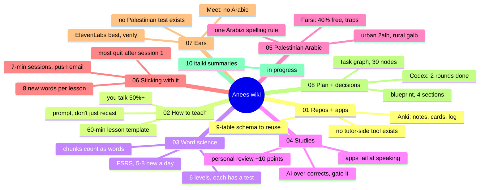

# 09 — Codex reviews

## Research audit— 2026-09-03 (corrections override the pages below where they conflict)
**Verdict:** strong enough to start M2 as a *validation* test; not strong enough to freeze vendors, thresholds, or automation.
**Corrected claims**
- Page 02/03: Lyster & Saito 2010 explicit-correction effect is **0.84**, not ~0.59, and explicit correction was **not distinguishable** from prompts/recasts ([paper](https://kazuyasaito.net/SSLA2010.pdf)). Keep "prompts work"; drop "prompts beat explicit".
- Page 04: Lindsey et al. 2014 (+10-17%) is a middle-school exam-retention result. Treat as a **ceiling**, not a forecast for adult Palestinian speaking.
- Page 04: "apps fail at speaking" → "in Duolingo's own data, speaking lags the other three skills"; Duolingo did report measurable speaking gains.
- Page 07: the WER table mixes incompatible datasets (generic Arabic, Israeli Levantine, non-Palestinian code-switching). **Not comparable.** The "expect 25-35% WER" line is withdrawn; the only number that counts is M2's own.
- Page 01: "no tutor-side dashboard exists" → "none found in a GitHub topic/star search"; absence not proven.
- Page 11: WhisperX is **BSD-2**; pyannote.audio is **MIT** with separate model-access terms.
**Contradictions resolved (single rule everywhere)**
- Leech: **warn at 4 lapses, flag+suspend at 8** (page 06 rule 12 "cull at 4" is withdrawn).
- Arabizi tooling: CAMeL Tools core has **no** Arabizi module; the CAMeL Lab **seq2seq-transliteration-tool** is a separate repo (license unverified).
- ElevenLabs Scribe v2: docs list **generic Arabic, 10-20% WER tier**; "Palestinian named" came from a marketing page and is **unverified** until M2.
- Overworded Levantine list: existence **unresolved**; do not plan on it.
- Echo-Loop: final interval is **336 h = 14 days** (README's "28 days" is wrong).
**Added to the plan**
- M2 trust test now also measures **diarization error rate (DER)** with pyannote.metrics (target ≤ 15%, provisional) and CER alongside WER.
- Tutor adjudication of the 50-line sheet can use **ELAN** or **Label Studio** (time-aligned audio + text) instead of a plain spreadsheet if Amal prefers; spreadsheet stays the default.
- Extraction trust (M2/L2): double-annotate corrections (Claude vs Amal) and report precision, recall, false-positive rate, and Amal's minutes.
- ADHD dosing: the 7-minute / 40-review / 8-new policy is a **starting point**; run a 4-6-week N-of-1 pilot (M4→M5) before hard-coding.
- Missing tools now covered on page 12: LinguaCafe, asbplayer, Yomitan, OpenLingo, Immersion Suite.

### Wiki map

Planned pages: 00-Home · 01-Repos-and-Apps · 02-Teaching-Methods · 03-Vocabulary-Science · 04-Studies-and-PoC · 05-Palestinian-Arabic-Specifics · 06-Sticking-With-It · 07-Transcription-Engines (from first research batch) · 08-Plan-and-Decisions
